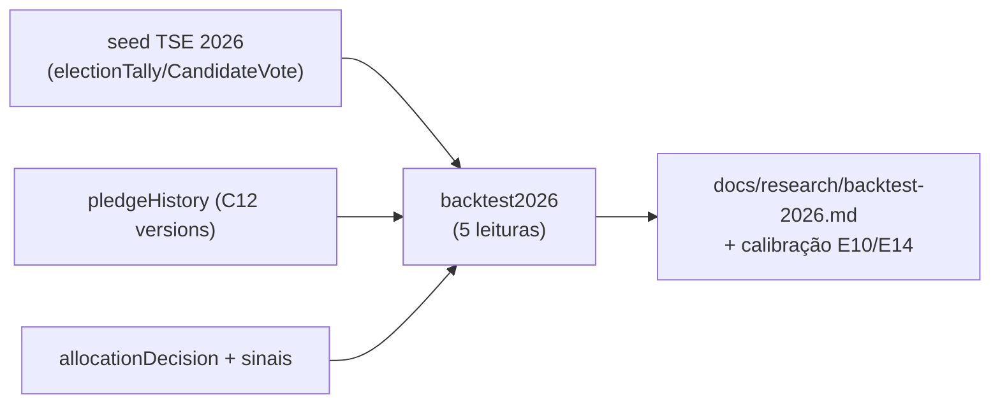

# E15 — Backtest pós-eleição (pledge vs. resultado; calibração de limiares)

Status: rascunho
Atualizado em: 2026-07-24 (refs sincronizadas pós-remodelagem Municípios + hardening)
Item do roadmap: [docs/roadmap.md](../roadmap.md) (seção "Inteligência de campanha", E15; plano-mestre [inteligencia-campanha.md](inteligencia-campanha.md))
Impeccable: A — N/A (sem superfície UI de produto neste ciclo; saída é relatório/dado)
Appetite: ~1 dia eng; janela pós-04/10 (sem pressa, sem migration própria)
Responsável: —

## Contexto

"Cada campanha que não compara pledge com voto realizado joga fora o experimento que pagou caro para rodar" (relatório C4). O backtest é a única calibração real de: fator de desconto de pledges (declarado × estimado × realizado), limiares da classificação relativa (E10), critérios de nível (E14), e a leitura ex-ante do motor (E11 — sugestões aceitas/descartadas vs. desfecho). Depende de dois lados: o lado TSE (resultado 2026 por município×zona — chega via extensão do seed `pnpm db:seed:tse` para 2026) e o lado campanha, que **só existe se C12 registrar durante o ciclo** (trajetória de pledges com datas, decisões com snapshot, sinais datados, esforço/origem de visitas). Este plano é deliberadamente pequeno: a fundação é C12; aqui é a leitura.

## Objetivos

- Import do resultado 2026 (extensão do seed TSE existente para `year=2026`, mesmo formato `electionTally`/`electionCandidateVote`).
- **Análises do backtest** (script/utility, saída em markdown versionado em `docs/research/` como apêndice do ciclo):
  1. Pledge → voto: por município, trajetória de comprometido (fotos em 15/08, 15/09, véspera) vs. nominal realizado; fator de conversão global e por assessor/liderança-fonte (com o cuidado anti-punição de K-C/G4 — leitura agregada, não ranking individual público).
  2. Limiares: quais cortes de LQ/captura teriam separado ex-ante os municípios onde o candidato cresceu (calibra E10/E14 para 2030).
  3. Decisões: `allocationDecision` aceitas/descartadas vs. desfecho do município — o motor acertou onde? a leitura alternativa descartada era a certa?
  4. Sinais: sinal registrado (invasão/esfriamento) previu queda? lead time médio.
  5. Roll-off: municípios I-A trabalhados vs. não trabalhados — o diferencial se moveu?
- Tudo com o estatuto honesto: n=1 eleição, sem contrafactual — é calibração, não prova causal.

## Decisões travadas

- **Saída é documento versionado + dados derivados, não dashboard.** Pós-eleição não há usuário sob pressão; o consumidor é o planejamento 2030 e a plataforma white-label. **Rejeitado:** UI de produto para o backtest (custo sem usuário no ciclo).
- **Nenhuma análise individual punitiva.** Fatores por liderança existem para desconto futuro, não para ranking — G4 (punição ensina a inflar). Saída pública interna só agregada.
- **i18n e naming:** `backtest2026.ts` (script na família dos seeds), leituras `pledgeConversion`, `thresholdCalibration`, `decisionAudit`.

## Questões em aberto

- **Fotos da trajetória em quais datas?** Opções: fixas (15/08, 15/09, 03/10) | todas as semanas. **Recomendação:** semanais com destaque às três âncoras — versions do C12 permitem qualquer recorte.
- **Onde roda?** **Recomendação:** script CLI com guard de banco local (padrão dos seeds), lendo prod via `db:pull` — nunca análise pesada contra o banco de produção.

## Abordagem proposta

Componentes:

- **`scripts/seed-tse-results.mjs`**: aceitar 2026 quando o TSE publicar (mesma família de flags de E2).
- **`src/utilities/backtest2026.ts`** (ou script em `scripts/`): as 5 leituras sobre `pledgeHistory` (C12), `allocationDecision`, sinais e tallies; saída markdown.
- **Sem migration** (dado 2026 usa as collections existentes).

## Dependências

- Duras: **C12** (sem registro não há backtest — é por isso que C12 é não-cortável), resultado TSE 2026 publicado (externo, ~nov/2026). Suaves: E10/E14 (consumidores da calibração), E11 (auditoria de decisões só se o motor rodou).

## Não escopo

- Previsão/modelo para 2030 (só calibração descritiva); relatório público externo; qualquer análise de dados pessoais além do agregado interno (LGPD — pledges são dados de campanha, tratamento segue o mesmo regime de acesso staff).

## Rabbit holes

- **Virar paper.** 5 leituras, um markdown, cortes sugeridos — não análise econométrica.
- **Rodar contra produção.** Guard de banco local obrigatório (padrão `assertLocalDatabase` dos seeds); dados de campanha via `db:pull` com PII já excluída onde aplicável.

## Adiado com gatilho

- **Backtest contínuo durante a campanha** (mini-calibrações mensais). Gatilho: coordenação pedir leitura intermediária + C12 com ≥6 semanas de série.

## Referências

- `docs/roadmap.md` (Inteligência de campanha, E15) · [plano-mestre](inteligencia-campanha.md)
- `docs/research/relatorio-entrevista-persona-campanha.md` C4 (calibração), FU4 (registro ex-ante), D4 (limiar por backtest), G4 (anti-punição)
- `scripts/seed-tse-results.mjs`, `scripts/db-pull.mjs`, `tests/helpers/assertTestDatabase.ts` (família de guards)
- [registro-fundacao.md](registro-fundacao.md) (C12 — a fundação)
- AGENTS.md — guards de banco, seeds TSE
