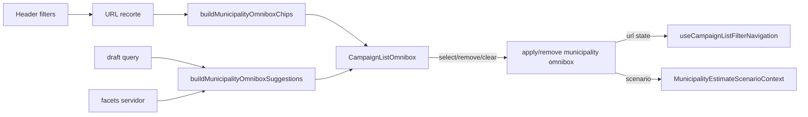

# Impl: B127 — Barra omnibox de filtros nas listas `/campanha`

Status: aprovado
Atualizado em: 2026-08-02
Issue: #264
Intenção: docs/plans/barra-filtros-omnibox-listas.md
Appetite restante: piloto Municípios + chassis compartilhado (B128 adota depois)

## Leitura da intenção

- **Outcome:** Uma barra omnibox (chips + caret + sugestões) é a entrada primária de filtro em Municípios em qualquer viewport; URL do recorte permanece a fonte de verdade; header filters e B18 sidebar ficam.
- **O que NÃO negociar:** contrato de URL B18; cenário fora do href/bookmark; leader lockdown; semântica inclusivo/exclusivo/texto do mapa de produto; não inventar dimensões.
- **O que reavaliar:** hipótese de “só trocar MunicipalityFilters” — precisa de chassis reutilizável (B128) + builders puros de chips/sugestões no domínio, sem terceiro caminho de estado.

## Abordagem recomendada

**Opções consideradas:**

|     | A — Chassis genérico + adapter Municípios                         | B — Reescrever só MunicipalityFilters sem chassis | C — cmdk CommandDialog global + filtros |
| --- | ----------------------------------------------------------------- | ------------------------------------------------- | --------------------------------------- |
|     | Tipos/UI em `shared` + `lib`; domínio monta chips/sugestões/ações | Tudo no arquivo do piloto                         | Palette global misturando home search   |

**Recomendação:** A — porque B128 precisa do mesmo gesto; deep module (UI burra + builders puros); evita twin na adoção.  
**Rejeitadas:** B porque a segunda lista copia 200 linhas; C viola anti-goal “command palette global”.

### Decisões de engenharia

1. **Fonte de verdade**  
   Opções: URL-only | URL + React espelho | Context unificado.  
   **Rec:** URL para filtros/sort/`q`; scenario continua no context existente (não URL).  
   **Rejeitadas:** Context unificado (duplica B18); scenario na URL (quebra bookmarks).

2. **Onde vive o matching de sugestões**  
   Opções: só no client UI | pure em `lib`/`utilities` do domínio.  
   **Rec:** pure `municipalityOmnibox.ts` (utilities, client-safe) + helper genérico mínimo em `lib/campaignListOmnibox.ts` (tipos + match includes via `normalizeSearchPhrase`).  
   **Rejeitadas:** lógica só no JSX (intestável); DSL cross-domínio agora (1 call site piloto — B128 extrai se precisar).

3. **Confirmação de texto livre**  
   Opções: debounce automático (status quo) | Enter/sugestão “Busca: …” | ambos.  
   **Rec:** Enter ou escolha da sugestão “Busca: {texto}” confirma chip; **sem** debounce que muda `q` a cada tecla — a digitação alimenta sugestões; o chip é o recorte.  
   **Rejeitadas:** só debounce (contradiz “confirmado”); manter debounce + chip (dois estados de texto).

4. **Chips de apresentação (cenário / sort)**  
   Opções: sempre visíveis | só quando ≠ default.  
   **Rec:** só quando ≠ default (cenário ≠ central; sort ≠ deficit+desc). Digitar “cenário”/“ordenar” sugere opções. Remover chip → default.  
   **Rejeitadas:** sempre visíveis (barra barulhenta no default).

5. **Empty focus**  
   Opções: listar tudo | nada | atalhos de dimensão.  
   **Rec:** com query vazia, sugestões = atalhos de dimensão/apresentação (Prioritária, Cenário…, Ordenar…) sem dump de 435 municípios; com texto, filtra valores + “Busca: …”.  
   **Rejeitadas:** dump completo (inútil em mobile).

### Componentes / mudanças

- **`lib/campaignListOmnibox.ts`**: tipos `CampaignListOmniboxChip` / `Suggestion` + `omniboxQueryMatches` (includes normalizado).
- **`shared/CampaignListOmnibox.tsx`**: input com chips removíveis, popover/cmdk de sugestões agrupadas, Limpar, pending; reusa `useCampaignListTransition` via props `isPending`.
- **`utilities/municipality/municipalityOmnibox.ts`**: `buildMunicipalityOmniboxChips`, `buildMunicipalityOmniboxSuggestions`, `applyMunicipalityOmniboxSuggestion`, `removeMunicipalityOmniboxChip` (resultado discriminado `url` | `scenario` | `noop`).
- **`MunicipalityFilters.tsx`**: substitui pilha (search + cenário solto + mobile selects + sort select) pela omnibox + `SaveMunicipalityFilterControl`; recebe também `slugFilterOptions` (facets).
- **`MunicipalityList.tsx`**: remove `
` “Ordenado por …” (caption `sr-only` permanece).
- **`municipios/page.tsx`**: passa facets de slug para filters.
- **Migration:** sem migration.
- **Access / Consent:** inalterado.
- **UI:** Impeccable C — shape→craft na barra existente; tokens `data-theme='campaign'`; touch `min-h-11`.

### Dados → forma

Não aplica (só UI do recorte).

## Fases verificáveis

1. **Tracer** — pure omnibox builders + unit tests (chips/sugestões/apply/remove/cenário/sort).
2. **UI** — `CampaignListOmnibox` + `MunicipalityFilters` piloto; remover pilha e sort label solto.
3. **Gates** — `pnpm gate:fast`; entrega `pnpm push`.

## Rabbit holes / Não escopo (engenharia)

- Adoção B128 nas outras listas.
- Mover B18 para dentro da omnibox.
- Debounce de busca “como estava” + chip simultâneo.
- Virtualizar 435 sugestões (cap por grupo + seeds memoizados no piloto).
- Redesign do header filter / mapa.

### Débitos deferidos (/simplify 2026-08-02)

- Extrair navigate-only helper do hook de debounce quando 2º consumidor omnibox (B128).
- Inline `omniboxGroupMatches` se a API não crescer no B128.
- Anunciar contagem de sugestões (live region) quando polish a11y for pedido.

## Riscos e mitigação

- **Dois estados de `q` (draft vs chip):** draft só no input; committed só via apply “Busca”; sync URL→draft só quando não há digitação pendente (mesmo padrão do nav hook, sem debounce de commit).
- **Sidebar B18:** não importar serializador no layout; Save control continua no domínio.
- **Header sync:** ambas as UIs só editam URL → chips refletem no RSC refresh; optimistic opcional nos chips via state prop.

## Aceite de engenharia

- [x] Aceite de produto da intenção ainda coberto
- [x] Invariantes AGENTS/engineering-standards
- [x] Testes de domínio: unit em builders omnibox + regressão municipalityList filters/URL

**Decision-quality self-score:** 5/5 (rejeitadas nas caras; appetite respeitado; rabbit holes nomeados; reusa URL/nav/header/B18; outcome intacto).
