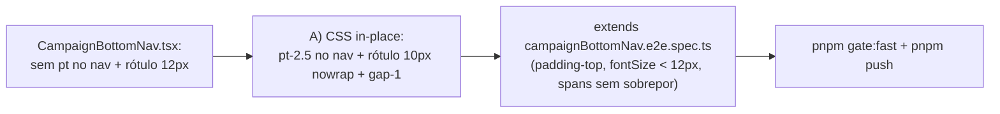

# Impl: B171 — Barra inferior mobile: folga no topo + rótulos sem sobreposição

Status: aprovado
Atualizado em: 2026-08-08
Issue: #443
Intenção: docs/plans/barra-navegacao-inferior-mobile-ajustes.md
Appetite restante: ~0,5 dia eng (herdado; cabe com folga)

## Leitura da intenção

- **Outcome:** no celular, o staff lê os 5 destinos da barra inferior de relance — com um pequeno respiro entre o conteúdo dos itens e a borda superior da barra, e rótulos com fonte menor que não colidem com o vizinho em viewport mobile estreito. Área de toque e estado ativo equivalentes aos de B164.
- **O que NÃO negociar:** barra continua só mobile (`md:hidden`), só staff (`isStaffCampaignRole` — leader lockdown intacto), 5 itens/ordem/ícones inalterados, desktop/tablet/sidebar intactos, FAB acima da barra, chamado de toque não encolhe.
- **O que reavaliar:** a hipótese da intenção apontava `getCampaignBottomNav`/`nav.ts` como área provável — na prática a estrutura de itens já está correta e **não será tocada**; o defeito mora 100% nas classes do `CampaignBottomNav.tsx` (sem espaçamento superior no `<nav>` e rótulo `text-xs` que estoura a coluna). Nenhuma mudança em `nav.ts`, `campaignPaths.ts` ou roles.

## Abordagem recomendada

**Opções consideradas:** A | B | C
**Recomendação:** **A — CSS in-place em `CampaignBottomNav.tsx`.** O motor do defeito são três classes do `<nav>` e dos itens. Editar o dono (o componente que já renderiza a barra), como manda o engineering-standards ("edit the owner, don't twin"); nenhum arquivo novo, nenhum schema. O canvas aprovado no gate (B171) mostra a barra desejada com `paddingTop` 10px e rótulo `fontSize 10px` — é exatamente isso.
**Rejeitadas:**

- B) Novo módulo de tokens/`CAMPAIGN_BOTTOM_NAV_CLASSES`: abstração raso com 1 call site — depth check falha ("pass-through raso → não criar").
- C) Só encolher fonte mantendo `text-xs` do container e dando `nowrap`: `text-xs` (12px) é o que estoura a coluna (~88px de texto em coluna ~68–78px); 11px ainda fica no limite em 320px. O canvas fixa 10px; seguimos o aceite.
- D) `hidden md:` e telas ultra-estreitas via media query por breakpoint de fonte: mixin de legibilidade desnecessário — 10px + `nowrap` resolve em toda viewport mobile real (mín 320px).

### Componentes / mudanças

- **`CampaignBottomNav`** (`src/components/campaign/shell/CampaignBottomNav.tsx`): duas linhas de classes.
  - `<nav>`: adicionar `pt-2.5` (10px, respiro no topo — acompanha o `pb-[env(safe-area-inset-bottom)]` já existente). Mantém `border-t`, `grid-cols-[repeat(5,minmax(0,1fr))]`, `z-30`, `md:hidden print:hidden`.
  - Itens (Link e button "Mais", as duas `className` iguais): `text-xs` → `text-[10px]` + `whitespace-nowrap` + `gap-0.5` → `gap-1` (4px, espaçamento do canvas). `justify-center`, `flex-1`, `font-medium`, `text-muted-foreground`/`text-primary` ativo e focus ring **inéditos**. Área de toque = célula inteira (`flex-1`), não encolhe.
- **Migration:** sem migration — chrome de navegação, sem schema.
- **Access / Consent:** nenhum — `getCampaignBottomNav(role)` / `isStaffCampaignRole` intocados; leader continua sem a barra.
- **UI:** Impeccable C (mesma nota da intenção). Shape dado pelo canvas B171 (respiro 10px no topo, rótulo 10px). Craft/critique/polish leves: confirmar com `getComputedStyle`/bounding boxes no e2e; sem motion nova.

### Dados → forma

N/A — chrome de navegação, sem dados hexibidos (a intenção já declara que não há número novo).

## Fases verificáveis

1. **Tracer** — editar as classes do `CampaignBottomNav.tsx` e confirmar a renderização no dev server (viewport 390×844 e 320×640).
2. **e2e** — estender `tests/e2e/campaignBottomNav.e2e.spec.ts` com um teste de estilo/legibilidade:
   - `paddingTop` calculado do `<nav>` ≥ 8px (respiro no topo);
   - `fontSize` calculado de todos os 5 rótulos < 12px (fonte menor que a atual);
   - bounding boxes dos 5 rótulos adjacentes sem sobreposição horizontal (rótulos não colidem);
   - sem tocar nos testes existentes (staff 5 itens, ativo/navegação, drawer, leader 0, desktop hidden, FAB acima).
3. **Gates** — `pnpm gate:fast` (lint + tsc + unit) e `pnpm push` (com CI espelho). Sem schema → migration-lock não se aplica a este PR.

## Rabbit holes / Não escopo (engenharia)

- Redesenho/drawer do Mais, novos itens, ordem, ícones — fora da intenção.
- Mexer em `nav.ts`/`campaignPaths.ts` (nada muda).
- Mudar `CampaignContentScroll`/FAB: barra nova ~44px+safe ≈ dentro do `pb-[calc(4rem+…)]` (64px) e FAB `bottom-[calc(7rem+…)]` limpa — sem retoques.
- Reduzir fonte abaixo de 10px (acessibilidade); `hidden` de rótulos em telas estreitas.
- Safe-area inferior: manter `env(safe-area-inset-bottom)`.

## Riscos e mitigação

- **Risco:** rótulo 10px quebra acessibilidade percebida. **Mitigação:** é o tamanho do canvas aprovado; rótulos continuam `font-medium`, ícone `size-5` inalterado, alvo de toque pleno; nenhum rótulo some.
- **Risco:** `nowrap` + fonte pequena ainda estoura em viewport 320px. **Mitigação:** 10px "Atualizações" ≈ 66px em célula ≥64px (320px/5); o teste e2e novo pina a não-sobreposição em 390px (viewport do suite) e valida `fontSize`; se 320px for exigido depois, é outro item.
- **Risco:** mudança quebra o FAB. **Mitigação:** FAB test (y < nav.y) já cobre; barra cresce ~10px, `bottom-[7rem]` sobra.

## Aceite de engenharia

- [ ] Aceite de produto da intenção ainda coberto (respiro no topo + rótulos menores sem sobreposição; toque/estado equivalentes; leader e desktop intactos)
- [ ] Invariantes AGENTS/engineering-standards: `md:hidden` e role filtering intocados; sem dead code novo; identificadores inglês / copy pt-BR
- [ ] e2e estendido: `paddingTop` ≥ 8px, rótulos < 12px e sem sobrepor
- [ ] `pnpm gate:fast` verde (tsc + lint `--max-warnings=0` + unit) e `pnpm push` com CI fechando green
