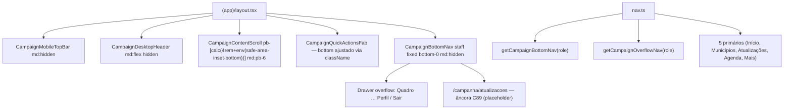

# Impl: B164 — Barra de navegação inferior no mobile (+ drawer Mais)

Status: aprovado
Atualizado em: 2026-08-08
Issue: #400
Intenção: docs/plans/barra-navegacao-inferior-mobile.md
Appetite restante: ~1 dia eng (dentro do estimado)

## Leitura da intenção

- **Outcome:** Staff no mobile troca entre os 4 destinos primários (Início, Municípios, Atualizações, Agenda) e o overflow (Mais) em um toque; barra fixa inferior só em mobile (< `md`), staff-only (leader lockdown intacto).
- **O que NÃO negociar:** leader não vê a barra de 5 destinos; desktop/tablet continua sidebar-only; `SidebarTrigger` mobile permanece; FAB continua; paginação/semântica do scroll global não quebra.
- **O que reavaliar:** altura real da bottom nav vs `pb` do scroll (`CampaignContentScroll`); z-index da barra vs FAB vs Drawer (overlay do wizard).

## Abordagem recomendada

**Opções consideradas:** A (drawer) | B (página separada) | C (reaproveitar B73)
**Recomendação:** **A — Drawer** para o overflow "Mais". — `@base-ui/react` Drawer já está no codebase (`CampaignQuickActionsOverlay` usa o mesmo padrão); consistente com swipe-down do wizard; FAB overlay já foi testado com Drawer. Nada de rota `/campanha/mais` → não precisa de página server, access gate, ou `CAMPAIGN_OVERFLOW_HREF`.
**Rejeitadas:**

- B) Página `/campanha/mais`: navegação full-reload, menos nativo; duplicaria Perfil/Sair do sidebar. O drawer fecha em 1 toque e reusa `logoutCampaign`.
- C) Reaproveitar `CampaignBottomNav` apagado do B73: foi deletado deliberadamente ("git history é o arquivo"). Recriar novo, sem código morto.
- Bottom navigator genérico do shadcn: **não existe** nesse projeto (verificado `src/components/ui/`). Usa `Button` + CSS grid, como o original.

### Componentes / mudanças

- **`src/lib/campaignPaths.ts`**: adicionar `CAMPAIGN_UPDATES_HREF = '/campanha/atualizacoes'`. (Sem `CAMPAIGN_OVERFLOW_HREF` — drawer, não rota.)
- **`src/components/campaign/shell/nav.ts`**:
  - Importar `BellIcon`, `EllipsisVertical` de `lucide-react`; importar `CAMPAIGN_UPDATES_HREF`.
  - `bottomNavPrimaryHrefs: Set<string>` — `{ '/campanha', '/campanha/municipios', CAMPAIGN_UPDATES_HREF, CAMPAIGN_AGENDA_HOME }` (os 4 que NÃO são Mais).
  - `bottomNavStaff: CampaignNavItem[]` — 5 itens: Início, Municípios, Atualizações, Agenda, Mais.
  - `getCampaignBottomNav(role)`: staff → `bottomNavStaff`; leader → `[]` (lockdown).
  - `getCampaignOverflowNav(role)`: staff → `getCampaignNav(role).filter(h => !bottomNavPrimaryHrefs.has(h.href))` + `getCampaignSecondaryNav(role)` (Conceitos). Leader → `[]`. Perfil + Sair são tratados inline no drawer footer, não em `nav.ts` (como no sidebar footer).
  - `isCampaignNavActive`: reconhecer `/campanha/atualizacoes` por prefixo (exatidão como `/campanha`).
- **`src/components/campaign/shell/CampaignBottomNav.tsx`** (new): `use client`, `fixed inset-x-0 bottom-0`, `md:hidden print:hidden`, `z-30` (abaixo do FAB `z-40`, acima do scroll). Contém:
  - Barra: grid 5 colunas, 4 itens = `Link`, item 5 "Mais" = `button` (abre drawer), ícone + rótulo pt-BR, `aria-current` via `isCampaignNavActive`, `pb-[env(safe-area-inset-bottom)]`, `border-t`.
  - Drawer: `@base-ui` Drawer (`showSwipeHandle`, `swipeDirection="down"`), overlay nav items de `getCampaignOverflowNav(role)` + footer Perfil (`CAMPAIGN_PROFILE_HOME`) + Sair (`logoutCampaign`).
- **`src/app/(campaign)/campanha/(app)/atualizacoes/page.tsx`** (new): placeholder honesto — `CampaignPageShell` + título "Atualizações" + texto "Em breve você verá o feed de atualizações da campanha aqui." Staff-only (redireciona leader para `/campanha`).
- **`src/app/(campaign)/campanha/(app)/layout.tsx`**: renderizar `<CampaignBottomNav role={user.role} />` quando `isStaffCampaignRole(user.role)` — sibling de `TooltipProvider > div`, fora do flex flow (`fixed`).
- **`src/components/campaign/shell/CampaignQuickActionsHost.tsx`**:
  - `CampaignContentScroll`: `pb-[calc(4rem+env(safe-area-inset-bottom))] md:pb-6` (mobile gap para a barra).
  - FAB: `className={showBottomNav ? 'bottom-[calc(4rem+env(safe-area-inset-bottom))] md:bottom-4' : undefined}` — sobe quando a barra existe.

- **Migration:** sem migration — chrome de navegação.
- **Access / Consent:** `isStaffCampaignRole` reusado; `canAccessSupporterArea` / `isUnrestrictedCampaignRole` já filtram `Apoiadores`/`Assessores` em `getCampaignNav` → herdados. Sem Consent.
- **UI:** Impeccable C — shell chrome, mobile-first, `data-theme='campaign'`, consistente com `CampaignQuickActionsOverlay` Drawer pattern.

### Dados → forma

N/A — chrome de navegação, sem dados de domínio.

## Fases verificáveis

1. **Nav (tracer)** — `nav.ts` com `getCampaignBottomNav` + `getCampaignOverflowNav`; `campaignPaths.ts` com `CAMPAIGN_UPDATES_HREF`. Unit test (`campaignNav.unit.spec.ts` estendido) validando: staff tem 5 itens; leader tem 0; overflow exclui primários + inclui Conceitos; `isCampaignNavActive` matcha `atualizacoes` por prefixo.
2. **UI** — `CampaignBottomNav.tsx` (barra + drawer overflow), `/campanha/atualizacoes` placeholder; layout renderiza barra only staff mobile; FAB sobe; scroll não esconde conteúdo; drawer reabre Perfil/Sair com role filter.
3. **Gates** — `pnpm gate:fast`; e2e smoke mobile (barra visível staff, invisível desktop/leader, navegação ativa reflete rota, FAB acima da barra, drawer overflow abre/fecha); `pnpm push -u origin HEAD` → `gh pr create --base main`.

## Rabbit holes / Não escopo (engenharia)

- Drawer do wizard (`CampaignQuickActionsOverlay` mobile) sobrepõe a barra: o Drawer é modal full-snap, z-index alto, não há conflito visual.
- FAB no desktop: bottom nav é `md:hidden`, então `md:bottom-4` no FAB mantém comportamento atual.
- Leader lockdown: `getCampaignBottomNav('leader')` retorna `[]`; `/campanha/atualizacoes` redireciona leader para `/campanha`.
- Atualizações: âncora honesta — **não** implementar feed/threads (→ C89). Placeholder com título + texto.
- Não reintroduzir Quadro/Territórios/Apoiadores/Assessores na barra (teto de 5, thumb zone).
- Não tocar no design-refs HTML legados.

## Riscos e mitigação

- **Risco:** conteúdo fica escondido atrás da barra. **Mitigação:** `pb-[calc(4rem+env(safe-area-inset-bottom))]` no scroll + teste de overflow.
- **Risco:** FAB some atrás da barra. **Mitigação:** ajuste de `bottom` via conditional className em `CampaignQuickActionsHost`.
- **Risco:** leader enxerga a barra. **Mitigação:** `isStaffCampaignRole` no layout + `getCampaignBottomNav('leader') → []`.
- **Risco:** z-index da barra sobe sobre o Drawer. **Mitigação:** `z-30` (Drawer usa z-50+).

## Aceite de engenharia

- [x] Aceite de produto da intenção ainda coberto (5 itens, staff only, Mais = drawer overflow, sidebar intacta desktop)
- [ ] Invariantes AGENTS/engineering-standards: identificadores inglês, copy pt-BR, `md:hidden`, role filtering via `nav.ts`
- [ ] Unit: `getCampaignBottomNav` / `getCampaignOverflowNav` / `isCampaignNavActive` estendidos (5 itens staff, 0 leader, overflow exclui primários, inclui Conceitos)
- [ ] e2e smoke: barra visível mobile staff, invisível desktop/leader, navegação ativa reflete rota, FAB acima da barra, drawer overflow abre/fecha
- [ ] `pnpm gate:fast` verde (tsc + lint + knip + test + build)
