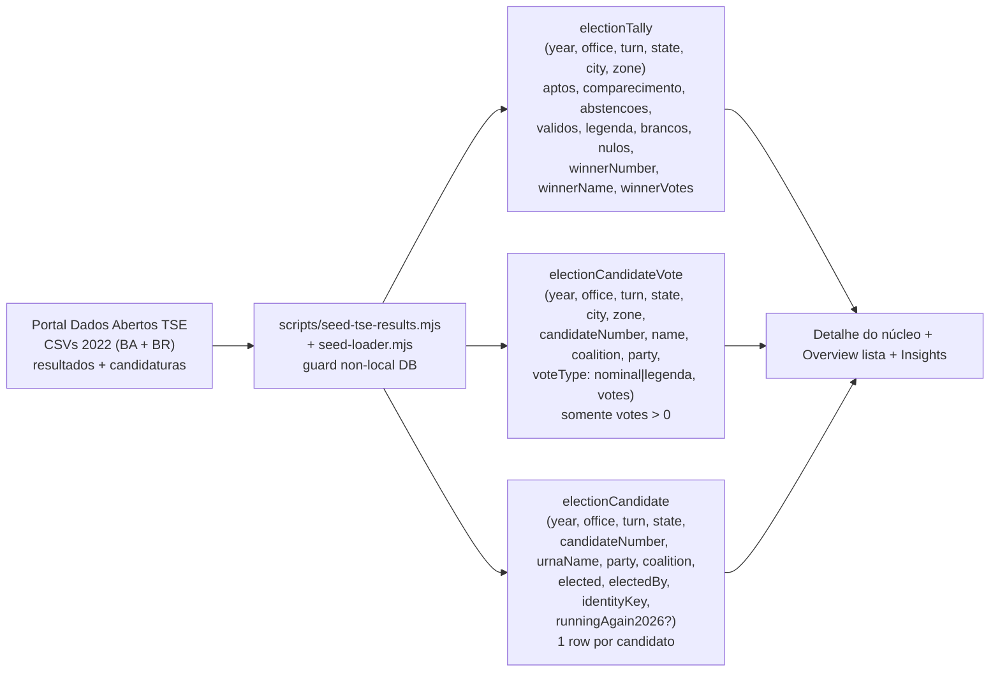
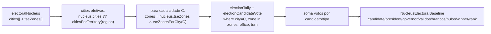

# Baseline eleitoral TSE 2022

Status: Fases 1–4 implementadas e mescladas em `main` (A3 modelo+import; A4 detalhe + overview + Gap vs 2022 + simplify). Follow-up de escala/DRY: [A7](escala-dry-pos-a4.md).
Atualizado em: 2026-07-19
Item do roadmap: [docs/roadmap.md](../roadmap.md) (A3/A4 Baseline TSE 2022)
Responsável: —

## Referência visual (UX Pilot)

Design: [`Baseline-Eleitoral-2022.png`](../design-refs/latest/Baseline-Eleitoral-2022.png) · [`Baseline-Eleitoral-2022.html`](../design-refs/latest/Baseline-Eleitoral-2022.html) — a tela também contém o card "Insights do território", que pertence aos planos de insight separados (ver abaixo).

Como usar:

- **Adotar a estrutura (Fases 2 e 4 deste plano):** bloco "Baseline eleitoral 2022" na aba Visão geral do núcleo com: linha destacada de Solla (votos 2022 + barra), linhas secundárias de Lula (Presidente, 2º turno) e Jerônimo (Governador); sub-bloco "Eleitorado 2022" (válidos, brancos, nulos, abstenções); linha "Mais votado aqui em 2022"; e o alerta âmbar do insight Gap vs 2022 ("Faltam 350 votos para o patamar de 2022" com a conta estimativa vs. resultado). Os quatro estados do gap descritos na Fase 4 seguem esse mesmo formato de alerta (âmbar/verde/informativo).
- **Pertence aos planos de insight separados (não implementar junto):** o card "Insights do território" (taxa de conversão, território de defesa, alavancagem da chapa, oportunidade de mobilização, mais votado/ranking) é a referência visual dos cinco planos `insight-*.md` — cada linha do card corresponde a um plano. A arquitetura do componente (`NucleusInsights.tsx`, stack de cards com ícone + veredito de uma linha + número de apoio) deve nascer extensível conforme já previsto.
- **Overview da lista:** o bloco compacto "Baseline 2022" da Fase 3 aparece no design [`Lista-Nucleos-Overview.png`](../design-refs/latest/Lista-Nucleos-Overview.png) (gap total + "8 acima · 6 abaixo").
- **Ajustar cores:** paleta antiga no HTML/PNG (header vermelho escuro, destaque de Solla em vermelho escuro). Implementar com tokens do tema `campaign`: destaque de Solla pode usar `#C51414` sobre fundo claro; alerta do gap usa o par âmbar (`#FEF3C7`/`#92400E`) ou verde (`#DCFCE7`/`#166534`).

## Contexto

Os resultados das eleições passadas são **dados abertos públicos** do TSE (Portal de Dados Abertos, licença Creative Commons Atribuição), disponíveis por **município e zona eleitoral** (e por seção). Hoje o `/campanha` só tem a estimativa manual de votos (sugerir/confirmar); não há referência histórica. A decisão de produto (2026-07-17) é importar os resultados oficiais de 2022 (presidente, governador, dep. federal, dep. estadual) por município+zona e usá-los como **baseline histórico** em três lugares: no detalhe do núcleo, no overview da lista de núcleos (escopado pelos filtros), e em insights automáticos para coordenadores e lideranças.

Conjunto TSE usado: ["Resultados - 2022"](https://dadosabertos.tse.jus.br/dataset/resultados-2022) — "Votação nominal por município e zona", "Detalhe da apuração por município e zona" e "Consulta candidatas e candidatos" (esta última traz `DS_SIT_TOT_TURNO`, que diz quem foi **eleito**). Arquivos por UF (BA) para governador/federal/estadual; BR para presidente.

Candidatos de interesse (destaques na UI): **Solla = dep. federal BA, PT, nº 1313** (128.968 votos, eleito); **Lula = presidente, PT, nº 13**; **Jerônimo = governador BA, PT, nº 13** (venceu no 2º turno).

## Objetivos

- Importar o **conjunto completo de candidatos de 2022** para os quatro cargos (não só Solla/Lula/Jerônimo), com flag `elected`/`electedBy` por candidato.
- Armazenar no grain **município + zona** (casa com `electoralNucleus.city` + `electoralNucleus.tseZones[]`).
- Derivar, por núcleo, o baseline 2022: votos de Solla/Lula/Jerônimo, válidos, brancos, nulos, abstenções, aptos, mais votado local, ranking do Solla.
- Mostrar baseline no detalhe do núcleo (aba overview) e no overview da lista (reagindo aos filtros).
- Gerar insights automáticos (gap vs 2022, taxa de conversão, classificação territorial, alavancagem da chapa, oportunidade de mobilização, competidor).
- Deixar o modelo pronto para, quando o TSE publicar 2026, casar quem concorre de novo (`runningAgain2026`).

## Decisões travadas

- **Granularidade município + zona** (confirmada com o produto). Seção não tem mapeamento oficial → bairro e não cruzaria com o núcleo; volume proibitivo.
- **Todos os candidatos**, não só os de interesse. `electionCandidate` guarda 1 row por candidato com `elected`/`electedBy` derivados de `DS_SIT_TOT_TURNO`.
- **Três collections** em admin group `Dados Eleitorais`: `electionTally` (apuração por city+zone+office+turn), `electionCandidateVote` (votos por candidato por city+zone, só `votes > 0`), `electionCandidate` (registro de candidatura + eleito + identidade cross-ano).
- **Access control:** dado público TSE. `read` para autenticado em `campaignUser` ou `users` (não aberto ao público). `create/update/delete` admin only. Sem `Consent`, sem transação em runtime. Import via CLI com `overrideAccess: true` fora do runtime deployado.
- **Sem PII.** Não persistir CPF nem título eleitoral. A identidade cross-ano usa `identityKey = sha256(normalize(urnaName) + birthCity + birthState + party)` — só dados públicos da consulta de candidaturas.
- **Migration** `add_election_results` (push:false). `pnpm build` aplica em prod no deploy. Não esbarra no bloqueador LGPD (dado público, sem liderança real).
- **Import idempotente por escopo** `(year, office, turn)`: delete + bulk insert via `payload.db.drizzle` (não upsert row a row). Proveniência (URL, SHA-256) no cabeçalho de `scripts/seed-tse-results.mjs`. Sem step de revalidate (páginas de campanha são dinâmicas com auth, sem ISR/tag).
- **Sem votos de legenda na v1.** Campo `voteType` permanece no schema; só rows `nominal` são importadas. O agregado `votosLegenda` do tally cobre o que os insights precisam. Dataset `votacao_partido_munzona` fica fora do escopo A3.
- **Votos anulados sub judice (2022):** `electionCandidateVote.votes` ← `QT_VOTOS_NOMINAIS` (apurados); validade fica no tally (`votosNominaisValidos`, `votosAnulados`).
- **Mapeamento de município:** `NM_MUNICIPIO` (TSE) → nome canônico de `bahiaTerritories.ts` via normalização case/acento/apóstrofo; falha alta em município não mapeado; persiste `cityCode` (TSE) + `cityName` canônico. Teste cobre os 417 municípios.
- **Agregação núcleo→baseline é autossuficiente** (revisão 2026-07-17): `citiesForTerritory` **já existe** em `src/lib/bahiaTerritories.ts` (não vem do plano `zonas-por-municipio.md`), e a correspondência cidade↔zona pode ser resolvida pelas próprias rows de `electionTally` (cada par cidade×zona importado é uma row — `where cityName = C` retorna todas as zonas da cidade). `tseZonesForCity` (plano `zonas-por-municipio.md`) é **opcional**: quando existir, vira a fonte preferida por ser validada por fixture. Sem `tseZones` → todas as zonas da(s) cidade(s); só `region` → todas as cidades do território; sem geografia → estado "sem baseline TSE".
- **i18n e naming** seguem o AGENTS.md: identificadores em inglês, strings visíveis em pt-BR.

## Questões em aberto

- ~~Mapeamento `CD_MUNICIPIO` (TSE) → nome canônico~~ — resolvido na Fase 1 via `canonicalizeMunicipalityName` + `cityCode` persistido.
- Limiares de classificação territorial (defesa/ataque/indecisa/perdida) — definir com produto (A5).
- ~~Mostrar 1º e 2º turno para presidente/governador, ou só o decisivo?~~ — A4 assume o **turno decisivo** (2º se houver votos; senão 1º) para Lula/Jerônimo; federal usa 1º. _(assumido — validar com produto)_
- ~~`lideranca` vê ranking/competidor?~~ — A4 mostra o bloco baseline + Gap vs 2022 para `geral`/`coordenador`/`lideranca` (dado público + estimativa já visível). Ranking detalhado / inteligência competitiva fica em A5. _(assumido — validar com produto)_
- `identityKey` por nome de urna + naturalidade + partido pode gerar colisões (homônimos) ou falsos negativos (mudança de partido). Mitigação: revisão manual admin do match 2022→2026 antes de fixar `runningAgain2026=sim|nao`, com `desconhecido` como padrão.

> Nota: limiares de classificação territorial, taxonomia de alinhamento político (para dobradinha) e limiares de conversão ficam nos planos separados dos respectivos insights no roadmap.

## Abordagem proposta

### Collections

- **`electionTally`** (`src/collections/ElectionTally.ts`): `year`, `office` (`presidente|governador|deputado_federal|deputado_estadual`), `turn` (1|2), `state` (`BA`), `cityCode`, `cityName`, `zoneNumber`, `aptos`, `comparecimento`, `abstencoes`, `votosValidos`, `votosNominaisValidos`, `votosLegenda`, `votosBranco`, `votosNulo`, `votosAnulados`, `winnerCandidateNumber`, `winnerCandidateName`, `winnerVotes`, `winnerCoalition`, `winnerParty`. Único `(year, office, turn, state, cityCode, zoneNumber)`.
- **`electionCandidateVote`** (`src/collections/ElectionCandidateVote.ts`): `year`, `office`, `turn`, `state`, `cityCode`, `cityName`, `zoneNumber`, `candidateNumber`, `candidateName`, `coalition`, `party`, `voteType` (`nominal|legenda`), `votes`. Único `(year, office, turn, state, cityCode, zoneNumber, candidateNumber, voteType)`. Só `votes > 0`.
- **`electionCandidate`** (`src/collections/ElectionCandidate.ts`): `year`, `office`, `turn`, `state`, `candidateNumber`, `urnaName`, `completeName`, `party`, `coalition`, `candidateStatus`, `elected` (checkbox), `electedBy` (`QP|média|2º turno`), `totalVotesState`, `identityKey` (index), `runningAgain2026` (`sim|nao|desconhecido`, default `desconhecido`). Único `(year, office, turn, state, candidateNumber)`.

### Agregação núcleo → baseline

### Fases

1. **Modelo + import** — **feito (A3, 2026-07-18).** Collections `electionTally` / `electionCandidateVote` / `electionCandidate`, migration `20260718_195854_add_election_results`, `pnpm db:seed:tse`, helpers em `src/lib/electionResults*.ts` + `electionCandidateIdentity.ts`, import drizzle em `src/utilities/electionResultsImport.ts`, testes unit/int com fixtures em `tests/fixtures/tse/`. Seed local BA 2022: **211.014** votos nominais, **2.700** apurações, **1.654** candidatos (6 escopos office×turn).
2. **Detalhe do núcleo** — **feito (A4, 2026-07-18).** Bloco "Baseline eleitoral 2022" na aba overview; view model `NucleusElectoralBaselineViewModel` em `src/utilities/nucleusViewModels.ts`; agregação em `src/utilities/nucleusElectoralBaseline.ts`; componente `src/components/campaign/NucleusElectoralBaseline.tsx`.
3. **Overview da lista** — **feito (A4, 2026-07-18).** Soma baselines sobre o conjunto filtrado (`buildNucleusListWhere` + `loadNucleusBaseline2022Overview`); card "Baseline 2022" no `NucleusListOverview`.
4. **Insights automáticos (Gap vs 2022)** — **feito (A4, 2026-07-18).** `src/components/campaign/NucleusInsights.tsx` + `src/lib/electionInsights.ts` (`computeGapVs2022`). Os demais insights ficam nos planos `insight-*.md` (A5).
5. **Prontidão 2026** — `identityKey` já em 2022; `scripts/reconcile-running-again.mjs` marca `runningAgain2026` quando 2026 publicar; UI sinaliza quem volta a concorrer. (O insight de dobradinha, que depende deste, é plano separado no roadmap.)

## Insights automáticos

Cada insight é uma **derivação de leitura** (sem escrita, sem `Consent`, sem migration) a partir do baseline TSE 2022 + `confirmedVoteEstimate`. Este plano implementa **apenas o insight "Gap vs 2022"** (Fase 4); os demais viram itens separados no roadmap, cada um com plano próprio, porque dependem de limiares/taxonomias a fechar com produto ou de dados de 2026.

### 1. Gap vs 2022 — IN-SCOPE (Fase 4 deste plano)

- **Definição:** compara a estimativa confirmada do núcleo com o voto histórico de Solla (dep. federal, nº 1313) em 2022 na mesma geografia. É o insight-cabeça que justifica o import do baseline.
- **Fórmula:**
  - `sollaVotes2022` = soma de `electionCandidateVote.votes` onde `year=2022`, `office=deputado_federal`, `candidateNumber=1313`, `voteType=nominal`, `(city,zone)` ∈ geografia do núcleo (cidades∩zonas, ver agregação).
  - `gap = confirmedVoteEstimate − sollaVotes2022`.
  - `ratio = confirmedVoteEstimate / sollaVotes2022` (quando `sollaVotes2022 > 0`).
- **Inputs:** `electoralNucleus.confirmedVoteEstimate` + `electionCandidateVote` agregado pela geografia do núcleo.
- **Output no detalhe do núcleo:** linha/badge:
  - `gap < 0` → "Faltam `{abs(gap)}` votos para o patamar de 2022" (cor de atenção).
  - `gap ≥ 0` → "Já superamos 2022 em `{ratio−1}`%" (cor positiva).
  - `sollaVotes2022 = 0` → "Solla não recebeu votos aqui em 2022 — território novo a abrir".
  - `confirmedVoteEstimate = null` → "Sem estimativa confirmada para comparar".
  - núcleo sem geografia → "Sem baseline TSE (informe território/município)".
- **Output no overview da lista:** sobre o conjunto filtrado: `gapTotal = Σ confirmedVoteEstimate − Σ sollaVotes2022`, `nucleiAbove2022` (contagem com `gap ≥ 0`), `nucleiBelow2022` (contagem com `gap < 0`). Renderizado no bloco "Baseline 2022" do `NucleusListOverview`.
- **Componente:** `src/components/campaign/NucleusInsights.tsx` (server; começa só com este insight; arquitetura extensível para os demais).
- **Helper:** `src/lib/electionInsights.ts` exportando `computeGapVs2022(baseline, confirmedVoteEstimate)` → `{ gap, ratio, status: 'above'|'below'|'noBaseline'|'noEstimate'|'noCandidateVotes' }` (chapa/candidato configurados em `BASELINE_TICKET_2022`, `src/lib/electionResults.ts`, para reuso em eleições futuras).
- **Visibilidade:** `geral`/`coordenador`/`lideranca` (dado público + estimativa já visível ao papel).
- **Teste int:** cenários com gap negativo, positivo, `sollaVotes2022=0`, `confirmedVoteEstimate=null` e sem geografia.

### 2. Taxa de conversão — PLANO SEPARADO no roadmap

- **Definição:** `confirmedVoteEstimate / aptos` — % do eleitorado apto da zona que a estimativa representa.
- **Inputs:** `electionTally.aptos` agregado pela geografia + `confirmedVoteEstimate`.
- **Limiares (guia de estratégia):** <15% oportunidade; >40% reduto. A definir com produto.
- **Roadmap:** "Insight: taxa de conversão por núcleo".

### 3. Classificação territorial — PLANO SEPARADO no roadmap

- **Definição:** classificar o núcleo em defesa/ataque/indecisa/perdida por `sollaPercentValid` (= `sollaVotes / votosValidosFederal`) vs. limiares configuráveis; opcionalmente cruzar com pesquisa de intenção de voto quando existir.
- **Inputs:** `electionCandidateVote` (Solla) + `electionTally.votosValidos` agregados.
- **Dependência externa:** limiares a definir com produto; possível sobreposição com futuro domínio de pesquisas.
- **Roadmap:** "Insight: classificação territorial (defesa/ataque/indecisa/perdida)".

### 4. Alavancagem da chapa — PLANO SEPARADO no roadmap

- **Definição:** `confirmedVoteEstimate / lulaVotes` e `/ jeronimoVotes` — % da base de Lula/Jerônimo capturada; o teto natural do PT no local como meta implícita.
- **Inputs:** `electionCandidateVote` para presidente (nº 13) e governador (nº 13) agregado + `confirmedVoteEstimate`.
- **Roadmap:** "Insight: alavancagem da chapa (Lula/Jerônimo)".

### 5. Oportunidade de mobilização — PLANO SEPARADO no roadmap

- **Definição:** `brancos + nulos` e `abstencoes` como potencial não aproveitado (votos que não foram a ninguém / eleitores que não compareceram).
- **Inputs:** `electionTally.votosBranco + votosNulo + abstencoes` agregados.
- **Roadmap:** "Insight: oportunidade de mobilização (brancos/nulos/abstenções)".

### 6. Inteligência competitiva — PLANO SEPARADO no roadmap

- **Definição:** `winnerFederal` (mais votado local para federal em 2022), margem sobre Solla, e `sollaRank` (posição do Solla entre os candidatos no local).
- **Inputs:** `electionCandidateVote` agregado por geografia, ordenado por votos; `electionCandidate.elected`.
- **Roadmap:** "Insight: inteligência competitiva (mais votado, ranking, margem)".

### 7. Oportunidades de dobradinha 2026 — PLANO SEPARADO no roadmap

- **Definição:** candidatos que concorrem de novo em 2026, priorizados por (a) alinhamento político com a chapa PT/Solla e (b) força eleitoral local (votos de 2022 na geografia).
- **Inputs:** `electionCandidate.runningAgain2026` + `electionCandidateVote` 2022 + `electionAlliances` (tiers de alinhamento).
- **Dependência:** Fase 5 (2026 carregado) + taxonomia de alinhamento (`src/lib/electionAlliances.ts`).
- **Roadmap:** "Insight: oportunidades de dobradinha 2026".

## Arquivos a criar/alterar

**Fase 1 (A3) — feitos:**

- Criar: `src/collections/ElectionTally.ts`, `ElectionCandidateVote.ts`, `ElectionCandidate.ts`; `src/lib/electionResults.ts`, `electionResultsParse.ts`, `electionResultsBuild.ts`, `electionResultsCsv.ts`, `electionResultsZip.ts`, `electionCandidateIdentity.ts`; `src/utilities/electionResultsImport.ts`; `scripts/seed-tse-results.mjs`; migration `20260718_195854_add_election_results`; fixtures `tests/fixtures/tse/*`; testes unit/int.
- Alterar: `src/payload.config.ts`, `src/utilities/campaignAccess.ts` (`canReadElectionData` / `canMutateElectionData`), `package.json` (`db:seed:tse`), `scripts/seed-loader.mjs` (stub `server-only`), `.gitignore` (`/data/tse/`).

**Fases 2–4 (A4) — feitos e mesclados em `main` (2026-07-18):**

- `src/lib/electionInsights.ts`, `src/utilities/nucleusElectoralBaseline.ts`, `src/components/campaign/NucleusElectoralBaseline.tsx`, `NucleusInsights.tsx`; overview estendido em `nucleusListOverviewPageData.ts` / `NucleusListOverview.tsx`; overview tab em `nucleusDetailPageData.ts` / `NucleusActiveTab.tsx`.
- Chapa tipada em `BASELINE_TICKET_2022` (`candidate` / `president` / `governor` — identificadores de papel, não nomes próprios).
- Pós-`/simplify`: débitos de escala/DRY maiores que cleanup registrados em [escala-dry-pos-a4.md](escala-dry-pos-a4.md) (item A7).

**Fase 5 (A4+/A6) — ainda a criar:**

- `scripts/reconcile-running-again.mjs` quando o TSE publicar 2026.

## Dependências

1. `zonas-por-municipio.md` — **dependência suave, não bloqueante** (revisado em 2026-07-17; UX A2 revisada 2026-07-18 para chips opt-in). A agregação funciona sem ele: `citiesForTerritory` já existe em `bahiaTerritories.ts` e as zonas de cada cidade saem das próprias rows de `electionTally`. O que aquele plano melhora é a **qualidade do input**: com sugestões município/TI→ZE, `electoralNucleus.tseZones` deixa de depender só de digitação manual (zonas erradas produzem baseline errado; zonas ausentes caem no fallback correto "todas as zonas da cidade"). Recomendado implementá-lo antes ou em paralelo, mas este plano pode ser executado de forma independente.
2. `territorio-multi-municipio-bairro.md` (torna `cities[]`) — `getNucleusElectoralBaseline` já desenhado para iterar sobre `cities[]`; funciona igualmente com o modelo single atual (array de 1).

## Não escopo

- Dados por seção eleitoral (grain escolhido: município+zona).
- Outras eleições além de 2022 (extensível via `year`; 2026 entra reusando o mesmo modelo quando o TSE publicar).
- Outros estados além da BA (todo núcleo é baiano; `state` fica `BA`).
- Previsão estatística de votos (roadmap linha 62) — aqui só baseline histórico + comparação com estimativa manual.
- Mapa/PostGIS (roadmap linha 52) — separado.
- Substitui o plano `zonas-por-municipio.md` — ele continua válido como melhoria de qualidade do input (dependência suave, ver "Dependências").

## Referências

- `docs/roadmap.md` (seção "Campanha → Próximos ciclos")
- `docs/plans/zonas-por-municipio.md` — dependência suave (`tseZonesForCity` como fonte preferida de zonas por cidade; `citiesForTerritory` já existe em `bahiaTerritories.ts`)
- `docs/plans/overview-lista-nucleos.md` — Fase 3 estende este plano
- `src/collections/ElectoralNucleus.ts` — `city`, `region`, `tseZones`
- `src/utilities/nucleusViewModels.ts` — onde entra `NucleusElectoralBaselineViewModel`
- `scripts/seed-posts.mjs` + `scripts/seed-loader.mjs` — padrão de seed CLI com guard non-local
- Portal de Dados Abertos do TSE — https://dadosabertos.tse.jus.br/dataset/resultados-2022
- AGENTS.md — naming conventions, padrão de leitura/escrita, "Bahia implícita no Núcleo"
