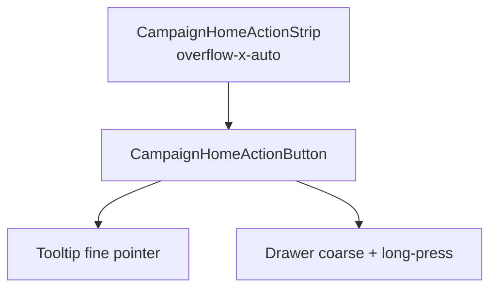

# Botão de ação do Início + lista horizontal

Status: rascunho
Atualizado em: 2026-07-29
Item do roadmap: [docs/roadmap.md](../roadmap.md) (Trilha B, item B44 — chassis UX-1)
Impeccable: C — primitivo UI novo (botão circular + strip rolável) no Início blank
Appetite: ~1 dia eng; 2 componentes client + long-press + Tooltip/Drawer; sem migration
Responsável: —

## Design (Impeccable)

Âncoras: `PRODUCT.md` (Clarity under pressure; Feel the action; anti spreadsheet/dashboard cards) / `DESIGN.md` (tokens `muted` / `foreground` / `primary` — **não** inventar cinza fora do tema) · `CampaignHoverTooltip` + `Drawer` shadcn · tema `campaign`.

Na implementação: **shape → craft → critique → polish** (classe C).

Brief compacto:

- **Persona / contexto:** CG no notebook e no celular; descobre o próximo gesto **above-the-fold** sem rolar a página.
- **Job principal:** um alvo tocável (círculo + rótulo) que comunica a ação; opcionalmente explica no hover / long-press **sem** disparar a ação no long-press.
- **Estratégia de cor:** Restrained — círculo `bg-muted` (cinza claro do tema), ícone e texto `foreground` / preto do tema; sem Signal Red no idle.
- **Edit where you see:** não — launcher, não editor.
- **Anti-goals:** card com borda/sombra envolvendo o botão; ícone sem verbo; scroll do `body` quando a strip estoura; Tooltip Radix no lugar do Drawer em coarse pointer; long-press = click.

## Dados → decisão → apresentação

Dados: N/A — chrome de ação; catálogo de rótulos é **B45**.

## Contexto

Com **B43**, `/campanha` está vazio. O rascunho UX-1 pede bloco “O que você quer fazer?” com 4–6 botões. Este item entrega o **primitivo reutilizável** e a **strip horizontal** com scroll interno — ainda sem catálogo por role (B45) e sem wizards.

Pedido (2026-07-29): círculo cinza claro + texto preto; ícone no centro; texto descritivo abaixo; área inteira clicável; lista horizontal com drag/scroll interno; descrição opcional em hover (desktop/tablet = tooltip) ou long-press (mobile = bottom drawer); long-press não dispara o click/tap.

## Objetivos

- Componente **`CampaignHomeActionButton`** (nome final no PR) com props: `label`, `icon` (Lucide), `description?`, `onClick?` / `href?`, `disabled?`.
- Visual: círculo claro + ícone centrado + label abaixo; hit target = círculo **e** label (um só controle focável).
- **`CampaignHomeActionStrip`**: fila horizontal; `overflow-x-auto` (não `overflow` no body); preferir scroll-snap leve; touch-pan-x; scrollbar discreta ou hidden com affordance de overflow.
- Descrição opcional:
  - `pointer-fine` + hover/focus → Tooltip (reusar stack shadcn; **não** reutilizar às cegas `CampaignHoverTooltip` se o contrato touch-toggle conflitar com long-press — medir e documentar).
  - `pointer-coarse` → long-press abre **Drawer** inferior com título = label + corpo = description; soltar após limiar **não** chama `onClick`.
- Sem migration / collection / Consent / action de escrita.
- Unit (jsdom): long-press não dispara click; strip não propaga scroll vertical do body (smoke); a11y name = label (+ description via `aria-describedby` quando aberta).

## Decisões travadas

- **Um botão = um controle**, não círculo link + texto link separados. **Rejeitado:** dois alvos (ícone vs texto) — falha de hit area e SC 2.5.3.
- **Long-press ≠ click.** Timer ~400–500 ms; `pointercancel` / move além de slop cancela; no fire do long-press, `preventDefault` no click sintético seguinte. **Rejeitado:** tap curto abre Drawer (rouba a ação futura); só `title=` nativo (inacessível no touch).
- **Tooltip fine / Drawer coarse** — espelha B34/B42 (política por pointer, não só viewport). **Rejeitado:** um único Popover; hover no mobile.
- **Cores via tokens** (`bg-muted`, `text-foreground`) — “cinza claro / preto” do pedido mapeiam ao tema, não hex soltos. **Rejeitado:** `#e5e5e5` hardcoded.
- **i18n:** ids/props em inglês (`label`, `description`, `HomeActionButton`); copy pt-BR vem do catálogo B45.

## Questões em aberto

- **Scroll com drag de mouse (desktop) além da wheel/trackpad?** **Opções:** A só overflow nativo | B drag-to-scroll. **Recomendação:** A no v1 — nativo basta; drag é polish se sessão reclamar. _(assumido)_

## Abordagem proposta

Componentes:

- **`src/components/campaign/dashboard/CampaignHomeActionButton.tsx`** (`'use client'`): botão/`Link` polimórfico; círculo `size-*` com ícone; label `text-sm` centrado; long-press machine; Tooltip vs Drawer.
- **`src/components/campaign/dashboard/CampaignHomeActionStrip.tsx`**: lista `role="list"` / items; classes de overflow; opcional fade edges (Adiado se custar).
- **Não** montar no Início com dados reais aqui — story/fixture no plano de teste **ou** mount placeholder só em storybook-less: B45 monta. Em B44, e2e/unit montam os componentes isolados **ou** uma página de smoke se necessário; preferir specs de componente.
- **Migration:** Sem migration, sem collection, sem server action.

## Dependências

- Dura: **B43** (Início blank onde a strip pousa — pode desenvolver isolado, mas aceitação visual é no Início).
- Soft: padrão Drawer de `CampaignCellEditOverlay` / `ui/Drawer`.

## Não escopo

- Catálogo por role e mount no Início → **B45**.
- Navegação/wizards reais → fatias UX-1 seguintes.
- Redesign do Quadro.

## Rabbit holes

- **Generalizar `CampaignHoverTooltip` para long-press+Drawer.** 3º comportamento num componente já denso. **Mitigação:** lógica no botão do Início; extrair só no 2º call site idêntico.
- **Carousel com setas / lib de swipe.** **Mitigação:** overflow nativo.

## Adiado com gatilho

- **Drag-to-scroll no desktop.** Revisitar se CG não descobrir overflow na strip.
- **Fade edges** na strip. Revisitar no critique Impeccable se o corte visual mentir “acabou”.

## Referências

- `docs/roadmap.md` (B44) · [inicio-em-branco-quadro.md](inicio-em-branco-quadro.md) (B43) · [fluxos-acao-primeiro-inicio.md](fluxos-acao-primeiro-inicio.md)
- `src/components/ui/Drawer.tsx` · `tooltip.tsx` · `CampaignHoverTooltip.tsx` (contrato touch — comparar, não copiar cego)
- `PRODUCT.md` / `DESIGN.md`
- AGENTS.md — client boundary; Feel the action
