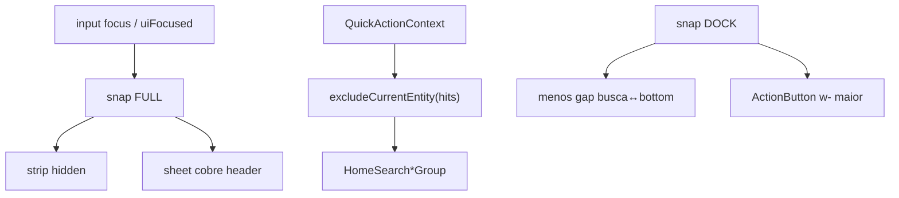

# Bottom drawer — polimento dock + busca fullscreen + excluir entidade atual

Status: registrado
Atualizado em: 2026-08-01
Issue: #148
Priority: P1
Model: composer-2.5
Impeccable: C — chrome `CampaignQuickActionsDrawer` (geometria dock + modo busca)
Appetite: ~1–1,5d eng; snap + CSS botões + filtro de hits; sem migration
Responsável: —

## Design (Impeccable)

Âncoras: `PRODUCT.md` (Clarity under pressure; Feel the action; Continuity) / `DESIGN.md` · B79/B91/B100/B105 · Início `focused` (B65) · tema `data-theme='campaign'`.

Na implementação (`work-issue`): craft compacto → critique → polish (viewport ~390; detalhe município + lista).

Brief compacto:

- **Persona / contexto:** CG/assessor no celular **fora do Início** — dock para ações + busca; ao digitar/focar a busca, precisa de tela inteira sem o strip competindo.
- **Job principal:** (1) ler rótulos das ações sem corte; (2) busca com dock apertado na base; (3) ao focar a busca, drawer sobe cobrindo o header, só handle + input + resultados; (4) não sugerir/listar a entidade da página atual.
- **Estratégia de cor:** Restrained.
- **Edit where you see:** não — launchers / navegação.
- **Anti-goals:** scrim modal no dock idle; segundo FAB; redesenhar catálogos B80–B90; wizard return (→ **B110**); polish do Início (→ **B111**).

### Wireframe (texto)

**1) Dock idle (não-Início):**

```text
┌─ /campanha/municipios/foo ─────────────────────┐
│ header + conteúdo                              │
├─ drawer DOCK ──────────────────────────────────┤
│ ═ handle                                       │
│ [● Ajustar] [● Mudar] [● …]  ← labels 2 linhas │
│   tendência cabe inteira; botão um pouco +largo│
│ ┌ Buscar na campanha ────────────────────────┐ │
│ └────────────────────────────────────────────┘ │
│ ← gap curto até safe-area / bottom             │
└────────────────────────────────────────────────┘
```

**2) Busca focada / ativa (fullscreen):**

```text
┌─ drawer FULL (cobre header) ───────────────────┐
│ ═ handle                                       │
│ ┌ Buscar na campanha ────────────────────────┐ │
│ └────────────────────────────────────────────┘ │
│ Sugestões / resultados (sem a entidade atual)  │
│ …                                              │
│ …                                              │
└────────────────────────────────────────────────┘
  Fora: strip de ações oculto; página atrás opaca
  (não-modal continua — sem scrim que bloqueie? ver Decisões).
```

## Dados → decisão → apresentação

Dados: N/A como métrica nova — hits de `POST /campanha/home-search` já existentes; só **filtro de exclusão** da entidade do contexto.

## Contexto

Pós **B100/B105** o drawer tem dock + collapsed + labels `line-clamp-2`. Feedback de campo (2026-08-01):

1. **Gap** entre a barra de busca e o fundo da tela **grande demais** no dock.
2. Labels cortados na horizontal (ex. “Mudar tendênci”) — `CampaignHomeActionButton` fixa `w-[4.75rem]`.
3. Foco na busca deve espelhar o ritual do Início (`CampaignHomeLayout` `focused`): strip some, superfície sobe — mas no drawer precisa **cobrir o header** também.
4. Empty state / resultados ainda incluem a entidade da página atual (município/liderança/assessor/…), o que é ruído quando já se está nela.

## Objetivos

- Reduzir o espaçamento vertical **busca → bottom** no snap dock (gap do stack + padding do handle / safe-area); dock continua a caber strip + busca.
- Largura dos botões da strip **o suficiente** para o maior rótulo do catálogo em **duas linhas**, centralizado; retirar padding horizontal residual do controle se ainda existir; sem encolher hit target do círculo (&lt;44 px).
- Ao **focus** do input de busca (e enquanto `uiFocused` / query ativa): snap **fullscreen** (`1` / `100dvh` — pin no craft); **ocultar** a strip de ações; sheet cobre o viewport inclusive `CampaignMobileTopBar`.
- Ao blur com query vazia / clear: voltar ao dock (ou collapsed se o scroll da página já tiver recolhido — ver Questões).
- Filtrar sugestões e resultados da busca para **excluir** a entidade do `CampaignQuickActionContext` da rota atual (slug/id por tipo).
- Guardrails: sem migration / Consent / escrita; Início fora deste drawer; leader lockdown intacto.
- **Tracer bullet:** e2e mobile em `/campanha/municipios/[slug]` — dock com label “Mudar tendência” legível → focus busca → strip ausente + handle no topo do viewport → hit do município atual **não** aparece nas sugestões.

## Decisões travadas

- **3º snap `full` só sob busca focada/ativa; idle continua dock|collapsed (B100).** Espelha Início `focused`. **Rejeitado:** sempre full; crescer só o dock sem snap novo (não cobre header de forma confiável).
- **Fullscreen não-modal (sem bloquear pointer na página) no appetite v1 — sheet cobre visualmente o chrome.** Overlay `modal={false}` já é o contrato B79; se o critique exigir scrim no full, Adiado. **Rejeitado:** tornar o drawer modal só no focus (muda a família de gesto / dismiss).
- **Exclusão client-side nos grupos de resultado + payload suggest, keyed pelo contexto da página** (`municipalitySlug` / `leadershipId` / `organizationSlug` / `activitySlug` / `demandSlug` / advisor id se houver). **Rejeitado:** mudar o ranking server-side do home-search neste item (blast maior; Início não precisa excluir “si mesmo”).
- **Botão: aumentar `w-*` (ou `min-w`) o mínimo que caiba “Mudar tendência” / “Atualizar liderança” em 2 linhas; não multi-width por label.** **Rejeitado:** `w-auto` solto (quebra snap/pan da strip); fonte menor.
- **Item novo (B109), não reabrir B105/B100.** Continuação de polimento. **Rejeitado:** editar só as-built antigo sem Issue.
- **i18n:** ids `full` snap / `excludeCurrentEntity`; copy pt-BR intacta.

## Questões em aberto

- **Após blur da busca com query vazia, voltar a qual snap?** **Opções:** A) sempre dock | B) dock se `scrollTop` baixo, senão collapsed. **Recomendação:** **B** — respeita o ritual B100 de leitura. _(assumido)_
- **Excluir também visitados recentes / geo suggest quando forem a entidade atual?** **Opções:** A) sim, qualquer hit com o mesmo id/slug | B) só grupo “Sugestões” server. **Recomendação:** **A**. _(assumido)_

## Abordagem proposta



Componentes:

- **`campaignQuickActionSnap.ts`**: adicionar `QUICK_ACTIONS_SNAP_FULL`; helpers `quickActionsSnapIsFull` / `isDock`.
- **`CampaignQuickActionsDrawer.tsx`**: reagir a `uiFocused` (já em `HomeSearchContext` no host) → `setSnapPoint(FULL)`; ocultar strip; ordem visual handle → busca → resultados no full; apertar padding/gap no dock.
- **`CampaignQuickActionsHost` / scroll peek**: peek height no full = full viewport (ou não reservar padding absurdo no content scroll enquanto full).
- **`CampaignHomeActionButton.tsx`**: largura do controle; pin visual/unit se houver snapshot de classe.
- **Filtro:** helper puro `excludeHomeSearchHitForContext(hit, context)` em `lib/`; aplicar nos grupos ou no merge do `HomeSearchResultsContext` quando montado sob o drawer (prop/`data-exclude` via provider leve). Evitar poluir o Início.
- **Migration:** Sem migration, sem collection, sem server action nova.

## Dependências

- Soft: B100 ✓, B105 ✓, B91 ✓, B79 ✓. Nenhuma dura.
- Paralelo: **B110** (return path wizard), **B111** (Início strip/delta) — sem `depends` duro.

## Não escopo

- Redirect pós-wizard → **B110**.
- Faixas brancas / delta flat do Início → **B111**.
- Redesign do catálogo de ações / novos verbos.
- Busca leader / rotas fora do drawer staff.

## Rabbit holes

- **Reescrever o primitivo `Drawer.tsx` para todos os sheets.** Mitigação: override só no chassis quick-actions; Base UI snap já usado.
- **Segundo `HomeSearchProvider` / fork do suggest API.** Mitigação: filtro no client com contexto já sincronizado.
- **Animar header aparte do snap.** Mitigação: cobrir com o sheet; não esconder o top bar via layout.

## Adiado com gatilho

- **Scrim no snap full.** Revisitar se critique de campo disser que o conteúdo atrás distrai durante a busca.
- **Exclusão server-side no `home-search`.** Revisitar se o payload vier grande demais para filtrar no client.

## Referências

- GitHub Issue #148 (spec + frontmatter `id/depends/priority/model`)
- `src/components/campaign/shell/CampaignQuickActionsDrawer.tsx` — chassis
- `src/lib/campaignQuickActionSnap.ts` — snaps
- `src/components/campaign/dashboard/CampaignHomeActionButton.tsx` — `w-[4.75rem]`
- `src/components/campaign/dashboard/CampaignHomeLayout.tsx` — precedente `focused`
- `src/lib/campaignQuickActionContext.ts` — entidade atual
- `docs/plans/bottom-drawer-peek-acoes-busca.md` (B100), `bottom-drawer-handle-scroll-peek.md` (B105)
- AGENTS.md — Campaign auth; naming EN / copy pt-BR
- `PRODUCT.md` / `DESIGN.md` — Field Desk / Continuity
