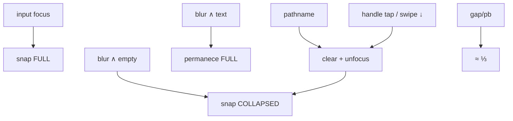

# Bottom drawer — colapso (blur vazio / nav / handle), swipe ↓ e padding inferior

Status: implementado (PR)
Atualizado em: 2026-08-01
Issue: #193
Priority: P0
Model: cursor-grok-4.5-medium
Impeccable: C — chrome `CampaignQuickActionsDrawer` (gesto + geometria + foco da busca)
Appetite: ~0,75–1d eng; colapso blur/nav/handle + gesto + padding; sem migration
Responsável: —

## Premissas

1. Superfície = bottom drawer **fora do Início** (`CampaignQuickActionsDrawer` / B79+), não a busca do Início (B65/B106).
2. **Três gatilhos de colapso:**
   - **Blur + query vazia** → colapsa (desistir sem texto / limpou).
   - **Navegação** (ex. hit → `/municipios/[slug]`) → colapsa **sempre**, mesmo com texto.
   - **Handle** (tap **ou** swipe ↓) → colapsa **sempre**, mesmo com texto — e **encerra o ritual** (clear + unfocus) para o efeito `uiFocused → FULL` não reabrir na hora.
3. **Blur com texto ainda escrito** → **não** colapsa (mantém busca). Diferente do handle: blur acidental não mata a query; gesto explícito no handle sim.
4. “Diminuir para um terço (33%) do atual” aplica-se ao **espaçamento busca → limite inferior** (padding/gap abaixo do input no dock), não à altura total do snap.
5. Puxar o drawer para baixo **tem** de recolher (pedido pela 3ª vez; B105 ✓ declarou, mas o gesto ainda falha no campo).
6. `safe-area-inset-bottom` permanece — o corte de 33% é no padding/gap **além** do inset mínimo do OS.
   → Corrija no gate ou o implementador segue com estas.

## Design (Impeccable)

Âncoras: `PRODUCT.md` (Clarity under pressure; Feel the action; thumb zone) / `DESIGN.md` · B79/B91/B100/B105/B109 · tema `data-theme='campaign'`.

Na implementação (`work-issue`): craft compacto → critique → polish (viewport ~390; blur real; gesto no device/emulador).

Brief compacto:

- **Persona / contexto:** CG/assessor no celular fora do Início; uma mão; digita, compara hits, ou toca um resultado — não perder a busca no blur acidental se ainda há texto.
- **Job principal:** (1) blur vazio / nav / **handle** → collapsed; blur com texto sem handle → permanece; (2) gap ~⅓; (3) handle tap **e** swipe ↓ sempre vencem query viva.
- **Estratégia de cor:** Restrained.
- **Edit where you see:** não — chrome.
- **Anti-goals:** scrim modal; colapsar no blur com query viva; handle que “tenta” collapsed e o `uiFocused` devolve FULL.

### Wireframe (texto)

```text
Focus → FULL.
Blur + vazio → COLLAPSED.
Blur + texto → permanece FULL.
Hit / pathname → COLLAPSED + clear.
Handle tap ou swipe ↓ → COLLAPSED + clear (mesmo com texto).

┌─ após handle / nav / blur vazio ───────────────┐
│ conteúdo                                       │
├─ COLLAPSED ────────────────────────────────────┤
│ ═ handle + busca discreta + gap ≈ ⅓            │
└────────────────────────────────────────────────┘
```

## Dados → decisão → apresentação

Dados: N/A — chrome; hits = providers existentes.

## Contexto

Pós **B105/B109**, focus → `uiFocused` → snap **full**; `restoreSnapAfterSearch()` no unfocus; pathname reseta para **dock**. Feedback de campo (2026-08-01) + correção de gate:

1. **Blur com texto preserva a busca** (não colapsa). Blur vazio → collapsed.
2. **Navegação** → sempre collapsed + clear (hoje pathname força **dock** e query pode sobreviver).
3. **Handle tap / swipe ↓ vs query viva:** `uiFocused` (focus ∨ `isActive`) tem `useEffect` que **reaplica FULL** — por isso, com texto no input, puxar ou tocar o handle “sempre força aberto”. Produto: handle é intenção explícita de recolher → **clear + collapsed**, e o efeito não pode reabrir no mesmo gesto.
4. **Padding** ≈ ⅓ do atual abaixo da busca.
5. **Swipe ↓** além do tap (3ª vez) — mesmo contrato do handle: sempre colapsa.

## Objetivos (critérios de aceite)

- [ ] **Blur + query vazia** → snap **collapsed**.
- [ ] **Blur + query com texto** → **não** colapsa.
- [ ] **Navegação** → clear + snap **collapsed** (não dock).
- [ ] **Tap no handle** com query viva (ou full) → clear + **collapsed**; não volta sozinho para full.
- [ ] **Swipe / drag ↓** no handle (e no sheet se Base UI permitir) → mesmo efeito: clear + collapsed; não só tap; não reabre por `uiFocused`.
- [ ] Espaçamento **abaixo** do input no dock ≈ **⅓** do medido antes do PR (safe-area intacta).
- [ ] Load inicial = **dock** (B100). Focus → full (B109).
- Guardrails: sem migration / Consent / escrita; Início fora; leader lockdown intacto.

## Boundaries (desta entrega)

- **Always:** pin unit/contrato do blur→collapse no drawer; docs Base UI snap/swipe na versão de `package.json`.
- **Ask first:** mudar `homeSearchUiFocused` / blur do **Início** (este item é drawer-first; extrair prop `collapseOnBlur` se o input for compartilhado).
- **Never:** Neon; reinventar drawer; tocar catálogos B80–B90; wizard chrome.

## Decisões travadas

- **Gatilhos de colapso:** (1) blur ∧ vazio; (2) navegação → clear + collapsed; (3) **handle tap ou swipe ↓ → clear + collapsed sempre**. Fonte: produto 2026-08-01. **Rejeitado:** colapsar em todo blur; pathname → dock; handle que só muda snap enquanto `uiFocused` reaplica FULL.
- **Causa raiz do “handle com texto força aberto”:** efeito `uiFocused → setSnapPoint(FULL)` em [`CampaignQuickActionsDrawer.tsx`](../../src/components/campaign/shell/CampaignQuickActionsDrawer.tsx). Handle/swipe devem **clear** (ou desarmar o efeito) **antes/junto** do collapsed. **Rejeitado:** só `setSnapPoint(COLLAPSED)` sem clear; “disable handle enquanto busca ativa”.
- **Blur ∧ texto → não colapsa** (preserva ritual). **Rejeitado:** clear-on-blur com texto.
- **Gap inferior = ⅓ do atual.** **Rejeitado:** cortar safe-area.
- **Swipe ↓ = mesmo contrato do tap no handle** (gesto Base UI real + clear). **Rejeitado:** tap only; swipe que falha em silent no full.
- **i18n:** ids existentes.

## Questões em aberto

- **Blur com texto: permanece FULL (recomendado) ou desce a DOCK mantendo query?** **Opções:** A) FULL | B) DOCK. **Recomendação:** **A**. _(assumido)_

## Abordagem proposta



Componentes:

- **`CampaignQuickActionsDrawer.tsx`:** `toggleSnap` / `onSnapPointChange` para collapsed → chamar `clear()` + unfocus; **não** deixar o effect `uiFocused→FULL` rearmar no mesmo tick (ordenar clear antes do setSnap, ou gate “userCollapsedUntilBlur”). Swipe + padding.
- **`CampaignQuickActionsSnapContext.tsx`:** pathname → collapsed + clear (não dock).
- **`CampaignHomeSearch` / context:** expor `clear` já usado; blur vazio → unfocus (padrão próximo ao atual).
- **Tests:** matriz blur∅ / blur+texto / pathname / **handle com query viva**; swipe se estável.
- **Migration:** Sem migration.

## Fases verificáveis

### Fase 1 — Tracer: matriz colapso + handle vence query

- **Quota:** ~0,45d
- **Entrega:** blur∅ / nav / handle(+texto) → collapsed; blur+texto permanece; handle não reabre FULL.
- **Aceite:**
  - [ ] Quatro casos pinados (unit e/ou e2e): blur∅, blur+texto, pathname, handle com `isActive`.
- **Verify:** `pnpm gate:fast` + pins
- **Files:** drawer, SnapContext, search clear wiring, tests
- **Tamanho:** M

### Fase 2 — Padding ⅓ + swipe ↓ = handle

- **Quota:** ~0,3–0,55d
- **Entrega:** gap ⅓; drag ↓ com o mesmo clear+collapsed do tap.
- **Aceite:**
  - [ ] Medida antes/depois; swipe com query viva colapsa e não reabre.
- **Verify:** `pnpm gate:fast` + e2e/manual
- **Files:** drawer, possivelmente `Drawer.tsx`, snap constants
- **Tamanho:** M

### Checkpoint

- [ ] Matriz + handle/swipe com texto + padding verdes; Início intacto.

## Dependências

- Soft: B105 ✓, B109 ✓ (supersede restore-on-blur→dock e pathname→dock).
- Nenhuma dura aberta.

## Não escopo

- Polish de wizard → **B113**.
- Sistema de back do wizard → **B114**.
- Mudar blur/collapse da busca do **Início** (salvo Ask first se o input for compartilhado demais).

## Rabbit holes

- **Unificar blur Início × drawer num único state machine.** **Mitigação:** prop/variante no drawer; Início fora.
- **Reescrever Drawer genérico.** **Mitigação:** mudanças mínimas no quick-actions.

## Adiado com gatilho

- **Collapsed sem barra de busca.** Revisitar se produto pedir só handle após 1 sprint.

## Referências

- GitHub Issue #193 (spec + frontmatter `id/depends/serializes/priority/model`)
- [`CampaignQuickActionsDrawer.tsx`](../../src/components/campaign/shell/CampaignQuickActionsDrawer.tsx)
- [`CampaignHomeSearch.tsx`](../../src/components/campaign/dashboard/CampaignHomeSearch.tsx) — blur condicional atual
- [`campaignHomeSearchContract.ts`](../../src/lib/campaignHomeSearchContract.ts) — `uiFocused = focused || isActive`
- [`CampaignQuickActionsSnapContext.tsx`](../../src/components/campaign/shell/CampaignQuickActionsSnapContext.tsx)
- `docs/plans/bottom-drawer-handle-scroll-peek.md` (B105) · `bottom-drawer-busca-fullscreen-polimento.md` (B109)
- AGENTS.md — naming; sem Neon
- `PRODUCT.md` / `DESIGN.md`
