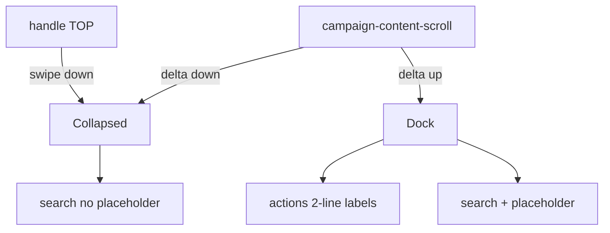

# Bottom drawer — handle, gesto, scroll, peek discreto, labels 2 linhas

Status: em implementação
Atualizado em: 2026-08-01
Issue: #132
Priority: P1
Model: cursor-grok-4.5-medium
Impeccable: C — chrome `CampaignQuickActionsDrawer` (comportamento + geometria)
Appetite: ~1–1,5d eng; snap/gesto/scroll + peek busca + altura labels; sem migration
Responsável: —

## Design (Impeccable)

Âncoras: `PRODUCT.md` (thumb zone; Feel the action) / `DESIGN.md` · B79/B91/B100 · Base UI Drawer snap · tema `campaign`.

Na implementação (`work-issue`): craft compacto → critique → polish (viewport ~390; detalhe município; scroll real).

Brief compacto:

- **Persona / contexto:** CG/assessor no celular fora do Início; uma mão; alterna ler a página e disparar ação/busca.
- **Job principal:** (1) handle **no topo** do sheet; (2) puxar para baixo fecha/recolhe; (3) scroll página ↓ fecha, ↑ abre; (4) collapsed ainda mostra busca **sem placeholder**; (5) títulos das ações com **2 linhas** visíveis.
- **Estratégia de cor:** Restrained.
- **Edit where you see:** não — launchers.
- **Anti-goals:** scrim modal; FAB; bottom nav; redesenhar catálogos B80–B90; absorver crash da busca (→ **B102** primeiro ou em paralelo sem bloquear geometria).

### Wireframe (texto)

**Dock (aberto):**

```text
┌─ página ───────────────────────────────────────┐
│ conteúdo                                       │
├─ drawer ───────────────────────────────────────┤
│ ═ handle (TOPO)                                │
│ [○][○][○]…  labels em 2 linhas visíveis        │
│ ┌ Buscar na campanha (placeholder ok) ───────┐ │
│ └────────────────────────────────────────────┘ │
└────────────────────────────────────────────────┘
```

**Collapsed (fechado / após scroll ↓):**

```text
┌─ página (mais conteúdo) ───────────────────────┐
│ …                                              │
├────────────────────────────────────────────────┤
│ ═ handle                                       │
│ ┌ (input sem placeholder — discreto) ────────┐ │
│ └────────────────────────────────────────────┘ │
└────────────────────────────────────────────────┘
```

**Gesto:** drag handle/sheet ↓ → collapsed; scroll content ↓ → collapsed; scroll content ↑ → dock.

## Dados → decisão → apresentação

Dados: N/A — chrome; hits = B48+ via provider existente.

## Contexto

**B100 ✓** (#114) definiu dock no load + collapse no scroll **para baixo** + reopen **só** tap/pull (explicitamente **sem** reopen no scroll-up). Follow-up `a056616d` reordenou o DOM para o handle ficar **em baixo** (“snap shows bottom band”) — produto agora rejeita: handle deve voltar ao **topo**; puxar ↓ deve recolher; scroll ↑ deve **abrir**. Collapsed deve manter a barra de busca visível **sem placeholder**. Labels `line-clamp-2` existem no botão, mas dock `12rem` + `overflow-hidden` + handle embaixo cortam a 2ª linha.

## Objetivos

- **Handle no topo** do `DrawerContent` (reverter ordem do `a056616d`); banda visível do snap mostra handle → ações → busca.
- **Swipe/drag para baixo** no drawer recolhe para collapsed (Base UI `swipeDirection="down"` + snap; validar que não fica “só tap”).
- **Scroll do `campaign-content-scroll`:** ↓ além do limiar → collapsed; ↑ (delta ou `scrollTop` caindo / direção) → dock. Não reabrir se busca `uiFocused` _(assumido)_.
- **Collapsed:** renderiza input de busca **visível**, `placeholder=""` (ou omitido); sem strip de ações (ou strip hidden). Tap no input / focus → dock + focus.
- **Altura do dock / overflow:** 2ª linha dos labels visível (subir `QUICK_ACTIONS_SNAP_DOCK` e/ou `overflow-y-auto` na região de ações; tirar clip que come `line-clamp-2`).
- Load / navegação: estado inicial = dock (B100).
- Pins: unit direção scroll; e2e mobile handle no topo + collapse swipe se estável.
- Sem migration / Consent.
- Tracer: load dock → scroll ↓ collapsed (busca sem placeholder) → scroll ↑ dock → labels 2 linhas no viewport.

## Decisões travadas

- **Supersede B100 no reopen por scroll-up e no collapsed “só handle”.** Fonte: produto 2026-08-01. **Rejeitado:** manter “reopen só tap” (B100); collapsed só handle sem busca.
- **Handle no topo — reverter o DOM order do `a056616d`.** Se a geometria do snap exigir `padding-bottom` Base UI, aplicar **sem** mover o handle para baixo. **Rejeitado:** handle embaixo como “fix” de banda visível.
- **Collapsed = handle + busca discreta (sem placeholder); ações hidden.** **Rejeitado:** collapsed = só handle (B100); esconder busca no collapsed.
- **Scroll-up reabre** com limiar de direção (delta ↑ ≥ N px) ou `scrollTop` caindo abaixo do limiar — craft escolhe o mais estável; pin no unit. **Rejeitado:** hysteresis multi-eixo complexa neste item.
- **i18n:** ids `dock`/`collapsed`; aria pt-BR; placeholder vazio no collapsed (label sr-only permanece).

## Questões em aberto

- **Limiar scroll-up para abrir?** **Opções:** A) espelhar 24 px de delta ↑ | B) `scrollTop < 24` (só perto do topo). **Recomendação:** **A** (simétrico ao collapse). ✅ travado em craft (`quickActionsScrollDirection`).
- **Focus no input collapsed:** expande para dock automaticamente? **Opções:** A) sim | B) só digitar. **Recomendação:** **A**. ✅ travado em craft (`uiFocused` → dock).

## Abordagem proposta



Componentes:

- **`CampaignQuickActionsDrawer.tsx`**: ordem handle → context; collapsed mostra `CampaignHomeSearch` (ou slot) sem placeholder; dock mostra strip + search completa; overflow/altura.
- **`CampaignQuickActionsHost.tsx` / snap context:** listener de scroll com direção (↑/↓); respeitar `uiFocused`.
- **`campaignQuickActionSnap.ts`:** recalibrar `QUICK_ACTIONS_SNAP_COLLAPSED` / `DOCK` para caber handle+busca (collapsed) e strip 2 linhas+busca (dock).
- **`CampaignHomeSearch` / `CampaignSearchInput`:** prop opcional `placeholder` / `discreet` para collapsed.
- **E2e / unit** atualizar expectativas B100 (scroll-up agora reabre; collapsed tem busca).
- **Migration:** Sem migration.

## Dependências

- Soft: B100 ✓, B91 ✓. Soft: **B101** (bleed/gap da strip — pode pousar junto). Soft: **B102** (crash) — se o crash bloquear teste manual da busca no drawer, priorizar B102.
- Nenhuma dura de Issue aberta.

## Não escopo

- Crash focus/type → **B102**.
- Gap/padding dos botões → **B101**.
- Título “Sugestões” → **B103**.
- Catálogos de ações por rota.

## Rabbit holes

- **Terceiro snap “expanded” para resultados.** Mitigação: Adiado; resultados rolam no dock ou a página.
- **`position: fixed` caseiro no lugar do Base UI.** Mitigação: só se swipe+snap forem irrecuperáveis após handle no topo + padding-bottom correto.
- **Persistir snap em sessionStorage.** Mitigação: fora; reset no pathname (B100).

## Adiado com gatilho

- Animação spring custom além do Base UI. Revisitar se critique pedir motion.
- Peek de 1 ícone de ação no collapsed. Revisitar se a mesa achar busca-só pobre.

## Referências

- GitHub Issue #132 (B105)
- `CampaignQuickActionsDrawer.tsx` · `CampaignQuickActionsHost.tsx` · `campaignQuickActionSnap.ts` · `Drawer.tsx` · `docs/plans/bottom-drawer-peek-acoes-busca.md` (B100 — supersedido em parte)
- Commit `a056616d` (handle bottom — reverter ordem)
- `PRODUCT.md` / `DESIGN.md` — Field Desk chrome
