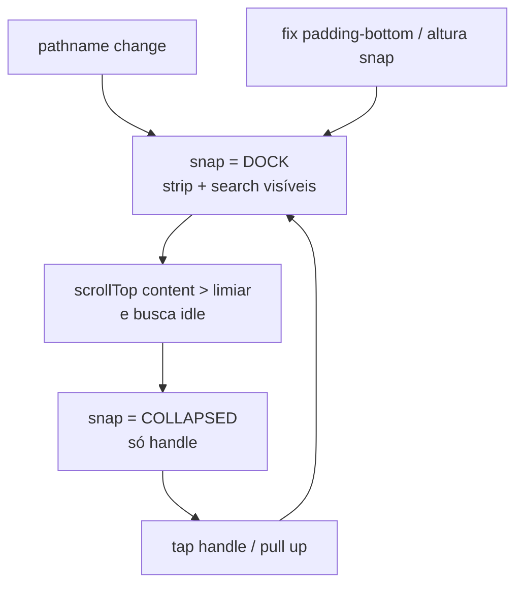

# Bottom drawer mobile — dock visível + recolhe no scroll

Status: rascunho
Atualizado em: 2026-08-01
Issue: —
Priority: P1
Model: composer-2.5
Impeccable: C — chrome `CampaignQuickActionsDrawer`: geometria do snap + comportamento scroll
Appetite: ~1 dia eng; fix de snap + dock inicial + collapse-on-scroll + e2e; sem migration
Responsável: —

## Design (Impeccable)

Âncoras: `PRODUCT.md` (Clarity under pressure; Feel the action; thumb zone) / `DESIGN.md` · dock do Início (**B65**) · chassis **B79** · docs Base UI Drawer snap · tema `data-theme='campaign'`.

Na implementação (`work-issue`): craft compacto → critique → polish (viewport ~390; detalhe de município; scroll real no `campaign-content-scroll`).

Brief compacto:

- **Persona / contexto:** CG/assessor no celular fora do Início — precisa ver ações + busca ao chegar; ao ler o conteúdo (scroll), o chrome some para não roubar tela; volta só sob demanda.
- **Job principal:** (1) dock aberto o suficiente para strip + “Buscar na campanha”; (2) recolhe ao rolar a página para baixo; (3) reabre só por tap no handle ou puxar para cima.
- **Estratégia de cor:** Restrained — `CampaignHomeActionStrip` + `CampaignGlobalSearchMount`.
- **Edit where you see:** não — launchers.
- **Anti-goals:** auto-reabrir no scroll para cima; scrim modal; FAB; bottom nav (**B73**); reescrever catálogos B80–B90.

### Wireframe (texto)

**1) Load / idle aberto (dock):**

```text
┌─ /campanha/municipios/foo ─────────────────────┐
│ conteúdo da página                             │
├─ drawer DOCK (snap aberto) ────────────────────┤
│ ═ handle                                       │
│ [●][●][●][●]…  ações contextuais               │
│ ┌ Buscar na campanha ────────────────────────┐ │
│ └────────────────────────────────────────────┘ │
└────────────────────────────────────────────────┘
```

**2) Após scroll para baixo (recolhido):**

```text
┌─ página (mais conteúdo visível) ───────────────┐
│ …                                              │
│ …                                              │
├────────────────────────────────────────────────┤
│ ═ handle ═   ← só isso; tap / puxar ↑ reabre   │
└────────────────────────────────────────────────┘
```

**Bug de geometria a corrigir no mesmo item** (expandido/dock “vazio” hoje):

```text
conteúdo (handle+ações+busca)  ↑ acima do corte do snap
──────────────────────────────  ← translateY sem padding-bottom
banda visível = fundo vazio do sheet
```

## Dados → decisão → apresentação

Dados: N/A — chrome; hits = providers B48+ via `POST /campanha/home-search`.

## Contexto

Pedido original (2026-07-30): drawer fora do Início com ações + busca (**B79–B91**). Em produção o usuário não vê o conteúdo (2026-08-01) — mesmo “expandido” a banda fica vazia.

Diagnóstico: (1) geometria do snap sem o `padding-bottom` da receita Base UI → topo do popup fora do viewport; (2) React `hidden` / mount só se `expanded` no collapsed.

**Novo comportamento de produto (2026-08-01):** a página **carrega com o drawer aberto** o suficiente para ações + busca; **ao rolar a página para baixo**, recolhe para o handle; **só reabre** com clique no handle ou gesto de puxar para cima (não no scroll de volta ao topo).

## Objetivos

- **Geometria:** strip + input com bounding box **no viewport** no snap de dock (e no handle-only o handle visível). Fix alinhado ao Base UI (`padding-bottom` compensando `--drawer-snap-point-offset`) sem regressão nos outros Drawers.
- **Dois snaps úteis:**
  - **Dock (default no load / após navegação):** handle + strip (se houver) + input de busca.
  - **Collapsed (após scroll down):** só handle (~3rem + safe-area).
- **Scroll → collapse:** listener no scrollport `data-slot="campaign-content-scroll"` (não `window`); scroll **para baixo** além de um limiar recolhe para collapsed.
- **Reabrir:** somente tap no handle **ou** drag/pull up no drawer (snap Base UI). **Não** reabrir automaticamente ao scrollar para cima / `scrollTop === 0`.
- Caso canônico: `/campanha/municipios/[slug]`.
- Guardrails: sem migration / Consent / action de escrita; leader lockdown intacto; Início sem este drawer.
- **Tracer bullet:** e2e mobile — load com busca `toBeInViewport` → scroll down → busca fora / handle visível → click handle → busca de volta no viewport.

## Decisões travadas

- **Dois snaps: dock (ações+busca) e collapsed (handle).** Pedido 2026-08-01. O antigo “expanded 0.55dvh” deixa de ser o default; se a busca ativa precisar de mais altura, crescer o dock ou um 3º snap **só com query/focus** (ver Questões). **Rejeitado:** três snaps no idle; default collapsed (esconde o ritual); always-expanded sem collapse no scroll.
- **Collapse só no scroll para baixo do content scrollport; reopen só gesto no drawer.** **Rejeitado:** toggle automático no scroll-up (usuário pediu o contrário); escutar `window` (o scroll real é o flex child); hysteresis complexa multi-eixo neste item.
- **Estado inicial = dock a cada navegação de rota** (remount / pathname change). **Rejeitado:** persistir collapsed em `sessionStorage` neste item (Adiado — primeiro entregar o ritual).
- **Corrigir geometria do snap (causa do sheet vazio) no mesmo delivery.** Preferência: receita Base UI com `padding-bottom`; ajuste no primitivo `Drawer.tsx` se for o gap documentado, senão override no chassis. **Rejeitado:** só CSS cosmético sem fix de offset; abandonar Drawer por `fixed` caseiro.
- **i18n:** ids em inglês (`dock` / `collapsed` snaps); aria pt-BR (“Mostrar/Ocultar ações rápidas”).

## Questões em aberto

- **Limiar de scroll para recolher?** **Opções:** A) `scrollTop > 24` | B) delta para baixo ≥ 16 px numa gesture. **Recomendação:** **A** — simples, previsível, fácil de pinar no e2e. _(assumido)_
- **Busca com query ativa / focus: manter dock aberto e ignorar collapse?** **Opções:** A) sim — não recolher enquanto `inputFocused || query.isActive` | B) recolher mesmo assim. **Recomendação:** **A** — senão o teclado + resultados somem no meio da busca. _(assumido)_
- **3º snap alto só para resultados?** **Opções:** A) não neste item — resultados rolam dentro do dock | B) expandir no focus. **Recomendação:** **A** no appetite; B se o critique mostrar resultados cortados. _(assumido)_

## Abordagem proposta



Componentes:

- **`campaignQuickActionSnap.ts`:** renomear/clarificar `DOCK` (altura fixa medida para strip+input, ~10–14rem) e `COLLAPSED` (`3rem`); atualizar padding do scroll (`--campaign-quick-actions-peek`) — **peek do layout = collapsed** (reserva mínima); quando dock aberto, padding maior ou medido para não cobrir o fim da página.
- **`CampaignQuickActionsDrawer`:** default `snapPoint = DOCK`; conteúdo do dock **sempre montado** (sem `hidden` que esconde ações/busca); collapsed só esconde/compacta via altura do snap (geometria correta), não via `display:none` do bloco útil se isso quebrar a medida — preferir deixar o conteúdo no DOM e deixar o snap clipar **desde que** o padding-bottom Base UI mantenha o topo na banda quando dock.
- **Scroll → collapse:** em `CampaignQuickActionsHost` / drawer, `useEffect` no elemento `[data-slot=campaign-content-scroll]` (`scroll` listener, passive); se `scrollTop > THRESHOLD` e busca idle → `setSnapPoint(COLLAPSED)`; **não** setar DOCK no scroll up.
- **`Drawer.tsx` (se necessário):** `padding-bottom: max(0px, calc(var(--drawer-snap-point-offset) + var(--drawer-swipe-movement-y)))` sob `data-snap-points`; revisar conflito `100dvh` vs `max-h`; smoke nos Drawers com snap.
- **Testes:** unit — default dock mostra busca sem click; scroll mock recolhe; scroll up não reabre. e2e mobile no detalhe de município com `toBeInViewport`.
- **Migration:** nenhuma.

## Dependências

- Soft (entregues): B79, B80, B91, B73.
- Serializa com outros `Drawer`+snap se o fix for global.

## Não escopo

- Catálogos B80–B90 / registry.
- Início (`CampaignHomeLayout`) — paridade visual só como referência; **não** aplicar collapse-on-scroll no Início neste item.
- Desktop / `md+`.
- Persistência de snap entre rotas.
- B99 (edge-to-edge da strip).

## Rabbit holes

- **IntersectionObserver / scroll velocity / hide-on-idle.** Mitigação: um limiar de `scrollTop`, ponto.
- **Reimplementar snap.** Mitigação: Base UI + CSS documentado.
- **Padding do scroll desafinado (conteúdo sob o dock).** Mitigação: CSS var por estado (dock vs collapsed) no `CampaignContentScroll`; medir no polish.
- **Teclado iOS.** Mitigação: busca ativa bloqueia collapse; polish em device.

## Adiado com gatilho

- **Persistir collapsed entre navegações.** Revisitar se o CG reclamar de reabrir o dock a cada rota.
- **3º snap / grow no focus da busca.** Revisitar se resultados ficarem cortados no dock.
- **Reabrir ao voltar ao topo (`scrollTop === 0`).** Só se produto pedir depois — hoje rejeitado.

## Referências

- Docs Base UI Drawer snap — padding-bottom + offset
- `src/components/ui/Drawer.tsx` · `CampaignQuickActionsDrawer.tsx` · `CampaignQuickActionsHost.tsx`
- `src/lib/campaignQuickActionSnap.ts`
- `data-slot="campaign-content-scroll"` — scrollport
- `tests/unit/campaignQuickActionsDrawer.unit.spec.tsx`
- `docs/plans/chassis-bottom-drawer-acoes-rapidas.md` · `busca-global-bottom-drawer.md`
- `PRODUCT.md` / `DESIGN.md`

## Revisões

- **2026-08-01:** Gap de visibilidade pós-B79/B91.
- **2026-08-01 (b):** Causa raiz = geometria do snap (conteúdo fora da banda).
- **2026-08-01 (c):** Produto — load em dock (ações+busca); collapse no scroll down; reopen só tap/pull.
