# Impl: Briefing de capacitação Solla 1313 — até 4 páginas para quem vai pedir voto no recorte (cidade · instituição · tema)

> **Replanejado em 2026-09-23** (4 folhas 100% recorte; âncora item-level por `sourceUrl`; `plan` no lugar do roteiro; sem evitar/conferir/limites): ver `docs/changelog/2026-09-23-c210-replan.md`, a skill atualizada e o design `docs/plans/briefing-capacitacao-solla-ui-design.html`. Este plano fica como histórico do desenho original (C210).

Status: aprovado
Atualizado em: 2026-09-22
Issue: #1252
Intenção: docs/plans/briefing-capacitacao-solla.md
Appetite restante: ~3–4 dias eng (herdado). Quota concentrada na redação com lastro (subagente autor), no port das 4 folhas do hi-fi e na integração das 3 skills irmãs. C209 é dependência **soft** (sem bloqueio); sem C209 a folha de defesas imprime a linha de lacuna.

## Leitura da intenção

- **Outcome:** um **briefing de capacitação por recorte** (cidade · instituição · tema), PDF A4 de **até 4 páginas** + companion `.md`, derivado dos artefatos do dossiê (**sem segunda pesquisa factual**), com "o essencial" (fatos-âncora com fonte), "o que Solla defende" (herdado do C209 quando houver), **roteiro do pedido de voto** ("vote 1313" + plano de voto + compromisso nomeado), **perguntas prováveis × melhores respostas** (direita e esquerda), **o que evitar** e **o que conferir no dossiê**; entregue como **3º entregável** pelas três skills de dossiê e invocável sozinho por recorte.
- **O que NÃO negociar:** rótulo literal `Insumo interno de capacitação — não publicar` em **todas** as folhas; teto de **4 páginas rígido**; sem CTA público/marca publicável/defeso; **sem fonte, o item não entra** (âncora obrigatória); sem cenário eleitoral, `estimatedVotes`, projeção ou qualquer dado staff-only; empenho ≠ pagamento (fase acompanha o valor); esfera explícita nunca somada; leitura relativa/local (nunca % estadual absoluto); PII mínima; artefato **gitignored**; nenhum schema/migration/DB write/rota/componente React; "nunca um segundo pipeline" de pesquisa ou render.
- **O que reavaliar (hipóteses da "Direção no codebase"):**
  - "PDF via `emitHtmlPairPdf`" — o dono exige `[data-page="resumo"]` **e** `[data-page="boletim"]` e emite 2 PDFs; o briefing é **documento único**. Saída: **aditiva** no dono (`emitHtmlSinglePdf`), `emitHtmlPairPdf` intocado.
  - "o teto de 4 páginas não é expressável hoje" — passa a ser: **esqueleto fixo de 4 folhas** (`data-page` adicionadas no port) + contagem de folhas + fit por folha + **shed determinístico por prioridade** (precedente `onBulletinOverflow`) + fail-closed.
  - "subagente" — confirmado: a redação é o passo pesado de contexto e vira **um subagente autor por recorte**, espelhando o redator do dossiê (o `narrative.json` também é escrito por subagente). O orquestrador da skill **coordena, audita e roda o build**.
  - O hi-fi usa Tailwind CDN e **não tem `data-page`**; o port troca por CSS inline (padrão da família) e adiciona as âncoras, classe a classe no resto.
  - As 3 SKILLs de dossiê são reescritas pelo **C209** na mesma janela; tocar apenas seções pontuais (3º entregável) e rebasar (C210 é P1).

## Abordagem recomendada

```mermaid
flowchart LR
  A["/briefing-capacitacao-solla cidade:Ilheus, instituicao:UFBA, tema:Saude"] --> B["orquestrador: resolve os recortes<br/>isMunicipalitySlug / resolveInstitutionName / resolveSpeechTopic"]
  B --> C["subagente autor (1 por recorte)<br/>lê research + voz solla-comunicacao"]
  C --> D["slug.briefing.json<br/>Q&A/roteiro/evitar/conferir só com fato-âncora"]
  D --> E["build-dossie-solla-briefing.mjs<br/>normaliza + resolve âncoras contra bulletinFacts"]
  F["dossiê já pesquisado<br/>slug.a/b/c.research.json + snapshot"] --> E
  E --> G["briefingContent: plano de impressão<br/>+ shed determinístico por prioridade"]
  G --> H["briefingRender: 4 folhas data-page + companion .md"]
  H --> I["emitHtmlSinglePdf<br/>maxPages=4 · fit por folha · fail-closed"]
  I --> J["docs/research/dossie-solla-<recorte>/slug-YYYY-MM-DD-briefing.pdf/.md"]
  K["skills dossie-solla-{cidade,instituicao,tema}<br/>dossiê + boletim + briefing na mesma invocação"] --> A
```



**Opções consideradas (forma geral):** (a) skill/command/build novos do briefing consumindo o **engine** do dossiê (`buildDossierReport`, `dossieResearch`, `dossieUnit`, `buildPdf`) | (b) um modo briefing dentro dos 3 builders existentes | (c) um segundo pipeline de pesquisa/render dedicado.
**Recomendação:** (a) — o engine já é unit-aware; o briefing é um **consumidor** do dossiê (ledger `bulletinFacts`), não um quarto recorte. Um dono por concern, custo de reverter baixo (scripts + prosa, nada em produção). A integração nas 3 skills cita a skill e chama **o mesmo build**.
**Rejeitadas:** (b) acopla o teto/emit de documento único ao caminho pinado dos 3 builders publicados (risco de regressão par a par) e multiplica o parse em 3 CLIs; (c) reabre a "sem segunda pesquisa factual" e twin-a as guardas de fonte/esfera/fase.

### Decisões de engenharia (A–F)

#### A. Onde mora o pipeline do briefing

**Opções:** A1) builder novo unit-aware (`scripts/build-dossie-solla-briefing.mjs`) + `scripts/lib/briefingContent.mjs` (contrato/validação/plano de impressão) + `scripts/lib/briefingRender.mjs` (HTML/MD), reusando o engine; A2) modo `--briefing` nos três builders `build-dossie-solla-{cidade,instituicao,tema}.mjs`; A3) pipeline próprio de pesquisa/render do briefing.
**Recomendação:** A1 — script unit-driven (`--unit=municipality|institution|theme`, default `municipality`), **offline** (não busca Câmara/Portal/IBGE; deriva dos `research.json` + snapshot), consumindo `buildDossierReport`/`bulletinFacts`. O fluxo dos dossiês chama **este mesmo script** para o 3º entregável.
**Rejeitadas:** A2 — os builders já fazem rede e emitem par; um modo briefing ali duplica a plumbing de cache/rede em 3 CLIs e toca o caminho com obrigação de byte-parity; A3 — proibido pela intenção ("nunca um segundo pipeline") e twin das guardas de fonte.

#### B. Forma do conteúdo autoral e onde validar

**Opções:** B1) contrato novo `<slug>.briefing.json` validado em `scripts/lib/briefingContent.mjs`, com âncoras resolvidas contra `report.bulletinFacts` (o ledger "só fato com fonte" que já é dono no dossiê); B2) estender `dossieResearch.mjs` com o contrato do briefing; B3) orquestrador escreve o JSON lendo os `research.json` direto.
**Recomendação:** B1 — arquivo autoral único por recorte, escrito pelo **subagente autor** a partir dos itens com fonte (análogo ao `narrative.json`), validado **fail-closed** no build. Shape mínimo:

```jsonc
{
  "unitId": "municipality",                      // municipality | institution | theme
  "municipalitySlug": "ilheus",                  // chave = slugField da unidade (institutionSlug | themeSlug)
  "generatedAt": "2026-09-22T12:00:00.000Z",     // obrigatório
  "subtitle": "Piemonte da Diamantina · consulta antes e durante o contato", // opcional
  "lede": "≤380 chars — como usar o essencial",
  "essential": [                                 // ≥3; cada item: factId XOR gapReason
    { "factId": "era_b_equipamentos", "title": "≤120", "note": "≤200" },
    { "gapReason": "sem fala própria localizada", "title": "…", "note": "…" }
  ],
  "defenses": [ { "factId": "…", "title": "…", "note": "…" } ],  // C209; [] = linha de lacuna
  "script": { "steps": [ { "title": "≤90", "note": "≤220" } ] }, // ≥3 passos; o pedido é literal do renderer
  "qa": [                                        // ≥4, com ≥1 "direita" e ≥1 "esquerda"
    { "side": "direita|esquerda|entrega", "question": "≤180",
      "acknowledge": "≤200", "answer": "≤520", "close": "≤200",
      "factId": "era_b_sesab" /* XOR */ "gapReason": "sem registro localizado" }
  ],
  "avoid": [ { "title": "≤120", "note": "≤200" } ],              // ≥3
  "checklist": { "beforeAnswer": ["≤200"], "unsure": ["≤200"] }  // ≥2 em cada
}
```

Regras de validação (todas `throw` → o builder `die` com o campo no erro): `unitId` casa com a unidade do build; slug + `generatedAt` presentes; cada item exige **exatamente um** de `factId | gapReason`; `factId` tem de resolver em `bulletinFacts` **com `sourceUrl`** (âncora, não texto novo); `side` no enum; Q&A cobre os dois lados; mínimos por lista. **Deny-list recursiva** de chaves (`estimatedVotes`, `estimated`, `scenario`, `cenario`, `projecao`, `projection`, `staffOnly`, `internalVotes`, `polls`) — o contrato não tem campo numérico; valor/fase vêm do **fato-âncora** no render. Caps de texto são **warning** (`console.warn`); quem falha fechado é o fit guard. Arquivo **ausente** → `die` com o ponteiro da skill (o briefing não tem fallback determinístico, ao contrário do `narrative.json`).
**Rejeitadas:** B2 — mistura dois ciclos de vida (pesquisa por era × derivado autoral de 1 arquivo) e exporia o contrato do briefing aos researcher subagents; B3 — obriga o orquestrador a reter o corpo dos `research.json` (contra a regra explícita da família) e serializa a redação no lote.

#### C. Teto rígido de ≤4 páginas

**Opções:** C1) esqueleto fixo de 4 folhas (`data-page="essencial|defesas|qa|evitar"`) + contagem de folhas + fit por folha + **shed determinístico por prioridade** com resto **declarado** no PDF (`.line-meta`: `e mais N no briefing completo (.md)`) e completo no `.md` + fail-closed quando o mínimo não cabe; C2) fail-closed puro (sem shed); C3) teto mole com continuação (modelo dossiê).
**Recomendação:** C1 — o renderer emite **sempre 4 folhas** (sem continuação, por construção); o builder mede (`measurePageOverflows` dentro do `emitHtmlSinglePdf`) e, se uma folha estourar, aplica `trimBriefing(content)` — função **pura e determinística** em `briefingContent.mjs` que remove um item por vez na ordem: `qa` (até o mínimo 4) → `defenses` (até 0) → `checklist` (até 2+2) → `avoid` (até 3) — re-renderiza e mede até estabilizar (teto de tentativas compartilhado `MAX_FIT_ATTEMPTS`, precedente do boletim C190); o QA só perde um item cuja remoção preserva os dois lados. **Essential, roteiro e identificação nunca são cortados**; se nem os mínimos couberem, `die` apontando a lista a encurtar. O resto é declarado na folha (`.line-meta`, estilo já especificado no design) — nunca em silêncio. A guarda de páginas é a proteção real: `.sheet{overflow:hidden}` esconde corte, então **contagem ≤4 + altura por folha + fail-closed** são obrigatórios e testados.
**Rejeitadas:** C2 — transforma cada build em tentativa/erro e ignora o precedente C190 (`onBulletinOverflow`); C3 — o produto decidiu rígido no gate; teto mole destrói o valor ("estudar/consultar em ≤4 páginas").

#### D. PDF de documento único

**Opções:** D1) aditivo no dono: exportar `emitHtmlSinglePdf(browser, { html, pdf, maxPages = 4, requiredAnchors, onOverflow = null })` em `scripts/lib/buildPdf.mjs`, reusando os helpers privados (`openPrintPage`, `measurePageOverflows`, `assertPageFits`, `printA4Pdf`) e mantendo `emitHtmlPairPdf` **intocado**; D2) generalizar `emitHtmlPairPdf` para `documents: []` (1..N); D3) exportar `printA4Pdf` e montar a guarda no builder do briefing.
**Recomendação:** D1 — superfície mínima, um só dono do mm→px/emit, zero mudança no caminho dos 3 builders publicados. O emit único: exige todas as `requiredAnchors`, conta `[data-page]` (guarda pura `assertPageCount` ≤ `maxPages`), mede overflows, chama `onOverflow` (rebuild) até estabilizar, e imprime. O **shed** fica no builder (que tem o conteúdo), não no emitter.
**Rejeitadas:** D2 — mexe no contrato emitido dos 3 builders por um ganho que não existe hoje (generalização especulativa); D3 — twin do loop/guarda fora do dono.

#### E. Companion `.md`

**Opções:** E1) `renderBriefingMd(content, { facts, unit, report })` derivado do **mesmo conteúdo normalizado** (+ ledger), carregando **tudo** (inclusive o que o PDF cortou), com `[fonte](url)` por fato-âncora; E2) derivar do HTML; E3) só PDF.
**Recomendação:** E1 — título + recorte + rótulo literal + seções espelhando as 4 folhas + roteiro com o literal "vote 1313" + Q&A em prosa com link de fonte + evitar/conferir + "Limites e defeso" + data de geração. O `.md` é a versão de referência (o PDF é a de campo).
**Rejeitadas:** E2 — parse de HTML é frágil, perde links/fonte; E3 — decisão do gate ("companion sim").

#### F. Integração nas 3 skills + command/registry

**Opções:** F1) **uma** skill/command `briefing-capacitacao-solla`, com seletor literal de recorte (`cidade:<token>` · `instituicao:<token>` · `tema:<token>`, lote por vírgula reusando os resolvedores das irmãs); as 3 SKILLs de dossiê citam a skill e ganham o 3º entregável; F2) três skills gêmeas (uma por recorte); F3) embutir o briefing nos fluxos existentes sem skill própria.
**Recomendação:** F1 — a skill é a fonte canônica do fluxo (parse → autor → auditoria → build → summary); as SKILLs irmãs só **citam** e listam o 3º entregável. Mudam nos 3 SKILLs: `description:`, "Quando usar", "Lote" (uma entrada = dossiê + boletim + briefing), saídas do passo 6 (`-briefing.pdf` + `-briefing.md`), summary do passo 7, guardrails do briefing (rótulo, ≤4 páginas, insumo interno, sem staff-only, sem segunda pesquisa) e Referências (skill + builder). Atualizar a `description:` dos 3 commands (texto de TUI).
**Rejeitadas:** F2 — triplica prosa para o mesmo pipeline (drift garantido); F3 — a intenção decidiu skill única invocável sozinha.

### Componentes / mudanças

**Skill / command / subagente (agêntico)**

- **`.agents/skills/briefing-capacitacao-solla/SKILL.md`** (novo) — fonte canônica. Seções: `Quando usar`, `Lote (recortes)`, `Pipeline (etapas)`, `Recibo do autor`, `Contrato do briefing.json`, `Conteúdo (4 folhas)`, `Guardrails`, `Troubleshooting`, `Referências`. Cita o hi-fi aprovado como fonte de verdade do port e a voz (`solla-comunicacao`).
- **`.opencode/commands/briefing-capacitacao-solla.md`** (novo) — frontmatter só `description:` (sem `model:`); corpo cita a skill pelo nome exato, `$ARGUMENTS` e `.agents/skills/briefing-capacitacao-solla/SKILL.md`.
- **`.opencode/agent/briefing-capacitacao-solla.md`** (novo) — `mode: subagent`, **sem pin openai**: lê os `research.json`/`narrative.json` do recorte + a voz, escreve `<researchDir>/<slug>.briefing.json` e devolve só o recibo. Proibido: pesquisa web nova, editar research, rodar build/ssh, commitar.
- **`.agents/skills/dossie-solla-{cidade,instituicao,tema}/SKILL.md`** (editar, pontual) — 3º entregável conforme F1.
- **`.opencode/commands/dossie-solla-{cidade,instituicao,tema}.md`** (editar, `description:` + 1 frase) — citar o briefing.

**Build (scripts, sem app)**

- **`scripts/build-dossie-solla-briefing.mjs`** (novo) — unit-aware, **offline**: lê snapshot + `<slug>.{a,b,c}.research.json` (mesmos asserts/ENOENT→lacuna dos irmãos), monta o report com `buildDossierReport({ snapshot, research, generatedAt, unit })` (sem `emendas`/`camara`/`health`), lê o `<slug>.briefing.json`, normaliza/valida, renderiza, mede/ajusta o plano de impressão e emite **1 PDF** + `.md`. Flags: `--unit`, `--snapshot`, `--research-dir`, `--out-dir`, `--generated-at`. Saídas: `<outDir>/<slug>-<YYYY-MM-DD>-briefing.pdf`/`.md` e cache `<researchDir>/<baseName>.briefing.html` (dirs já gitignored).
- **`scripts/lib/briefingContent.mjs`** (novo) — `normalizeBriefingContent(raw, { unit, facts })` (fail-closed + warnings), `briefingAnchorFact(facts, factId)`, `trimBriefing(content)` (ordem/mínimos do C; o QA preserva os dois lados), `briefingSubjectName(report, content)` (nome do recorte, em `briefingRender.mjs`). Puro.
- **`scripts/lib/briefingRender.mjs`** (novo) — `renderBriefingHtml(content, { unit, report })` (4 `<article class="sheet" data-page="…">`, literais de renderer: rótulo interno, "Como usar", "Por que assim", "Régua visível", linha do pedido com `vote 1313`, limites/defeso, rodapés `folha N/4`; CSS inline portado classe a classe do hi-fi, sem Tailwind) e `renderBriefingMd(content, { unit, report })`. Reusa `htmlEscape`/`htmlWithLinks` (`reportText.mjs`).
- **`scripts/lib/buildPdf.mjs`** (editar, **aditivo**) — `emitHtmlSinglePdf` + guarda pura `assertPageCount`; `emitHtmlPairPdf` e demais exports intocados.
- **`scripts/lib/dossieUnit.mjs`** (editar, **aditivo**) — `snapshotField: 'municipality'` em `MUNICIPALITY_UNIT` (hoje só `subject` lê o campo); `briefingNoun` (`cidade|instituição|tema`) e `outDir` nos 3 descritores; nenhum leitor existente muda e os 3 builders não são refatorados.

**Testes (unit, `tests/unit/`)**

- `briefingContent.unit.spec.ts`, `briefingRender.unit.spec.ts`, `briefingSkill.unit.spec.ts` (novos); `buildPdf.unit.spec.ts` (aditivo: export + `assertPageCount`); `opencodeCommands.unit.spec.ts` (adicionar `'briefing-capacitacao-solla'` ao array); `dossieBatchSkill.unit.spec.ts` + `dossieInstitutionBatchSkill.unit.spec.ts` + `dossieThemeBatchSkill.unit.spec.ts` (aditivo: 3º entregável).
- **Migration:** sem migration (nenhum schema/DB).
- **Access / Consent:** n/a (nenhuma collection/gravação; PII mínima por contrato).
- **UI:** Impeccable **C**; o hi-fi `docs/plans/briefing-capacitacao-solla-ui-design.html` já passou o gate (design aprovado) — implementação é **port classe a classe** para CSS inline, sem shell React (o "UI" é o HTML de impressão). O resto declarado do shed reusa `.line-meta` (estilo já especificado) — non-trigger; qualquer outra superfície ausente aciona o `designer`.

### Dados → forma (pergunta 3)

- **Forma escolhida:** listas de linhas curtas com **fonte por âncora** (essencial/defesas), um **bloco literal de pedido** em destaque (`.request-line` com "vote 1313"), **Q&A em duas colunas** (pergunta | reconhecer→fato→fechar) e listas de evitar/conferir; **nenhum gráfico, placar ou tabela numérica**. É a forma mais pobre que ainda desbloqueia a decisão da persona (o que citar, como responder, o que evitar), cabe em 4 folhas e não convida a somar esfera nem a expor cenário.
- **Rejeitadas:** dashboard/KPIs (perde o lastro item a item e expõe leitura absoluta); tabela de números (briefing é fala, não planilha; estoura o teto); prosa longa (não se consulta em campo); qualquer forma com número sem fase/fonte (anti-goal).

## Fases verificáveis

1. **Tracer — contrato + conteúdo + render, sem PDF (meio dia).** `briefingContent.mjs` + `briefingRender.mjs` + specs com fixture derivada de `normalizeDossierResearchInput`/`buildDossierReport` (padrão do `dossieRender.unit.spec.ts`): 4 âncoras, rótulo literal ×4, "vote 1313", link de fonte por Q&A ancorada, MD superset com budget reduzido, deny-list barrando staff-only. Prova o encadeamento mais arriscado (âncora + teto) cedo, sem Chromium.
2. **Emit único + builder.** `emitHtmlSinglePdf` + `assertPageCount` aditivos + teste; `build-dossie-solla-briefing.mjs` com o loop medido de shed; rodar em **1 recorte** com fixture `briefing.json` (dados gitignored), conferindo PDF de 4 páginas, rótulo em todas e `.md` completo.
3. **Superfície agêntica.** `SKILL.md` + command + subagente autor + `briefingSkill.unit.spec.ts` + registry (`opencodeCommands.unit.spec.ts`).
4. **Integração nas 3 skills + contrato dos irmãos.** Editar as 3 SKILLs e as 3 `description:` de command; adicionar o `it` do 3º entregável nos 3 specs de lote; conferir o gitignore com `git check-ignore -v` nos dirs reusados; `docs/changelog/2026-09-22-c210.md`.
5. **Gates.** `pnpm gate:fast` (lint 0 warnings, `tsc --noEmit`, unit) → build real de 1 recorte (≤4 páginas, rótulo, fontes no `.md`) → `pnpm push` (o PR CI roda knip — exports em ERROR —, cycles, int, build e o e2e curado).

### Testes previstos por camada

- **Unit:** `briefingContent` (validação fail-closed, âncoras, ordem/mínimos do shed, deny-list, resto declarado), `briefingRender` (âncoras, literais, fontes, escape, MD superset), `briefingSkill` (skill/agent/command: seções, literais `Insumo interno de capacitação — não publicar`/`vote 1313`/`4 páginas`, `mode: subagent`, sem `model:`), `buildPdf` (aditivo `emitHtmlSinglePdf` + `assertPageCount`), `opencodeCommands` (novo comando no array), 3 `*BatchSkill` (3º entregável + skill citada). Nenhum export novo sem consumidor (knip).
- **Int:** nenhum — não há fronteira Payload/DB (scripts puros + leitura de JSON; `tests/int/*` intocados).
- **E2E:** nenhum — não há superfície de runtime no app; o PDF é artefato de script e a verificação é o build real (aceite manual), como no C186.

## Rabbit holes / Não escopo (engenharia)

- Segundo pipeline de pesquisa/render; qualquer fetch de rede no build do briefing (Câmara/Portal/IBGE/SIOPS); forkar `dossieResearch`/`buildDossierReport`/`dossieRender`.
- Editar `emitHtmlPairPdf`/`dossieRender`/os 3 builders para "reusar" o briefing; tocar a saída byte a byte dos artefatos publicados.
- "Teto mole", continuação, pack grow/shrink no briefing (o produto quer 4 folhas fixas e curtas).
- Gerar o conteúdo autoral dentro do build determinístico (LLM no script); template automático de Q&A sem fato-âncora.
- Abrir o briefing para cenário/estimativa/projeção/staff-only ("só um numerinho") ou CTA/marca publicável ("aproveita e vira peça").
- Schema/migration/collection/rota/componente React/índice agregado de lote.
- Reescrever as seções de conteúdo das 3 SKILLs (isso é C209); aqui só o ponteiro do 3º entregável.

## Riscos e mitigação

- **Regressão dos 3 builders/dossiê por tocar `buildPdf`/`dossieUnit`:** mudanças **aditivas** com rejeitadas registradas; `emitHtmlPairPdf` e renderers intocados; specs existentes verdes no `gate:fast`/PR CI.
- **Corte escondido pelo `.sheet{overflow:hidden}`:** a guarda mede **toda** folha e **conta** as folhas (`maxPages=4`); qualquer estouro vira shed ou `die` — nada de sair cortado.
- **Conteúdo autoral sem lastro:** âncora obrigatória resolvida contra `bulletinFacts` (fonte garantida), `gapReason` explícito para lacuna, deny-list de staff-only/cenário, auditoria de citações do orquestrador, voz com dono único (`solla-comunicacao`, sem gemar).
- **Teto apertado com conteúdo real:** shed determinístico + resto declarado no PDF e completo no `.md`; `die` orientando a lista a encurtar quando o mínimo não cabe; caps de autor são warnings.
- **C209 ausente/atrasado (soft):** `defenses` é opcional e, sem itens, a folha imprime a linha de lacuna ("sem registro localizado"); C210 não bloqueia nem é bloqueado.
- **Vazamento de artefato no repo público:** dirs já gitignored (`/data/dossie-solla-*/`, `/docs/research/dossie-solla-*/`); conferir com `git check-ignore -v`; subagente proibido de commitar; contrato sem PII.
- **Ambiguidade no comando standalone (ex.: `cidade:Salvador`):** seletor de recorte literal + resolvedores das irmãs; token inválido/ambíguo falha fechado com o motivo no summary, sem inventar slug.
- **Drift entre a prosa da skill e o validador:** `briefingSkill.unit.spec.ts` pina literais/regras (rótulo, "vote 1313", 4 páginas, campos do contrato, ordem do shed).
- **Rebase com C209 nas 3 SKILLs:** C210 é P1 e toca só seções pontuais (saídas/summary/guardrails/referências); resolver conflito preservando o 3º entregável.

## Adiado com gatilho (triage do simplify, 2026-09-22)

- **Consumo do C209 (fronteira `defenses`)**: hoje o autor redige as defesas a
  partir dos `research.json`; quando o C209 (`#1251`) mergear/exposer o artefato
  da dimensão "o que defende", o briefing consome o dono em vez de re-redigir.
  — **Gatilho:** C209 mergeado com o artefato de defesas.
- **Contagem real de páginas do PDF**: `assertPageCount` conta as folhas
  `[data-page]`; o 1:1 folha↔página é por construção (`.sheet{break-after:page}`
  - A4) e a contagem real (4) foi conferida com `pdfinfo` no build. — **Gatilho:**
    build real com `pdfinfo` ≠ nº de folhas, ou mudança no CSS de impressão/Chromium.
- **Helper de parse compartilhado dos builders**: o 4º builder repete o padrão
  `readJson`/`readEraResearch` dos 3 irmãos (convenção da família). — **Gatilho:**
  5º consumidor do parse, ou primeira correção de parse a aplicar em ≥2 builders.
- **Spec do builder por unit**: o seam `themeSlug` do contrato é testado; o
  builder `--unit=theme` foi provado por build real (aceite manual, como no
  C186). — **Gatilho:** primeira alteração em `build-dossie-solla-briefing.mjs`
  ou relato de quebra por `--unit`.

## Explicitamente fora (triage do simplify, 2026-09-22)

- **Unificar a prosa do 3º entregável nas 3 SKILLs irmãs**: cada skill é lida por
  si; a extração criaria acoplamento pior que a repetição (decisão registrada).
- **Numerar o `ol.qa-list`**: `list-style: none` é o markup do hi-fi aprovado no
  gate de design; numeração não é requisito.

## Aceite de engenharia

- [ ] Aceite de produto da intenção coberto: briefing por recorte (cidade · instituição · tema), PDF A4 **≤4 páginas** + `.md`, com identificação, essencial com fonte, "o que defende" (C209 ou lacuna), roteiro ("vote 1313" + plano + compromisso nomeado), Q&A dos dois lados, evitar e conferir.
- [ ] Integração literal: as 3 SKILLs citam `briefing-capacitacao-solla` e entregam **dossiê + boletim + briefing** na mesma invocação; skill/command invocáveis sozinhos por recorte; mesmo build (sem fork).
- [ ] Rótulo `Insumo interno de capacitação — não publicar` em todas as folhas; sem CTA/marca publicável; artefato gitignored.
- [ ] Guardrails: sem fonte o item não entra (âncora); empenho ≠ pagamento (fase do fato-âncora); esfera explícita nunca somada; leitura relativa; **sem cenário/estimativa/staff-only**; PII mínima.
- [ ] Teto rígido com prova: contagem de folhas ≤4 + fit por folha + shed determinístico (ordem/minimos testados) + resto declarado + fail-closed; `.md` superset.
- [ ] Um dono por concern: `buildDossierReport`/`bulletinFacts` (fatos), `dossieResearch` (pesquisa), `dossieUnit` (vocabulário), `buildPdf` (emit), `reportText` (escape/links), `solla-comunicacao` (voz); nenhum twin; 3 builders/renderers intocados.
- [ ] Sem schema/migration/DB write/rota/componente React; build offline (sem segunda pesquisa factual); nenhum dado staff-only renderizado.
- [ ] Identificadores em inglês; português só em literais visíveis/labels; C210 literais verbatim.
- [ ] Testes unit novos verdes (`briefingContent`, `briefingRender`, `briefingSkill`, `buildPdf` aditivo, `opencodeCommands`, 3 `*BatchSkill`); int/e2e justificadamente ausentes.
- [ ] `pnpm gate:fast` verde; build real aceito em 1 recorte; `pnpm push`; changelog `docs/changelog/2026-09-22-c210.md`.

### Self-score (decision-quality, gate ≥4/5)

1. **Decisões caras têm rejeitadas?** A–F com Opções/Recomendação/Rejeitadas explícitas (pipeline, contrato autoral, teto, emit único, companion, integração). — **5/5**
2. **Abordagem cabe no appetite (3–4 dias)?** Sim: scripts + prosa + unit, sem schema/rede, tracer no dia 1 e reuso máximo do engine; a quota está na redação com lastro e no port das 4 folhas. — **5/5**
3. **Rabbit holes nomeados?** Sim: segundo pipeline, fork do emit/render, teto mole, conteúdo inventado no build, cenário/staff-only, schema/rota, reescrita C209. — **5/5**
4. **Depth check: reusa shell/helpers existentes?** Sim — `buildDossierReport`/`bulletinFacts`, `dossieResearch`, `dossieUnit`, `buildPdf`, `reportText`, `cli`, resolvedores das 3 skills, voz `solla-comunicacao`; o que é novo tem responsabilidade própria (contrato autoral, plano de impressão, render do briefing). — **4/5** (o único ponto de atenção é o aditivo em `buildPdf`/`dossieUnit`, coberto por specs e pela regra "não tocar os builders").
5. **Intenção (aceite de produto) permanece satisfeita?** Sim — ≤4 páginas, 3º entregável nas 3 skills, rótulo literal, Q&A dos dois lados, sem cenário/staff-only, derivado do dossiê; a engenharia não reescreveu o outcome. — **5/5**

**Total 24/25 (média 4,8/5) — passa o gate ≥4/5.**
