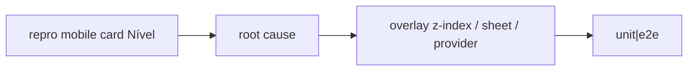

# Bug — crash ao tocar Nível no card mobile de municípios

Status: ready
Atualizado em: 2026-08-01
Issue: #206
Priority: P0
Model: composer-2.5
Impeccable: B — fix no card / sheet existente
Appetite: ~0,5 dia eng; reproduzir → fix mínimo → pin; sem redesign do card
Responsável: —

## Design (Impeccable)

Âncoras: `PRODUCT.md` (Feel the action; Edit where you see) · E14 nível · B42 cards.

Na implementação: craft mínimo no fix → critique só se o affordance mudar → polish. Sem redesign (isso é **B120**).

Brief: coordenador no celular toca **Nível** no card e a página não pode cair; sheet E14 abre com motivo/sinais.

### Wireframe (texto)

```text
┌─ card município (mobile) ─────────────┐
│ Nome · TI                             │
│ …                                     │
│ Nível  [N2 badge] ──tap──► sheet E14  │
│         (não navega; não crasha)      │
└───────────────────────────────────────┘
```

## Dados → decisão → apresentação

Dados: N/A nesta entrega (o sheet E14 já existe; não muda métrica).

## Contexto

Pedido (2026-08-01): ao clicar no nível no card de município (lista mobile), a página crasha.

Código:

- Card: `MunicipalityListMobileCards` — `Link` do título com `after:absolute after:inset-0` (hit full-card).
- Controle: `MunicipalityListLevelControl` → `CampaignCellEditOverlay` `variant="sheet"`.
- Host: `MunicipalityListMobileSection` → `CampaignListSheetProvider`.
- Endpoint: `POST /campanha/municipios/engagement-level`.

Hipóteses (ordem de investigação):

1. Overlay do `Link` vs trigger sem `z-index` / `pointer-events` — navegação + open sheet juntos ou evento maluco.
2. Sheet host / Drawer nesting (React #185 / histórico em `CampaignListSheetHost`).
3. Provider/contexto ausente (precedente B102 TooltipProvider no drawer).
4. Throw no render do body E14 (dados/violations) só no caminho mobile sheet.

## Objetivos

- Reproduzir com coordenador/`canMoveEngagementLevel` em viewport mobile (ou Playwright).
- Corrigir a causa raiz com o menor diff; sheet E14 abre e salva como no desktop popover.
- Pin: unit e/ou e2e que falharia com o crash (open level control no card).
- **Não** densificar o card neste item (B120).
- Sem migration.

## Decisões travadas

- **Issue P0 separada do redesign B120.** Crash não espera critique do card. **Rejeitado:** absorver só como “fase 0” sem Issue própria (vira refém do appetite do combobox).
- **Fix mínimo na causa**, não “remover edit de nível no mobile”. **Rejeitado:** tornar badge read-only “até B120”.
- **i18n:** sem copy nova além de erros já existentes.

## Questões em aberto

- Nenhuma de produto — só diagnóstico no craft.

## Abordagem proposta



Componentes:

- Provável: `MunicipalityListMobileCards` (stacking do Link), `CampaignCellEditOverlay`, `CampaignListSheetHost`, `MunicipalityListLevelControl`.
- **Migration:** Sem.

## Dependências

- Nenhuma. Soft: B42 ✓, E14 ✓.

## Não escopo

- Critique/densidade do card → **B120**.
- Mudar semântica E14 (motivo/override).

## Rabbit holes

- **Refatorar todos os sheet controls de uma vez.** **Mitigação:** só o que o crash exigir; se z-index no trigger for a fix, aplicar padrão nos siblings do mesmo card se o mesmo bug existir.
- **Remover full-card Link.** Pode ser parte da fix **ou** de B120; se necessário ao crash, documentar no as-built.

## Adiado com gatilho

- Nenhum neste item.

## Referências

- GitHub Issue #206
- `MunicipalityListMobileCards.tsx`, `MunicipalityListLevelControl.tsx`, `CampaignCellEditOverlay.tsx`, `CampaignListSheetHost.tsx`
- `docs/plans/polimento-mobile-lista-municipios.md` (B42)
- `docs/plans/crash-busca-bottom-drawer.md` (B102 — precedente provider)
- AGENTS.md — access E14 unrestricted
