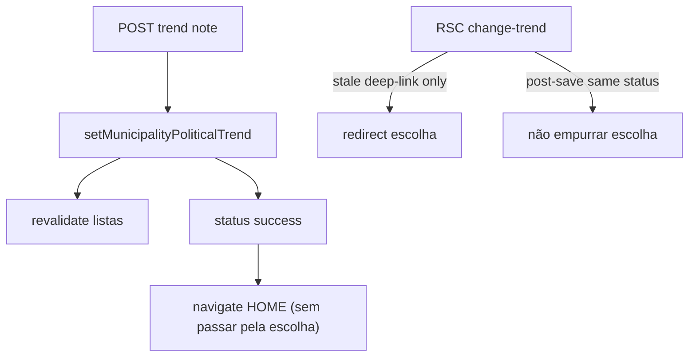

# Bug — Salvar tendência fecha o wizard (não volta ao começo)

Status: rascunho
Atualizado em: 2026-08-01
Issue: —
Priority: P0
Model: composer-2.5
Impeccable: B — pós-submit de `WizardTrendNoteStep`
Appetite: ~0,5d eng; race revalidate×redirect; sem migration
Responsável: —

## Design (Impeccable)

Âncoras: `PRODUCT.md` (Feel the action; commit óbvio) · tema `campaign`.

Na implementação: craft compacto → critique → polish (toast + navegação).

Brief:

- **Persona:** CG salvou a justificativa de tendência.
- **Job principal:** sair do ritual com feedback de sucesso — **não** reabrir a grade de tendências.
- **Anti-goals:** loop escolha↔nota; sumir sem toast.

### Wireframe (texto)

```text
Antes (bug):
  Nota → [Salvar] → (revalidate) página vê status==atual → redirect escolha
  → “volta ao começo”

Depois:
  Nota → [Salvar] → toast “Tendência política registrada.” → Início
  (ou, com B98: próximo encadeado / tela de sucesso)
```

## Dados → decisão → apresentação

Dados: N/A — navegação pós-write; mensagem de toast já existe (`WIZARD_TREND_SAVED_MESSAGE`).

## Contexto

`WizardTrendNoteStep` grava via `setMunicipalityPoliticalTrendFormAction` e, no sucesso client, `useCampaignFormSuccessToast` → `router.push(CAMPAIGN_HOME)`.

A action também chama `revalidateMunicipalityListPaths`. A página RSC (`acoes/[slug]/page.tsx`) para `change-trend`, quando `trendStatus` query **igual** ao `currentStatus` do município (já persistido), faz `redirect(...)` **de volta à etapa de escolha** (sem `tendencia=`).

Ordem típica do bug:

1. Usuário salva nota com `?tendencia=favoravel` (atual era outra).
2. Write OK + revalidate; RSC refresha com `politicalTrend.status === favoravel`.
3. Branch `trendStatus === currentStatus` → **redirect para a escolha**.
4. Client `router.push(HOME)` perde a corrida ou é sobrescrito → sensação de “Salvar volta ao começo”.

Pedido (2026-08-01): Salvar **fecha** o wizard.

## Objetivos

- Após Salvar bem-sucedido na nota de tendência, o usuário **não** permanece/reentra na grade de escolha do mesmo município.
- Destino v1: **Início** (toast intacto). Quando **B98** existir, o destino pode ser o próximo da cadeia — este item deixa um único ponto de navegação pós-sucesso.
- Eliminar a corrida revalidate → `redirect` de “status já atual” enquanto o client ainda está no passo nota **ou** tornar o redirect inofensivo (não mandar de volta à escolha após save).
- Unit/int ou e2e smoke: save → URL final ≠ escolha do mesmo fluxo.

## Decisões travadas

- **Fechar = navegar para fora do passo nota com sucesso explícito (Início v1).** Fonte: produto 2026-08-01. **Rejeitado:** ficar na nota com banner; voltar à escolha “para confirmar”.
- **Corrigir a race no server redirect e/ou no success path — não só `router.push` mais agressivo.** O `redirect` quando `trendStatus === currentStatus` é legítimo para deep-link stale **antes** do save; pós-save ele vira armadilha. **Rejeitado:** só `router.replace(HOME)` sem mudar o redirect (continua flash/loop em rede lenta).
- **Preferência de implementação (barata):** success path da form action (ou wrapper do wizard) usa `redirect(CAMPAIGN_HOME)` server-side **ou** a página deixa de redirecionar à escolha quando o doc já reflete o query (tratar como “já aplicado” → home / success). **Recomendação no craft:** `runCampaignRedirectFormAction` / redirect no success do wizard trend (precedente outros forms) **ou** client navigation + não revalidar a rota do wizard antes do push. Pin a opção no as-built.
- **i18n:** `WIZARD_TREND_SAVED_MESSAGE` intacto.

## Questões em aberto

- **Redirect server na action vs client toast+push?** **Opções:** A `redirect` na action (fecha cedo; toast via query `?saved=1`) | B manter toast client mas impedir redirect RSC à escolha (ex. não revalidate path do wizard; ou branch “same status” → home). **Recomendação:** **B com revalidate seletivo + push**, ou A se B ainda correr — Feel the action prefere toast; redirect puro sem toast é pior. _(assumido)_

## Abordagem proposta



Componentes:

- **`WizardTrendNoteStep.tsx`** + **`municipalityStaffFormActions.ts`** / página `acoes/[slug]`: quebrar a corrida (detalhe no craft).
- **`acoes/[slug]/page.tsx`**: revisitar branch `trendStatus === currentStatus` — distinguir deep-link inválido vs “já salvo”.
- **Teste:** unit do helper de resolução de destino; e2e smoke se barato.
- **Migration:** Sem migration.

## Dependências

- Nenhuma dura. Soft: B64 ✓. Compatível com **B96** (X no standalone). Destino encadeado futuro: **B98**.

## Não escopo

- Encadear tendência após votos → **B98**.
- Mudar tiles/nota UI.
- Autosave da lista (B24) — outro path.

## Rabbit holes

- **Optimistic UI da tendência no wizard.** **Mitigação:** fix de navegação só.
- **Remover o guard `trendStatus === currentStatus` por completo.** Pode reabrir deep-links lixo; mitigar com destino home ou mensagem, não loop.

## Adiado com gatilho

- **Pós-sucesso → próximo da cadeia.** **B98**.

## Referências

- `src/components/campaign/municipality/WizardTrendNoteStep.tsx`
- `src/app/(campaign)/campanha/(app)/acoes/[slug]/page.tsx` (branch change-trend)
- `src/app/(campaign)/campanha/(app)/municipios/municipalityStaffFormActions.ts`
- `src/components/campaign/shared/useCampaignFormSuccessToast.ts`
- [wizard-mudar-tendencia.md](wizard-mudar-tendencia.md)
- AGENTS.md — Feel the action / form actions

Qualidade de decisão: 5/5
