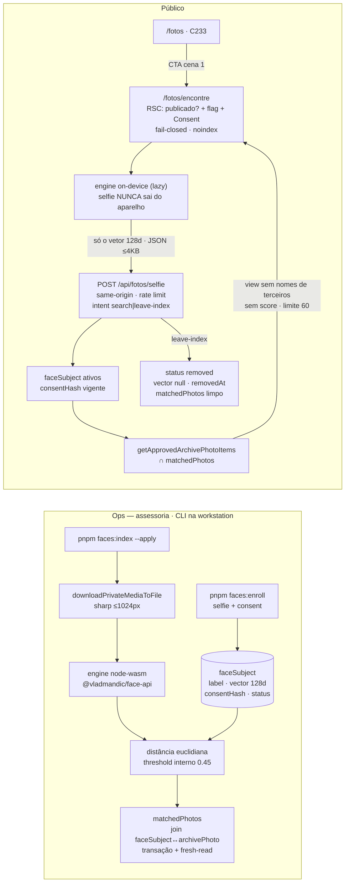

# Impl: C234 — Busca por selfie — visitante encontra as fotos em que aparece

Status: aprovado (modo `--auto`) — hard-stops pendentes de aprovação humana explícita na sessão (migração de schema e contrato público)
Atualizado em: 2026-09-27
Issue: #1369
Intenção: docs/plans/busca-fotos-por-selfie.md
Design UI (gate): docs/plans/busca-fotos-por-selfie-ui-design.html
Appetite restante: herdado (~2–3 dias eng + ops de enrollment/index + aval jurídico de produto) — **uma superfície nova de biometria sobre o acervo aprovado do C232/C233** (`/fotos/encontre` + `POST /api/fotos/selfie`), sem segundo cadastro de pessoa. Cortes explícitos para caber: enrollment e indexação são **ops-only (CLI)**; sem UI de enrollment; sem captcha; sem modo B (rostos anônimos do acervo); sem retenção de selfie; sem score.

> Aprovado pelo próprio agente via `--auto` (modo autônomo do `work-issue`); os hard-stops continuam exigindo aprovação humana explícita e estão **pendentes** (migração de schema, contrato público, Consent/DPIA, dependência de engine e enrollment ops-only). **Decisão do gate (PR #1370): "Escopo do índice facial A/C no MVP (B só com DPIA + aval jurídico)".** Interpretação canônica a implementar: **só entram no índice rostos de pessoas que aderiram/consentiram**; a busca por selfie só devolve se o rosto consultante já estiver indexado; **índices anônimos de rostos do acervo são proibidos** (isso é B). Timing: superfície pública de biometria **não abre** sem revisão jurídica — o código nasce **fechado** (flag própria default `false` + Consent fail-closed); a pessoa geral (não indexada) recebe **vazio honesto**.

## Leitura da intenção

- **Outcome:** com consentimento ativo e adesão ao índice, o visitante tira/envia uma selfie, o reconhecimento roda no dispositivo (a imagem nunca sai dele) e ele recebe somente as fotos **públicas aprovadas** em que aparece — sem nomes de terceiros e sem score; sem consentimento configurado o fluxo recusa com linguagem clara (nem na UI nem no servidor); a remoção (sair do índice / despublicar foto) funciona e fica registrada.
- **O que NÃO negociar:**
  - **Escopo A/C travado pelo gate:** índice só de rostos consentidos; busca que só devolve para rosto já indexado; proibido indexar rostos anônimos do acervo (B) sem DPIA + aval jurídico.
  - **Fail-closed de Consent/LGPD:** sem Consent resolvido por `key` estável, o fluxo não habilita — nem na UI, nem no servidor (conceito travado do repo).
  - **A selfie nunca sai do dispositivo:** ao servidor vai só o vetor (128 floats), nunca imagem; sem upload, sem galeria, sem retenção.
  - **Resposta mínima:** só as fotos aprovadas da pessoa consultante; nunca “outras pessoas parecidas”, nunca nome de terceiro, nunca score/percentual em nenhum estado.
  - **Nada de foto privada/bruta:** o resultado é o mesmo acervo aprovado do C232/C233 (`publicationStatus: 'approved'`, `archivePhotoIsPublic` — `src/lib/archivePhotoCatalog.ts:128-129`).
  - **Sem cadastro paralelo:** `faceSubject` não é pessoa; sem vínculo com `Contact`/leadership; mínimo PII (label interno + consent + vetor).
  - **Antiabuso anônimo** (rate limit, same-origin, body cap), sem captcha no MVP.
- **O que reavaliar (hipóteses da “Direção no codebase”):**
  - A intenção cita `src/utilities/ai/rateLimit.ts` como antiabuso; o dono real do throttle anônimo por IP é `src/utilities/content/contentEventRateLimit.ts` (D8) — `ai/rateLimit.ts` é por usuário de chat, não serve.
  - A resposta do C233 inclui `people`/`peopleLabel` (`src/lib/archivePhotoPublicCatalog.ts:208-230,285`) — o view model do C234 **precisa** cortar esses campos (D5/D9).
  - O CTA “Encontre você nas fotos” foi deliberadamente removido do artefato do C233 (`src/components/fotos/ArchivePhotoHero.tsx:3-6`) — o C234 traz a entrada própria (D9).
  - “Upload consentido com retenção zero” da intenção: **rejeitado** — o caminho é vetor-only (sem upload), o que já satisfaz o aceite por construção.

## Abordagem recomendada

**Opções consideradas (abordagem geral):** A) engine único `@vladmandic/face-api` nos dois lados (browser on-device + CLI node-wasm), subjects consentidos em collection nova, vínculos fotos↔subject calculados em lote CLI e consultados por um route handler novo; B) engine/server-side de terceiro com upload da selfie; C) serviço separado (Python/Rust) ou `MediaPipe` no browser.
**Recomendação:** **A** — mantém a selfie no aparelho (o aceite de produto), usa a mesma família de modelo e a mesma matemática no browser e no CLI, reusa os donos existentes (approval gate do C233, `downloadPrivateMediaToFile`, `withPayloadTransaction`, `getConsentByKey`, guardas de CLI do C231/C232) e cabe no appetite sem infra nova.
**Rejeitadas:** **B** porque manda biometria de cidadão a terceiro e a selfie sairia do dispositivo (anti-goal explícito); **C** porque cria runtime/serviço novo fora do appetite e sem precedente no repo.

### Componentes / mudanças

**Novos — schema/dados (na MESMA migration aditiva `add_face_subject`)**

- **`src/collections/FaceSubject.ts`** (novo): slug `faceSubject`, labels “Pessoa no índice facial”/“Pessoas no índice facial”, grupo `Comunicação` (mesmo dono do acervo, `ArchivePhoto.ts:286-288`), sem versões; access `payloadAdminOnly` nas quatro operações (precedente `ArchivePhoto.ts:300-305`); campos: `label` (text, required; nome de uso interno — nunca público), `consent` (relationship → `consent`, required), `consentHash` (text, readOnly; snapshot de `hashConsentContent` via `getConsentByKey`, `src/utilities/campaignConsent.ts:72-100`), `vector` (json, `hidden` + readOnly; 128 floats — nunca sai do servidor), `model` (text, readOnly; ex. `face-api@1.7.15/faceRecognitionNet`), `status` (select `active|removed`, default `active`, index), `removedAt` (date, readOnly), `matchedPhotos` (relationship hasMany → `archivePhoto`, readOnly; join table). Sem hooks.
- **`src/collections/ArchivePhoto.ts`** (editar `:311-505`): grupo `faces` (`hidden: true`) com `checkedAt` (date) e `checkedKey` (text), readOnly — o marker de incremental do lote (D4). `defaultColumns`/access/hooks intocados.
- **`src/globals/PhotoAlbum.ts`** (editar `:61-80`): campo `selfieSearchEnabled` (checkbox, **default `false`**) — kill switch independente da busca por selfie (o Consent referenciado não pode ser apagado enquanto houver subject, `Consent.ts:8-52` estendido abaixo; sem a flag o “desligar” não teria dono).
- **`src/collections/Consent.ts`** (editar `:24-90`): somar `faceSubject` às contagens do `beforeDelete` (o Consent da adesão não pode ser apagado por baixo dos subjects).
- **Migration `add_face_subject`** (`src/migrations/<stamp>_add_face_subject.ts|.json` + registro no fim de `src/migrations/index.ts`): tabela `face_subject` + join `face_subject_rels`, colunas `faces_checked_at`/`faces_checked_key` em `archive_photo` e `selfie_search_enabled` no global `photo_album`; SQL revisado à mão; nenhuma migration existente tocada; `pnpm migrate:create add_face_subject` → `pnpm migrate` só no banco do worktree → `pnpm generate:types`.

**Novos — contrato puro (client-safe, sem I/O)**

- **`src/lib/faceSearch.ts`** (novo): `FACE_SEARCH_DESCRIPTOR_LENGTH = 128`, `FACE_SEARCH_MODEL = 'face-api@1.7.15/faceRecognitionNet'`, `FACE_SEARCH_MAX_DISTANCE = 0.45` (interno, nunca devolvido), `FACE_SEARCH_RESULT_LIMIT = 60`, `FACE_SEARCH_INTENTS = ['search','leave-index']`, `faceEuclideanDistance(a,b)`, `findFaceMatch({ vector, subjects })` (melhor subject sob o threshold), `faceSubjectIsEligible(subject, { model, consentHash })` (ativo + modelo corrente + hash vigente), `toFaceSearchPhotoView(item)` (corta `people`/`peopleLabel`), `faceStubDescriptorFromBytes(bytes)` (seam determinístico do e2e).
- **`src/lib/schemas/faceSearch.ts`** (novo): `z.strictObject` do body `{ vector: number[128] finitos, intent: enum }` — fail-closed (mold `src/lib/schemas/contentEvent.ts:37-59`).
- **`src/lib/campaignConsentKeys.ts`** (editar `:1-40`): `FACE_SEARCH_CONSENT_KEY = 'busca-selfie-fotos'`, `FACE_INDEX_CONSENT_KEY = 'busca-selfie-indice'` + mensagens de ausência (padrão `:16-19`); comentário de cabeçalho ajustado (o arquivo já hospeda a key pública do WhatsApp, `:26`).

**Novos — server-side Payload**

- **`src/utilities/faceSubjects/faceSubjectReads.ts`** (novo, `server-only`): `listSearchableFaceSubjects(payload)` (query `status=active`, `select` explícito de `vector`/`consentHash`/`model`/`matchedPhotos`, `depth 0`, bypass anônimo documentado como `archivePhotoReads.ts:13-24`) e `listFaceSubjects` (para `--verify`). **Sem `unstable_cache`**: a tabela é pequena e o opt-out precisa valer imediatamente (D5).
- **`src/utilities/faceSubjects/faceSubjectEnrollment.ts`** (novo, `server-only`): `enrollFaceSubject({ payload, label, descriptor, consent, subjectId? })` — grava/atualiza com `overrideAccess: true` (CLI sem sessão) e `context: { faceIndex: true }` (precedente `src/utilities/flickr/archivePhotoCatalog.ts:258-267`).
- **`src/utilities/faceSubjects/faceSubjectPhotoIndex.ts`** (novo, `server-only`): `listArchivePhotoFaceIndexQueue({ payload, refresh, subjectId })` (aprovadas + marker) e `indexArchivePhotoFaces({ payload, item, analyze })` — baixa bytes com `downloadPrivateMediaToFile` + `resolvePrivateMediaStaticDir` (`src/utilities/privateMedia/privateMediaResponse.ts:314-344,45`), `sharp` ≤1024px, descriptors **transitórios**, e dentro de `withPayloadTransaction` (`src/utilities/payloadTransaction.ts:86-113`) relê os subjects e **substitui** os vínculos `matchedPhotos` (adiciona os que casaram, remove o vínculo que deixou de casar); grava `faces.checkedAt`/`checkedKey`. Analyzer injetado (molde C232).
- **`src/utilities/content/contentEventRateLimit.ts`** (editar `:17-25,53-73`): budget parametrizável `checkContentEventRateLimit(key, budget)` com o default atual intocado (beacon C213) e budget estrito para a busca (D8).
- **`src/utilities/boundedRequestBody.ts`** (novo): extrai `readBoundedBody` de `src/app/(frontend)/api/content-events/route.ts:47-78` (cap de bytes em streaming); o route de content-events passa a importar (comportamento idêntico) e o route novo reusa — sem segundo twin.

**Novos — rotas públicas**

- **`src/app/(frontend)/fotos/encontre/page.tsx`** (novo): RSC — `photoAlbum.published === false` → 404; `selfieSearchEnabled !== true` → 404; Consent ausente → 200 com o estado fechado da cena 7; resolve o texto do Consent (renderizado por `ConsentText`, precedente `src/app/(campaign)/campanha/convite/[token]/page.tsx:49-63`) e o `removalChannelUrl`; `robots: { index:false, follow:false }`; **sem `loading.tsx`** (mesma razão do C233: `page.tsx:55-59`).
- **`src/app/(frontend)/api/fotos/selfie/route.ts`** (novo): `export const dynamic = 'force-dynamic'`; mesmo-origem (`isSameOriginRequest`, `src/utilities/sameOriginRequest.ts:33-64`); body ≤4KB pelo helper extraído; parse zod; rate limit por IP hasheado; re-checa flag + Consent no servidor; `search` → subjects elegíveis → melhor match sob o threshold → `getApprovedArchivePhotoItems()` (`archivePhotoReads.ts:58-61`) filtrado por `matchedPhotos` → view model sem nomes/score, limite 60; `leave-index` → transação (`status:'removed'`, `vector:null`, `removedAt`, `matchedPhotos:[]`). Envelopes: `{ ok:true, found:true, photos }` | `{ ok:true, found:false }` | `{ ok:true, removed:true|false }` | erros `{ ok:false, error }` (400 body, 403 origem, 429 rate limit, 404 fechado por flag/publicação, 503 Consent ausente). **Nenhuma imagem em nenhum request; nada de score; nada de nomes de terceiros.**
- **`src/app/(frontend)/fotos/page.tsx`** (editar `:119-157`): renderiza `<SelfieSearchEntry>` (link para `/fotos/encontre`) só quando `selfieSearchEnabled === true`; posição validada pelo `designer` (D9).

**Novos — UI client**

- **`src/components/fotos/faceSearchEngine.ts`** (novo): `computeFaceDescriptor(file)` — probes de WebGL/WASM (`cardCutout.ts:97-127`), `import('@vladmandic/face-api')` **lazy** (só quando o fluxo começa), modelos same-origin em `/fotos/modelos/`, cap ≤1024 (face maior quando há mais de um rosto); stub `NEXT_PUBLIC_FACE_SEARCH_STUB=1` no molde `cardCutout.ts:347-394` com `window.__faceSearchStub`.
- **`src/components/fotos/SelfieSearchFlow.tsx`** (novo, client): máquina de estados (consent → pick → processing → results → empty → presence/confirm → removed/no-removal; + engine/unsupported, rate-limited, network); recebe o texto do Consent já renderizado como `children` (regra de client boundary, `engineering-standards.mdc:22-25`); preview com `URL.revokeObjectURL`; a selfie nunca vai a `fetch`.
- **`src/components/fotos/SelfieSearchEntry.tsx`** e **`SelfieSearchResultCard.tsx`** (novos): entrada na `/fotos` e card do resultado **sem** “Quem aparece”, reusando `ARCHIVE_PHOTO_CARD`/botões de `archivePhotoClasses.ts`; o clique do card leva ao detalhe do C233 (`/fotos?foto=<id>`), dono único do detalhe.

**Novos — scripts/CLI**

- **`scripts/copy-face-vision-assets.mjs`** (novo, molde `scripts/copy-card-vision-assets.mjs:24-47`): copia `tiny_face_detector` (~190KB) + `face_landmark_68` (~357KB) + `face_recognition` (~6,4MB) de `node_modules/@vladmandic/face-api/model` para `public/fotos/modelos/` (gitignored); idempotente por tamanho; chamado no `prebuild` (`package.json:24`), no `predev` (`:62`) e no `Dockerfile:48`.
- **`scripts/lib/faceEnrollPlan.mjs`** + **`scripts/lib/faceIndexPlan.mjs`** (novos): parsers de argv e recibos (mold `scripts/lib/archiveCatalogPlan.mjs:1-120`); pinados em `SCRIPTS_SPEC_PINNED` (`scripts/lib/test-affected-core.mjs:31-111`).
- **`scripts/enroll-face-subject.mjs`** (`pnpm faces:enroll`) e **`scripts/index-archive-faces.mjs`** (`pnpm faces:index` — sem `--subject`: o canário é `--limit`; adicionar sujeito invalida a revisão de qualquer forma) (novos): guardas de `scripts/lib/cli.mjs` (`assertWriteConfirm` `:312-320`, `assertEnvironmentDatabaseTarget` `:238-301`, `mirroredMediaRequired` `:197-202`), recibo JSON datado em `data/face/`, falha isolada e estágio nomeado (molde `scripts/catalog-archive-photos.mjs:129-280`). `package.json` ganha os dois scripts junto de `:37-38`.

**Testes/manifest/migration/ops**

- Testes: ver D10. Pins: entry nova em `scripts/lib/e2e-affected-manifest.mjs` (`:204-240` e `:448-460,493-552` conforme D10), curado `:24-58`, pin `tests/unit/e2eAffectedManifest.unit.spec.ts:54-89`, projeto em `playwright.config.ts:211-220` + env do stub (`:260-300`) e workflow (`ci-pr.yml:226`, `deploy.yml:200`).
- Docs: `AGENTS-public.md:3-7` (contrato `/fotos/encontre` + API + flag), runbook C234 em `docs/ops/teqo-1313-deploy.md`, `.env.example` (`NEXT_PUBLIC_FACE_SEARCH_STUB=` junto de `:36-37`), `.gitignore` (`/public/fotos/modelos/`, `/data/face/`), `docs/changelog/2026-09-27-c234.md`.

### Dados → forma (se aplicável)

N/A — a intenção é explícita: **não há dado numérico na superfície**. A única saída é a lista de fotos; score/percentual é anti-goal (o view model não tem campo de similaridade — o shape torna a violação impossível, não apenas proibida).

## Decisões de engenharia

### D1 — Engine facial (browser + CLI)

**Opções:** A) `@vladmandic/face-api` 1.7.15 (MIT) nos dois lados — browser `dist/face-api.esm.js` (TFJS pré-bundlado) e CLI `dist/face-api.node-wasm.js` com `@tensorflow/tfjs` + `@tensorflow/tfjs-backend-wasm`; B) MediaPipe `tasks-vision`; C) `@tensorflow/tfjs-node`; D) Playwright headless; E) API de terceiro.
**Recomendação:** **A** — um único engine e **a mesma matemática** nos dois lados (descriptor 128-d, distância euclidiana, threshold estrito 0.45 interno, nunca devolvido); no browser o import é lazy e os modelos (`tiny_face_detector` + `face_landmark_68` + `face_recognition`, ~7MB) são copiados same-origin para `public/fotos/modelos/` (zero CDN, precedente `copy-card-vision-assets.mjs`); no CLI não há binário nativo (backend wasm do próprio pacote) nem browser — decode com `sharp` (já dependência) → `tf.tensor3d`. O modelo é versionado no registro (`model` no subject; string `face-api@1.7.15/faceRecognitionNet`) e trocá-lo **invalida o índice** (re-enrollment, D4/riscos).
**Rejeitadas:** **B** porque não tem embedder facial — a geometria de landmarks é fraca demais para similaridade de identidade; **C** porque o binário nativo no Node 24 é risco operacional (build/AJV) por zero ganho; **D** porque a inferência no lote via browser headless é infra frágil (e o C232 já rejeitou esse caminho); **E** porque biometria facial de cidadão não vai a terceiro (guardrail de produto).

### D2 — Dados: `faceSubject`, marker de incremental e kill switch

**Opções:** A) collection nova `faceSubject` + grupo hidden `faces` em `archivePhoto` + flag `selfieSearchEnabled` no global `photoAlbum`, tudo na mesma migration aditiva; B) guardar o descriptor em campos `json` do próprio `archivePhoto`; C) reusar `Contact`/`leadership` ou tabela fora do Payload.
**Recomendação:** **A** — cada subject é um registro auditável (label, consent vinculado, snapshot do hash do texto, modelo, status, `removedAt`, vínculos), com PII mínima e sem vínculo de pessoa; `matchedPhotos` e `vector` são `readOnly` no admin (só o CLI escreve, com bypass documentado + `context`); `status` indexado distingue ativo de removido sem apagar histórico; o marker `checkedAt` + `checkedKey` (sha256 de `model` + `id:updatedAt` dos subjects elegíveis ordenados) é o **único jeito honesto** de pular fotos sem reprocessar bytes a cada run (sem a key, um subject novo/atualizado geraria skip errado); a flag `selfieSearchEnabled` default `false` é o kill switch da feature — o Consent referenciado **não** pode ser deletado (`Consent.ts:8-52` estendido), então a flag é o “puxar a tomada” sem deploy.
**Rejeitadas:** **B** porque um vetor por foto não é o modelo de subjects consentidos (sem status/consent/remoção) e mistura o índice ao acervo; **C** porque `Contact` é cadastro de pessoa (invariante do repo) e uma tabela fora do Payload perde migrations/access/admin.

### D3 — Enrollment (ops-only, CLI)

**Opções:** A) CLI `pnpm faces:enroll --label "<nome>" --selfie <arquivo> --consent <key>` (dry-run default; `--apply`; `--subject <id>` para re-enrollment); B) auto-enrollment público a partir da selfie de consulta; C) tela admin de enrollment já no MVP.
**Recomendação:** **A** — a adesão é ato da assessoria **com** a pessoa (consentimento assinado, `Consent` próprio de enrollment com key estável `busca-selfie-indice`, hash snapshot no registro); o CLI exige exatamente **1 rosto** na selfie (0 ou >1 recusam, fail-closed), valida a key do consent contra a constante e grava `status active`; guardas `FACE_ENROLL_CONFIRM=1` + `assertEnvironmentDatabaseTarget` + recibo JSON sem vetor nem bytes; `--dry-run` mostra a contagem de rostos e o que seria gravado. Re-enrollment (`--subject`) é o caminho previsto para troca de modelo/atualização (a assessoria mantém as selfies fora do site — nada de imagem é guardado pelo Teqo).
**Rejeitadas:** **B** porque sem verificação de identidade vira consentimento de terceiro + DoS de opt-out (qualquer um pode remover o rosto alheio do índice) — registrar por quê; **C** adiada com gatilho (assessoria precisar operar sem CLI).

### D4 — Indexação em lote

**Opções:** A) CLI `pnpm faces:index [--apply|--verify] [--limit] [--refresh]` rodando na workstation, vínculos transacionais, descriptors transitórios e marker incremental; B) job in-app disparado por `after()`/fila; C) worker/browser headless.
**Recomendação:** **A** — só fotos `approved`; por foto, baixa os bytes privados (`downloadPrivateMediaToFile`), redimensiona ≤1024px com `sharp`, detecta **todos** os rostos, calcula descriptors **que nunca são persistidos** (se um subject ativo tiver distância < threshold em qualquer rosto, o vínculo nasce) e, dentro de `withPayloadTransaction` com fresh-read dos subjects, substitui `matchedPhotos` (adiciona novos vínculos e **remove o vínculo que deixou de casar**), gravando o marker; `--refresh` ignora o marker; `--limit` canário; `--verify` é read-only e reporta fotos indexadas/stale/pendentes, subjects ativos/removidos/consentimento vencido e os vínculos por subject (breakdown); recibo JSON honesto em `data/face/`; idempotente e retomável; **documentado que adicionar subject novo reprocessa todas as aprovadas** (a `checkedKey` muda). Guardas: `FACE_INDEX_CONFIRM=1`, alvo de banco declarado, mídia espelhada (S3) — mesmo combo do C232.
**Rejeitadas:** **B** porque o repo não tem fila e o lote pertence ao container de manutenção (precedente C231/C232); **C** porque browser headless para 6,5k é frágil; e **persistir descriptors anônimos** é proibido (seria B disfarçado).

### D5 — Consulta: rota, API e contrato de resposta

**Opções:** A) `/fotos/encontre` (RSC fail-closed) + `POST /api/fotos/selfie` com `{ vector, intent }`, matching server-side e view model cortado; B) client falando direto com a REST do Payload; C) upload da selfie e matching server-side.
**Recomendação:** **A** — a página checa `published` (404) e `selfieSearchEnabled` (404) e renderiza a cena 7 (200) sem Consent; o API re-checa tudo no servidor (fail-closed em profundidade), aceita **só o vetor** (JSON ≤4KB, sem multipart/imagem), exige same-origin, aplica rate limit, resolve o Consent de consulta e só então: `search` → subjects elegíveis (`status active` + modelo corrente + `consentHash` vigente) → melhor distância sob **0.45** → fotos **aprovadas** ∩ `matchedPhotos` → view sem `people`/`peopleLabel`/score, no máximo `FACE_SEARCH_RESULT_LIMIT = 60` (mais recentes primeiro; sem paginação no MVP); sem match **ou** sem fotos aprovadas → `{ ok:true, found:false }` (a pessoa não indexada recebe vazio honesto, nunca “parecidos”); `leave-index` → match → transação zera `vector`, marca `removed`, `removedAt` e limpa `matchedPhotos`; sem match → `{ ok:true, removed:false }` e a UI aponta para o canal de remoção do C233 (nunca inventado — `PhotoAlbum.ts:22-37,72-79`). A entrada fica **só na `/fotos`** (cena 1), sem link no header/rodapé no MVP (não anuncia fluxo fechado; posição validada pelo `designer` — D9).
**Rejeitadas:** **B** impossível/sujo (a collection é admin-only e o client enxergaria índice/metadados); **C** contraria o anti-goal “a selfie não sai do dispositivo” — é o inverso do desenho.

### D6 — Consent: duas chaves estáveis, texto nunca seedado

**Opções:** A) adicionar as keys em `src/lib/campaignConsentKeys.ts` (owner atual, client-safe); B) renomear o registry para módulo neutro e reexportar; C) keys hardcoded no CLI/rota.
**Recomendação:** **A** — `busca-selfie-fotos` (consulta; resolve no RSC e na API) e `busca-selfie-indice` (adesão; resolve no `faces:enroll` e vira snapshot em `consentHash`); o arquivo já é o dono dos stable keys e já hospeda key pública (`WHATSAPP_SUBSCRIPTION_CONSENT_KEY`, `src/lib/campaignConsentKeys.ts:26`), então só o comentário de cabeçalho muda; a resolução reusa `getConsentByKey`/`requireConsentByKey` (`src/utilities/campaignConsent.ts:72-111`, bypass de leitura documentado) e o texto é renderizado por `ConsentText`; **nenhum texto é seedado por migration** (nasce fechado; assessoria/jurídico criam o Consent no admin quando liberarem), e o `consentHash` vencido deixa o subject **inelegível** (fail-closed) até re-consentimento. O runbook de abertura (criar o Consent com key+texto → `faces:enroll` → `faces:index` → ligar `selfieSearchEnabled` → verificar) fecha a entrega.
**Rejeitadas:** **B** porque o rename move ~15 import sites sem nenhum ganho de comportamento (gatilho: o nome passar a mentir, ex. 3º fluxo público); **C** porque ID/key hardcoded é proibido pelo invariante.

### D7 — Remoção e atendimento

**Opções:** A) sair do índice self-service por match facial + canal de foto do C233; B) collection de pedidos de remoção com formulário; C) e-mail manual sem registro.
**Recomendação:** **A** — o opt-out é o próprio match (D5) e o registro do atendimento é o estado do subject (`status removed` + `removedAt`); despublicar foto continua o fluxo do C233 (`publicationStatus: removed` pela staff + `ArchivePhotoRemovalBand`/canal — `ArchivePhoto.ts:340-348`, `AGENTS-public.md:5-7`). Sem collection nova, sem PII nova, sem Consent novo para pedido.
**Rejeitadas:** **B** (formulário/collection/Consent novos, fora do appetite e do invariante); **C** (não registra e não é fail-closed).

### D8 — Antiabuso

**Opções:** A) reusar o dono do throttle (`contentEventRateLimit.ts`) com budget parametrizável + same-origin + body cap extraído; B) limiter novo para a feature; C) reusar as constantes atuais como estão.
**Recomendação:** **A** — `checkContentEventRateLimit(key, budget)` mantém o default do beacon (`:17-25,53-73`) e a busca passa budget estrito (`20` requisições / 10 min por IP hasheado; a busca responde a um **oráculo de pertencimento** — testar vetores para descobrir quem está no índice —, então o budget tem de ser bem menor que o de telemetria); `contentEventClientKey` (`:34-41`) continua sendo o único hash de IP (sal por processo, nada persistido); o body reader sai de `content-events/route.ts:47-78` para `boundedRequestBody.ts` e os dois routes consomem o mesmo dono; sem conta e **sem captcha no MVP** (gatilho registrado). O limiter é bar-raiser, não fronteira de segurança — o gate real é o threshold + Consent.
**Rejeitadas:** **B** (segundo limiter = twin); **C** (120/10min é frouxo demais para biometria); captcha adiado com gatilho (custo de UX/dependência de terceiro).

### D9 — UI e extensão do design (trigger do `designer`)

**Opções:** A) `designer` estende/adapta o artefato **antes** do markup (trigger a/b) e faz a crítica final renderizada (trigger c), com port classe-a-classe; B) portar o artefato literal; C) redesenhar.
**Recomendação:** **A** — o artefato cobre 8 cenas, mas falta o recorte de execução: (i) **cena 6 no modo A/C** — o vazio honesto precisa dizer que a busca cobre quem autorizou participar do índice (sem prometer “todas as fotos”); (ii) **resultado sem “Quem aparece”** (a cena 5 já não mostra, mas o card do C233 mostra — a variante C234 é nova, `ArchivePhotoCard.tsx:53-55`); (iii) estados novos: engine indisponível (WebGL/WASM off), erro de engine, rate-limited, erro de rede — mensagens honestas (nunca “tente outra foto” genérico, precedente `cardCutout.ts:13-20`); (iv) mapeamento de rota: a cena 2 (modal sobre o álbum) vira a página `/fotos/encontre` e a cena 1 vira a entrada na `/fotos` (posição do aside validada); (v) opt-out sem match (encaminha ao canal do C233) e confirmação da cena 8; (vi) a11y já desenhada (44px, foco visível, `prefers-reduced-motion`) mantida. Port com os contratos de classe de `archivePhotoClasses.ts` e `ConsentText`; crítica final com screenshots 390/1280; `Design tier:` no PR.
**Rejeitadas:** **B** (o artefato não cobre rota/estados novos — seguir literal é defeito); **C** (design aprovado existe; redesign é desperdício).

### D10 — Verificação por camada (pins e e2e)

**Opções:** A) unit puro + int das fronteiras Payload/HTTP + e2e novo com stub, no manifest/projeto/curado/pin; B) só int; C) e2e de browser para tudo.
**Recomendação:** **A** — **unit:** `tests/unit/faceSearch.unit.spec.ts` (distância/limiar/melhor match; elegibilidade por modelo+hash; view sem nomes; derivação do stub), `tests/unit/faceSearchRequest.unit.spec.ts` (parse fail-closed do body), `tests/unit/faceEnrollPlan.unit.spec.ts`/`faceIndexPlan.unit.spec.ts` (parsers/recibos), `tests/unit/faceCli.unit.spec.ts` (guardas por subprocesso, molde `archiveCatalogCli.unit.spec.ts`), extensão do unit do rate limit (budget) e das keys de consent. **int:** `tests/int/faceSubjectIndex.int.spec.ts` (enrollment grava; index com analyzer stub cria/remove vínculos; removed não casa; curadoria/aprovação intocadas; transação) e `tests/int/faceSearchApi.int.spec.ts` importando o `POST` (precedente `contentEvents.int.spec.ts:40`): sem Consent → recusa; match devolve **só aprovadas**; **sem score e sem nomes**; subject `removed` não casa; foto `approved→removed` some; opt-out zera vetor e não casa mais; rate limit; same-origin; body inválido. **e2e:** `tests/e2e/frontendFotosSelfie.e2e.spec.ts` (serial) com o engine stubado (`NEXT_PUBLIC_FACE_SEARCH_STUB=1`, seam `faceStubDescriptorFromBytes` compartilhado entre stub e spec — fixtures sem rede), seeds via REST admin (Consent novo, subject, fotos, global) e cleanup; projeto Playwright `frontendFotosSelfie` com `dependencies: ['frontendFotos']` nos **dois** modos (serializa contra o flip do kill switch do álbum; o C233 liga/desliga o global em `frontendFotos.e2e.spec.ts:335-345`); manifest: `frontendFotosSelfie` na entry do C233 (`e2e-affected-manifest.mjs:204-225`) e em `src/lib/schemas`/`src/utilities/content` (`:448-460,493-552`), entry nova com `src/app/(frontend)/api/fotos`, `src/lib/faceSearch`, `src/utilities/faceSubjects`, `src/collections/FaceSubject.ts`, `src/collections/Consent.ts`; curado `E2E_CURATED_SPECS:24-58` + pin `tests/unit/e2eAffectedManifest.unit.spec.ts:54-89` (a migration torna o PR high-risk → conjunto curado). Os scripts/planos novos entram em `SCRIPTS_SPEC_PINNED`.
**Rejeitadas:** **B** (o contrato HTTP público de biometria pede prova real); **C** (browser para lógica pura é caro e frágil).

## Fases verificáveis

1. **Tracer / schema+server — quota ~40%:** migration `add_face_subject` (collection + join + marker + flag) com SQL revisado + `generate:types`; keys + `src/lib/faceSearch.ts` + schema zod; reads/enrollment/index writes; `POST /api/fotos/selfie`; guard do `Consent.ts`; budget do rate limit + extração do body cap. Unit + int verdes antes de seguir. Gate: `pnpm gate:fast` + int do caminho.
2. **CLI ops — quota ~20%:** spike do engine node-wasm (`face-api.node-wasm.js` + tfjs wasm backend em Node, 1 foto de fixture) **antes** de construir o CLI; `copy-face-vision-assets.mjs` + hooks (`package.json`, `Dockerfile`), `faceEnrollPlan.mjs`/`faceIndexPlan.mjs`, `faces:enroll`/`faces:index` com guardas e recibo; unit dos parsers/guardas; `--verify`/plano contra o banco do worktree. Gate: `pnpm gate:fast`.
3. **UI/Design — quota ~30%:** dispatch do `designer` (trigger a/b) e extensão do artefato; components `SelfieSearch*` + engine + stub; `/fotos/encontre` + entrada na `/fotos`; port classe-a-classe; e2e local `--no-deps --project=frontendFotosSelfie`; crítica final (trigger c) com screenshots 390/1280.
4. **Gates/entrega — quota ~10%:** spec e2e + projeto + manifest + curado + pin; `pnpm gate:fast`, int, e2e local; `/simplify` + `capture-review-debts`; docs (`AGENTS-public.md`, runbook C234, `.env.example`, `.gitignore`, changelog); `pnpm push` → PR Ready com `Closes #1369`, `Design tier` e o status dos hard-stops.

## Rabbit holes / Não escopo (engenharia)

- **“Outras pessoas parecidas”, score/percentual, ranking** — vedados; o shape do view model não tem o campo.
- **Guardar selfie/descriptor do visitante** (galeria, localStorage, cookie, “melhorar o match”) — vedado; vetor só em memória do request.
- **Modo B (indexar rostos anônimos do acervo)** sem DPIA/aval — proibido pelo gate desta entrega.
- **Auto-enrollment público, UI de enrollment, fila de revisão de matches** — adiados com gatilho.
- **Vídeo/tempo real/câmeras no evento, app nativo, API pública de reconhecimento** — fora.
- **Vínculo com `Contact`/leadership, “quem é quem”, CRM de rostos** — invariante.
- **Reusar o índice semântico do C229** (falas) para rostos — dono e modalidade diferentes.
- **Segundo engine, terceiro de reconhecimento, modelo via CDN, `tfjs-node`, inferência server-side da selfie** — rejeitados em D1/D5.
- **Segundo limiter, segundo body cap, segundo mecanismo de Consent** — D8/D6 (editar o dono).
- **Global novo de configuração da busca** — a flag vive no `photoAlbum` (dono das chaves do álbum); sem terceiro global.
- **Paginação/ordenação configurável do resultado, contadores de busca, debug de vetores** — fora do MVP.

## Riscos e mitigação

- **Falso positivo de match (sem score exposto):** threshold estrito 0.45 + melhor match único + só fotos aprovadas + canal de remoção + opt-out; a assimetria é honesta (o pior caso mostra fotos públicas sem qualquer identificação/nome). Calibrar o threshold no canário de enrollment antes de ligar a flag em produção; gatilho de revisita se a taxa de falso vínculo aparecer em atendimento.
- **Engine node-wasm do CLI não validado:** a rota `face-api.node-wasm.js` + `@tensorflow/tfjs-backend-wasm` em Node é a aposta do lote; o spike da Fase 2 roda o descriptor sobre a fixture antes de qualquer CLI (fallback documentado: lote via browser headless, rejeitado para o MVP). Se o spike falhar, o plano para em `blocked` — nunca indexa com engine divergente do browser.
- **Troca de modelo invalida o índice:** `model` no subject + `checkedKey` no marker + `--verify` apontando stale; re-enrollment exige as selfies mantidas pela assessoria (fora do site) — registrar no runbook.
- **Engine falha em browser sem WebGL/WASM:** probes antes do download + estado honesto “seu navegador não permite…” (sem culpabilizar a selfie); sem fallback silencioso (precedente `cardCutout.ts:13-20,97-127`).
- **~9MB de bundle/modelos:** import dinâmico só quando o fluxo começa + modelos same-origin baixados com progresso; nunca no bundle inicial da `/fotos`.
- **Lote longo (6,5k fotos, workstation):** `--limit` canário, falha isolada por foto com estágio nomeado, retomada pela marker, recibo com tempo real; rodar fora da janela de deploy.
- **Índice vazio no MVP A/C:** o vazio honesto (cena 6 com recorte A/C) evita promessa falsa; o runbook exige enroll+index antes de ligar a flag; `hasPublishedArchivePhotos` continua dono do link “Fotos”.
- **Oráculo de pertencimento (abuso):** rate limit estrito por IP hasheado + threshold + resposta sem ids/scores; nada lista subjects publicamente.
- **PR high-risk (migration + lockfile):** curado de e2e com `frontendFotosSelfie`/`frontendFotos` + pin atualizado no mesmo PR; e2e local `--no-deps` antes do push.
- **Corrida de e2e com o kill switch do álbum:** projeto com `dependencies: ['frontendFotos']` nos dois modos + linhas próprias + restauração de global/Consent no `afterAll`.
- **Hook de revalidação do `archivePhoto` disparando no CLI:** `revalidateTagSafely` engole fora de request (`documents.ts:27-34`) e o `context: { faceIndex: true }` mantém a curadoria intocada (`ArchivePhoto.ts:168`).
- **Consent apagado por baixo dos subjects:** guard de `beforeDelete` estendido (`Consent.ts:24-90`); texto editado deixa subjects inelegíveis até re-consentimento (fail-closed).
- **Boot com S3 parcial:** mesmo dono de mídia privada; o CLI de index exige mídia espelhada no alvo (`mirroredMediaRequired`).

## Hard-stops (aprovação humana explícita — valem mesmo em `--auto`)

1. **Schema/migration:** `faceSubject` (+ join `matchedPhotos`), grupo hidden `faces` em `archivePhoto` e flag `selfieSearchEnabled` no global `photoAlbum` na migration aditiva `add_face_subject` — `pnpm migrate:create` → SQL revisado à mão (nenhum objeto existente recriado) → `pnpm migrate` **só** no banco do worktree (`teqo_wt<slot>*`) → `pnpm generate:types`; migrations entregues intocadas. **✅ Aprovado na sessão `--auto` (2026-09-27).**
2. **Contrato público/URL e shapes:** `/fotos/encontre` (noindex; 404 sem flag/publicado, 200 com o estado fechado sem Consent), `POST /api/fotos/selfie` com body `{ vector: number[128], intent: 'search'|'leave-index' }` (JSON ≤4KB; sem imagem) e envelopes `{ ok, found, photos }`/`{ ok, removed }` sem score/nomes, com 404 (fechado) e 503 (Consent ausente) como recusas; entrada na `/fotos` gated pela flag. **✅ Aprovado na sessão `--auto` (2026-09-27).**
3. **Consent/DPIA/chaves e política de nascer fechado:** keys `busca-selfie-fotos` e `busca-selfie-indice`, **texto não seedado**, flag default `false`, índice A/C (só consentidos; rostos anônimos proibidos) e **aval jurídico + DPIA antes de ligar em produção** (timing eleitoral, eleição 04/10/2026); o runbook de abertura documenta o ato. **✅ Aprovado na sessão `--auto` (2026-09-27).**
4. **Dependência nova de engine + assets (disclose):** `@vladmandic/face-api@1.7.15` (MIT) + `@tensorflow/tfjs` + `@tensorflow/tfjs-backend-wasm` no `package.json`/lockfile (lockfile = high-risk), com ~9MB de modelos gitignored em `public/fotos/modelos/` servidos same-origin (sem CDN, sem terceiro em runtime); `copy-face-vision-assets.mjs` no `prebuild`/`predev`/Dockerfile. **✅ Aprovado na sessão `--auto` (2026-09-27).**
5. **Enrollment ops-only vs UI:** enrollment e indexação só por CLI (`faces:enroll`/`faces:index`); auto-enrollment público e UI de admin **fora do MVP** — auto-enrollment rejeitado por ausência de verificação de identidade (consentimento de terceiro + DoS de opt-out); UI adiada com gatilho. **✅ Aprovado na sessão `--auto` (2026-09-27).**

## Adiado com gatilho

- **Refatoração do `SelfieSearchFlow`** — 886 linhas/15 estados com render inline; `LeaveConfirmDialog` reimplementa o chassi do kit (`ui/dialog`, Radix); intents/envelopes redigitados em vez de derivar de `lib/faceSearch`/rota. **Gatilho:** próximo toque de comportamento no fluxo (novo estado/envelope), 2º diálogo nas fotos ou requisito de a11y em modal.
- **2ª cópia do copiador de assets de visão** — `copy-face-vision-assets.mjs` quase verbatim de `copy-card-vision-assets.mjs`. **Gatilho:** 3ª cópia `copy-*-vision-assets` — extrair o loop `stat`+size+write para `scripts/lib/`.
- **Recibos/`reportStamp` por CLI de lote** — 3ª cópia (`archiveCatalogPlan`/C232 + `faceEnrollPlan` + `faceIndexPlan`) com `writeReport` quase verbatim nos scripts. **Gatilho:** próximo CLI de lote/recibo — extrair `reportStamp`+`writeReport` para `scripts/lib/cli.mjs` junto do `writeRepoFile`.
- **Reader nomeado do global `photoAlbum`** — residual (comentário de leitura pública já no ponto da rota). **Gatilho:** 3º consumidor direto do global (hoje rota `/api/fotos/selfie` + 2 RSCs via `getCachedGlobal`).
- **Workspace único por run no `faces:index`** — hoje `mkdtemp`/`rm` por foto; mesmo gatilho do bullet de índice incremental (tempo do lote acima do canário ou aprovadas > ~1k).
- **UI de enrollment no admin** — gatilho: assessoria precisar operar sem CLI (volume de adesões ou equipe sem terminal).
- **Captcha/anti-bot** — gatilho: padrão de abuso/comportamento de oráculo observado (contadores, não conteúdo).
- **Modo B (índice de rostos do acervo com DPIA)** — gatilho: DPIA + aval jurídico documentados.
- **Re-embedding automático em troca de modelo** — gatilho: troca do `FACE_SEARCH_MODEL` (vira o item de runbook de migração de índice).
- **Índice incremental otimizado / sharding por município** — gatilho: tempo do lote materialmente acima do canário ou aprovadas > ~1k.
- **Revisão/auditoria de matches pela assessoria (admin)** — gatilho: primeira queixa de falso vínculo ou pedido do jurídico.
- **Extração do registry de consent keys para módulo neutro** — gatilho: 3º fluxo público de consentimento ou o nome passar a mentir.
- **Extração do rate limit/body cap para módulo neutro** — gatilho: 3ª superfície anônima consumindo o mesmo dono.
- **Upload consentido da selfie com retenção zero** — gatilho: cobertura on-device provar-se insuficiente para o público-alvo **e** jurídico aprovar o caminho (hoje: rejeitado).
- **Paginação/filtros do resultado** — gatilho: pessoas com mais de 60 fotos aprovadas no índice.

## Fechamento (sessão `--auto`, 2026-09-27)

- **Hard-stops:** os cinco aprovados explicitamente pelo humano na sessão (schema/migration, contrato público/URL e shapes, Consent/DPIA/chaves com texto não seedado, dependência nova de engine + assets, enrollment ops-only).
- **Desvios registrados na execução:** (1) `faces:index` ficou **sem `--subject`** (canário = `--limit`; qualquer enrollment invalida a revisão de todas as fotos, então o filtro por sujeito economizava pouco e adicionava estado) e o `--verify` ganhou o breakdown de vínculos por sujeito; (2) a recusa do endpoint usa **404** para flag/publicação fechadas e **503** para Consent ausente; (3) o rate limit ganhou **namespace de chave** (`selfie:<hash>`) sobre o dono compartilhado — o beacon e a busca não consomem mais o mesmo contador; (4) o miolo do card virou `ArchivePhotoCardBody` (dono C233) e a variante C234 só troca o href e omite a linha de terceiros; (5) `enrolled_at` (não `updated_at`) é a revisão do sujeito na `checkedKey` — o lote escreve `matchedPhotos` e avançaria o `updated_at` para sempre.
- **Design (trigger c): PARIDADE CERTIFICADA** pelo `designer` (tier primário `openai/gpt-5.6-sol`, sem `DEGRADED`) em 3 rodadas contra o app renderizado (390/1280): faixa de entrada, consentimento, escolha, processamento, resultado (grade larga, superfície branca, título 34px), presença, diálogo, vazio e erro de engine. Ajustes da crítica aplicados: `border-0 pb-0` nos títulos (o `h2` global injeta borda), resultado full-bleed branco com a faixa creme de presença contrastando, scroll/foco no início de cada passo, submit do álbum secundário com a faixa ativa, 44px no "Voltar ao álbum" e no "Voltar sem alterar", copies mobile por breakpoint, ícones semânticos (imagem/aparelho/lixeira), `aria-label` distinto no backdrop do diálogo.
- **`/simplify` + débitos:** dois revisores (estrutural + qualidade) rodados no diff; fixes aplicados (namespace do rate limit, card body compartilhado, foco/scroll por passo, projeção enxuta do subject, dedup de fixtures int, uso do dono `waitForStreamSettled` no e2e novo, remoção de código morto). Triagem `capture-review-debts`: zero `expensive_lock` ≥4 → nenhuma Issue nova; baratos deferidos na seção "Adiado com gatilho" abaixo.

## Aceite de engenharia

- [ ] Aceite de produto coberto: com Consent + flag + adesão, o visitante recebe só as fotos aprovadas em que aparece (sem terceiros/score); sem Consent (ou sem flag) recusa honesta na UI e no servidor; selfie nunca sobe; remoção/opt-out efetivos e registrados; antiabuso ativo; A/C estrito (rostos anônimos fora).
- [ ] Invariantes AGENTS/engineering-standards: sem cadastro paralelo/PII desnecessária; Consent por key estável fail-closed; escrita multi-collection em transação com `req`; bypasses documentados (`overrideAccess` no CLI/na rota); `import 'server-only'`; identificadores em inglês e copy pt-BR; editar o dono (rate limit, body cap, guard do Consent), sem twins.
- [ ] Migration aditiva gerada, revista à mão, aplicada local e registrada; `pnpm generate:types`; nenhuma migration retroeditada.
- [ ] Testes de domínio previstos (unit/int) onde o contrato/shape/transações mudam; e2e novo no disco + projeto Playwright + `E2E_AFFECTED_MANIFEST` + `E2E_CURATED_SPECS` + pin + `SCRIPTS_SPEC_PINNED`.
- [ ] UI portada classe-a-classe do artefato estendido pelo `designer` (triggers a/b), crítica final (c) com screenshots 390/1280 e `Design tier:` no PR.
- [ ] `pnpm gate:fast` verde; int do caminho verde; e2e `frontendFotosSelfie`/`frontendFotos` verde local; runbook + `AGENTS-public.md` + `.env.example` + `.gitignore` + changelog no fechamento; hard-stops com aprovação explícita antes do push.

## Self-score (decision-quality)

**Self-score decision-quality: 4/5.** (1) todas as decisões caras (engine, schema/marker/kill switch, enrollment ops, lote, contrato de consulta, consent, remoção, antiabuso, UI, verificação) têm Opções + Recomendação + Rejeitadas; (2) cabe no appetite: uma collection nova, uma migration aditiva, uma rota pública nova, reuso dos donos existentes (approval gate/media privada/transação/consent/guardas de CLI) e o lote é máquina, não código; (3) rabbit holes nomeados (parecidos/score, retenção de selfie, modo B, auto-enrollment, segundo limiter/engine, C229, CRM de rostos); (4) depth check: edita donos reais (`contentEventRateLimit`, body cap do beacon, guard do `Consent`, global `photoAlbum`, hook de revalidação do `ArchivePhoto`) e só cria módulos onde não há dono (`faceSubjects/`, `lib/faceSearch`, rotas); (5) outcome preservado — fail-closed, A/C, sem PII desnecessária, sem score, sem reescrever o aceite. O que impede o 5: o **threshold 0.45** e a qualidade do engine são aposta não medida (calibração só no canário), e a **operação de re-enrollment na troca de modelo** depende das selfies mantidas pela assessoria fora do site — ambos registrados como risco com gatilho, não escondidos.
