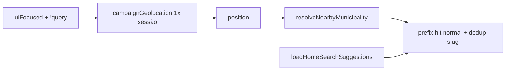

# Busca geral — município mais próximo (geo) na 1ª sugestão

Status: in-prod
Atualizado em: 2026-08-01
Issue: #204
Priority: P1
Model: composer-2.5
Impeccable: B — encaixe no empty/suggest de `CampaignGlobalSearchBody` (Início + drawer)
Appetite: ~1 dia eng; reuso B14 (`campaignGeolocation` + `municipalityProximity`); sem migration / Consent
Responsável: —

## Design (Impeccable)

Âncoras: `PRODUCT.md` (Feel the action) / `DESIGN.md` · tema `campaign` · B14 Quadro (só matching/prompt; **não** a UI do card).

Na implementação: craft compacto → critique → polish. `harden` se permission race no focus da busca.

Brief compacto:

- **Persona:** staff abre a busca geral (Início ou drawer) em deslocamento e quer o município **onde está** no topo da lista.
- **Job principal:** 1ª sugestão = município mais próximo no escopo, **como item normal**; se ainda não pediu localização nesta sessão de aba, pedir.
- **Estratégia de cor:** Restrained — mesma row que as outras sugestões.
- **Edit where you see:** não.
- **Anti-goals:** reason “Perto de você”; distância km; badge/chip geo; POST de lat/lng; Consent novo; card GPS; segundo prompt se B14 já marcou a sessão.

### Wireframe (texto)

```text
┌─ Busca geral (focus, query vazia) ─────────────────────┐
│ [Buscar na campanha…]                                  │
│ · Feira de Santana                              ← 1º   │
│ · … (demais sugestões server, sem o slug acima)        │
│ · lideranças / …                                       │
└────────────────────────────────────────────────────────┘
  Hit idêntica às outras (sem reason, sem km).
  Prompt geo 1×/sessão (mesma chave B14) se ainda não
  prompted e permission ≠ granted/denied estável.
```

## Dados → decisão → apresentação

- **Vou apresentar dados?** Sim — 0–1 município resolvido por geo, apresentado como hit de suggest **sem** metadado geo.
- **Decisões:** “abro **este** município a partir da busca?” (a proximidade só ordena; não se explica).
- **Forma:** mesma hit row das sugestões atuais; só a **ordem** muda. **Rejeitado:** reason/distância; card “Onde estou”; mapa.
- **Profile:** 1 item prefixado; client-only; malha B14.
- **Anti-goals:** sem % estadual; sem transmitir posição ao servidor; sem copy que revele GPS.

## Contexto

B14 ✓ no Quadro (`NearestMunicipalityCard` + `GEO_PROMPT_SESSION_KEY`). B94 ✓ no wizard usa reason “Perto de você” — **este item não copia essa UI**.

Pedido (2026-08-01, gate): na **busca geral**, o município mais próximo deve ser a **primeira** sugestão **como item normal** (sem informação extra de proximidade); se ainda não houver pedido nesta sessão, **pedir**.

Suggest atual: `loadHomeSearchSuggestions` / `rankHomeSearchSuggestMunicipalities` (top 8) — **sem** slot geo. UI: `HomeSearchMunicipalityGroup` + `useHomeSearchResultsState`.

## Objetivos

- Ao abrir/focar a busca geral com query vazia (`mode: suggest`), resolver nearest no escopo e **prefixar** a lista de municípios (1ª posição; dedup por slug com o restante).
- A hit prefixada usa o **mesmo shape visual/dados** das outras sugestões (nome, prioridade se houver, href) — **sem** reason, distância ou label geo.
- Se permission não está `granted` **e** a sessão ainda não foi marcada como prompted (`GEO_PROMPT_SESSION_KEY`), disparar o pedido (helpers B14).
- Se `denied` / unsupported / fora da BA / sem nearest in-scope: **silêncio** — lista server inalterada.
- Client-only matching; sem migration / Consent / POST de coordenadas.
- Cobrir **Início e drawer** (mesmo body de busca).

## Decisões travadas

- **Só reordenar — zero copy geo na row.** **Rejeitado:** “Perto de você”; `formatDistanceKm` na busca; chip/badge; estilo distinto do B94.
- **Reusar `GEO_PROMPT_SESSION_KEY` e utils B14** — um prompt por sessão de aba. **Rejeitado:** chave nova; prompt a cada focus.
- **Prompt na busca = permitido** (produto 2026-08-01), distinto do wizard B94 (`granted`-only). **Rejeitado:** copiar gate B94 à risca aqui.
- **Prefixo client**; não alterar o rank server. **Rejeitado:** lat/lng no POST `home-search`.
- **Payload de municípios acessíveis** (scope completo, não só top-8). **Rejeitado:** nearest só entre os 8.
- **Salvador multi-ZE:** seguir B14; se ambíguo demais para uma hit, omitir. **Rejeitado:** inventar ZE sem malha.
- **i18n:** sem strings novas de proximidade; ids internos `nearest`/`geo` só na merge (não na UI).

## Questões em aberto

- **Quando disparar o prompt?** **Opções:** A) no primeiro `uiFocused` da busca na sessão | B) só quando o Quadro não montou. **Recomendação:** A — pedido é “ao abrir a busca”; a chave evita double-prompt _(assumido)_.

## Abordagem proposta



Componentes:

- **Hook client** (reuso/`useWizardNearestMunicipality` só pela resolução — **não** pela reason UI do wizard): permission + optional prompt + resolve → slug.
- **`CampaignStaffGlobalSearch` / results state:** se houver nearest, colocar hit equivalente no topo e remover duplicata do array server.
- **RSC props:** `AccessibleMunicipality[]` no provider/host (Início + drawer).
- **Pins unit:** merge order; dedup; denied → lista intacta; assert **ausência** de reason/distância na hit.
- **Migration:** Sem.

## Dependências

- Soft: B14 ✓, B91 ✓ (matching/prompt). B94 é contraste de UI (wizard tem reason; busca **não**).
- Soft: B103 (sem heading “Sugestões”).

## Não escopo

- Reason / distância / chip “Perto de você” (explícito neste gate).
- Wizard geo UI → B94.
- Card Quadro → B14 fechado.

## Rabbit holes

- **Unificar B94 + busca + Quadro num GeoProvider.** **Mitigação:** hook fino + chave compartilhada.
- **“Melhorar” a row com reason depois do merge.** **Mitigação:** pin de regressão visual/copy; anti-goal acima.

## Adiado com gatilho

- Nenhum neste item. (Reason geo na busca ficou **fora** por decisão de produto, não adiado.)

## Referências

- GitHub Issue #204
- `campaignGeolocation.ts`, `municipalityProximity.ts`
- `loadHomeSearchSuggestions.ts`, `HomeSearchMunicipalityGroup.tsx`
- `wizard-municipio-sugestoes-geo.md` (B94) — **não** copiar reason
- AGENTS.md — sem Consent para geo; PRODUCT.md
