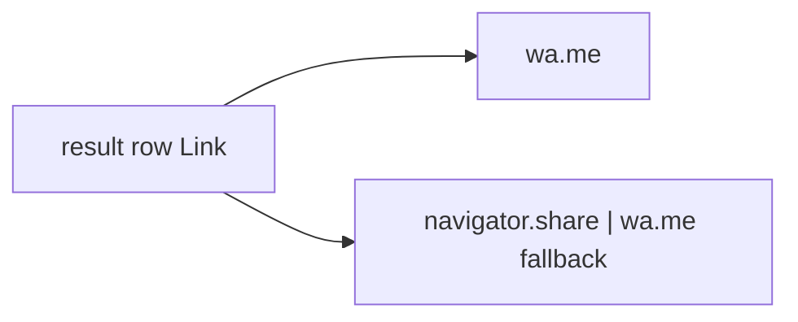

# Busca global — ações de linha (WhatsApp / compartilhar)

Status: rascunho
Atualizado em: 2026-07-29
Item do roadmap: [docs/roadmap.md](../roadmap.md) (Trilha B, item B55 — busca global)
Impeccable: B — trailing actions nas linhas de resultado
Appetite: ~0,5–0,75 dia eng; botões + Web Share / wa.me; sem migration
Responsável: —

## Design (Impeccable)

Âncoras: `PRODUCT.md` (atalhos WhatsApp ok; soberania no horizonte) / `DESIGN.md` · `whatsAppHrefForPhone` (B28/B19) · tema `campaign`.

Na implementação: craft compacto → critique → polish.

Brief:

- **Persona:** staff achou a pessoa/pedido e quer ZAP ou share sem abrir a ficha.
- **Job:** trailing control à direita da linha; não rouba o click da linha (stopPropagation).
- **Anti-goals:** share que grava PII em analytics; segundo botão de copy; WA em município/TI.

## Dados → decisão → apresentação

Dados: N/A — ações de saída; texto de share = título + URL canônica do detalhe.

## Contexto

Pedido (2026-07-29):

- **Lideranças, assessores, dobradinhas:** ação abrir WhatsApp à direita.
- **Demandas e atividades:** compartilhar à direita — **mobile** = `navigator.share` do device; **desktop** = delegar para WhatsApp (`wa.me` com texto/url).

## Objetivos

- Primitivo(s) `HomeSearchWhatsAppAction` / `HomeSearchShareAction` (ou um com `variant`).
- WA: reusar `whatsAppHrefForPhone`; ocultar se null; `target`/`rel` seguros; `aria-label` com nome.
- Share: se `navigator.share` disponível **e** viewport/pointer mobile (definir: `navigator.share` + `!matchMedia('(pointer: fine)')` ou UA — **recomendação:** feature-detect `share` primeiro; fallback WA no desktop).
- Texto/url de share: título do hit + absolute URL do detalhe (`getCampaignInviteBaseURL` / site URL já usados na campanha).
- `pointer-events` / `onClick` stop na ação para o `Link` da linha não navegar.
- Sem migration / Consent novo (não é canal D3; é `wa.me` / share nativo).

## Decisões travadas

- **stopPropagation na ação.** **Rejeitado:** ação = único hit da linha (mata navegação).
- **Desktop share → WhatsApp**, não Twitter/e-mail picker. **Rejeitado:** `mailto:` genérico.
- **Sem Consent** — não armazena biometria nem canal; só abre app externo. **Rejeitado:** abrir Onda 0 por isso.
- **i18n:** labels “Abrir no WhatsApp” / “Compartilhar”.

## Questões em aberto

- **Dobradinha sem telefone:** esconder ícone (já em B52). Confirmado.

## Abordagem proposta

- Integrar nos grupos **B49–B53** via prop `trailingAction` ou composição.
- Precedente share: `SupporterShareKit.tsx`; WA: `whatsAppHrefForPhone` / `buildWhatsAppUrl` em `lib/phone.ts`.
- Unit: share fallback; click não navega.

## Dependências

- Dura: **B47** + pelo menos um de **B49–B53**. Soft: todos os cinco grupos.
- Soft: B28 ✓ / B19 ✓ (`whatsAppHrefForPhone`).

## Não escopo

Bridge D3–D5. Preview de mensagem rica. Municípios/TIs.

## Rabbit holes

**Web Share Level 2 files.** **Mitigação:** só text+url.

## Adiado com gatilho

- **Copy link** ao lado do share. Revisitar se mesa pedir no critique.

## Referências

- [busca-global-resultados-liderancas.md](busca-global-resultados-liderancas.md) · assessores/atividades/dobradinhas/demandas · `src/lib/phone.ts` · share kits de apoiadores (precedente copy/`wa.me` se existir)
- AGENTS.md — naming; sem WABA
