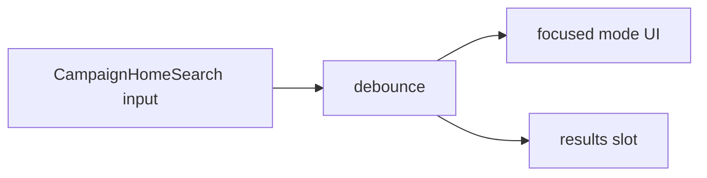

# Busca global do Início — input e modo resultados

Status: entregue (2026-07-29)
Atualizado em: 2026-07-29 — as-built: `CampaignHomeStaffChrome` (client) + `CampaignHomeSearch` + `useHomeSearchQuery` + `HomeSearchContext`; contrato `src/lib/campaignHomeSearchContract.ts` (debounce 250 ms, mín. 2 chars); staff-only em `page.tsx`; modo focado esconde strip/spacer via `CampaignHomeLayout` `focused`; região de resultados vazia (hits = B48+); DOM mantém ordem B46 (`order-*`); sem endpoint; Escape limpa query. Unit `campaignHomeSearchQuery` + `campaignHomeSearch`; e2e B47 em `campaignHomeActions`. Sem migration.
Item do roadmap: [docs/roadmap.md](../roadmap.md) (Trilha B, item B47 — busca global)
Impeccable: C — superfície nova de busca no Início (expand/collapse + empty results region)
Appetite: ~1–1,5 dia eng; ilha client + debounce + chrome de modo focado; sem provider de hits ainda
Responsável: —

## Design (Impeccable)

Âncoras: `PRODUCT.md` (Clarity under pressure; Feel the action) / `DESIGN.md` · `CampaignSearchInput` · tema `campaign`.

Na implementação: **shape → craft → critique → polish** (classe C).

Brief compacto:

- **Persona / contexto:** staff no Início quer achar um município/pessoa/atividade sem abrir a lista certa na sidebar.
- **Job principal:** digitar → ver resultados; no mobile o input sobe e o resto some.
- **Estratégia de cor:** Restrained; sem card chrome nos resultados (grupos chegam em B48+).
- **Edit where you see:** não — navegação/descoberta.
- **Anti-goals:** botão “Pesquisar”; command palette estilo Raycast com atalho global nesta fatia; busca na sidebar; leader com omnibox estadual _(assumido — lockdown)_.

## Dados → decisão → apresentação

Dados: N/A neste item — só chrome; hits = **B48–B53**.

## Contexto

Início blank (**B43**) + ações (**B44/B45**) + posição (**B46**). Pedido (2026-07-29): input de busca geral **sem botão**, debounce na digitação; no mobile fica **abaixo** das ações e, ao digitar, **desliza para cima**, some o resto, ficam input + resultados; no tablet/desktop o input fica **acima** das ações e a visualização de resultados é semelhante (grid = **B54**).

## Objetivos

- Ilha **`CampaignHomeSearch`** (nome final no PR) no Início **staff** (`coordinator` / `candidate` / `advisor`); **não** montar para `leader` _(assumido)_.
- Reusar visual de `CampaignSearchInput` (ícone, `min-h-11`); **sem** submit button.
- Debounce ~200–300 ms (**não** reusar `SEARCH_DEBOUNCE_MS = 1000` de `useCampaignListFilterNavigation` / `CampaignSearchForm` — esse valor é para filtro de lista com round-trip RSC; omnibox precisa resposta mais curta); query vazia / só espaços → sair do modo focado e limpar região de resultados.
- **Modo focado (mobile):** ao ter query não vazia, transição: input sobe; strip de ações e demais chrome do Início ocultos; região de resultados abaixo do input.
- **Modo focado (`md+`):** mesma semântica de “só input + resultados”, sem empurrar a strip para baixo da dobra de forma confusa — strip some enquanto há query (paridade com mobile).
- Slot/região `aria-live` / `role="region"` para grupos (**B48+**); empty state “Nenhum resultado.” só quando query ≥ limiar e todos os grupos vazios (após ≥1 provider).
- Endpoint ou RSC search: **não** neste item — expor contrato (`query`, `onResults`, registry de grupos) para B48+.
- Sem migration / Consent.

## Decisões travadas

- **Debounce no cliente; sem botão Pesquisar.** **Rejeitado:** submit form; busca a cada keystroke sem debounce.
- **Staff-only.** Leader continua lockdown (contatos). **Rejeitado:** omnibox para leader com só apoiadores nesta fatia (outro job).
- **Expand = query não vazia**, não focus-only. **Rejeitado:** sumir a strip no focus vazio (rouba o ritual de ações). **Supersedido 2026-07-29 por B66** ([modo-focado-busca-no-focus.md](modo-focado-busca-no-focus.md)): produto pediu limpeza **no focus** + animação de expansão; hits continuam gated por query.
- **i18n:** `CampaignHomeSearch`, `homeSearchQuery`; label pt-BR “Buscar na campanha” (ou copy curta a fechar no craft).

## Questões em aberto

- **Ordem de foco no `md+`:** com `searchSlot`, o visual fica busca→ações (`order-*`), mas o DOM hoje é ações→busca. No craft do B47, colocar o nó de busca **antes** de `home-actions` no markup e usar `order-*` só no mobile, **ou** aceitar exceção documentada se produto priorizar o markup atual.
- **Transporte dos hits: `POST` JSON vs server action vs fetch RSC?** **Opções:** A rota `campaignJsonMutationRoute`-like GET/POST search | B server action | C debounce + `router` query. **Recomendação:** A — `GET`/`POST` same-origin com body/query curta, access no loader, sem sujar a URL do Início com `?q=` (Início não é lista). _(assumido)_
- **Limiar mínimo de caracteres?** **Opções:** 1 | 2. **Recomendação:** 2 para reduzir ruído em nomes curtos; 1 se critique pedir. _(assumido)_

## Abordagem proposta

Componentes:

- **`CampaignHomeSearch.tsx`** (`'use client'`, `components/campaign/dashboard/`): estado local da query; debounce; classes de modo focado; renderiza `children` / registry de grupos quando B48+ plugar.
- **Wire-up** em `page.tsx` (RSC) só para staff; passar escopo mínimo se necessário depois.
- **Não** importar `buildMunicipalityListHref` / catálogo no client strip — hits serializados pelo server nos itens seguintes.
- **Migration:** Sem migration. Rota JSON de busca pode nascer em **B48** com o primeiro provider (evitar endpoint vazio).

## Dependências

- Dura: **B46** (ordem relativa ações↔busca). Soft: **B45**.
- Desbloqueia **B48–B55**.

## Não escopo

- Providers de hits → **B48–B53**.
- Grid 2/3 colunas e cap de viewport → **B54**.
- WhatsApp/share na linha → **B55**.
- Páginas de detalhe novas → rotas existentes (cada grupo só `Link`).

## Rabbit holes

- **cmdk / Command palette global com ⌘K.** **Mitigação:** input no Início só; atalho = fill-in se pedido ≥2×.
- **Index único tipo Algolia.** **Mitigação:** loaders Payload/`wordStartFilter` por domínio.

## Adiado com gatilho

- **`?q=` na URL do Início** (shareable). Revisitar se mesa pedir mandar link da busca.
- **Busca na liderança (apoiadores).** Revisitar se leader pedir achar contato sem rolar a lista.
- **Contexto / boundary só com query debounced para grupos B48+** (evitar re-render por keystroke nos providers). Revisitar ao plugar o primeiro provider com trabalho não trivial em `searchResults`.
- **`useDebouncedState` compartilhado com `AsyncSearchCombobox`.** Revisitar no 3º call site client-only com o mesmo contrato de debounce.
- **Fundir wrapper `CampaignHomeStaffChrome` em `CampaignHomeLayout`.** Revisitar se `data-home-focused` ganhar CSS além de `focused` prop (B48 layout).

## Já resolvido no simplify pós-B47 (não reabrir)

- Estado `isDebouncing` derivado (`raw !== debounced`); `HomeSearchController` como tipo único; JSDoc de `focused`; `aria-busy` deduplicado no input.

## Referências

- [posicao-botoes-acao-inicio-thumb-zone.md](posicao-botoes-acao-inicio-thumb-zone.md) · [fluxos-acao-primeiro-inicio.md](fluxos-acao-primeiro-inicio.md) (U11 busca de município nos wizards — reusar matcher)
- `CampaignSearchInput.tsx` · `lib/wordStartFilter.ts` · `campaignJsonMutationRoute.ts` (precedente CSRF se POST)
- `PRODUCT.md` / `DESIGN.md`
