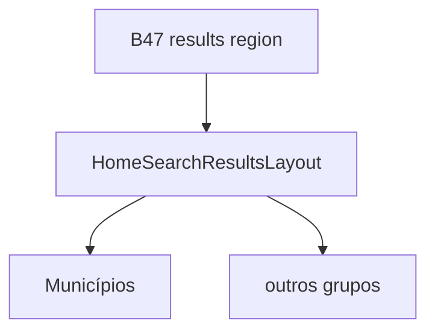

# Busca global — layout dos resultados (grid + cap de viewport)

Status: rascunho
Atualizado em: 2026-07-29
Item do roadmap: [docs/roadmap.md](../roadmap.md) (Trilha B, item B54 — busca global)
Impeccable: B — layout responsivo da região de resultados B47
Appetite: ~0,5–0,75 dia eng; CSS grid + política de cap; sem provider novo
Responsável: —

## Design (Impeccable)

Âncoras: `PRODUCT.md` (Clarity under pressure) / `DESIGN.md` · chrome **B47** · tema `campaign`.

Na implementação: craft compacto → critique → polish.

Brief compacto:

- **Persona:** staff no tablet/notebook com vários grupos; no mobile empilha.
- **Job principal:** ver grupos lado a lado sem scroll infinito de hits.
- **Anti-goals:** masonry irregular; virtualização prematura; cap por grupo fixo que esconde Municípios (grupo principal).

## Dados → decisão → apresentação

Dados: N/A — só layout/quantidade de linhas renderizadas; números vêm dos grupos.

## Contexto

Pedido (2026-07-29): mobile = grupos empilhados; tablet = **2 colunas**; desktop = **3 colunas**; total de resultados limitado ao **preenchimento da tela** pelo conjunto dos grupos. Conteúdo das linhas = **B48–B53**; este item só organiza e corta.

## Objetivos

- Container de resultados: `flex flex-col` (&lt;`md`) → `md:grid md:grid-cols-2` → `lg:grid-cols-3` (breakpoints alinhados ao shell da campanha).
- **Cap de viewport:** limitar o número total de hits renderizados (soma dos grupos) ao que cabe na área útil sob o input — medir via `ResizeObserver` / estimativa de row height, ou política simples documentada (ex. max 12–18 hits totais redistribuídos com prioridade ao grupo Municípios).
- Grupo Municípios (**B48**) tem prioridade de slots no cap; demais grupos compartilham o resto.
- Grupos vazios continuam não montados (regra dos providers).
- Sem migration.

## Decisões travadas

- **Grid por viewport, não por pointer.** **Rejeitado:** 1 coluna em touch tablet paisagem.
- **Cap no conjunto, não scroll infinito.** **Rejeitado:** “mostrar todos” com página interna.
- **Prioridade de slots: Municípios primeiro.** **Rejeitado:** round-robin que deixa Cairu fora e enche de demandas.
- **i18n:** `HomeSearchResultsLayout`.

## Questões em aberto

- **Cap: medir DOM vs constante?** **Opções:** A ResizeObserver + row estimate | B constante por breakpoint (ex. 8/12/15). **Recomendação:** B no v1 (barato, testável); A se critique achar corte cego. _(assumido)_

## Abordagem proposta

- Componente de layout envolvendo os grupos já registrados; API `allocateHitBudget(groups, budget)`.
- **Migration:** nenhuma.

## Dependências

- Dura: **B47**. Soft: **B48** (precisa ≥1 grupo para validar cap); melhor após 2+ grupos.

## Não escopo

Conteúdo das linhas → **B48–B53**. Ações → **B55**.

## Rabbit holes

**Virtualização (`react-virtual`).** **Mitigação:** cap pequeno; virtualizar só se budget &gt; 50.

## Adiado com gatilho

- **“Ver todos em /municipios?q=”** por grupo. Revisitar se cap gerar reclamação na sessão.

## Referências

- [busca-global-inicio-input.md](busca-global-inicio-input.md) · [busca-global-resultados-municipios.md](busca-global-resultados-municipios.md)
- `CampaignPageShell` breakpoints · `PRODUCT.md`
