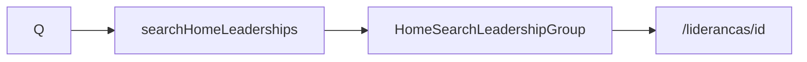

# Busca global — resultados Lideranças

Status: rascunho
Atualizado em: 2026-07-29
Item do roadmap: [docs/roadmap.md](../roadmap.md) (Trilha B, item B49 — busca global)
Impeccable: B — grupo de hits no slot B47
Appetite: ~0,5–0,75 dia eng; loader + grupo UI; sem WA (B55)
Responsável: —

## Design (Impeccable)

Âncoras: `PRODUCT.md` / `DESIGN.md` · lista `/campanha/liderancas` · tema `campaign`.

Na implementação: craft compacto → critique → polish.

Brief: staff acha uma liderança pelo nome; toque abre a ficha. Sem card. Grupo “Lideranças” só se houver hit.

## Dados → decisão → apresentação

Dados: N/A como KPI — identificação (nome + contexto curto: município principal ou contagem). Forma: lista. Sem chart.

## Contexto

Slot **B47**; grupo secundário abaixo de Municípios (**B48**). Clique → `/campanha/liderancas/[id]` (rota existente). Ação WhatsApp à direita = **B55**.

## Objetivos

- `searchHomeLeaderships(query, user)` com access existente (`overrideAccess: false`); match em `contact.name` (mesmo espírito da busca da lista / `wordStartFilter`).
- Grupo título **“Lideranças”**; oculto se vazio.
- Linha: nome em destaque; linha secundária discreta (ex. municípios resumidos ou setor — o que o loader já tiver barato); **sem** trailing WA neste item (reserva slot/`actions` opcional para B55).
- Sem migration / Consent.

## Decisões travadas

- **Navega para detalhe existente.** **Rejeitado:** drawer de preview nesta fatia.
- **Sem WhatsApp aqui** — **B55**. **Rejeitado:** copiar o ícone do B28 agora e divergir depois.
- **i18n:** `HomeSearchLeadershipHit`; título “Lideranças”.

## Questões em aberto

- **Secundário: lista de municípios vs status de apoio?** **Opções:** A municípios (curto) | B status. **Recomendação:** A — alinha ao job “quem é de onde”. _(assumido)_

## Abordagem proposta

- Loader perto de `leadershipData.ts` / list where; UI no dashboard/search.
- **Migration:** nenhuma.

## Dependências

- Dura: **B47**. Soft: **B48** (ordem visual — Municípios acima); B28 ✓ (telefone existirá para B55).

## Não escopo

- WA → **B55**. Assessores/outros grupos → **B50–B53**. Layout grid → **B54**.

## Rabbit holes

- **Buscar por telefone.** **Mitigação:** só nome no v1; gatilho se campo pedir.

## Adiado com gatilho

Nenhum neste item.

## Referências

- [busca-global-inicio-input.md](busca-global-inicio-input.md) · `utilities/leadership/leadershipData.ts` (`loadLeadershipListPageData`) · `/campanha/liderancas/[id]` · B28 (`whatsAppHrefForPhone` em `lib/phone.ts`)
