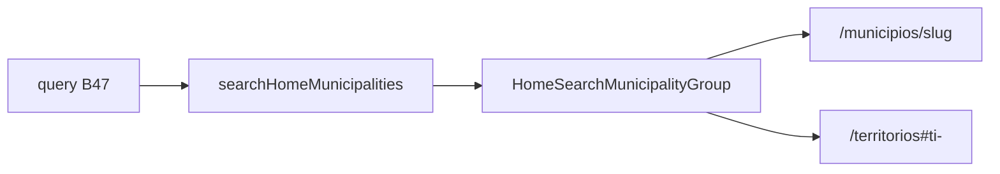

# Busca global — resultados Municípios (+ Territórios)

Status: entregue (2026-07-29)
Atualizado em: 2026-07-29 — as-built: `POST /campanha/home-search` (`campaignJsonMutationRoute` + `homeSearchBodySchema`); loader `searchHomeMunicipalities` (`loadMunicipalityScope` + `matchesAtWordStart` + A11 readout; TIs no mesmo grupo via `loadTerritoryOverview` + votos 2022); client `HomeSearchResultsContext` (fetch único, extensível B49+) + `HomeSearchResultsShell` + `HomeSearchMunicipalityGroup`; `MunicipalityVotePositionReadout` extraído da lista; empty “Nenhum resultado.”; sem migration.
Item do roadmap: [docs/roadmap.md](../roadmap.md) (Trilha B, item B48 — busca global)
Impeccable: B — grupo de resultados no chrome B47; linhas sem card
Appetite: ~1–1,5 dia eng; loader scoped + UI do grupo; 1º provider da busca
Responsável: —

## Design (Impeccable)

Âncoras: `PRODUCT.md` / `DESIGN.md` · `MunicipalityPriorityIndicator` · coluna “2022” (A11) · tema `campaign`.

Na implementação: craft compacto → critique → polish.

Brief compacto:

- **Persona:** staff digita “Cairu” / “Recôncavo” e quer o hit certo em 1 toque.
- **Job principal:** listar municípios (e TIs) que casam a query, com prioridade e votos 2022 legíveis.
- **Anti-goals:** card com borda por linha; grupo vazio visível; desalinhamento dos nomes quando um tem flag e outro não.

## Dados → decisão → apresentação

- **Vou apresentar dados?** Sim — votos 2022 (município) e agregado do território (TI) à direita.
- **Decisões:** abrir o município/TI certo; ler magnitude relativa (mesma linguagem da coluna “2022” / rollup E17).
- **Forma:** lista ranqueada por relevância de nome (word-start), não chart. **Rejeitado:** mapa nos resultados; % estadual absoluto.
- **Profile:** ~até N hits por grupo (cap fino em **B54**); scoped ao access do ator.
- **Anti-goals de dado:** sem inventar métrica nova; reusar A11 / rollup TI.

## Contexto

**B47** entrega o input e o slot. Este item é o **grupo principal** (“Municípios”), sempre no topo quando há hits. Inclui **territórios de identidade** no mesmo grupo (pedido 2026-07-29): nome do TI + valores agregados à direita. Clique → detalhe existente (`/campanha/municipios/[slug]` ou `/campanha/territorios#ti-…` via `territoryAnchor`).

## Objetivos

- Loader/server path `searchHomeMunicipalities(query, user)` (nome final) com `overrideAccess: false`; match via `matchesAtWordStart` / `normalizeSearchPhrase` (`lib/wordStartFilter.ts`).
- Grupo com título discreto **“Municípios”**; **só renderiza se `hits.length > 0`**.
- Linha município: flag de prioridade (`MunicipalityPriorityIndicator`) **só se `priority === 'alta'`**, com **coluna de ícone de largura fixa** para alinhar o início dos nomes; nome em destaque; território (TI) abaixo, menor/`muted`; à direita a mesma informação da coluna **“2022”** da lista (votos + contexto A11 — reusar helper de célula / `formatElectionNumber`, sem rank longo se estourar densidade — preferir o compacto da lista).
- Linha TI: sem flag; nome do território; à direita agregado já usado em `/campanha/territorios` / `territoryOverview` (o mesmo número que a mesa já lê — tipicamente votos/rollup 2022 do E17/E12, documentar no PR qual campo).
- Sem borda/card; padding vertical suficiente; hit target ≥ 44 px no mobile.
- Clique = `Link` para detalhe existente — **sem** item de roadmap de “página nova”.
- Sem migration / Consent.

## Decisões travadas

- **TIs no grupo Municípios**, não grupo separado. **Rejeitado:** “Territórios” como 7º grupo (pedido explícito).
- **Coluna de ícone reservada** (vazia se não prioritário). **Rejeitado:** flag inline que desloca o texto.
- **Primeiro provider nasce com a rota de busca** (se B47 adiou o endpoint). **Rejeitado:** client-only scan do catálogo sem access (assessor veria fora da carteira).
- **i18n:** `HomeSearchMunicipalityHit`, título pt-BR “Municípios”.

## Questões em aberto

- **Ordenação: word-start primeiro vs votos 2022 desc?** **Opções:** A relevância de nome | B votos. **Recomendação:** A (busca é achar pelo nome); empate → votos desc. _(assumido)_

## Abordagem proposta

Componentes:

- **Loader** em `utilities/` (domínio municipality ou `dashboard/` se multi — preferir municipality + territory helpers existentes: `loadTerritoryOverview` / rollup puro).
- **`HomeSearchMunicipalityGroup.tsx`**: título + lista de linhas; registra-se no slot B47.
- Reuso: `MunicipalityPriorityIndicator`, `mapKey`/catalog names, `TerritoryLink`/`territoryAnchor` se couber.
- **Migration:** Sem migration.

## Dependências

- Dura: **B47**. Soft: A11 ✓, E17/E12 ✓, B20 ✓ (priority), B25 ✓ (âncora TI).

## Não escopo

- Outros grupos → **B49–B53**. Grid/cap → **B54**. Ações WA → **B55** (não aplica a município/TI).

## Rabbit holes

- **Fuzzy/typo tolerance.** **Mitigação:** word-start como listas.
- **Salvador ZE vs cidade.** **Mitigação:** hits são as 19 unidades operacionais + TIs; não agregar Salvador num hit único.
- **Custo de `loadTerritoryOverview` por keystroke.** v1 reutiliza o loader E17/E12 (pledges + E8 + classe) só para `votesByYear[2022]` nos TIs. **Mitigação futura:** ver Adiado abaixo.

## Já resolvido no simplify (2026-07-29 — não reabrir)

- Resposta `ok` sem `status: 'success'` deixava loading infinito → erro genérico.
- `aria-busy` na região de resultados durante fetch (`resultsBusy` no chrome).
- Mensagens staff/erro em `campaignHomeSearchMessages.ts`; `HOME_SEARCH_MIN_QUERY_LENGTH` único com Zod + `maxLength` no input.
- Filtro word-start: query normalizada uma vez (`matchesNormalizedAtWordStart`).

## Adiado com gatilho

- **Hit “sem responsável” / deficit na linha.** Revisitar se a busca virar fila E9.
- **Loader leve de TIs na busca** (nomes estáticos + votos 2022 do artefato `bahiaElectionAggregates`, sem `loadTerritoryOverview` / pledges / E8). **Gatilho:** latência perceptível no Início com uso real **ou** antes de **B49+** se o mesmo POST continuar pesado com mais providers.
- **`reloadStaffActor` no handler** (JWT role stale). **Gatilho:** próxima rota JSON staff-only que toque o mesmo padrão.
- **Builder compartilhado de href `/campanha/municipios/[slug]`.** **Gatilho:** 3º call site além de lista + busca.
- **Coalescer POSTs abortados no servidor.** **Gatilho:** debounce 250 ms gerar carga Neon mensurável em produção.
- **B50 assessores no mesmo POST (`searchHomeAdvisors` em paralelo com municípios).** v1 aceita query extra de portfolio só quando há match de nome. **Gatilho:** ver [busca-global-resultados-assessores.md](busca-global-resultados-assessores.md) § Adiado (orquestrador / scan de roster).

## Referências

- [busca-global-inicio-input.md](busca-global-inicio-input.md) · `MunicipalityList.tsx` (`VotePositionReadout` / coluna `votos` → header “2022”) · `MunicipalityPriorityIndicator.tsx` · `lib/municipalityVoteRank.ts` · `lib/wordStartFilter.ts` · `utilities/territory/loadTerritoryOverview.ts` · `utilities/territory/territoryOverview.ts` (`TerritoryOverviewRow.votesByYear` / `pctPropriaVotacao`) · `lib/territoryAnchor.ts` · `municipalityListUrl.ts` (lista usa `name.contains` — busca home preferir word-start no índice/loader próprio)
- AGENTS.md — `overrideAccess: false`; access advisor
