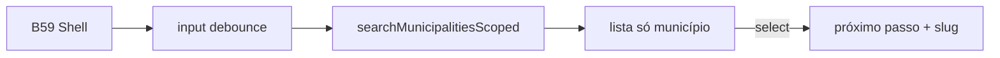

# Etapa de busca de município nos wizards

Status: rascunho
Atualizado em: 2026-07-29
Item do roadmap: [docs/roadmap.md](../roadmap.md) (Trilha B, item B60 — UX-1 wizards)
Impeccable: B — encaixe da UX da busca do Início (B47/B48) numa etapa de wizard, só municípios
Appetite: ~1 dia eng; input + lista de hits + auto-avanço; soft reuso do loader B48
Responsável: —

## Design (Impeccable)

Âncoras: `PRODUCT.md` / `DESIGN.md` · B47 `CampaignHomeSearch` / B48 linhas de município · tema `campaign`.

Na implementação: craft compacto → critique → polish.

Brief compacto:

- **Persona:** CG digita “Cairu” no meio do ritual A1/A2 e quer o município em 1 toque.
- **Job principal:** achar o município no escopo do ator e **avançar sozinho** ao selecionar.
- **Estratégia de cor:** Restrained.
- **Edit where you see:** não — seleção é navegação de fluxo.
- **Anti-goals:** grupos (TI/lideranças/…); botão “Continuar” após selecionar; card por linha.

## Dados → decisão → apresentação

- **Vou apresentar dados?** Sim — hits de município (nome, TI, opcional “2022” se B48 já tiver o readout).
- **Decisões:** escolher **qual** município entra no fluxo.
- **Forma:** lista ranqueada por nome (word-start), igual espírito B48. **Rejeitado:** mapa; grupos multi-entidade.
- **Profile:** scoped ao access; tipicamente &lt;20 hits.
- **Anti-goals de dado:** sem inventar métrica; sem TIs neste passo (wizard precisa de unidade operacional `municipality`).

## Contexto

No Início, **B47** ✓ entrega input + modo focado; **B48** lista Municípios (+ TIs no mesmo grupo). Nos wizards (pedido 2026-07-29): **mesma experiência de busca**, com duas diferenças — (1) **sem grupos**: só municípios; (2) **selecionar = avançar** ao próximo passo, sem confirmar.

Serve A1 (votos), A2 (sinal), A3/A4/A5 e qualquer fluxo que precise de local cedo ([fluxos-acao-primeiro-inicio.md](fluxos-acao-primeiro-inicio.md) § contrato #2).

## Objetivos

- Etapa reutilizável (ex. `WizardMunicipalitySearchStep`) montada no **B59**: input debounce (mesmo espírito 250 ms de B47), lista de hits **apenas** `municipality`, escopo `overrideAccess: false`.
- Clique/Enter no hit → callback/`router.push` para o próximo passo **com município escolhido** (slug ou id na URL/query do fluxo).
- Sem botão “Continuar” / “Confirmar município”.
- Recentres / prioritários opcionais acima da busca (soft; cortável) — 3 recentes se `recentVisits` já existir no Início.
- Match: `matchesAtWordStart` / `normalizeSearchPhrase` (`lib/wordStartFilter.ts`).
- Sem migration / Consent.
- Se **B48** já tiver `searchHomeMunicipalities`, **filtrar/omitir TIs** e reusar o loader; senão, loader mínimo só de municípios (depth: não duplicar fuzzy).

## Decisões travadas

- **Só municípios** — TIs fora deste passo (wizard grava em `municipality`). **Rejeitado:** copiar B48 com TIs (não há `municipality` para um TI).
- **Select = auto-avanço.** **Rejeitado:** seleção + “Continuar” (pedido explícito; atrito no ritual).
- **Mesma linguagem visual da busca do Início** (linha sem card, tipografia). **Rejeitado:** `Command`/`Combobox` de lista (B27) como UI primária — é outro modelo mental.
- **i18n:** `WizardMunicipalitySearch`, copy “Em qual município?”.

## Questões em aberto

- **Mostrar votos 2022 à direita no wizard?** **Opções:** A sim (paridade B48) | B só nome+TI. **Recomendação:** B no v1 se B48 ainda não landou; A quando o readout existir e não atrasar o appetite. _(assumido)_

## Abordagem proposta

Componentes:

- **`WizardMunicipalitySearchStep`** (client island): input + results; registra seleção.
- **Loader** — reuso B48 ou `utilities/municipality/` com `overrideAccess: false`.
- Reuso: `useHomeSearchQuery` pattern / debounce B47; **não** importar o chrome focado do Início inteiro.
- **Migration:** Sem migration.

## Dependências

- Dura: **B59**. Soft: **B48** (UX/loader), **B47** ✓ (debounce/modo focado como referência).

## Não escopo

- Grupos lideranças/assessores/… → B49–B53 (só Início). Ajuste de votos → **B61**. Chassis → **B59**.

## Rabbit holes

- **Um único componente de busca para Início e wizard.** **Mitigação:** compartilhar loader + row renderer; chrome (grupos vs só município, onSelect vs Link) fica nos wrappers — extrair shared só com 2 call sites reais medidos.

## Adiado com gatilho

- **Chips de recentes/prioritários acima do input.** Revisitar se o CG pedir atalho sem digitar (sessão).

## Referências

- [busca-global-inicio-input.md](busca-global-inicio-input.md) · [busca-global-resultados-municipios.md](busca-global-resultados-municipios.md) · [chassis-wizard-campanha.md](chassis-wizard-campanha.md) · `lib/wordStartFilter.ts` · `recentVisits` utilities
- AGENTS.md — access advisor; `overrideAccess: false`
- `PRODUCT.md` / `DESIGN.md`
