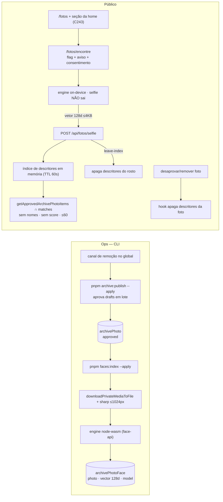

# Impl: C242 — Busca por selfie aberta a qualquer visitante (escopo B)

Status: aprovado (decisão do dono na sessão, 2026-10-01) — hard-stops humanos registrados (migração de schema, contrato público, Consent/LGPD)
Atualizado em: 2026-10-01
Issue: — (worktree `work/43`, sem claim)
Intenção: docs/plans/busca-selfie-escopo-b.md
Design UI (gate): docs/plans/busca-fotos-por-selfie-ui-design.html (estendido no C243; aqui só copy/estados)
Appetite restante: herdado (~2–3 dias eng + ops de publicação/indexação) — índice biométrico **anônimo** do acervo aprovado, sem enrollment e sem cadastro de pessoa.

## Leitura da intenção

- **Outcome:** qualquer visitante com rosto em foto aprovada se encontra; sem aviso/consentimento/flag, nada abre; sem score/nomes; opt-out e remoção funcionam; foto desaprovada sai na hora.
- **O que NÃO negociar:**
  - Fail-closed de Consent/LGPD: sem as duas linhas de Consent com as chaves exatas, o endpoint recusa (503) e a página mostra o estado fechado.
  - A selfie nunca sai do dispositivo (vetor-only), sem score, sem nome de terceiro, sem retenção.
  - Resultado = interseção com `getApprovedArchivePhotoItems()` (draft/removida nunca).
  - Kill switch `photoAlbum.selfieSearchEnabled` e `photoAlbum.published` valem no servidor.
  - Sem vínculo com `Contact`/leadership; o índice não vira cadastro de pessoas.
- **O que reavaliar (achados do reconhecimento):**
  - O índice A/C persiste **só os vínculos** `matchedPhotos` por subject; os descritores do acervo são transitórios (`faceSubjectPhotoIndex.ts:28-44`). B exige persistir descritores por foto — collection nova.
  - `findFaceMatch` casa a consulta contra **subjects elegíveis** (`faceSearch.ts:101-128`); B casa a consulta contra **descritores do acervo**.
  - O marker `faces.checkedKey` hoje resume modelo + revisões de subjects (`faceSubjectPhotoIndex.ts:111-120`); em B resume só o modelo.
  - `deriveArchivePhotoCatalogIndex` já ignora writes do lote via `context.faceIndex` (`ArchivePhoto.ts:168-172`) — manter.
  - Produção verificada 2026-10-01: `archive_photo` 0 aprovadas / 6.492 draft; `face_subject` 0; 0 consentimentos; flag default off; `photo_album` sem linha (defaults: published=true, selfie=false, sem canal de remoção).

## Abordagem recomendada

**Opções consideradas (índice B):**
A) collection `archivePhotoFace` (1 linha/rosto, `json` 128 floats) + ranking em memória com cache curto; B) coluna json no próprio `archivePhoto`; C) pgvector/serviço externo.
**Recomendação:** **A** — segue o precedente C229 (`speechEmbedding` jsonb + ranking em memória), isola PII biométrica da ficha pública, permite apagar por rosto/foto e não exige extensão de banco (o Postgres do homeserver é vanilla; C229 rejeitou pgvector).
**Rejeitadas:** **B** porque carregaria ~6,5k documentos com vetores a cada scan e misturaria biometria na ficha do acervo; **C** porque troca imagem do Postgres/instala extensão por ganho marginal na escala atual (~dezenas de milhares de rostos).

### Componentes / mudanças

**Schema**

- **`src/collections/ArchivePhotoFace.ts`** (novo): slug `archivePhotoFace`, labels “Rosto no índice”/“Rostos no índice”, grupo `Comunicação`, `admin.hidden: true` (dado de máquina; sem UI), access `payloadAdminOnly` nas quatro operações. Campos: `photo` (relationship → `archivePhoto`, required, index), `model` (text, required, index), `vector` (json, hidden, readOnly), `detectedAt` (date, readOnly). Sem hooks.
- **`src/payload.config.ts`**: registrar a collection; remover `FaceSubject`.
- **`src/collections/FaceSubject.ts`**: **deletar**.
- **Migration `add_archive_photo_face`** (gerada + revisada à mão): cria `archive_photo_face` (+ FK para `archive_photo` com `ON DELETE CASCADE` e índice por `photo`), dropa `face_subject`, `face_subject_rels`, `enum_face_subject_status` (0 linhas em produção). Nunca editar migrations antigas.
- **`src/collections/ArchivePhoto.ts`**: hook novo `afterChange` que apaga descritores quando a foto deixa de ser `approved` (e `afterDelete` equivalente); o batch continua marcando `faces.checkedAt/checkedKey` com `context.faceIndex`.

**Contrato puro (`src/lib/faceSearch.ts`, editar)**

- Manter descritor/modelo/threshold/intents/view model/stub.
- Novo `findFaceDescriptorMatch({ vector, descriptors, model })` → melhores `photoIds` distintos sob o threshold (nunca devolve distância).
- Remover `findFaceMatch`/`faceSubjectIsEligible`/`FaceSearchSubject` (sem subjects).

**Índice (novo domínio `src/utilities/faceIndex/`, substitui `faceSubjects/`)**

- `faceDescriptorIndex.ts` (`server-only`): `listArchivePhotoFaceIndexQueue({ payload, refresh, limit })` (aprovadas + marker), `indexArchivePhotoFaces({ payload, item, indexKey, analyze })` — baixa/prepara/analisa e, em uma transação, **substitui** os descritores da foto e grava o marker `sha256(model)`. Falha por foto é resultado, nunca throw (estágios download/image/analyze/write).
- `faceDescriptorReads.ts` (`server-only`): `loadFaceDescriptorIndex(payload)` com cache em memória (TTL 60 s, `Float32Array` por descritor, cap defensivo documentado) e `deleteFaceDescriptorMatches({ payload, vector, model })` para o opt-out; leitura direta (sem cache) no delete para o opt-out valer na hora.
- Deletar `src/utilities/faceSubjects/*` e `scripts/enroll-face-subject.mjs`; remover `faces:enroll` do `package.json`; ajustar `scripts/copy-face-vision-assets.mjs` só se referenciar o CLI (não referencia).

**Endpoint (`src/app/(frontend)/api/fotos/selfie/route.ts`, editar)**

- Mesmas recusas (400 body, 403 origin, 404 flag/álbum, 429 rate, 503 consent) — muda o miolo: exige os dois Consents (`busca-selfie-fotos` consulta + `busca-selfie-indice` aviso); match contra `loadFaceDescriptorIndex`; `leave-index` apaga os descritores que casarem; resposta `getApprovedArchivePhotoItems ∩ photoIds` (≤60, `toFaceSearchPhotoView`).
- Página `/fotos/encontre`: passa a exigir/consumir também o aviso (renderiza o texto do aviso + texto do consentimento) e mantém o estado fechado sem qualquer um dos dois; `/fotos` mostra a entrada quando flag + aprovadas (e aviso/consentimento configurados).

**Copy/estados (porta do design estendido no C243)**

- `SelfieSearchEntry`: “a busca cobre quem autorizou participar do índice” → cobre o acervo aprovado, com saída do índice.
- `SelfieSearchFlow`: textos de consentimento/aviso e o estado de “Minha presença” (o vetor/descritores do rosto são apagados do índice).

**CLI de publicação (novo `scripts/publish-archive-photos.mjs`, guardas C231/C232)**

- Dry-run default; `--apply` exige `ARCHIVE_PUBLISH_CONFIRM=1`, `TEQO_ENV` casando o banco e as 4 `S3_*`; `--limit`, `--refresh`; nunca toca `removed`; exige `removalChannelUrl` válido (o guard da collection reforça); recibo JSON em `data/archive/reports/`; ao fim, instrui/deposita o bust da tag `archivePhotos` via `POST /api/revalidate` (writes fora do processo Next não revalidam sozinhos).
- `package.json`: script `archive:publish`.

**Testes**

- Unit: `faceSearch` (match por descritores, threshold estrito, sem score), parser do CLI de publicação, plan/CLI do índice.
- Int: `faceSearchApi` (busca sem subject, opt-out, flag/álbum/Consents, rate limit, 404/503) e `faceDescriptorIndex` (substituição por foto, purge em desaprovação/delete, marker).
- E2e: `frontendFotosSelfie` (semear descritores via fixture em vez de subject; fluxo completo com stub), seção da home (C243).
- Fixtures/helpers: `tests/helpers/faceIntFixtures.ts` reescrito para descritores; ownership de `archivePhotoFace`.

**Ops (runbook §C234 reescrito)**

1. Admin: criar os dois Consentimentos (textos da entrega) e o canal de remoção no global Álbum de fotos.
2. `pnpm archive:publish --apply` (6.492) + bust da tag; conferir `/fotos`.
3. `pnpm faces:index --apply` (horas; canário `--limit 20` antes) + `--verify`.
4. Ligar `Busca por selfie`; conferir `/fotos/encontre` e a seção da home.
   Rollback: desligar a flag; migration do índice é aditiva exceto o drop do `face_subject` (vazio).

**Docs**

- `AGENTS-public.md` (contrato `/fotos/encontre` reescrito para escopo B), `docs/ops/teqo-1313-deploy.md` §C234, `docs/changelog/<data>-c240-c241.md`, planos atualizados (C234 ganha nota de superação).

## Riscos

- **Falso positivo do threshold** mostra foto de outra pessoa — mitigado por threshold conservador, canário e calibração no runbook; sem score na UI.
- **Custo do lote** (~6,5k detecções) — ops em background no homeserver; retomável pelo marker.
- **Descrição/volume do índice em memória** — `Float32Array`, TTL curto e cap documentado; degrada para vazio honesto se o índice não carregar.
- **Migração destrutiva** do `face_subject` (vazio em produção; staging/local com dados de teste podem perder linhas — aceitável e registrado).

## Checklist

- [ ] Collection + migration + purge hooks + types
- [ ] Domínio `faceIndex` (batch/reads/delete) + CLI `faces:index` novo + remoção do enrollment
- [ ] Endpoint + páginas fail-closed (consulta + aviso)
- [ ] CLI `archive:publish` + script
- [ ] Copy/estados do fluxo e da entrada `/fotos` (porta do design)
- [ ] Testes unit/int/e2e + fixtures
- [ ] Docs (AGENTS-public, runbook, changelog, planos)
- [ ] Ops: consentimentos, canal, lote, indexação, flag
