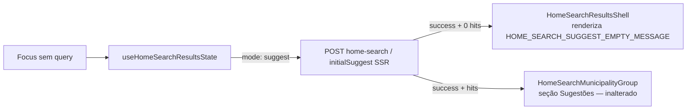

# Impl: Busca global sem sugestões mostra região em branco — estado vazio honesto

Status: aprovado
Atualizado em: 2026-08-10
Issue: #585
Intenção: docs/plans/busca-sem-sugestoes-estado-vazio-honesto.md
Appetite restante: ~0,5 dia eng (herdado — cabe folgado)

## Leitura da intenção

- **Outcome:** com zero municípios `priority: alta`, focar o search (Início e FAB overlay) mostra uma mensagem curta de estado vazio dentro da região `Resultados da busca` — nunca uma região muda. Com ≥1 `alta`, comportamento preservado. API `/campanha/home-search` intacta. E2E do FAB passa em qualquer estado de dados.
- **O que NÃO negociar:** sem mudança de API; sem sugestões falsas; sem componente pesado de onboarding; mensagem vinda do estado compartilhado (não uma cópia por superfície); leader lockdown intacto (leader nem tem search).
- **O que reavaliar:** a hipótese da intenção aponta `HomeSearchResultsShell.tsx` como dono do vazio — confirmei; também reavaliei a pergunta em aberto do assessor contra a regra real do ranking (ver Decisões).

## Abordagem recomendada

**Opções consideradas:** A | B | C  
**Recomendação:** A — o empty entra no `HomeSearchResultsShell`, o mesmo componente que já decide skeleton/erro/`Nenhum resultado.` do modo busca. É o estado compartilhado por Início, FAB desktop e Drawer mobile (`CampaignStaffGlobalSearchBody`), então uma única condição cobre as três superfícies — exatamente o que a intenção pede ("mensagem do estado compartilhado, não cópia por superfície").
**Rejeitadas:**

- **B — empty dentro de `HomeSearchMunicipalityGroup`:** o grupo já retorna `null` sem hits e não renderiza heading no modo sugestão; o vazio é propriedade da _região inteira_ (todos os grupos somem), não do grupo de municípios. Colocar lá quebraria a simetria com o empty do modo busca, que já vive no shell.
- **C — componente novo de empty state:** DRY <3 call sites; a gramática de vazios do app é um `
` com `text-sm text-muted-foreground` (precedentes: `Nenhum resultado.` no shell e `emptyState` do `SuggestionsPanel` E11). Componente novo seria camada sem volatilidade.

### Componentes / mudanças

- **`HOME_SEARCH_SUGGEST_EMPTY_MESSAGE`** (`src/lib/campaignHomeSearchMessages.ts`): nova constante de copy — "Nenhuma sugestão ainda — priorize municípios na planilha de projeção." (texto recomendado A da intenção, que diz o que é, por quê e o que desbloqueia). Morar ao lado de `HOME_SEARCH_GENERIC_ERROR_MESSAGE`/`HOME_SEARCH_STAFF_ONLY_MESSAGE`, que já são a casa das strings do search.
- **`HomeSearchResultsShell`** (`src/components/campaign/dashboard/HomeSearchResultsShell.tsx`): nova condição `showSuggestEmpty` — `resultKind === 'suggest' && results.status === 'success' && !homeSearchHasAnyHits(results.data)` — renderizando `
` com a mensagem, no mesmo lugar e estilo do `Nenhum resultado.` do modo busca (simetria byte a byte com o padrão existente). O modo busca (`query.isActive`) e o estado com hits ficam intocados.
- **Migration:** nenhuma — sem schema.
- **Access / Consent:** nenhum — UI pura; nenhum dado novo exposto.
- **UI:** Impeccable A — só copy em superfície existente, sem rearranjo (a intenção já classifica como B mas restringe a "só copy/label"; o canvas diz N/A). Sem shape/craft/polish.

### Dados → forma (se aplicável)

N/A — estado vazio de UI, sem métrica nova (pergunta 3 de data-presentation não dispara).

## Decisões de engenharia

**D1 — Onde vive o empty (A vs B vs C):** ver "Opções consideradas" acima. Custo de reverter: nulo (uma condição no shell).

**D2 — Texto único compartilhado vs copy por papel:**

- **Opções:** A) mensagem única para todos os papéis | B) copy específica por papel (coordenador vs assessor).
- **Recomendação:** A — a regra real do ranking (`rankHomeSearchSuggestMunicipalities`) mostra que **ambos** os papéis podem nascer com lista vazia: unrestricted filtra `priority: alta` (vazio em banco novo — o caso da intenção); advisor rankeia a carteira, que é vazia se o coordenador ainda não atribuiu municípios (caso raro mas real). A intenção recomendava C ("assessor não tem empty") para a pergunta em aberto, mas a regra real contradiz a premissa — a carteira só "sempre lista algo" quando o assessor já tem atribuição. Com os dois papéis capazes de vazio, uma mensagem única honesta é mais simples que plumbing de role até o cliente para um edge raro.
- **Rejeitadas:** B (role-aware) porque exigiria expor o role no client state do search para um caso de canto; o núcleo honesto da mensagem ("não há sugestões ainda") vale para ambos.

**D3 — Estratégia do e2e (intenção: "asserção para o vazio ou expectativa tolerante a ambos, sem enfraquecer o contrato"):**

- **Opções:** A) estado determinístico por teste — o B126 existente ganha um município `alta` explícito (contrato original preservado: região `Sugestões` com dados) + dois testes novos de vazio (FAB e Início) | B) expectativa tolerante (`region 'Sugestões'` OR mensagem de vazio) no B126.
- **Recomendação:** A — cada estado vira contrato explícito e verificado, em qualquer ambiente. O banco de teste e2e nasce sem `alta` (migrações não seedam prioridade) e o cleanup do fixture reseta `priority: 'normal'` dos municípios tocados (campaignE2EFixtures.ts:431).
- **Refinamento pós-simplify (race paralelo):** a config roda `fullyParallel` com workers ≥2 num banco compartilhado — o município `alta` pinado pelo B126 fica vivo do `payload.update` ao cleanup e vazaria para testes zero-alta rodando em paralelo (a classe do miss #73). Os dois testes OPS29 novos usam então um **advisor sem municípios administrados**: o scope do suggest é a carteira (vazia), imune a qualquer `alta` global. O caso unrestricted (coordenador/candidato) continua coberto pelos unit tests do shell, que não ramificam por papel. O teste do FAB também aguarda o `suggestResponse` antes das asserções (o POST acontece no focus).
- **Rejeitadas:** B — OR tolerante é mais fraco: verifica "algum estado honesto" sem nunca provar nenhum dos dois por extenso; e o contrato da intenção ("passa em qualquer estado") já é atendido por A com asserções mais fortes. A variante "zero-alta via fixture default" sem o advisor foi rejeitada pelo race acima.

**D4 — Edge de exclusão de contexto (FAB em página de detalhe):** `filterHomeSearchResponseForContext` pode zerar a lista filtrada mesmo com hits no servidor (único `alta` = o município que você está vendo; FAB em `/campanha/municipios/<slug>`). Nesse caso o vazio renderiza com a mensagem A — o núcleo ("nenhuma sugestão [neste contexto]") continua verdadeiro; a segunda oração fica imperfeita. **Aceito como trade-off documentado:** hoje a região renderiza em branco (o bug); com a mudança renderiza a mensagem — estritamente melhor, e corrigir custaria expor o payload pré-filtro no estado compartilhado para um caso de canto (rejeitado em D2/D4 por depth check: pass-through de dados que 99% dos consumidores não usam).

## Fases verificáveis

1. **UI (shell + constante):** `campaignHomeSearchMessages.ts` + condição no `HomeSearchResultsShell`. Sem fase server — API e server loaders intocados.
2. **Testes unit:** `tests/unit/campaignHomeSearch.unit.spec.tsx` — caso novo no describe do shell: suggest success vazio → mensagem visível; sugestão com hits → sem mensagem; garantir que `Nenhum resultado.` do modo busca não regride (caso que hoje não está coberto — adicionar junto).
3. **Testes e2e:**
   - `campaignMunicipalities.e2e.spec.ts` (describe B126): B126 existente ganha `fixtures.payload.update` setando `priority: 'alta'` no município claimado + `fixtures.touchMunicipality` (cleanup reseta) — região `Sugestões` passa a ser determinística em qualquer ambiente.
   - Novo teste no mesmo describe: FAB em estado zero-alta → foca search → `region 'Resultados da busca'` contém a mensagem de vazio.
   - `campaignHomeActions.e2e.spec.ts`: novo teste — Início zero-alta → foca search → mensagem de vazio (cobre o caminho SSR `initialSuggest`, que difere do POST do FAB).
4. **Gates:** `pnpm gate:fast` na iteração; entrega com `pnpm push` (não `git push` nu); CI green antes de merge.

## Rabbit holes / Não escopo (engenharia)

- Wizard municipality suggest (`loadWizardMunicipalitySuggestions`, B93) — superfície separada, fora da intenção; não tocar.
- Copy por papel / role-aware (D2) — decidido, não fazer.
- Expor payload pré-filtro para o edge de exclusão (D4) — não fazer.
- Mudar `Nenhum resultado.` ou qualquer comportamento do modo busca — fora de escopo.
- Texto da mensagem além da oração única — sem ilustrações, sem CTA (anti-goal da intenção).
- `HomeSearchSuggestSkeleton` — inalterado; o skeleton já cobre o fetch antes do success vazio.

## Riscos e mitigação

- **Regressão do caso com dados:** a condição nova só ativa com `resultKind === 'suggest'` + success + zero hits; com hits, `children` renderiza igual (só há uma asserção a mais, que falha se `homeSearchHasAnyHits` voltar true — testado em unit).
- **Flakiness e2e por estado do banco:** mitigado por D3-A refinado — B126 seta `alta` explicitamente e toca o município para o cleanup restaurar; os testes de vazio usam advisor sem carteira, imune a `alta` global de workers paralelos.
- **Exclusão de contexto zerando a lista:** aceito (D4) — estritamente melhor que a região em branco atual.

## Aceite de engenharia

- [x] Aceite de produto da intenção ainda coberto (vazio honesto nos dois fluxos; ≥1 `alta` byte a byte; API intacta)
- [x] Invariantes AGENTS/engineering-standards (sem schema/access/consent; copy pt-BR; identificadores em inglês)
- [x] Testes de domínio previstos (unit do shell + e2e dos dois fluxos)
- [x] Sem migration, sem `generate:types`, sem importmap
