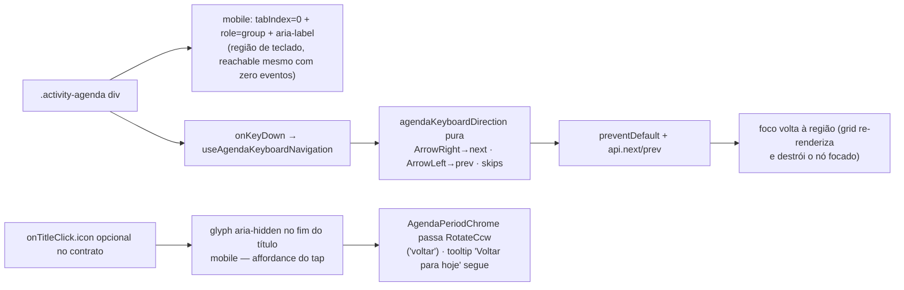

# Impl: Agenda mobile — affordance do "voltar ao hoje" + navegação por teclado (pós-C101)

Status: aprovado
Atualizado em: 2026-08-09
Issue: #512
Intenção: docs/plans/c101-ux-pos-critique.md
Appetite: ~0,5 dia eng (fill-in pós-entrega)

## Leitura da intenção

- **Outcome:** no mobile da agenda, (1) usuários de teclado/AT conseguem navegar entre períodos mesmo com a toolbar do FullCalendar escondida (C101), e (2) o tap no título do header ("voltar ao hoje") tem uma pista visual — hoje só existe `title` (hover), invisível no toque.
- **O que NÃO negociar:** desktop intacto (toolbar continua mandando lá); swipe continua sendo o gesto primário; C91 (tap cria inline) e C15 (arrasto de remanejo) intactos; nada de segunda barra de controles.
- **O que reavaliar:** a hipótese de "reusar o teclado interno do FC" — **verificado no bundle instalado (FullCalendar 7.0.2): o FC v7 NÃO tem navegação por setas no grid.** Varredura dos chunks: só existe `createAriaKeyboardAttrs` (Enter/Space ativa elementos clicáveis — células com `dateClick` e âncoras de evento) e Escape no more-popover. Não há handler ArrowLeft/ArrowRight de navegação de data em nenhum lugar do core/headless-calendar/react. → Handler próprio é obrigatório; a hipótese cai. Bônus da verificação: células de data com `dateClick` JÁ são focáveis (`tabIndex=0`), então teclado já alcança o calendário via células — mas sem navegação.

## Abordagem recomendada

**Opções consideradas (teclado):** A | B | C | D
**Recomendação:** A — **região de teclado**: o container `.activity-agenda` vira, no mobile, um elemento focável (`tabIndex={0}`) com `role="group"` + `aria-label`; um `onKeyDown` no container traduz ArrowLeft/ArrowRight em `api.prev()/api.next()` (mesma semântica do swipe: direita = avança). Focar a região resolve também o "calendário inalcançável por teclado quando o período não tem eventos e não há células focáveis" (hoje, com 0 eventos, não há nada tabbable no grid mobile — só o more-popover e as âncoras de evento). É o padrão APG de região de teclado, sem lutar contra o grid.
**Rejeitadas:** B — handler em nível de `document` gated por "foco em qualquer lugar da página da agenda": engole setas perto do combobox/seletor de vista, exige as mesmas regras de skip e ainda dispara quando o usuário só passou de tab; C — emular roving tabindex sobre as células de data: o FC v7 não expõe API de foco de célula (não há navegação interna para espelhar), seria lutar contra o grid por dentro; D — nada: falha o aceite (teclado no mobile não sai do período, e com zero eventos o calendário é inalcançável).

**Opções consideradas (affordance):** A | B | C
**Recomendação:** A — **glyph discreto dentro do próprio botão de título** (móvel): o contrato `onTitleClick` ganha `icon?: LucideIcon` opcional (glyph é da página, mesmo padrão do `hint` — o chrome compartilhado não hardcoda copy da agenda), renderizado `aria-hidden` após o texto truncado. Agenda passa `RotateCcw` ("voltar"). Zero controles novos, o tap continua sendo UM alvo.
**Rejeitadas:** B — chip "Hoje" separado ao lado do título: segundo alvo de toque, disputa espaço com `[Semana ▾][sino]`, e torna o tap no título redundante (vizinho do anti-goal "segunda barra"); C — nada além do affordance de botão: é exatamente o gap que o critique apontou (o `title` hover-only é invisível no toque). Nota de gate: a escolha do glyph é troca de uma linha no Impeccable B/C.

### Componentes / mudanças

- **`useAgendaKeyboardNavigation`** (`src/components/campaign/activity/useAgendaKeyboardNavigation.ts`): hook novo, agenda-only, espelhando a forma do `useAgendaSwipeNavigation` (refs de `enabled`/`onNavigate`, sem stale closure). Exports a pura `agendaKeyboardDirection(event)`:
  - `ArrowRight → 'next'`, `ArrowLeft → 'prev'`; qualquer outra tecla/modificador → `null`.
  - Skips: `alt/ctrl/meta` pressionados (não sequestrar atalhos do browser/AT); `target.closest('[role="dialog"], [role="menu"]')` (more-popover do FC é dialog; menus têm setas próprias); `target` é input/textarea/select/contentEditable (defensivo — não há inputs no grid).
  - `event.repeat` permitido (paridade com segurar Enter na toolbar desktop; o fetch de eventos já cancela requisições atrasadas via flag `cancelled`).
  - No consumo: `preventDefault()` + `onNavigate(direction)` + **restaura foco na região** (`containerRef.current.focus({ preventScroll: true })`) — trocar de período re-renderiza o grid e destrói o nó focado (âncora de evento/célula); a região sobrevive à troca e mantém o teclado navegando.
- **`ActivityAgenda.tsx`**: no div `.activity-agenda` (mobile-only, `isMobile` — mesmo gate do chrome): `tabIndex={isMobile ? 0 : undefined}`, `role="group"`, `aria-label="Calendário de atividades — setas mudam o período"` e `onKeyDown={handleKeyDown}` do hook. Desktop intacto (sem tabIndex, sem handler).
- **`campaignPageChrome.ts`**: `onTitleClick` ganha `icon?: LucideIcon` (opcional; página decide o glyph).
- **`CampaignPageChromeText.tsx`** (branch mobile): botão vira `flex items-center gap-1.5`; texto num `span` com `min-w-0 truncate`; quando `onTitleClick.icon`, glyph `size-3.5 shrink-0` `aria-hidden` no fim. Accessible name inalterado (o texto do período continua sendo o nome). Branch desktop intocado.
- **`AgendaPeriodChrome.tsx`**: passa `icon: RotateCcw` no chrome memo.
- **`ActivityAgenda.css`**: no media ≤767px, `.activity-agenda:focus-visible { outline: 2px solid var(--ring); outline-offset: -2px }` (anel interno sutil na região focada — a região é navegável, precisa de foco visível; o anel interno não desloca layout). Sem nada além disso.
- **Migration:** nenhuma (só UI/interação de tela). Nenhum `Consent`/access novo.

### Dados → forma

- Não apresenta dados novos: navegação por teclado e affordance são estado de tela/copy. (N/A.)

## Fases verificáveis

1. **Teclado (a11y primeiro):** pura `agendaKeyboardDirection` + hook `useAgendaKeyboardNavigation` + unit tests (mapeamento, skips de modificador/dialog/menu/input, preventDefault, restore de foco) + wiring no `ActivityAgenda` + CSS do anel.
2. **Affordance:** `icon` no contrato + glyph no `CampaignPageChromeText` + passagem pelo `AgendaPeriodChrome` + unit test do renderer (glyph aparece só com `icon`; desktop inalterado). Gate Impeccable B/C para a escolha do glyph (swap de 1 linha se o review pedir).
3. **Gates:** e2e novos no `campaignAgendaMobile.e2e.spec.ts` (teclado: focar região → ArrowRight → período seguinte, ArrowLeft → volta; glyph visível no botão do título no mobile; desktop com "Hoje" da toolbar intacto — verificar asserção existente no `campaignActivity`); `pnpm gate:fast` na iteração; `pnpm push` na entrega.

## Rabbit holes / Não escopo (engenharia)

- ArrowUp/ArrowDown e Home/End: NÃO tocar — são a rolagem nativa da linha do tempo do dia (e da página), comportamento desejado.
- Roving tabindex dentro do grid (impossível sem API do FC — ver rejeitadas) e navegação por teclado no desktop (a toolbar é o controle, já acessível).
- Throttle de `event.repeat`, anúncio SR do período trocado (aria-live no title já cobre via texto), teclado dentro do more-popover/do combobox do strip (fora da região por construção; skips cobrem o caso de foco interno).
- Qualquer mudança no gesto de swipe, no strip, no desktop, e nas outras listas.

## Riscos e mitigação

- **Foco perdido na troca de período** (grid re-renderiza): restore para a região com `preventScroll: true` no próprio consumo — deterministicamente o teclado continua no calendário.
- **Conflito futuro com teclado interno do FC** (se um v7.x adicionar setas no grid): hoje não existe (verificado); se vier, o handler do container cai antes (o keydown das células borbulha até ele) — registrar como gatilho de revisão, não reabrir agora.
- **Anel de foco feio no card edge-to-edge**: anel interno de 2px com `outline-offset: -2px` (sem deslocamento); gate visual no browser.
- **E2E de teclado no viewport mobile**: esperar o label do período (medição `isMobile` assentou — padrão B167 existente) antes de focar a região; `page.keyboard.press` não precisa de CDP.
- **Glyph no título móvel disputa espaço com "3–9 Agosto" truncado**: `shrink-0` + span truncante; conferir no browser (o título já truncava).

## Aceite de engenharia

- [ ] Teclado navega períodos no mobile (ArrowRight/ArrowLeft por vista) sem conflitar com nada do FC (v7 não tem setas no grid — verificado) nem com popover/menu/inputs
- [ ] Tap no título comunica a ação sem depender de hover (glyph visível, aria-hidden; accessible name preservado)
- [ ] Desktop, swipe, C91 e C15 intactos; gates verdes (gate:fast + push)
- [ ] Invariantes AGENTS/engineering-standards (sem migration, sem prod, sem Consent novo, copy pt-BR / ids em inglês)
- [ ] Testes: unit (direção/skips/focus; renderer do glyph) + e2e (teclado, glyph, desktop intacto)
