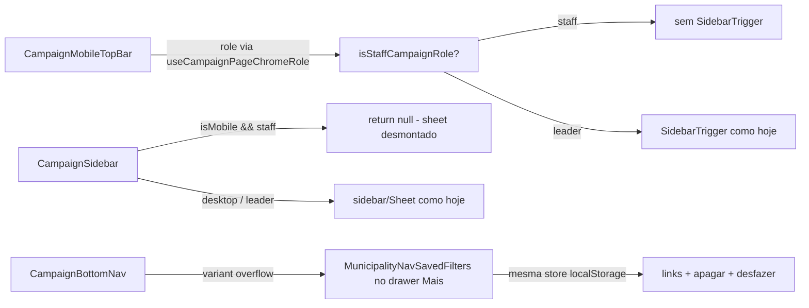

# Impl: C102 — Mobile: sem botão/sheet de sidebar (navegação pela barra inferior + "Mais")

Status: aprovado
Atualizado em: 2026-08-09
Issue: #498
Intenção: docs/plans/c102-mobile-sem-botao-sidebar.md
Appetite restante: herdado (~0,5–1 dia eng; sem schema — só shell + drawer + testes)

## Leitura da intenção

- **Outcome:** no mobile (<768px), nenhuma tela `/campanha` de staff mostra o botão de abrir sidebar na barra superior e o sheet de navegação não é renderizado para staff; todos os destinos continuam alcançáveis via barra inferior + drawer "Mais"; filtros salvos de Municípios (B18) continuam acessíveis no mobile; desktop e leader inalterados.
- **O que NÃO negociar:** leader (lockdown) mantém o sheet — é a única navegação dele no mobile; desktop (≥ md) inalterado — sidebar offcanvas B38 continua; sem regressão de wizard/busca/PWA.
- **O que reavaliar:** "áreas prováveis" da intenção apontam para 4 arquivos do shell — confirmei que são os donos certos: `CampaignMobileTopBar.tsx` (único `SidebarTrigger` mobile), `CampaignSidebar.tsx` (o `<Sidebar>` que vira Sheet no mobile), `CampaignBottomNav.tsx` (drawer "Mais"), `MunicipalityNavSavedFilters.tsx` (sub-lista B18). O `layout.tsx` não muda.

## Abordagem recomendada

**Opções consideradas:** ver decisões D1–D3.
**Recomendação:** gate de papel dentro dos componentes que já possuem o contexto (top bar) e o viewport (`CampaignSidebar`), e a sub-lista B18 migrada para o drawer "Mais" como segundo lar do mesmo componente (variante).
**Rejeitadas:** prop-drilling de `user` para a top bar (layout e N testes mudam sem necessidade); gating no `layout.tsx` (o breakpoint é cliente, exigiria wrapper novo); modificar o primitivo `Sidebar` da shadcn para "no mobile sheet" (polui o genérico para um consumidor); deixar B18 desktop-only (deixa um recurso entregue inalcançável no mobile — a intenção recomenda migrar).

### Decisões de engenharia

**D1 — onde esconder o `SidebarTrigger` no mobile.**
Opções: A) na `CampaignMobileTopBar`, lendo `useCampaignPageChromeRole()` (já envolve o componente no layout) + `isStaffCampaignRole` | B) prop `user` do layout | C) `useSidebar().isMobile` dentro da top bar.
Recomendação: **A** — o provider `CampaignPageChromeProvider role={user.role}` já existe no layout e a top bar já consome contextos dele; nenhuma mudança de contrato, testes unitários atuais (`renderTopBar` com role coordinator) continuam válidos. Alternativas rejeitadas: B porque propaga dependência de layout e quebra os unit tests de render sem props; C porque `useSidebar` exige `SidebarProvider` e duplica um sinal que o papel já carrega.

**D2 — como desmontar o sheet para staff no mobile.**
Opções: A) early return `null` em `CampaignSidebar` quando `isMobile && isStaffCampaignRole(user.role)` (o `useSidebar()` já fornece `isMobile`, e o `<Sidebar>` da shadcn renderiza o Sheet só `if (isMobile)`) | B) gating no layout por user-agent/viewport | C) prop no primitivo `Sidebar`.
Recomendação: **A** — dono do concern é o próprio `CampaignSidebar`; no desktop (≥768px) o rail continua exatamente como hoje; no mobile staff o Sheet nunca monta. Rejeitadas: B porque viewport é sinal de cliente e user-agent é frágil (breakpoint matchMedia é a fonte canônica no repo); C porque altera um primitivo de UI genérico para um caso.

**D3 — B18 (filtros salvos) no mobile staff.**
Opções: A) `MunicipalityNavSavedFilters` ganha `variant: 'sidebar' | 'overflow'` e o `CampaignBottomNav` renderiza a variante no drawer "Mais" (mesma store `useMunicipalitySavedFilters`, mesma lógica de apagar/desfazer/foco) | B) componente irmão novo dentro de `CampaignBottomNav.tsx` com a lógica duplicada | C) desktop-only + débito.
Recomendação: **A** — um componente, um conhecimento (linha = link + apagar + undo + sucessão de foco), dois lares; a store foi desenhada para "a barra de filtro escreve e a navegação lê" (subscribe, B18) e o drawer vira leitor extra sem nenhuma mudança de dados. Rejeitadas: B porque duplica comportamento que a auditoria do repo consolida (não "twin"); C porque a intenção recomenda A e registra B apenas como fallback.

**D4 — toast de "Desfazer" clicável com o drawer aberto (bug pré-existente exposto pelo C102).**
O e2e revelou: o `<Toaster>` vivia dentro de `CampaignAISidebarShell` → div `[contain:layout_paint]` (painel da AI). `contain: paint` vira containing block para `position: fixed` E cria stacking context próprio — o toast (z-999999999 do sonner) ficava preso ABAIXO do portal `z-50` do drawer/sheet, e o clique no "Desfazer" era interceptado pelo viewport do drawer.
Opções: A) mover `<Toaster position="top-center" />` para o layout raiz `(campaign)/layout.tsx` (irmão do `{children}`, direto no `<body>` — nenhum ancestor contain) | B) `zIndex` prop no sonner (inútil: o z-index fica preso no stacking context do contain) | C) fechar o drawer ao apagar (muda UX de snackbar).
Recomendação: **A** — correção no dono do problema (placement do toaster); o toast passa a flutuar acima de sheets/drawers em todos os fluxos `/campanha`, não só neste. Rejeitadas: B porque não resolve; C porque altera o comportamento de deleção. (Pré-existente: qualquer toast com ação era inalcançável com modal aberto — o C102 só expôs porque o drawer agora é lar de uma deleção com undo.)

### Componentes / mudanças

- **`CampaignMobileTopBar`** (`src/components/campaign/shell/CampaignMobileTopBar.tsx`): no `data-mode="app"`, renderiza `SidebarTrigger` só quando `!isStaffCampaignRole(useCampaignPageChromeRole())` (leader mantém). Wizard/home-search: inalterado (já sem trigger).
- **`CampaignSidebar`** (`src/components/campaign/shell/CampaignSidebar.tsx`): early return `null` quando `isMobile && isStaffCampaignRole(user.role)` — o Sheet mobile não monta para staff; rail desktop intacto; leader intacto.
- **`MunicipalityNavSavedFilters`** (`src/components/campaign/shell/MunicipalityNavSavedFilters.tsx`): prop `variant: 'sidebar' | 'overflow'` (default `sidebar` — `CampaignSidebar` não muda chamada). Variante `overflow`: wrapper seção (label "Filtros salvos de Municípios", `aria-label`), linhas em markup de drawer (link + botão lixeira), `onNavigate` fecha o drawer, sucessor de foco resolve para linha vizinha → último link dos destinos / link "Perfil" do footer (calculado ANTES da remoção, mesmo padrão do sidebar).
- **`CampaignBottomNav`** (`src/components/campaign/shell/CampaignBottomNav.tsx`): renderiza a variante `overflow` entre os destinos e o `DrawerFooter`; container de links ganha `min-h-0 overflow-y-auto` (lista longa + filtros não pode clipar no max-h 85dvh).
- **`(campaign)/layout.tsx`**: `<Toaster position="top-center" />` move do `(app)/layout.tsx` para o root layout (D4).
- **Migration:** sem migration (sem schema).
- **Access / Consent:** nenhum toque — papéis já chegam por `user.role`/contexto; leader lockdown intacto.
- **UI:** Impeccable B — encaixe no shell existente; sem redesign; reaproveita tokens e markup do drawer B164 e da sidebar B18.

### Dados → forma (se aplicável)

- Não apresenta dados novos — é migração de navegação. Forma da sub-lista = a mesma da sidebar (linhas link + lixeira), re-estilizada com o markup do drawer.

## Fases verificáveis

1. **Shell (trigger + sheet)** — `CampaignMobileTopBar` + `CampaignSidebar`. Verificável: unit test da top bar (staff sem trigger, leader com trigger); manual no navegador mobile.
2. **Drawer "Mais" (B18)** — variante `overflow` de `MunicipalityNavSavedFilters` + `CampaignBottomNav`. Verificável: e2e mobile salva filtro → abre "Mais" → seção visível, navega, apaga, desfaz.
3. **Gates** — `pnpm gate:fast` (lint/typecheck/format/knip/cycles/unit+int), `pnpm test:e2e` (specs de shell), `pnpm build` local; `pnpm push` → PR Ready `--base main` + `Closes #498` → auto-merge → `gh pr checks --watch --required`.

## Rabbit holes / Não escopo (engenharia)

- Não mexer no `Sidebar` da shadcn, `SidebarProvider`, `SidebarInset`, cookie `sidebar_state`, `CampaignSidebarViewportDefault` (continua inofensivo com o sheet desmontado).
- Não tocar `CampaignDesktopHeader` (trigger desktop) nem a AI sidebar (`CampaignAISidebarShell`).
- Não mudar `nav.ts` — `getCampaignOverflowNav` já cobre tudo do staff; só B18 faltava e entra pelo drawer.
- Não mexer no shortcut `cmd+b` (no staff mobile ele alterna `openMobile` sem Sheet para mostrar — no-op inofensivo).
- Não redesenhar barra inferior/drawer (B164) nem remover sidebar desktop.

## Riscos e mitigação

- **Flash de hidratação:** `useIsMobile` é `false` no primeiro render — o Sheet staff existe fechado por 1 frame até o `matchMedia` medir; sem efeito visual (fechado, portal). Mitigação: nenhuma ação; o padrão B167 (`useIsMobileMeasured`) não agrega aqui porque a diferença é invisível.
- **Foco após apagar o último filtro no drawer:** sucessor resolvido antes da remoção (linha vizinha → link "Perfil" do footer); nunca cai em `<body>` com o drawer aberto.
- **Drawer estourando 85dvh** com destinos + filtros: `overflow-y-auto` no container.
- **Regressão desktop/saved-filters e2e:** `campaignSavedFilters.e2e.spec.ts` roda no viewport desktop (1280) — sidebar continua com a sub-lista; nenhuma asserção muda.
- **Coordenação C101:** mesma top bar mobile; C102 libera o slot do hamburger; sem ordem dura — cada item entrega sozinho.

## Aceite de engenharia

- [x] Aceite de produto da intenção ainda coberto (staff mobile sem botão/sheet; destinos 100% via barra+Mais; B18 no drawer; leader e desktop intactos)
- [x] Invariantes AGENTS/engineering-standards (sem schema, sem access, sem Consent; papéis por contexto/predicado existente)
- [x] Testes previstos: unit `campaignMobileTopBar` (staff/leader) + e2e mobile (staff sem trigger/sheet, leader com sheet, B18 no drawer) — ver fases
