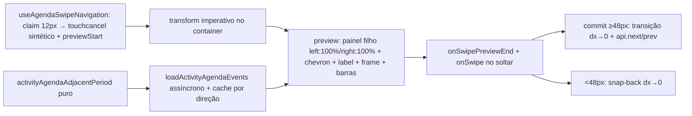

# Impl: C110 — Agenda mobile: feedback visual do arrasto (reveal do período adjacente + commit/snap-back)

Status: aprovado
Atualizado em: 2026-08-10
Issue: #589
Intenção: docs/plans/c110-agenda-mobile-feedback-arrasto.md
Appetite restante: ~1 dia eng (herdado; cabe nas fases abaixo sem corte)

## Leitura da intenção

- **Outcome:** durante o arrasto horizontal no calendário mobile (dia/semana/mês/lista), o grid **acompanha o dedo em tempo real** e o período adjacente é **revelado progressivamente** na direção do gesto (quadro do grid + cabeçalho com datas + chevron), com os **eventos do adjacente entrando no preview assíncronos** (degradação aceita: quadro sem eles, entram quando chegam). Soltar abaixo de 48 px → **snap-back** sem navegação; acima → **commit** com transição suave. `prefers-reduced-motion` → troca instantânea (como hoje).
- **O que NÃO negociar:** desktop intacto (chrome/toolbar atuais); tap de criação inline (C91) e long-press de remanejo (C15) intactos; vista de dia (coluna única) segue sem abrir criação após arrasto; contrato e2e CDP do gesto atualizado no mesmo item; sem segunda barra de controles; sem mudar o header (título continua atualizando só no commit).
- **O que reavaliar:** a hipótese da intenção de "expor o delta vivo do gesto" (decisão passa a ser no soltar) — **confirmado como o caminho**, mas com uma restrição de engenharia que a intenção não nomeia: o delta NÃO pode virar estado React por frame (re-render do FullCalendar a 60 fps é caro). O delta vivo vira transform imperativo no container, no próprio hook dono do gesto; o React só entra nos eventos discretos (preview liga/desliga).

## Abordagem recomendada

**Opções consideradas:** A | B | C | D | E
**Recomendação:** A — o hook continua dono do gesto (contrato unit-testado) e passa a aplicar o transform imperativo no container (zero re-render do FC por frame); o preview é um painel filho do container transformado em `left: 100%`/`right: 100%` (a costura do grid e do painel se move junto — a faixa revelada mostra a borda do painel sem coordenar dois elementos); a decisão (commit vs snap-back) acontece no `pointerup` com o limiar atual de 48 px.
**Rejeitadas:** B — segundo FullCalendar vivo para folhear de verdade (rabbit hole da intenção: render extra + chamada de dados por período); C — `swipeDx` em estado React atualizado por `pointermove` (re-render do FC por frame — 60 fps de reconciliação cara); D — CSS var `--swipe-dx` compartilhada entre container e painel (exige ref da shell, indireção sem ganho: o painel filho do container já herda o transform); E — manter commit no meio do gesto + só animar (o snap-back abaixo do limiar não existe se a troca já aconteceu — aceite exige decisão no soltar).

### Componentes / mudanças

- **`activityAgendaAdjacentPeriod`** (`src/utilities/activityUi.ts`): pura — `(view, { start, end, anchorDate }, direction) => { start, end, anchorDate } | null`. Espelha a aritmética do FC (dia ±1d; semana ±7d sobre os instantes — Bahia não tem DST, instante ± 86.400.000 ms é dia civil exato; mês/lista: anchor civil ±1 mês, range do mês = [segunda ≤ 1º, +42d] — cobre o grid de 5–6 semanas e fica ≤ cap de 45 dias do schema; label usa só o anchor). O label do preview sai do MESMO `activityAgendaPeriodLabel` sobre o range adjacente → garante label do preview == título pós-commit.
- **`useAgendaSwipeNavigation`** (`src/components/campaign/activity/useAgendaSwipeNavigation.ts`): contrato reworkado:
  - `onSwipe(direction)` — agora dispara **só no commit** (`pointerup` com |dx| ≥ 48 e dominância), não mais no meio do gesto.
  - `onSwipePreviewStart(direction)` — no claim (12 px + dominância, no `touchmove` não-passivo): direção **travada** aqui; dispara também o `touchcancel` sintético (movido do commit para o claim — mata o timer de long-press do FC no momento em que o gesto é nosso).
  - `onSwipePreviewEnd()` — fim sem commit (solta < 48 px, dominância vertical, `blockRef`, `pointercancel`).
  - Transform imperativo no `containerRef`: a partir do claim, `translateX(dx)` com **clamp na direção travada** (o grid nunca cruza o ponto de partida); snap-back/commit = classe de transição + reset para 0 (transitionend/fallback limpa). Reduz-movimento: a regra CSS existente zera a transição.
- **`ActivityAgenda.tsx`**: estado `swipePreview: { direction } | null` (liga no `previewStart`, desliga no `previewEnd`), `swipePreviewEvents` + cache `Map` por `start|end|direction` num ref (limpo quando `visibleRange` muda) + guard de chave ativa contra race de fetch; no previewStart: `loadActivityAgendaEvents({ ...state, rangeStart, rangeEnd })` com o range adjacente (mesma action/filtros do grid — access intacto). Commit: `api.next()/prev()` como hoje.
- **`ActivityAgendaSwipePreview.tsx`** (novo, `src/components/campaign/activity/`): painel `aria-hidden` filho do container transformado, `position: absolute; inset-block: 0; width: 100%; left: 100%` (next) / `right: 100%` (prev). Conteúdo na costura (lado do painel que encosta no grid): chevron (lucide), label do período adjacente, frame skeleton por vista (dia/semana: linha de cabeçalho com iniciais dos dias + separadores de coluna/faixa; mês: grid de células sutil; lista: label + linhas skeleton) e **barras de evento** aproximadas por proporção de tempo 07:00–22:00 (all-day → faixa do topo; mês → pontos por célula; lista → linhas com título). Aproximação assumida (preview ≠ pixel-perfect); fallback Opção 2 (só chevron+label) se destoar demais — guarda do aceite, validada no browser.
- **`ActivityAgenda.css`**: `.activity-agenda { position: relative }` (containing block do painel), painel/frame/barras, `will-change: transform` durante o drag (classe do hook), transição de saída, e o container entra na regra `prefers-reduced-motion` (hoje ela cobre só descendentes).
- **Migration:** nenhuma. **Access/Consent:** nenhum novo (mesma server action autenticada do grid).

### Dados → forma

- N/A para o grid (mesmo dado de hoje); a "forma" nova é o preview: quadro abstrato do grid (não números) + chevron + barras aproximadas — restrição de produto da intenção ("mostra o quadro do grid, não números").

## Fases verificáveis

1. **Helpers puros** — `activityAgendaAdjacentPeriod` + unit tests (dia/semana/mês cruzando ano, lista, ano bissexto, direção prev; paridade: `activityAgendaPeriodLabel(adjacente)` retorna o rótulo esperado pós-commit).
2. **Hook rework** — contrato novo + unit tests (claim → previewStart; solta < limiar → previewEnd sem onSwipe e transform resetado; ≥ limiar → onSwipe uma vez; dominância vertical → abandona + reset; blockRef; pointercancel; direção travada + clamp; pen; mouse ignorado; enabled=false; suppressDateClickRef inalterado: armado no claim, limpo no próximo pointerdown).
3. **Preview + integração (tracer)** — painel + frame + barras + cache/fetch; browser: transform segue o dedo, preview na faixa revelada, commit navega, snap-back volta.
4. **Impeccable C (shape → craft → critique → polish)** — localizado na superfície mobile da agenda: chevron (seguir canvas: aponta para o lado revelado; critique re-checa "direção da mudança" do aceite e pode flippar), frames por vista, barras, slide do commit, sensação do snap-back.
5. **E2E + gates** — adaptar `touchSwipe` (o commit agora é no soltar — o contrato de resultado é o mesmo), novos testes: snap-back (swipe < 48 px: título não muda, transform volta a zero), preview no meio do gesto (gesto pausado via CDP: painel + chevron visíveis; eventos do adjacente entram no preview com `expect.poll`), commit ≥ limiar; `pnpm gate:fast` na iteração; `pnpm push` na entrega.

## Rabbit holes / Não escopo (engenharia)

- Segundo FullCalendar vivo + preload (B da Opção D1 — o aceite cortou).
- Preview pixel-perfect (posição das barras é proporção aproximada; validar no browser se "destoa" → Opção 2).
- Reavaliação de direção no meio do gesto (travada no claim — nativo reavalia, mas aqui é cosmético e custaria fetch/render duplos; gatilho de revisita se o feel pedir).
- Animar o título do período no header (anti-goal da intenção — atualiza no commit, como hoje).
- Transições de criação inline / remanejo / redimensionamento; ano no rótulo do mês; desktop.

## Riscos e mitigação

- **dateClick do FC no grid deslocado** (vista de semana, pointerup sobre o grid antigo deslocado antes do `api.next()`): o click é engolido pela `suppressDateClickRef` já armada no claim (contrato existente; o e2e "swipe não abre inline create" pina).
- **FC com filho absoluto extra**: FC renderiza a própria raiz e não varre irmãos — verificar no browser (o painel é `aria-hidden` e não participa do layout).
- **Ordem touchend (FC) vs pointerup (janela)**: FC processa o toque antes do nosso commit; dateClick do grid antigo → engolido (acima). O `api.next()` no pointerup renderiza o período novo no container em transição → slide de entrada lido como transição suave; se o efeito ficar estranho, degrade para troca instantânea (aceite permite — "resultado final é o de hoje").
- **Mudança de comportamento documentada**: touchcancel no claim mata o timer de long-press do FC aos 12 px — um arrasto horizontal lento (12–47 px) sobre evento não inicia mais remanejo (hoje começava se passasse dos 650 ms antes dos 48 px). Remanejo (C15) continua intacto via hold-650ms-depois-arrasta (o `blockRef` vence antes do claim). Registrar como débito leve? Não — comportamento intencional e mais consistente (gesto horizontal = swipe).
- **Fetch durante o arrasto**: mesma action autenticada do grid; range ≤ 45d ✓; guard de chave ativa contra race; cache Map evita refetch ao ir e voltar.
- **Re-render**: transform imperativo no hook → FC não re-renderiza por frame; preview vira estado só nos eventos discretos.
- **E2E CDP**: observar o meio do gesto exige dispatches pausados (touchStart + moves → avaliar DOM → moves → touchEnd); o gesto pausado ~125 ms é idêntico ao padrão atual do helper.

## Aceite de engenharia

- [ ] Aceite de produto da intenção ainda coberto (grid segue o dedo; adjacente revelado com chevron + label + quadro; eventos assíncronos no preview; snap-back < 48 px; commit ≥ 48 px com transição suave; reduced-motion instantâneo; desktop, tap C91 e long-press C15 intactos; vista de dia sem create pós-arrasto)
- [ ] Invariantes AGENTS/engineering-standards (sem migration/sem prod/sem Consent novo; copy pt-BR / identificadores em inglês; hook dono do gesto com contrato unit-testado; sem twin de componentes)
- [ ] Testes de domínio: unit do helper adjacente + label parity; unit do hook (contrato novo); e2e mobile (snap-back, preview mid-drag com eventos, commit) + existentes verdes; gate:fast e gate:push verdes

## Débitos deferidos (pós-/simplify; nenhum com score ≥4 — nada virou Issue)

- **Dots do mês ancorados no content box, não no frame do grid** (o painel posiciona os dots contra o bloco cheio do preview — chevron/label inclusos — e o frame é um skeleton independente). Polimento visual dentro da aproximação aceita pelo aceite; gatilho de revisita: se o mês ganhar mais uso no mobile ou a crítica de produto apontar o desalinhamento.
- **Gradiente de colunas duplicado no CSS** (base do frame + camada do mês) — custom property traria mais indireção que as ~5 linhas; descartado.
- **Chevron segue o canvas do gate (aponta para o lado revelado)** — se a leitura "direção da mudança" do aceite prevalecer na prática, é flip de 1 linha (ChevronLeft/Right) no `ActivityAgendaSwipePreview`.
