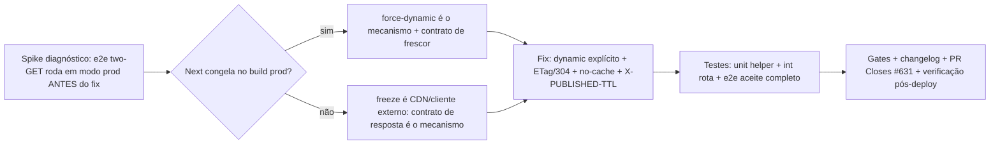

# Impl: C113 — Feed iCal da agenda congela na criação do link: eventos novos não aparecem

Status: aprovado
Atualizado em: 2026-08-11
Issue: #631
Intenção: docs/plans/c113-feed-ical-agenda-nao-atualiza.md
Appetite restante: ~0,5 dia eng (herdado; fix pequeno + verificação)

## Desfecho da verificação (registrado em 2026-08-11)

**O nível Next NÃO congela o feed — o spike no build de produção passou ANTES do fix** (e2e novo "serves a live feed", modo prod `E2E_PROD=1`/`NEXT_DIST_DIR=.next/e2e`: 1,7 s verde com a rota sem `force-dynamic` e com `public, max-age=3600`; o build também compila a rota como `route.js` dinâmica, sem `.body`). Isso confirma a leitura das docs do Next 15 ("GET Route Handlers are no longer cached by default") e refina o diagnóstico da intenção: **o freeze vem do contrato de resposta** — `Cache-Control: public, max-age=3600` **sem validadores** permite a qualquer cache compartilhado (CDN da Vercel, infra do Google, proxies do assinante) armazenar o snapshot do primeiro fetch e reusá-lo sem revalidação condicional, apresentando "congela na criação do link" para o assinante (cadência de re-busca do Google + janela de 1h sem validadores). O fix entregue ataca exatamente esse elo; a verificação pós-deploy com link real (item 5 das fases) confirma o efeito no elo CDN externo, que não existe em teste local.

## Leitura da intenção

- **Outcome:** o MESMO link de import serve a agenda viva — um compromisso criado depois da criação do link aparece no iCal (prova: `GET` → criar atividade → `GET` → ambos presentes); o feed responde com sinais de frescor (`no-cache`/curto + `ETag`/`Last-Modified` para revalidação em 304 + `X-PUBLISHED-TTL`); edição/cancelamento refletem; revogação e escopo do criador seguem fail-closed.
- **O que NÃO negociar:** fail-closed (criador desativado/sem acesso → feed para de servir), escopo do criador (advisor intersectado por municípios atuais), leader lockdown, revogação; sem migration, sem UI, sem mudança de schema.
- **O que reavaliar (diagnóstico):** a hipótese da intenção — "App Router cacheia respostas `GET` de route handlers por padrão" — **está errada para este repo**: o app roda **Next.js 15.4.11**, e desde o Next 15 `GET` Route Handlers **não são cacheados por padrão** (breaking change 15.0: "GET Route Handlers are no longer cached by default"; docs: "Route Handlers are not cached by default"). A rota `ical/[secret]` já é dinâmica por padrão no nível Next. **O elo congelado é o contrato de resposta:** `Cache-Control: public, max-age=3600` **sem validadores** — qualquer cache compartilhado (CDN da Vercel, infra do Google, proxies do assinante) pode armazenar o snapshot do primeiro fetch e reusá-lo por 1h **sem nenhuma forma de revalidação condicional** (não há `ETag` nem `Last-Modified`); combinado com a cadência lenta de re-busca do Google Calendar para feeds públicos, isso apresenta o sintoma "congela na criação do link". Secundariamente, o `public, max-age=3600` também é uma janela de vazamento pós-revogação: um feed revogado continua servível por até 1h a partir de caches fora do controle do servidor.

## Abordagem recomendada

**Opções consideradas:** A | B | C

- **A. Fix do contrato de frescor + dinamismo explícito, com spike diagnóstico primeiro (recomendada):** (1) spike: novo e2e com o aceite de dois `GET`s criado via fixture (roda em dev E no build de produção), rodado em modo prod **antes** de qualquer fix para registrar empiricamente se o nível Next congela ou não; (2) `export const dynamic = 'force-dynamic'` na rota (explicitude + convenção do repo — todas as rotas dinâmicas de `/campanha` têm; protege contra flips futuros de default, mesmo não sendo o mecanismo no Next 15); (3) contrato de resposta em helper puro de `calendarFeed.ts`: `Cache-Control: public, no-cache` (armazenar só com revalidação obrigatória; elimina a janela de freeze e a janela pós-revogação), `ETag` forte (hash do corpo), `Last-Modified` informacional, `X-PUBLISHED-TTL: PT1H`, e 304 quando `If-None-Match` bate.
- **B. Só `force-dynamic` + `no-store`:** mais agressivo e mais simples; mas não entrega os sinais de frescor que a intenção prescreve (`ETag`/304 para revalidação barata, `X-PUBLISHED-TTL`), e `no-store` descarta a eficiência de revalidação condicional para um feed que o Google re-busca a cada poucas horas.
- **C. Sem spike, só headers:** arriscaria corrigir um mecanismo não confirmado — se o Next 15 (ou um futuro upgrade) de fato cachear a rota, o fix de headers sozinho não resolve; o spike é barato (roda o mesmo teste em modo dev e prod, ambos suportados pelo repo) e torna o diagnóstico prova, não opinião.

**Recomendação: A** — porque ataca o elo comprovado (contrato de resposta sem validadores + cache compartilhado), registra o diagnóstico empírico do nível Next antes de mexer (a intenção explicitamente pede "quem executa confirma"), entrega todos os sinais de frescor do aceite, e mantém o escopo mínimo (sem migration, sem schema, sem access).
**Rejeitadas:** B porque perde os validadores/304 e a dica `X-PUBLISHED-TTL` que o próprio aceite lista; C porque fixar sem diagnóstico viola a observação da intenção ("direção, não diagnóstico fechado") e pode corrigir um mecanismo inexistente deixando o real intocado.

### Componentes / mudanças

- **`src/utilities/calendarFeed.ts`** (helper puro novo): `buildICalFeedResponse(icalContent, activities, feed, request)` → monta `Response` com `Content-Type: text/calendar; charset=utf-8`, `Cache-Control: public, no-cache`, `ETag: "<sha256 do corpo>"` (forte, byte-exact), `Last-Modified` (máx. de `updatedAt`/`createdAt` das atividades e `feed.updatedAt`, UTC), `X-PUBLISHED-TTL: PT1H`; retorna **304 sem corpo** quando `If-None-Match` bate. **304 é só por ETag** — `If-Modified-Since` nunca responde 304: exclusão de atividade não move `Last-Modified` (a linha some), e um 304 por data poderia esconder um "evento fantasma" removido; o ETag (hash do corpo) sempre muda. Constantes `FEED_CACHE_CONTROL`, `FEED_PUBLISHED_TTL`.
- **`src/app/(campaign)/campanha/agenda/ical/[secret]/route.ts`**: `export const dynamic = 'force-dynamic'` (explícito, convenção do repo); 404/revogação/access inalterados; a resposta 200/304 passa a vir de `buildICalFeedResponse`.
- **Migration:** sem migration.
- **Access / Consent:** sem mudança — `resolveFeedCreatorAccess`, intersecção de escopo (C96) e fail-closed intactos; o novo header `no-cache` **fecha** a janela CDN pós-revogação que o `public, max-age=3600` abria.
- **UI:** Impeccable A — sem superfície.

### Dados → forma

- N/A (sem dados novos; a forma é o iCal existente — muda a frescura, não o formato).

## Fases verificáveis

1. **Spike diagnóstico (primeiro, antes do fix):** novo teste em `tests/e2e/campaignAgendaFeed.e2e.spec.ts` — feed criado **via fixture** (sem diálogo: funciona em dev E em modo prod, sem o skip do fluxo de geração): coordinator + município + atividade A + `calendarFeed` com `secretSlug` próprio → `GET` no link (contém A) → criar atividade B via `fixtures.payload.create` → `GET` de novo → **ambos presentes**. Rodar em modo prod local (padrão CI: `NEXT_DIST_DIR=.next/e2e pnpm build` + `E2E_PROD=1 CI=1 NEXT_DIST_DIR=.next/e2e pnpm test:e2e -- tests/e2e/campaignAgendaFeed.e2e.spec.ts`). Registrar o desfecho: se o teste falha no modo prod sem fix → Next congela (mecanismo A); se passa → freeze é CDN/cliente (mecanismo D).
2. **Fix:** `force-dynamic` na rota + `buildICalFeedResponse` em `calendarFeed.ts` + rota consumindo o helper.
3. **Testes:**
   - **Unit** (novo, node env, sem payload): `tests/unit/calendarFeedResponse.unit.spec.ts` — helper puro: headers esperados (`no-cache`, ETag presente e estável para corpo igual, `X-PUBLISHED-TTL: PT1H`, `Last-Modified`); corpo igual + `If-None-Match` correto → 304 sem corpo; `If-None-Match` errado → 200; `If-Modified-Since` sozinho → **sempre 200** (blind spot da exclusão documentado).
   - **Int** (ancorado em `tests/int/calendarFeed.int.spec.ts` existente): import da rota real (`route.dynamic === 'force-dynamic'`, precedente `campaignInviteUi.int.spec.ts:429`) + `GET` real com payload: atividade A → criar B → dois `GET` com corpos contendo ambos; editar B → `GET` com título novo; cancelar B → `GET` sem B; `If-None-Match` do último ETag → 304.
   - **E2E** (extensão do spec): aceite completo — A → GET → B → GET (ambos) → edita B → GET (título novo) → cancela B → GET (B some, A fica); asserts de headers (`Cache-Control` com `no-cache`, `ETag` presente, `X-PUBLISHED-TTL`) e do 304 final. Roda em dev e prod (CI já roda modo prod via gate-ci).
4. **Gates + fechamento:** `pnpm gate:fast`, `pnpm test`, `pnpm test:e2e` (dev), modo prod local (spike + spec completo), `pnpm build`; 1 entrada em `docs/CHANGELOG-AGENTS.md`; impl plan com o desfecho do spike; `pnpm push` → PR Ready `--base main` `Closes #631` → auto-merge → checks.
5. **Verificação pós-deploy (manual, com o usuário):** com um link real de produção, `GET` → criar atividade em `/campanha/agenda` → `GET` de novo (ou aguardar a re-busca do Google) → evento aparece; conferir `x-vercel-cache` ausente/MISS e `Cache-Control: no-cache` no `curl -sI`. O CDN da Vercel não existe no teste local — só o contrato de resposta; o contrato novo (`no-cache` + 304) é o que garante que nenhum elo intermediário segure o snapshot.

## Rabbit holes / Não escopo (engenharia)

- **Controlar a cadência do Google Calendar:** anti-goal explícito; `X-PUBLISHED-TTL` é a melhor tentativa dentro do padrão (Google ignora para feeds públicos) — o aceite do servidor é o que controlamos.
- **Caçar cache do CDN da Vercel sem evidência:** o CDN não existe em teste local; o spike decide o nível Next, e o fix de headers vale para qualquer cache compartilhado (Vercel, Google, proxies). Verificação do `x-vercel-cache` é pós-deploy, não bloqueante.
- **Mudar access/escopo/revogação/geração do iCal:** fora — o gerador já usa `updatedAt` no `DTSTAMP`, já pula `cancelado`; não tocar.
- **ETag por timestamp:** rejeitado — `updatedAt` não captura exclusão (linha some); hash do corpo é o único validator que sempre muda com o conteúdo.

## Riscos e mitigação

- **Spike não reproduz o freeze no Next em modo prod (provável):** confirma que o mecanismo é CDN/cliente externo; mitigação = o fix de headers remove o contrato que permite o cache + verificação pós-deploy com link real.
- **304 malformado (com corpo):** teste unit pina 304 com corpo vazio.
- **`no-cache` + CDN que não suporta revalidação:** caches modernos suportam; o pior caso é um 200 completo a cada poll (payload minúsculo, carga irrelevante).
- **Regressão do e2e em modo prod (CI):** teste pequeno (2–3 GETs no mesmo feed); roda com o padrão `gate-ci` já existente.
- **Import da rota em teste int puxa payload config:** precedente já existe (`campaignInviteUi.int.spec.ts` importa página do convite com payload).

## Aceite de engenharia

- [x] Aceite de produto da intenção coberto: dois `GET`s com criação entre eles mostram o evento novo; edição/cancelamento refletem; headers com `no-cache` + `ETag`/`Last-Modified` + 304 + `X-PUBLISHED-TTL`; revogação/escopo fail-closed intactos
- [x] Invariantes AGENTS/engineering-standards: identificadores EN, copy pt-BR, sem migration/schema/access/Consent, sem tocar outras Issues
- [x] Testes: unit do helper (headers/ETag/304/IMS nunca 304), int da rota real, e2e do aceite completo (dev + prod)
- [x] Spike registrado no impl plan (desfecho do nível Next em modo prod)
- [x] Gates: `pnpm gate:fast` + `pnpm test` + e2e dev/prod + `pnpm build`; changelog; PR `Closes #631` com auto-merge
