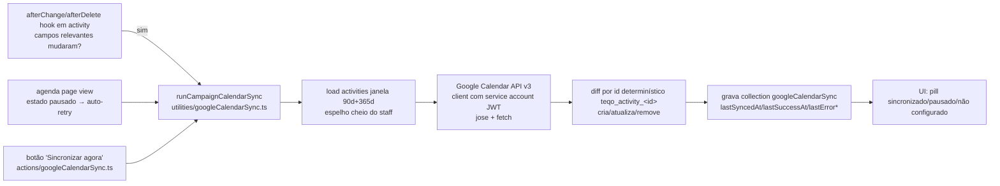

# Impl: C114 — Google Calendar: agenda da campanha espelhada com notificação (push Teqo → Google)

Status: aprovado
Atualizado em: 2026-08-11
Issue: #635
Intenção: docs/plans/c114-google-calendar-push-agenda-oficial.md
Appetite restante: ~2 dias eng (herdado; corte explícito: sem participantes no v1 — ver decisão aberta P1)

## Leitura da intenção

- **Outcome:** com um comando em `/campanha/agenda`, a campanha ativa um calendário Google compartilhado ("Agenda da Campanha"); criar/remarcar/cancelar atividades em Teqo reflete no Google em minutos (push via API oficial); quem segue recebe aviso conforme as próprias configurações; Teqo segue SoT e funciona sem Google (estado do sync visível, re-tenta sem ação manual); leader lockdown intocado.
- **O que NÃO negociar:** direção única Teqo → Google (C115 é o bidirecional); modelo = calendário compartilhado (nunca OAuth por pessoa); Teqo SoT — credencial inválida/API fora não pode quebrar o Teqo; espelho cheio do escopo do staff (recortes continuam no iCal); sem PII desnecessária no evento; líder não vê nem ativa.
- **O que reavaliar:** a "hipótese" aponta `src/utilities/calendarFeed.ts` como precedente — confirmado (janela de eventos, formatação de summary/description, nomes de município reusáveis). O que a intenção NÃO diz e a engenharia precisa decidir: **como disparar o push** (não há cron no Vercel — verificação: `vercel.json` não tem `crons`; Hobby limita cron), **onde viver o estado do sync** e **como mapear atividade→evento sem estado duplicado**.

## Abordagem recomendada

**Opções consideradas:** ver decisões D1–D6 abaixo.
**Recomendação:** push **orientado a evento** (hook no `activity`) com **reconciliação completa por passada** e **id determinístico de evento** — sem cron, sem fila, sem collection join e sem campo novo em `activity`. Configuração e estado do sync numa **collection `googleCalendarSync`** (credencial em env; **auto-resync quando a configuração muda**). UI no padrão do link de import (C94): pill no header desktop + quick action mobile + dialog.

### Decisões de engenharia

**D1 — Transporte para a API do Google.**
Opções: A) `googleapis` + `google-auth-library` (SDK oficial) | B) `jose` (assina JWT RS256) + `fetch` nativo → Calendar API v3 REST | C) JWT com `node:crypto` na mão.
Recomendação: **B** — só precisamos de token (JWT service account) + 4 endpoints REST (`events.list/insert/update/delete`); SDK oficial é ~40MB de máquina para 1 chamada; C reimplementa crypto de JWT (risco de segurança). `jose` é dependência pequena e padrão (Payload usa a mesma família).
Rejeitadas: A (pesado demais para a superfície real); C (implementar JWT à mão viola "nunca implemente crypto").

**D2 — Mapeamento atividade → evento Google.**
Opções: A) collection join `activityCalendarEvent` (activityId→googleEventId) | B) campos `googleEventId`/hash no `activity` | C) **id determinístico** `teqo_activity_<id>` (charset do Google permite alfanumérico + `_`).
Recomendação: **C** — upsert idempotente sem estado persistido por evento: `events.get`/`list` → 404 cria, 200 compara conteúdo e atualiza só se mudou, cancelado/deletado remove. Elimina collection nova, migration de tabela e o loop de re-entrada do hook (escrever campo no doc re-dispara afterChange). "Edit the owner": o dono do evento no Google É a atividade; o id determinístico é só a identidade externa.
Rejeitadas: A (estado duplicado desnecessário; mais uma collection/access para administrar); B (re-entrada do hook — toda escrita de `googleEventId` re-dispara afterChange; precisa guard frágil; e leader update guard já compara snapshots de campos de staff).

**D3 — Motor de sync.**
Opções: A) upsert incremental por evento (só o evento tocado) no hook | B) **reconciliação completa por passada**: lista janela no Google + diff contra atividades do Teqo + cria/atualiza/remove | C) dois caminhos (incremental no hook + reconciliação periódica).
Recomendação: **B** — um único caminho de código (uma superfície de teste), auto-curativo (remove fantasmas de eventos deletados no Teqo, reconstrói evento apagado à mão no Google — Teqo é SoT), e a comparação de conteúdo (summary/description/start/end) faz passadas repetidas convergirem sem tocar no Google quando nada mudou. Custo: 1 chamada `list` por passada (~100ms) — irrelevante na escala (centenas de eventos).
Rejeitadas: A (não limpa fantasmas; edição manual no Google não é corrigida; dois estados de falha distintos); C (dois caminhos para manter/testar sem ganho real).

**D4 — Trigger do push ("em minutos" sem cron).**
Opções: A) cron Vercel (`vercel.json` crons) | B) **hook afterChange/afterDelete em `activity` (campos relevantes) + auto-retry na view da agenda quando pausado + botão "Sincronizar agora"** | C) Google push channels (webhook reverso).
Recomendação: **B** — o hook dá latência de segundos (o aceite pede "minutos"); a view da agenda + o botão cobrem o "re-tenta sem ação manual" (a própria equipe abre a agenda quando opera); escrever em Teqo continua 100% local. Sem cron (Hobby limita a 2/dia), sem fila, sem endpoint público novo.
Rejeitadas: A (limite de Hobby; cadência de horas não entrega o aceite); C (endpoint público + desafios de renovação de channel — infra que este item não precisa).
Nota: corridas convergem — a comparação de conteúdo torna uma segunda passada simultânea um no-op; sem advisory lock distribuído para estado cosmético (o `pg_advisory_xact_lock` existente é transacional e soltaria no commit, inútil para chamadas HTTP pós-commit).

**D5 — Configuração e estado do sync (collection, não global).**
Opções: A) **collection `googleCalendarSync`** (uma linha de fato; precedente de infra `supporterImportBatch`/`calendarFeed`) | B) global `googleCalendarSync` (precedente `campaignGoals`) | C) tudo em env.
Recomendação: **A** — pedido do gate e casa com o precedente de recurso de sync com credencial revogável (`calendarFeed`); o `afterChange` da própria collection dispara o **auto-resync** quando a configuração muda (D7); access por collection explícito (read staff, update staff campo a campo: `calendarId` admin-only, `disabledAt` staff, estado system-write/staff-read). Singleton de fato garantido pelo fluxo (engine faz find/create na primeira ativação) — sem unicidade DB (a linha é única por construção da ação de ativação).
Rejeitadas: B (auto-resync também funcionaria num global, mas o precedente de recurso de sync é collection e o access fica mais legível; `campaignGoals` é configuração pura sem estado rastreado); C (calendarId em env exigiria redeploy para rotacionar; sem rastreabilidade de `lastError` na UI).

**D6 — Credencial.**
Opções: A) **chave privada da service account em env** (`GOOGLE_CALENDAR_SERVICE_ACCOUNT_KEY`, base64 do JSON do GCP) + `calendarId` na collection (admin-set) | B) JSON inteiro da service account na collection (campo admin) | C) OAuth por pessoa.
Recomendação: **A** — segredo em env (precedente `REVALIDATE_SECRET`/Blob), identidade operacional (calendarId) na collection: staff desativa/reativa sem tocar em env; admin ajusta calendarId sem redeploy; key nunca vaza em log/DB. O runbook de ops (criar calendário na conta da campanha, compartilhar "público no link", dar permissão de escrita à service account, pôr calendarId) é o caminho da questão aberta de produto Q1 (dono da conta).
Rejeitadas: B (segredo em DB — precedente do repo é env; revogação via env é mais segura); C (anti-goal explícito da intenção).

**D7 — Auto-resync ao mudar a configuração.**
Opções: A) **afterChange na collection `googleCalendarSync`**: quando `calendarId` (ou `disabledAt`) mudou de fato (comparação `originalDoc` vs `doc`), dispara `runCampaignCalendarSync` — reconciliação completa contra o novo calendário | B) só manual ("Sincronizar agora" / view da agenda) | C) migração completa entre calendários (deletar no antigo + criar no novo).
Recomendação: **A** — o id determinístico + diff por conteúdo tornam a passada idempotente: trocar o `calendarId` recria o espelho inteiro no novo calendário na hora, sem ação manual. Guard de re-entrada: as escritas de estado (`lastSyncedAt`/`lastSuccessAt`/`lastError*`) não alteram `calendarId`/`disabledAt`, então não re-disparam o afterChange. O calendário antigo fica com o último espelho congelado (sem limpeza retroativa — documentado no runbook).
Rejeitadas: B (o aceite "re-tenta sem ação manual" se estende à reconfiguração); C (varrer e deletar N eventos de um calendário que a campanha abandonou é valor marginal — o calendarId troca só em migração de conta).

### Componentes / mudanças

- **`src/lib/googleCalendarEventMapping.ts`** (novo, puro, unit-testável): `googleEventIdForActivity` (`teqo_activity_<id>`), `buildGoogleEventPayload(activity, municipalityName)` (summary `[Município] Título`; description sem PII — Município/Local/Tags/Deputado presente, mesmo espírito do iCal; `start`/`end` timed com offset America/Bahia −03:00 ou `date` all-day via `allDayCivilDateOf`/`allDayExclusiveEndDate` de `src/lib/activityAllDay.ts`; **end ausente → start + 1h** — pendente de verificação no doc oficial da API), `googleEventContentEquals(remote, payload)`.
- **`src/utilities/googleCalendarClient.ts`** (novo, `server-only`): JWT service account com `jose` (`SignJWT` RS256, scope `https://www.googleapis.com/auth/calendar`, aud `https://oauth2.googleapis.com/token`), POST token (cache em módulo, invalida em 401 e re-tenta uma vez), `listEvents` (paginação), `insertEvent`, `updateEvent`, `deleteEvent`; erros tipados (`GoogleCalendarApiError`) sem credencial em log.
- **`src/utilities/googleCalendarSync.ts`** (novo, `server-only`): `readGoogleSyncConfig`, `deriveGoogleSyncStatus` (matriz pura `not-configured | disabled | synced | paused` — key presente? calendarId? disabledAt? lastErrorAt > lastSuccessAt?), `runCampaignCalendarSync(payload, client)` — reconciliação completa (carrega atividades da janela 90d passado/365d futuro com `overrideAccess` — espelho cheio do staff, sem intersecção de escopo de advisor: é a agenda oficial da campanha; reusa o padrão de `loadFeedActivities`/`loadMunicipalityNames` de `calendarFeed.ts`), grava `lastSyncedAt` + `lastSuccessAt` ou `lastErrorAt`/`lastError`.
- **`src/collections/GoogleCalendarSync.ts`** (novo): slug `googleCalendarSync`, group `Campanha` (precedente de infra `supporterImportBatch`); campos `calendarId` (admin-write), `disabledAt` (staff-settable via action), `lastSyncedAt`/`lastSuccessAt`/`lastErrorAt`/`lastError` (system-write, staff-read para a pill); access: read staff, update staff campo a campo (field access); **afterChange com auto-resync (D7)**: `calendarId`/`disabledAt` mudaram de fato → dispara `runCampaignCalendarSync`; escritas de estado não re-disparam (guard por comparação de campo).
- **`src/collections/Activity.ts`** (editar): afterChange ganha `syncActivityToGoogleCalendar` (dynamic import — mesmo padrão do `notifyActivityNeedsAttention`; guard: só dispara quando campos relevantes mudaram — `title, status, startAt, endAt, allDay, locality, municipality, tags, deputyPresent, description` — compara `originalDoc` vs `doc`, tarefas não disparam; try/catch **nunca lança** — Teqo nunca depende do Google) e afterDelete idem (reconciliação remove o fantasma).
- **Server actions `src/app/(campaign)/campanha/actions/googleCalendarSync.ts`** (novo): `getGoogleCalendarSyncState` (status + link público quando configurado), `runGoogleCalendarSyncNow` (retry manual/automático, retorna estado fresco), `setGoogleCalendarSyncDisabled` (toggle staff); padrão `getCampaignActionContext` + `reloadStaffActor` de `actions/calendarFeed.ts`; líder nunca chega (layout `(app)` + gate staff da página).
- **`src/lib/googleCalendarLink.ts`** (novo, puro): link público de adição `https://calendar.google.com/calendar/r?cid=<encodeURIComponent(calendarId)>` + URL iCal pública `webcal://calendar.google.com/calendar/ical/<id>/public/basic.ics` (Apple/Outlook) — formato a verificar no doc oficial no impl.
- **UI** (Impeccable B — shape→craft→critique→polish; reusa shell `Dialog`/`Drawer`/`useIsMobile`/`SetCampaignHeaderAction`/`useCampaignQuickActionContext` de C94): `AgendaGoogleSyncChrome.tsx` (pill no header desktop junto do link de import + quick action mobile; recebe estado inicial do servidor; auto-retry quando `paused` e atualiza via action + `revalidatePath`) e `GoogleCalendarSyncDialog.tsx` (estados do canvas: não configurado → instruções de ops; sincronizado → link + copiar + instruções + "Sincronizar agora" + "Desativar"; pausado → último erro + re-tentar; desativado → reativar). Copy pt-BR conforme canvas.
- **`src/app/(campaign)/campanha/(app)/agenda/page.tsx`** (editar): carrega estado do sync (staff) e monta `<AgendaGoogleSyncChrome>` ao lado do `AgendaFeedChrome` (ordem do cluster C95: [Semana][Link de import][Google][Notificações][IA] — verificar colisão de `id` dos `SetCampaignHeaderAction`).
- **`.env.example`** (editar): `GOOGLE_CALENDAR_SERVICE_ACCOUNT_KEY` documentada.
- **Migration:** `migrate:create add_google_calendar_sync` (tabela da collection nova — D5; sem collection join — D2).
- **Access / Consent:** sem chave de Consent (dados internos da campanha, precedente `calendarFeed`); sem PII nova — emails de campanha não vão para o Google no v1 (corte de participantes). Fail-closed: sem env key o sync não dispara (estado `not-configured`), o hook é no-op.
- **Docs:** entrada única em `docs/CHANGELOG-AGENTS.md`; runbook de ops (criação do calendário na conta da campanha + compartilhamento + permissão da service account + envs) — na AGENTS.md ou no plano? Decisão barata: na entrada do CHANGELOG + nota no impl.

### Dados → forma (se aplicável)

N/A — não há apresentação de dados no Teqo (o evento é do Google Calendar; decisão de apresentação do Google). Único dado novo visível: a pill de estado do sync (derivada, matriz unit-testada).

## Fases verificáveis

1. **Tracer / schema+server** (dia 1): `pnpm add jose`; collection `googleCalendarSync` + migration + `generate:types` + `generate:importmap`; `googleCalendarEventMapping` + unit tests; `googleCalendarClient`; `googleCalendarSync` + int tests com stub in-memory do cliente (incl. **auto-resync ao trocar `calendarId`** e guard de re-entrada do afterChange); hook no `activity` + guard; actions; `migrate` local + `migrate:status`.
2. **UI** (dia 1–2): chrome + dialog + wiring na página; e2e do estado `not-configured` (sem env no teste → determinístico, sem dependência externa) + diálogo; Impeccable shape→craft.
3. **Gates** (dia 2): `pnpm gate:fast`; `pnpm format:check`; `pnpm exec knip`; `pnpm check:cycles`; `pnpm test` (unit+int); `pnpm test:e2e`; `pnpm build`; Aikido nos arquivos novos; `pnpm push` com CI green.

## Rabbit holes / Não escopo (engenharia)

- **Watch channels do Google (push reverso para nós)** — exige webhook público e renovação; o hook do Teqo já dá latência de segundos.
- **Fila/worker/cron próprio** — Hobby; hook + lazy retry cobre o aceite.
- **Um calendário por filtro/recorte** — iCal cobre (intenção).
- **Participantes/attendees (aviso garantido ao núcleo)** — corte v1: quem segue recebe conforme as configs do próprio Google (é o que o pedido assume); reabre como follow-up se a mesa quiser (decisão aberta P1).
- **Sincronizar histórico completo** — janela 90d+365d (precedente do feed).
- **Migrar eventos antigos para o Google** — fora de escopo.
- **OAuth por pessoa** — anti-goal da intenção.
- **Lock distribuído para a passada** — corridas convergem por comparação de conteúdo; D3.

## Riscos e mitigação

- **Semântica da API Google desconhecida** (charset do id de evento, `end` obrigatório para timed, formato do link `cid`): verificar no doc oficial durante o impl (source-driven-development); os int tests com stub travam NOSSO contrato de mapeamento, não o do Google.
- **E2E com dependência externa (Google real)** — flakiness em CI: e2e só cobre `not-configured` (env ausente); motor testado em int com stub.
- **Latência no hook** — guard de campos relevantes (tarefa não sincroniza), try/catch total, escrita nunca bloqueada.
- **Segredo vazando em log** — key só em env; client tipa erros sem corpo da credencial; Aikido nos arquivos novos.
- **Env ausente em produção (C98 lesson)** — a pill mostra `não configurado` com runbook em vez de quebrar; `NEXT_PUBLIC_SITE_URL` já é conhecida; sem env nova obrigatória para o app funcionar (sync desligado é estado válido).
- **Re-escrita de edição manual feita no Google** — direção intencional (Teqo SoT); documentar no runbook.

## Aceite de engenharia

- [ ] Aceite de produto da intenção coberto: push em minutos via hook; estado visível; re-tenta sem ação manual (view + botão + próximas escritas); Teqo funciona sem Google; leader lockdown intocado (gate staff da página + sem superfície para líder).
- [ ] Reconfiguração auto-sincronizada: mudar `calendarId`/`disabledAt` dispara reconciliação contra o novo calendário sem ação manual (D7), com guard de re-entrada do afterChange.
- [ ] Invariantes AGENTS/engineering-standards: identificadores em inglês, copy pt-BR; server actions com `getCampaignActionContext`; sem PII nova; segredo em env; sem migration retroativa.
- [ ] Testes de domínio previstos: unit (mapping, derivação de status, link), int (engine com stub: cria/atualiza só quando muda/cancela remove/fantasma limpo/falha→pausado→recupera/auto-resync de config; guard do hook), e2e (pill não-configurado + diálogo).
- [ ] Self-score decision-quality: 5/5 (decisões caras com rejeitadas; cabe no appetite; rabbit holes nomeados; depth check reusa `calendarFeed.ts`/`activityAllDay.ts`/shells C94; intenção preservada).

## Decisões em aberto (produto — para o gate humano)

- **P1 — Participantes (núcleo) no v1?** Recomendação: **não** (quem segue recebe conforme as próprias configs; é o que o pedido assume; evita e-mail PII da campanha no Google e spam de convite a cada remarcação). Reabre como follow-up.
- **Q1 — Dono da conta do calendário:** assumido A (conta Google da campanha; service account só escreve). Requer do humano: confirmação de que existe a conta e o `calendarId` (ops).
- **Q2 — Visibilidade:** assumido A (público no link — a equipe é mista Google+Apple; conteúdo já é a agenda oficial sem PII).

## Referências

- Intenção: `docs/plans/c114-google-calendar-push-agenda-oficial.md` (gate de produto)
- Canvas: `plan-c114-ui-draft.canvas.tsx` (4 estados da jornada + pill)
- Precedentes: `src/utilities/calendarFeed.ts`, `src/collections/CalendarFeed.ts`, `src/app/(campaign)/campanha/actions/calendarFeed.ts`, `src/components/campaign/activity/CalendarFeedDialog.tsx` + `AgendaFeedChrome.tsx` (C94), `src/collections/Activity.ts` (hooks), `src/collections/SupporterImportBatch.ts` (infra admin-hidden), `src/lib/activityAllDay.ts`, `src/utilities/postgresTransactionLocks.ts` (lido; decidido não usar)
- Testes existentes: `tests/e2e/campaignAgendaFeed.e2e.spec.ts`, `tests/unit/calendarFeed.unit.spec.ts`, `tests/int/calendarFeed.int.spec.ts`
