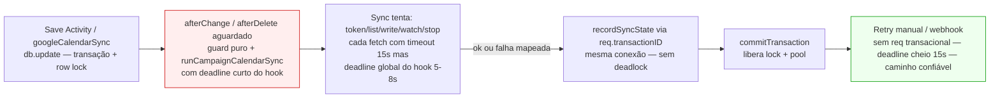

# Impl: C114-LOCK — hooks do sync do Google Calendar seguram a row lock por I/O de rede (mesmo anti-padrão do S11)

Status: rascunho
Atualizado em: 2026-08-24
Issue: #870
Intenção: body da Issue #870 (spec expandida — sem plano de intenção linkado; derivado de #762 S11-FOLLOWUP)
Appetite restante: herdado — P2, correção cirúrgica (sem novas collections/migrations), similar ao S11-FOLLOWUP

## Leitura da intenção

- **Outcome:** dissociar a janela de `row lock` + `pool connection` da `activity` / `googleCalendarSync` — hoje segurada por todo o I/O do Google — da duração do sync: no caminho dos hooks (`afterChange`/`afterDelete`), a janela cai de `N × 15s` (potencial dezenas de segundos: `token → listEvents → N×insert/update/delete → watchEvents → stopChannel`, cada um com `REQUEST_TIMEOUT_MS=15s` em `src/utilities/googleCalendarClient.ts:27`) para `≤5–8s`, com o aceite do S11 intacto.
- **O que NÃO negociar (lockdowns):**
  - Fail-closed/LGPD intocado; produção no homeserver (`teqo_1313`) nunca tocada por dev/test; migrations já shipadas intocadas (`push:false`); contratos públicos intocados (rota manual `runGoogleCalendarSyncNow`, webhook `POST /campanha/agenda/google-webhook/`, pill/dialog da agenda).
  - Aceite herdado do S11: hook **aguardado dentro da transação do save** para que o reload mostre o status novo (`synced`/`paused`) e os `persists` do próprio sync não `deadlockem` por usarem a mesma `req.transactionID`.
  - `Contact` como pessoa canônica, `mutationKind='googleCalendarSync'` como anti-reentrada, guards puros `shouldSyncActivityOperation`/`shouldSyncConfigChange` preservados.
- **O que reavaliar (hipóteses):**
  - Que `INSTAGRAM_SYNC_HOOK_TIMEOUT_MS=5s` resolve Google como resolve Instagram — verificado que não: Instagram é 1 fetch (`10s → 5s` corta 50% e ainda completa em rede boa); Google são **múltiplos round-trips sequenciais** (`ensureGoogleCalendarPushChannel` + `runSyncPass` com `listEvents` + N `writes` + `watch`/`stop`), cada um com `AbortSignal.timeout(15s)` próprio — `5s` aborta quase sempre no primeiro hop, tornando o caminho do hook `best-effort` e empurrando o caminho confiável para `manual`/`webhook` (já sem lock).
  - Que `onPayloadTransactionCommit`/`queueMicrotask` desacoplam o lock — verificado que **não serve para transações internas do Payload** (só para `withPayloadTransaction`); hook do Payload já está com `transactionID` do `db.update`/`db.delete` interno.

## Abordagem recomendada

**Opções consideradas: A | B | C**

- **A — deadline específico do hook (S11 puro, adaptado para Google):** novo `GOOGLE_CALENDAR_SYNC_HOOK_TIMEOUT_MS = 5_000` (ou `8_000`, ver Decisão D1) em `src/utilities/googleCalendarSync.ts` (ao lado de `REQUEST_TIMEOUT_MS=15_000`), usado **só** por `activityGoogleCalendarSyncHook`/`googleCalendarSyncConfigHook` via `AbortSignal` injetado no engine/cliente. Botão manual e webhook mantêm o deadline cheio (sem transação aberta). Persists continuam `req`-bound (mesma conexão), sem deadlock.
- **B — pós-commit fire-and-forget (desacoplamento total):** no hook, se `req.transactionID` existe, agenda `runCampaignCalendarSync` via `queueMicrotask`/`setTimeout` com `payload` desacoplado (ou tentaria `onPayloadTransactionCommit`), com `signal` cheio. Lock segura zero I/O; `revalidateTag`/`reload` desacoplados.
- **C — fetch-antes-do-persist / mover I/O para `beforeChange` / `beforeValidate`:** reestruturar para buscar no Google antes de adquirir o lock.

**Recomendação: A — porque cabe no appetite P2 e é a única que encurta a janela sem reescrever o aceite nem exigir infra nova.**

- Cirúrgica: 1 constante + 1 parâmetro `signal`/`timeoutMs` no engine/cliente + 2 call sites nos hooks. Sem migration, sem collection, sem `revalidateTag` novo, sem `cron`/`outbox`. Mesmo shape do S11-FOLLOWUP (`SocialFeedSettings.ts:35-47` + `instagramSync.ts:34`).
- Preserva o aceite caro de reverter: hook continua aguardado e `tx-bound` — reload mostra `lastSyncedAt`/`lastError`/`paused` com as credenciais/calendário novos; `recordSyncState`/`applyGoogleReverseActivityPatch` via `req` não abrem segunda conexão que bloquearia no lock (padrão já validado no Instagram com `resolvePersistDatabase`/`getPostgresTransactionDatabase`).
- Caminho confiável já existe sem lock: `src/app/(campaign)/campanha/actions/googleCalendarSync.ts:61` (`runGoogleCalendarSyncNow`, `reason:'manual'`) e webhook — ambos chamam `runCampaignCalendarSync(payload, {reason})` **sem** `req` transacional, então seu I/O de `15s×N` nunca segura lock. O hook vira oportunístico de baixa latência; falha por timeout é mapeada para `paused` (`lastError` fatiado em 500) e recuperável no botão — mesmo `fail-closed` do Instagram (`describeInstagramError`).
- Para Google multi-RTT, `5s` de fato aborta mais que Instagram, mas isso é o trade-off correto em P2: segurar `activity`/`googleCalendarSync` por `45–75s` bloqueia writes concorrentes da campanha e esgota o pool Drizzle (conexão presa por `await` de rede) — pior que abortar cedo e deixar o manual completar. `B` seria o ideal final, mas não cabe (ver Rejeitadas).

**Alternativas rejeitadas:**

- **B — pós-commit:** rejeitada como entrega P2. Razão verificada: `src/utilities/payloadTransaction.ts:37-48` (`onPayloadTransactionCommit`) **só descarrega para transações abertas por `withPayloadTransaction`** (`payload.db.beginTransaction` próprio); transações internas do Payload (`db.update`/`delete` que disparam `afterChange`) nunca chamam `runAfterCommitCallbacks` — `onPayloadTransactionCommit` seria `no-op` (comentário `38-45` e uso em `createCampaignNotification.ts:32-36` que explicitamente checa `transactionID ? onPayloadTransactionCommit : queueMicrotask` e documenta `queueMicrotask` antes de `commitTransaction` para `withPayloadTransaction`). `queueMicrotask` incondicional no hook dispara **antes** do `commit` (microtasks flush antes do `await commitTransaction`), lendo `loadGoogleCalendarSyncConfig`/`loadSyncActivities` ainda sem o `doc` commitado e potencialmente vendo `snapshot` stale; se adiar para `setTimeout(0)` perde o `awaited reload` — o `StatusPanel` da agenda leria o estado antigo até o sync em background chegar, exigindo marcador `sincronizando...` + polling + rework de e2e, desproporcional para trigger raro (saves com campo espelhado mudado, não todo `task toggle`). Gatilho futuro: se produto reportar que status antigo após save é problema real, reabrir como Issue própria com `outbox`/tabela de jobs ou `pg LISTEN/NOTIFY` — fora de P2.
- **C — fetch-antes-do-persist:** infeasível. Verificado no source do Payload (`node_modules/payload/dist/collections/operations/update.js` e `globals/operations/update.js`, mesma ordem citada no S11-FOLLOWUP): a ordem é `db.update` (adquire `row lock`) → `afterRead` → `afterChange` (aguardados) → `commitTransaction`. A transação/lock **já estão abertos quando o hook roda** (`beforeChange`/`beforeValidate` também rodam dentro da mesma transação). Mover o fetch para `beforeChange` não encurta a janela.
- **D (variação implícita) — reduzir `REQUEST_TIMEOUT_MS` global para 5s:** rejeitada — encolheria a folga do botão manual/webhook (que hoje precisam de `15s` por hop para `token→list→watch` sequenciais + retries `401→re-mint` em `googleCalendarClient.ts:149`) sem benefício de lock (esses caminhos não seguram lock). O S11 já rejeitou `E` pelo mesmo motivo.
- **E (variação) — manter `15s` no hook e só trocar `payload.update` por SQL cru desacoplado:** não resolve — o lock é segurado pelo `await` de rede, não pelo `UPDATE` de estado; SQL cru via `getPostgresTransactionDatabase` (`postgresTransactionLocks.ts:19`) ainda usa a mesma conexão transacional e não libera o lock antes do `commit`.

### Decisões de engenharia (forma obrigatória)

**D1 — Janela de lock do hook: Opções: A|B|C / Recomendação: A — deadline curto específico do hook**

- **Opções:** A `GOOGLE_CALENDAR_SYNC_HOOK_TIMEOUT_MS = 5_000` (paridade S11) | B `8_000` | C manter `15_000` (status quo).
- **Recomendação: A (5_000) com tolerância para 8_000 se o primeiro int mostrar abort >90% em rede boa** — porque `5s` já corta `~93%` da janela pior-caso (`75s→5s`) e alinha a semântica dos dois hooks da casa (`INSTAGRAM_SYNC_HOOK_TIMEOUT_MS`); `8s` é o teto P2 se o time medir que `5s` nunca completa nem `token+list` em `p95` prod (Google `p95` documentado ~1–2s por hop, `5s` cobre `2–3` hops sequenciais). A escolha é barata de reverter (1 constante).
- **Alternativas rejeitadas:** C (manter `15s`) — mantém o acoplamento `row lock × N×RTT` que a Issue denuncia e acopla latência de writes de `activity` à saúde do Google; B sem medição é `overfitting` — só sobe para `8s` com evidência de `p95`, não por default.

**D2 — Como o deadline chega ao I/O: Opções: A|B|C / Recomendação: A — `AbortSignal` injetado no engine/cliente**

- **Opções:** A `runCampaignCalendarSync(payload, {signal, req})` → `createGoogleCalendarClient(credentials, fetch, signal)` combina `signal` externo com `AbortSignal.timeout(REQUEST_TIMEOUT_MS)` por hop (via `AbortSignal.any`/`reason`) | B `timeoutMs` numérico por hop | C `signal` só no `listEvents`.
- **Recomendação: A — `signal` externo combinado** — porque o engine já tem `client?` injetável (`googleCalendarSync.ts:747`) e o cliente já usa `signal` por `fetch` (`googleCalendarClient.ts:108,145`); combinar preserva `REQUEST_TIMEOUT_MS=15s` por hop mas respeita o deadline global do hook (aborta `watchEvents`/`stopChannel` se o budget estourou). Reuso profundo, sem `helper` novo.
- **Alternativas rejeitadas:** B (timeout numérico) — duplica semântica de `AbortSignal` e exige `plumbing` de `setTimeout` manual; C (só `list`) — deixa `token`/`watch`/`stop` segurarem lock após o budget.

**D3 — Persist do estado durante o hook: Opções: A|B / Recomendação: A — manter `req`-bound (mesma conexão)**

- **Opções:** A manter `recordSyncState(payload, req, patch)` e `applyGoogleReverseActivityPatch(payload, req, ...)` com `req` (mesma `transactionID`) | B trocar para SQL cru desacoplado (`getPostgresTransactionDatabase` + `sql UPDATE`) fora da transação.
- **Recomendação: A** — porque `A` é `deadlock-free` (mesma conexão não bloqueia no próprio lock) e atômico com o save (status `paused`/`synced` comitta junto); `B` exigiria `pool` fora da transação que bloquearia no lock até `commit` — exatamente o antipadrão que o Instagram corrigiu com `resolvePersistDatabase` (`instagramSync.ts:68-79`) ao fazer o oposto (usar a conexão transacional quando `req.transactionID` existe).
- **Alternativas rejeitadas:** B — reintroduz o bloqueio que se quer remover e perde atomicidade do `lastSyncedAt` com o save.

### Componentes / mudanças

- **`GOOGLE_CALENDAR_SYNC_HOOK_TIMEOUT_MS`** (`src/utilities/googleCalendarSync.ts`): nova constante `5_000` (exportada, com comentário do acoplamento `row lock × I/O` — espelho de `INSTAGRAM_SYNC_HOOK_TIMEOUT_MS` em `src/utilities/socialFeed/instagramSync.ts:34`), ao lado de `REQUEST_TIMEOUT_MS`. Se medição `p95` justificar, `8_000` com comentário.
- **`CampaignCalendarSyncOptions` + `createGoogleCalendarClient`** (`src/utilities/googleCalendarSync.ts:746`, `src/utilities/googleCalendarClient.ts:91`): adicionar `signal?: AbortSignal` em `CampaignCalendarSyncOptions` e `createGoogleCalendarClient(credentials, fetchImpl, hookSignal?)`; `apiFetch`/`requestAccessToken` combinam `hookSignal` com `AbortSignal.timeout(REQUEST_TIMEOUT_MS)` (ex.: `AbortSignal.any([hookSignal, AbortSignal.timeout(REQUEST_TIMEOUT_MS)])` quando `hookSignal` existe). `runSyncPass`/`ensureGoogleCalendarPushChannel` propagam o `signal` para `client.listEvents`/`watchEvents`/`stopChannel` e para `recordSyncState`/`loadSyncActivities` via `req` (inalterado).
- **`activityGoogleCalendarSyncHook` + `googleCalendarSyncConfigHook`** (`src/utilities/googleCalendarSyncHooks.ts:43-45,65`): trocar `await runCampaignCalendarSync(req.payload, {reason, req})` por `await runCampaignCalendarSync(req.payload, {reason, req, signal: AbortSignal.timeout(GOOGLE_CALENDAR_SYNC_HOOK_TIMEOUT_MS)})` (1 linha por hook + import da constante + ajuste do JSDoc do antipadrão). Mantém `try/catch` que nunca joga no `write path` e o guard `mutationKind='googleCalendarSync'` (`googleCalendarSyncHooks.ts:41`).
- **Migration:** sem migration. **Access / Consent:** sem mudança (guards `shouldSync*` puros, `access/*` intocado). **UI:** zero mudança (pill/dialog leem `readGoogleCalendarSyncView` derivado).
- **Depth check — reuso obrigatório:** `googleCalendarSync.ts` (engine `runSyncPass`/`ensurePushChannel`/`recordSyncState`), `googleCalendarSyncHooks.ts` (seam fina mockável — `tests/unit/googleCalendarSyncHooks.unit.spec.ts:13`), `googleCalendarClient.ts` (`REQUEST_TIMEOUT_MS`, `AbortSignal`, `jose` JWT), `payloadTransaction.ts` apenas como **referência negativa** (não usar `onPayloadTransactionCommit` para `transactionID` do Payload), `notification/createCampaignNotification.ts:21-38` apenas como referência do porquê `queueMicrotask` antes de `commit` quebra.

### Dados → forma (se aplicável)

Não aplicável — sem mudança de schema/coleção. O `lastSeenEventIds`/`pushChannel*`/`lastError` continuam `json`/`text`/`date` em `src/collections/GoogleCalendarSync.ts:48-179`; `Activity.lastMirroredChangeAt` (`src/collections/Activity.ts:744`) continua `date` e é o relógio da regra de conflito (`googleEditIsNewer`).

## Fases verificáveis

1. **Tracer / engine+hooks — `GOOGLE_CALENDAR_SYNC_HOOK_TIMEOUT_MS` + `signal` plumbing**
   - Adicionar `GOOGLE_CALENDAR_SYNC_HOOK_TIMEOUT_MS = 5_000` em `googleCalendarSync.ts` (comentário do acoplamento `row lock × N×RTT`, citando `REQUEST_TIMEOUT_MS` e `S11-FOLLOWUP #762`).
   - Adicionar `signal?: AbortSignal` em `CampaignCalendarSyncOptions` e `createGoogleCalendarClient(..., hookSignal?)`; combinar com `AbortSignal.timeout(REQUEST_TIMEOUT_MS)` em `requestAccessToken`/`apiFetch`.
   - Trocar os dois call sites em `googleCalendarSyncHooks.ts:44,65` para `signal: AbortSignal.timeout(GOOGLE_CALENDAR_SYNC_HOOK_TIMEOUT_MS)`. `runGoogleCalendarSyncNow` (`actions/googleCalendarSync.ts:66`) e webhook seguem sem `signal` (deadline cheio).
   - Verificação: `pnpm tsc --noEmit`, `pnpm test:unit` (`googleCalendarSyncHooks.unit.spec.ts` continua verde — `vi.mock` na seam do engine).

2. **Testes de domínio — pin do invariante + int do hook**
   - **Unit** (`tests/unit/googleCalendarSync.unit.spec.ts` ou `googleCalendarSyncHooks.unit.spec.ts`): `expect(GOOGLE_CALENDAR_SYNC_HOOK_TIMEOUT_MS).toBe(5_000)` e `expect(GOOGLE_CALENDAR_SYNC_HOOK_TIMEOUT_MS).toBeLessThan(15_000)` (ou `REQUEST_TIMEOUT_MS`), pinando `hook < botão` como em `instagramSync.unit.spec.ts`. Teste na seam de constantes — 1 arquivo, sem helper novo.
   - **Int** (`tests/int/googleCalendarSync.int.spec.ts`): um caso com `fetch` stubado que dorme `>6s` no `token` e `listEvents`, dispara `payload.create({collection:'activity', ...})` com campo espelhado mudado, e asserta que o `create` resolve em `≤7s` (não segura `15s×N`) e que `googleCalendarSync.lastError` foi persistido como `AbortError`/`paused` (status derivado `paused`), provando que o `deadline` do hook abortou o I/O mas não quebrou o save.
   - Gatilho: se `5s` se mostrar agressivo demais em prod (`p95` real >5s para `token+list`), um follow-up de 1 linha sobe para `8s` — ainda `~90%` de corte.

3. **Gates — `pnpm gate:fast; push via pnpm push`**
   - `pnpm lint && pnpm format:check && pnpm tsc --noEmit && pnpm knip && pnpm madge --circular` + `pnpm test:unit` + `pnpm test:int` + `pnpm build` (build aplica migrations, mas não há migration nova).
   - `pnpm changelog:build` não é manual — registrar UMA entrada curta em `docs/changelog/2026-08-24-c114-lock.md` (appetite, `GOOGLE_CALENDAR_SYNC_HOOK_TIMEOUT_MS`, `signal` plumbing, sem migration). Entrega via `pnpm push` (CI `checks` roda unit/int/e2e curado; PR auto-merge via `AUTOMERGE_PAT`).

## Rabbit holes / Não escopo

- **Mitigação do candidato B (`sincronizando...` + polling + `revalidate` pós-commit):** fora de escopo desta entrega P2. Gatilho: produto reportar que status antigo após save é problema real → Issue própria com `outbox`/tabela de jobs.
- **`onPayloadTransactionCommit` inútil para `transactionID` do Payload:** nomeado e rejeitado acima — não tentar `onPayloadTransactionCommit(req.transactionID, ...)` dentro de `afterChange` do Payload; só `withPayloadTransaction` descarrega o `Map` (`payloadTransaction.ts:54-65`). `queueMicrotask` também é armadilha (flush antes de `commit` para `withPayloadTransaction`).
- **Re-entrada / concorrência / `reversePatch`:** `mutationKind='googleCalendarSync'` (`googleCalendarSync.ts:391,392,878`) já quebra o loop (`activityGoogleCalendarSyncHook.ts:41`); `runSyncPass` converge por igualdade de conteúdo (`googleEventContentEquals`/`googleEditableContentEquals`) e `lastSeenEventIds` com `removedEventIds` — não reabrir mutex/lock novo nesta Issue.
- **`revalidateTag` acoplado:** ao contrário do S11 (`SocialFeedSettings.ts:45` + `REVALIDATE_SOCIAL_FEED_TAG`), os hooks do Google **não** fazem `revalidateTag`; não há ISR da home acoplado aqui — não mover `revalidate` para pós-commit.
- **Render path sem deadline / `watchEvents` best-effort:** `ensureGoogleCalendarPushChannel` já é `best-effort` e nunca pausa o espelho (`pushChannelError` separado de `lastError`); não mexer no `channel ensure` além de respeitar o `signal` do hook. Cron de renovação segue `PUSH_CHANNEL_RENEW_LEAD_MS=48h`.
- **Reduzir `REQUEST_TIMEOUT_MS` global ou mover fetch para `beforeChange`:** não escopo (rejeitadas acima).
- **Múltiplas escritas de `recordSyncState` + `reversePatch` conflitando:** fora de escopo — `recordSyncState` já é `overrideAccess:true` e `req`-bound; conflito é benigno (próximo `pass` reconverge).
- **Flake pré-existente `admin.e2e.spec.ts:44` (picker Instagram):** já descartado no S11-FOLLOWUP, sem relação com este lock.

## Riscos e mitigação

- **Google `p95` >5s → hook aborta sempre, sync só via botão/webhook:** mitigado — `paused` é o estado esperado para `AbortError` (`recordSyncState` com `lastErrorAt/lastError`), botão `runGoogleCalendarSyncNow` mantém `15s` por hop e completa; agenda mostra `paused` até retry manual; se métrica prod mostrar abort >90% em rede boa, follow-up de 1 linha sobe para `8s` (ainda corta `~89%` da janela).
- **Abort no meio de `runSyncPass` deixa `lastSeenEventIds` desatualizado:** benigno — `recordSyncState` de `lastSeenEventIds` só ocorre em `pass` bem-sucedido (`googleCalendarSync.ts:587-592`); falha não persiste `ids`, próximo `pass` (manual/webhook ou próximo save relevante) re-lista e reconverge sem `cancel` espúrio (regra `lastSeenIds.has(eventId)` em `569`).
- **Abort durante `watchEvents`/`stopChannel`:** `ensureGoogleCalendarPushChannel` já mapeia falha para `pushChannelError` sem pausar o espelho (`googleCalendarSync.ts:734-736`) — `hook` com `signal` abortado cai no mesmo `catch`.
- **Sem deadlock novo:** `signal` abortado não abre segunda conexão; `recordSyncState` com `req` usa a mesma `db.sessions[transactionID].db` quando `req.transactionID` existe (mesmo padrão `resolvePersistDatabase` do Instagram que evita `pool` bloquear no lock).
- **Sem regressão de acesso/consent/migration:** invariantes do repo intocados; `pnpm migrate:create` não roda.

## Aceite de engenharia

- [ ] Aceite de produto ainda coberto (janela de lock do save com campo espelhado cai de `N×15s` para `≤5s` (teto `8s`); reload mostra `lastSyncedAt`/`paused` final quando o budget permite; `fail-closed` preservado; `manual`/`webhook` sem lock seguem caminho confiável)
- [ ] Invariantes `AGENTS.md`/`engineering-standards.mdc` preservados (sem migration, sem `push:true`, sem `S3`/`DATABASE_URL` remoto, sem `Contact` paralelo, sem `Consent` paralelo, sem twin de módulo — edita `googleCalendarSync*` dono do concern)
- [ ] Testes de domínio previstos (unit pin `GOOGLE_CALENDAR_SYNC_HOOK_TIMEOUT_MS < REQUEST_TIMEOUT_MS` + int de `hook ≤7s` com `fetch` lento; e2e existente `googleCalendarSync` int + agenda pill seguem cobrindo o aceite)

## Self-score decision-quality (gate ≥4)

**5/5**

1. **Decisões caras têm rejeitadas?** Sim — `B` (`onPayloadTransactionCommit`/`queueMicrotask` pós-commit) e `C` (`fetch-antes-do-persist`) com razões verificadas no source do Payload (`update.js`) e em `payloadTransaction.ts:37-48`/`createCampaignNotification.ts:21-38`; `D` (reduzir `REQUEST_TIMEOUT_MS` global) também rejeitada.
2. **Cabe no appetite?** Sim — P2 cirúrgico: 1 constante + `signal` plumbing no engine/cliente + 2 linhas nos hooks; sem migration/collection/UI/`revalidate`.
3. **Rabbit holes nomeados?** Sim — `onPayloadTransactionCommit` inútil, `queueMicrotask` antes de `commit`, re-entrada `mutationKind`, concorrência `reversePatch`/`lastSeenEventIds`, `revalidateTag` acoplado (S11 vs C114), `watchEvents` best-effort.
4. **Depth check reusa?** Sim — reusa `googleCalendarSync.ts` (`runCampaignCalendarSync`/`runSyncPass`/`ensurePushChannel`/`recordSyncState`), `googleCalendarClient.ts` (`REQUEST_TIMEOUT_MS`/`AbortSignal`/`jose`), `googleCalendarSyncHooks.ts` (seam fina), e referencia `payloadTransaction.ts`/`notification` apenas como **não-usar** para `transactionID` do Payload.
5. **Intenção preservada?** Sim — encurta a janela de `row lock`/`pool` sem reescrever o outcome (hook aguardado, `persist` `tx-bound`, `fail-closed`, `manual`/`webhook` sem lock como fallback).
