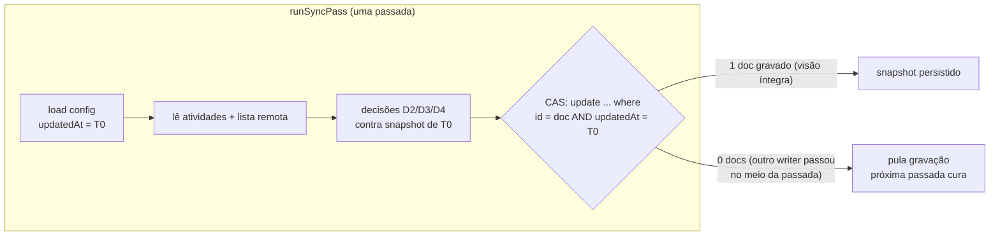

# Impl: C115 follow-up — corrida do snapshot de eventos + hermeticidade da suíte int do motor

Status: executado (2026-08-24)
Atualizado em: 2026-08-24
Issue: #694 (C115-F1)
Intenção: docs/plans/c115-followup-snapshot-race-e-hermeticidade-int.md
Appetite restante: herdado (~0,5–1 dia eng)

## Leitura da intenção

- **Outcome:** duas passadas concorrentes do motor de sync Google Calendar não podem
  fazer o snapshot `lastSeenEventIds` regredir (last-writer-wins hoje) a ponto de uma
  remoção permanente feita pelo usuário ser "ressuscitada" como recriação de evento;
  e a suíte int do motor para de absorver atividades ambiente de specs irmãs na janela
  espelhada (estabilidade ×N sem falhas de contagem).
- **O que NÃO negociar:**
  - Regra D4/C115 intacta: evento previamente visto que sumiu (`lastSeenIds.has(eventId)`
    + atividade `confirmado`) → cancelamento da atividade (`cancelActivityFromGoogle`),
    nunca recriação (`src/utilities/googleCalendarSync.ts:569-584`). O fix só muda QUANDO
    o snapshot é confiável para gravar, jamais a semântica de decisão.
  - `ensureGoogleCalendarPushChannel` lê o MESMO snapshot para o pin de calendarId
    (`googleCalendarSync.ts:678-690`) — essa leitura continua funcionando com estado
    legado e novo, sem mudança de contrato.
  - Motor never-throw: falha de gravação de estado vira degradação silenciosa
    (próxima passada cura), nunca exceção nos gatilhos (hook de atividade
    `src/utilities/googleCalendarSyncHooks.ts:26-44`, webhook
    `src/app/(campaign)/campanha/agenda/google-webhook/[secret]/route.ts:97`,
    hook de config L52-65).
  - `overrideAccess: true` mantido nas escritas de estado (contexto sem `user`;
    campos system-only por design — invariantes do engineering-brief).
  - Sem migration: nenhuma coluna nova; o JSON `lastSeenEventIds`
    (`src/collections/GoogleCalendarSync.ts:171-178`) nem muda de forma nesta abordagem.
- **O que reavaliar:** a hipótese da intenção de que o CAS precisaria comparar
  `lastSuccessAt` — a implementação usa `updatedAt` do doc (token mais sensível e já em
  mãos), mesmo mecanismo; e a hipótese de que F2 exigiria tocar specs irmãs — não exige
  (ver F2 abaixo).

## Abordagem recomendada

### Decisão F1 — corrida do snapshot

**Opções consideradas:** A) compare-and-swap otimista no write do snapshot |
B) advisory lock por passada (`postgresTransactionLocks`) | C) aceitar/documentar

**Recomendação: A — CAS otimista via update condicional, skip-silencioso no miss.**
A gravação do snapshot no fim de `runSyncPass` (`src/utilities/googleCalendarSync.ts`,
bloco `recordLastSeenSnapshot`) passa a ser condicional: o token (`updatedAt` + `id`)
é capturado num reload do doc NO TOPO de `runSyncPass` — depois do
`ensureGoogleCalendarPushChannel` (cujas escritas fazem parte do baseline da própria
passada; usar o `config` de L766 daria falso positivo determinístico em toda passada que
renovasse canal) e ANTES das leituras que o snapshot resume. A escrita é um
`payload.update({ where: { id, updatedAt = token } })`; `docs.length === 0` → outro
writer gravou durante a passada, esta visão está **contaminada** e é descartada
(never-throw, log debug).

Por que fecha o bug: a ressurreição exige que uma visão cega (B listou antes de X
existir) sobrescreva a visão de quem viu X. Com o guard, B só grava se NINGUÉM escreveu
estado desde o início da passada de B — exatamente a condição em que a visão de B é
confiável. Quem chega primeiro num estado limpo ganha; o segundo detecta a invalidação e
pula. Um snapshot temporariamente atrasado se auto-cura: se X existe remotamente mas não
no snapshot, a passada seguinte o vê na lista e o reinclui SEM recriar (o ramo de criação
só dispara quando X **não** está na lista remota). O caminho catastrófico (X fora do
snapshot E fora do Google) fica inalcançável por visão contaminada.

Escopo do CAS: **somente o write do snapshot**. Os outros stamps de
`recordSyncState` (`lastSuccessAt`/`lastError*` em `googleCalendarSync.ts:800,805`,
canal em L672/687/715/737) permanecem last-writer-wins — são carimbos comutativos e
benignos; serializá-los seria cerimônia sem volatilidade. O doc carregado em
`loadGoogleCalendarSyncConfig` (find depth 0, `googleCalendarSync.ts:160-181`) já traz
`id` e `updatedAt` — nenhum campo novo, nenhuma migration, nenhum módulo novo (edita-se
o owner `googleCalendarSync.ts`).

**Alternativas rejeitadas:**
- **B) advisory lock por passada** (`acquireTextAdvisoryLocks`,
  `src/utilities/postgresTransactionLocks.ts:40-61`): `pg_advisory_xact_lock` exige
  transação aberta durante toda a passada (`withPayloadTransaction` envolvendo
  `listEvents`/`insertEvent`/`updateEvent`/`watchEvents` — chamadas externas lentas ao
  Google). É exatamente o hazard documentado no precedente do instagramSync
  (`src/utilities/socialFeed/instagramSync.ts:59-79`): transação longa segurando row
  lock/conexão do pool, deadlock potencial com hooks escrevendo o mesmo doc, e gatilhos
  fire-and-forget (hook de atividade dentro do save do usuário) bloqueando atrás de
  I/O de rede. Força demais para proteger UMA escrita de uma linha.
- **C) aceitar/documentar**: rejeitado na triage da intenção — write path, piso de score.
- **Merge monotônico por `listedAt` dentro do JSON** (sub-variante considerada): capturar
  o instante pós-`listEvents` no JSON e só aceitar escrita com observação mais nova.
  Rejeitada: não fecha o caso da observação cega (a lista vazia de B pode ser
  genuinamente MAIS NOVA que a de A e ainda assim não ter visto X — B começou antes);
  comparação de relógio entre writers é frágil; e mudaria a forma do JSON consumido
  também pelo pin do canal. O guard por `updatedAt` invalida a passada inteira, cobrindo
  também a leitura de atividades (mais forte e mais simples).
- **Retry completo da passada no miss**: re-listar e regravar adiciona loop/livelock em
  potencial e custo de I/O externo; o skip é seguro porque a cura acontece naturalmente
  na próxima passada (ver acima). Complexidade sem ganho de correção.

### Decisão F2 — hermeticidade da suíte int

**Opções consideradas:** A) cleanup por teste nos irmãos | B) helper compartilhado de
"atividades da janela com prefixo" | C) documentar a convenção

**Recomendação: C — documentar a convenção no header de
`tests/int/googleCalendarSync.int.spec.ts`.** O mecanismo de isolamento JÁ EXISTE e já
é usado: `fixtures.own` limpa por teste (beforeEach/afterEach em
`tests/helpers/campaignFixtures.ts:1115-1146`), então não há vazamento *entre testes* —
o problema real é coexistência *durante* execução paralela (vitest até 8 forks num único
`teqo_test`, `vitest.config.mts:18-22`), e contra isso a única defesa válida é o
consumidor da janela se escopar — o que a spec do motor já faz com
`activityWhere {title like 'C114%'}` (`googleCalendarSync.int.spec.ts:120-130`, mecanismo
C126 do próprio motor, `googleCalendarSync.ts:752-758`). Cleanup adicional nos irmãos
(option A) não resolve coexistência e toca specs alheias sem ganho comportamental.
Helper compartilhado (option B) tem HOJE um único call site — extrair é DRY < 3 call
sites (rabbit hole nomeado); o gatilho de revisitação é a segunda spec sensível à janela.

**Alternativas rejeitadas:** A porque edits specs irmãs (`homeSearchActivities`,
`calendarFeed`, `campaignActivity` — todas criam atividades confirmadas na janela via
`createActivityRecord`, ex. `homeSearchActivities.int.spec.ts:48-53`) sem eliminar a
coexistência paralela, que é a raiz; B porque abstração prematura com 1 call site —
documentação + `activityWhere` existente cobre o risco a custo zero.

### Componentes / mudanças

- **`runSyncPass` / novo write condicional do snapshot** (`src/utilities/googleCalendarSync.ts`):
  substitui a chamada plain de `recordSyncState` do snapshot (L587-592) por um
  `payload.update` com `where` composto (`id` + `updatedAt = config.updatedAt`),
  `depth: 0`, `overrideAccess: true`, `req` repassado; `docs.length === 0` → return
  silencioso. `recordSyncState` permanece intocado para os demais patches.
- **`createStubClient`** (`tests/int/googleCalendarSync.int.spec.ts:35-58`): ganha gate
  opcional injetável (promise deferred aplicada ao `listEvents`) — default indefinido,
  specs existentes intocadas. Stub de `insertEvent` torna-se idempotente por id
  (ignora inserção de id já presente), imitando a rejeição de id duplicado do Google —
  necessário para a coreografia da corrida.
- **Migration:** sem migration (nenhuma coluna/field novo; o JSON não muda de forma).
- **Access / Consent:** nada novo; `overrideAccess: true` preservado e documentado no
  código (contexto sem user, campos system-only — invariante atendida).
- **UI:** nenhuma.

### Dados → forma (se aplicável)

Não se aplica (nenhuma superfície de dados nova exposta; o snapshot mantém a forma atual).

## Fases verificáveis

1. **Tracer F1 — guard CAS no snapshot** (~metade do appetite): em
   `googleCalendarSync.ts`, trocar o write plain do snapshot pelo update condicional
   (skip em 0 docs). Verificar: `pnpm test:int -- tests/int/googleCalendarSync.int.spec.ts`
   verde (comportamento sequencial idêntico — o guard só difere sob concorrência) +
   `pnpm gate:fast`.
2. **Teste de corrida F1 (RED→GREEN)**: gate no stub + novo teste
   "overlapping passes do not resurrect a permanent removal": coreografia determinística
   por promises (sem sleeps) —
   (i) cria config; inicia passada B com cliente cujo `listEvents` espera num gate
   (as atividades de B já foram lidas — `loadSyncActivities` precede `listEvents`,
   `googleCalendarSync.ts:458-460`);
   (ii) cria a atividade (hook dispara passada real sem credencial → early-return
   inofensivo);
   (iii) passada A roda livre: lista vazia → insere X → grava snapshot {x};
   (iv) simula remoção permanente do usuário: remove X do store;
   (v) libera o gate de B: B lista vazio, não conhece a atividade, grava snapshot {}
   — no código atual ressuscita; com o guard, o CAS de B falha e pula;
   (vi) terceira passada: assert `created === 0`, `reverseEdits === 1`, store vazio,
   atividade `cancelado`. Rodar ANTES do passo 1 aplicado para ver o RED (cria o evento),
   depois GREEN. Verificar: arquivo alvo verde.
3. **F2 — convenção documentada**: bloco de comentário no header de
   `tests/int/googleCalendarSync.int.spec.ts`: specs novas sensíveis à janela espelhada
   DEVEM escopar via `options.activityWhere` (prefixo próprio de título), e specs que
   criam atividades de passagem mantêm cleanup por teste via `installCampaignFixtures`.
   Sem código de produção. Verificar: lint verde.
4. **Gates e estabilidade**: rodar o arquivo alvo ×5 local (`pnpm test:int --
   tests/int/googleCalendarSync.int.spec.ts`, repetido) e a suíte int completa 1×
   (`pnpm test:int`) sem falhas de contagem; `pnpm gate:fast`; PR com cascade normal
   (CI roda o conjunto curado conforme ci-scope); push via `pnpm push`.

## Rabbit holes / Não escopo (engenharia)

- Fila/job framework ou serialização global de passadas — o CAS torna a ordem
  irrelevante para a correção do snapshot; serializar é option B rejeitada.
- Retry/backoff no miss do CAS — skip + cura na próxima passada basta.
- Generalizar CAS para todos os patches de `recordSyncState` — só o snapshot tem
  semântica de leitura-modificação-escrita; stamps são comutativos.
- Extrair helper de harness de sync (F2 option B) — 1 call site hoje; revisitar na
  segunda spec sensível à janela.
- Tocar specs irmãs (`homeSearchActivities`, `calendarFeed`, `campaignActivity`) —
  cleanup delas já está correto por teste.
- Corrida de dupla-insersão de evento (duas passadas criando o mesmo id determinístico
  simultaneamente) — mitigada no stub do teste por idempotência; no Google real o id
  determinístico rejeita duplicata e a convergência por conteúdo (D3) cura. Fora do
  aceite deste follow-up.
- **Flip de linha de config na suíte int** (achado do /simplify desta sessão):
  `loadGoogleCalendarSyncConfig` é `limit: 1` sem sort e
  `googleCalendarSyncAction.int.spec.ts` cria rows próprias na mesma DB compartilhada —
  pré-existente, nunca observado como flake, e a leitura "configured row wins" já é o
  contrato do motor. Defer com gatilho: primeiro flake atribuído a flip de row de
  config ou uma terceira spec criando rows de `googleCalendarSync`.

## Riscos e mitigação

- **Semântica do `payload.update` por `where`** (verificado no fonte do adapter
  drizzle 3.82: o bulk update faz find-com-`where` e depois update por id —
  check-then-write, não um único UPDATE atômico): a janela residual é de
  milissegundos contra passadas de segundos; o teste de corrida valida o
  comportamento end-to-end. Se um dia essa janela importar, o fallback é
  advisory lock curto em volta de re-ler+gravar (sem I/O externo dentro).
- **Falso positivo do guard** (escrita não-relacionada — renovação de canal, erro do
  webhook — invalida a passada): consequência é apenas pular a gravação do snapshot;
  cura automática na passada seguinte (X presente remotamente volta ao snapshot sem
  recriação). Degradation, never incorrect.
- **Flakiness do teste de corrida**: coreografia por promises explícitas (gates), sem
  dependência de timing; timeout global de 10s da suíte é folgado para 3 passadas stub.
- **Precisão de `updatedAt`** (duas escritas no mesmo microsecond): improvável no
  Postgres (`timestamptz` microsecond); no pior caso o guard falha a valer → skip
  conservador → cura. Nunca grava visão contaminada.
- **Passadas disparadas por hook dentro da transação do save** (`req.transactionID`
  presente): o update condicional participa da transação do caller como qualquer write
  de hoje — nenhuma nova semântica introduzida (ao contrário da option B, que abriria
  transação própria em volta de I/O externo).

## Aceite de engenharia

- [x] Aceite de produto da intenção ainda coberto (teste de corrida da fase 2 é
      literalmente o aceite: remoção permanente após corrida sobreposta não é
      ressuscitada; suíte ×N sem falhas de contagem)
- [x] Invariantes AGENTS/engineering-standards (sem migration; overrideAccess
      preservado e justificado; edita-se o owner, sem twins; identificadores em
      inglês, copy pt-BR)
- [x] Testes de domínio previstos (int com stub: corrida + estabilidade ×N) onde o
      write path muda

## Self-score (decision-quality, gate ≥4)

| Dimensão | Nota | Justificativa |
| --- | --- | --- |
| Decisões caras têm rejeitadas? | 5 | CAS vs advisory-lock vs aceitar vs merge-por-listedAt vs retry — cada uma com motivo técnico citando precedentes do repo. |
| Abordagem cabe no appetite? | 5 | Guard ~20 linhas no owner + 1 teste de corrida + 1 bloco de comentário; bem dentro de 0,5–1 dia. |
| Rabbit holes nomeados? | 5 | Seis itens explícitos (fila, retry, generalização do CAS, helper F2, specs irmãs, dupla-insersão). |
| Depth check: reusa o que existe? | 4 | Edita o owner `googleCalendarSync.ts`, reusa `activityWhere`/fixtures/stub existentes; perde 1 pois o stub ganha mecanismo novo de gate (justificado: único jeito determinístico de coreografar a corrida). |
| Intenção permanece satisfeita? | 5 | Outcome e regra D4 intactos; engenharia escolheu forma (guard por `updatedAt` vs `lastSuccessAt`) sem reescrever o aceite. |
