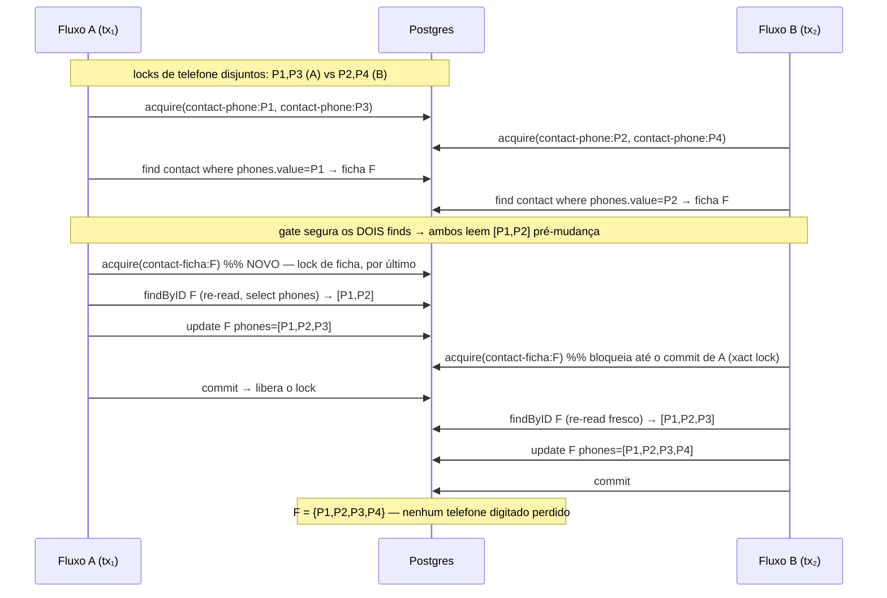

# Impl: C120 — race de append de telefone em findOrCreateContactByPhone (lock de ficha)

Status: aprovado
Atualizado em: 2026-08-24
Issue: #663
Intenção: body da Issue (fonte única — não há `docs/plans/c120-*.md` de intenção; o body é a spec)
Appetite restante: herdar sem appetite declarado (P2)

## Leitura da intenção

- **Outcome (aceite):** dois fluxos concorrentes contra a MESMA ficha nunca perdem um
  telefone digitado — ou, na alternativa, uma decisão documentada de aceitar a perda com
  rationale. O alvo nomeado é `findOrCreateContactByPhone`
  (`src/utilities/contactIdentity.ts`).
- **O que NÃO negociar:** granularidade de lock por ficha (não trocar o modelo de
  identidade); sem mudança de schema (nenhuma migration; `contact_phones` relacional
  intocado); sem mudança de Access/Consent; editar o dono que já possui o concern
  (locks de contato), não criar caminho paralelo.
- **Por que não foi no C112:** a granularidade por-telefone é herdada do C111; o C112
  alargou a janela ao introduzir o append-on-reuse (re-registro/import da MESMA pessoa
  com 1 ficha e primário inambíguo). Dois fluxos que resolvam a mesma ficha por primários
  DIFERENTES (ficha com 2+ números) não disputam nenhum `contact-phone:*` em comum — os
  locks por-telefone disjuntos não os serializam, os dois leem o array pré-mudança e o
  last-writer-wins perde um append. O lock por ficha é o ponto de serialização correto.
- **O que reavaliar:** (a) o MECANISMO — lock de ficha+re-read (A) vs escrita
  determinística SQL (B) vs aceitar/documentar (C); (b) se o RMW do sync conta→ficha
  (`CampaignUser.ts`) entra no escopo mesmo com o custo CI de `src/collections/`
  (HIGH_RISK); (c) os editors full-replace de staff — entrarem ou serem documentados
  como fora do aceite; (d) se a chave do invite redemption (`invite-redemption-contact:<id>`)
  é unificada agora ou vira débito; (e) a forma do spec int (chamada direta da unidade vs
  através dos flows de action, que exigem consent/municipality etc.).

## Abordagem recomendada

O núcleo é lock de ficha `contact-ficha:<id>` AO REDOR do read-modify-write **com
re-leitura da ficha DENTRO do lock**. Sem a re-leitura o lock não resolve nada: o array
lido no `find` pré-lock pode estar stale e o append ainda se perde. Os locks de telefone
de hoje são mantidos (são a serialização cruzada entre fichas distintas no create-path e
a proteção de dedupe de criações concorrentes); o ficha-lock é sempre adquirido POR
ÚLTIMO e sozinho (uma chave de entidade por RMW), então não existe ciclo de lock-order.

Sem o fix, A e B escrevem `[P1,P2,P3]` e `[P1,P2,P4]` a partir do MESMO array lido
`[P1,P2]` e o último commit vence — final com 3 números, P3 ou P4 perdido
(last-writer-wins). O lock de xact garante commit-then-release: o segundo fluxo a entrar
sempre re-lê o append do primeiro (que já está commitado) e só acrescenta os seus
faltantes.

**Opções consideradas:**

- **A — lock de ficha `contact-ficha:<id>` + re-read dentro do lock (recomendada):**
  após o `find` retornar exatamente 1 ficha (`totalDocs === 1`), adquirir o lock, re-ler
  a ficha via `findByID` (depth 0, `select: { phones: { value: true } }`) dentro do lock e
  montar o append de faltantes sobre essa leitura fresca; `update` só se `missing > 0`.
  Mantém os phone locks e o `find` de dedupe intactos. Custo: 1 round-trip de lock + 1
  `findByID` seletivo, só no branch de reuso (caminho raro).
- **B — escrita determinística via SQL (rejeitada):** append direto na tabela relacional
  `contact_phones` (`_parent_id`/`_order`/`value`) sem read prévio. Rejeitada porque:
  `contact_phones` não tem índice UNIQUE nem validação própria — a dedupe intraficha vive
  só em memória (`normalizeContactPhones`, `Contact.ts:22-59`); um insert SQL burlaria o
  adapter/hook do Payload (validation, `overrideAccess`, transação única) e o commit
  atômico com o resto do flow; a mesma garantia custaria algo razoável, mas com blast
  radius de camada inteira (SQL + ordenação `_order` + validação), para um problema que um
  advisory lock resolve com 3 linhas no padrão já existente do repo.
- **C — aceitar e documentar (rejeitada):** a perda não é benigna em escopo: é um número
  digitado que SOME silenciosamente num cadastro de rotina (dois registros da mesma pessoa
  via canais/arquivos diferentes é uso real do apoiador/liderança flow, não janela
  desprezível), o dado é PII recém-coletado e o custo do fix (A) é baixo e in-pattern.
  Aceitar exigiria além disso um rationale de produto que não existe.

**Recomendação:** A.

**Rejeitadas:** B (camada errada — contorna o dono), C (dado coletado some), e também o
lock de ficha SEM re-read (insuficiente por construção: serializa a escrita mas não o
conteúdo — a re-leitura dentro do lock é a parte que torna o append correto).

### Componentes / mudanças

- **~ `src/utilities/contactPhoneLocks.ts`** — adicionar `contactFichaLockKey(id)` →
  `contact-ficha:${id}` e `acquireContactFichaLock(payload, req, id)` (um wrapper de
  `acquireTextAdvisoryLocks`). Fica no dono dos locks de contato; a chave segue o padrão
  das locks por entidade existentes (`campaign-demand:<id>`, `activity:<id>`,
  `contact-name:<normalized>`, `person-delete:<id>`).
- **~ `src/utilities/contactIdentity.ts:68-87`** — no branch `totalDocs === 1`, após
  resolver a ficha: `await acquireContactFichaLock(payload, req, existing.id)`; re-ler a
  ficha com `payload.findByID` (depth 0, `select: { phones: { value: true } }`,
  `overrideAccess: true`, `req`) DENTRO do lock; montar `missing` e o array final sobre a
  RE-LEITURA (não sobre `docs[0]` do find); `update` só com `missing > 0`. Atualizar o
  doc-comment do módulo (mencionar a serialização por ficha no reuso).
- **~ `src/collections/CampaignUser.ts:270-291`** — no RMW do sync conta→ficha
  (account phone mudou e a ficha existe), adquirir `contact-ficha:<id>` antes do `findByID`
  existente (que já é a leitura do RMW: lock antes do read serializa read+write com um lock
  só). **DECISÃO: ENTRA no escopo.** Mesma classe de perda (append perdido → número
  digitado some no sync), mesmo padrão/dono, e o hook já roda em transação no postgres
  (C99/int exercita phone locks dentro desses hooks — `req.transactionID` existe). Custo:
  2 linhas vs 1 camada de risco real no mesmo defeito silencioso. O custo CI (collections =
  HIGH_RISK) está registrado em Riscos e em Fases.
- **+ `tests/int/contactPhoneAppendRace.int.spec.ts`** — spec de concorrência (ver Fase 2).
- **Full-replace editors (`updateSupporterContactRecord` em `actions/supporter.ts:216-223`,
  `contact.ts`, `leadership.ts` field `phones`/wizard, `advisor.ts`, tombstones e o branch
  `phone` do `leadership.ts` inline) — FORA do aceite (documentado, não alterado):**
  a semântica de um editor é "o array é agora exatamente isto" — a ficha lock não muda o
  last-writer-wins de um replace; e o branch `phone` inline (reorderWithPrimaryPhone) é
  edição explícita de staff que define o primário, não append implícito. O lock só faz
  sentido onde dois fluxos appendam sem intenção de sobrescrever. Documentar no header do
  `contactPhoneLocks.ts` (quem serializa o quê) e no commit.
- **Invite redemption (`invite-redemption-contact:<id>`, `campaignInviteRepository.ts:127-132`)**
  — RMW do profile JÁ serializado, mas por chave DIFERENTE → ficha não fica globalmente
  serializada entre create-flow e redemption-flow. **DECISÃO: capturar como débito**, não
  unificar agora (unificar é renomear a chave e revalidar os specs de redemption — escopo
  e risco extras sem relação com o aceite de C120). Nova Issue de débito.
- **Migration:** sem migration (nenhuma mudança de schema; `contact_phones` continua
  `_parent_id`/`_order`/`value`, sem índice UNIQUE, dedupe intraficha segue em memória).
- **Access/Consent:** n/a (sem mudança de acesso; `overrideAccess: true` inalterado nos
  pontos tocados, coberto pelos gates de fluxo existentes).
- **UI:** n/a.

## Fases verificáveis

1. **Schema+server** — editar `contactPhoneLocks.ts`, `contactIdentity.ts` e
   `CampaignUser.ts`, conforme Componentes. Nenhuma migration; nenhum tipo novo
   (`generate:types` desnecessário — não há campo novo). Verificação local: `tsc --noEmit`.
2. **Teste int** — criar `tests/int/contactPhoneAppendRace.int.spec.ts` (formato abaixo) e
   rodar com o db de teste do worktree (`pnpm test:int contactPhoneAppendRace`). **Prova em
   duas direções:** rodar o spec contra o código ATUAL (sem o fix) e ver a asserção
   `{P1,P2,P3,P4}` falhar com 3 números (prova a perda — o teste não é tautológico); com o
   fix, a mesma spec passa (prova a sobrevivência). O teste fixa a regressão.
3. **Gates de CI** — com `src/collections/` no diff (CampaignUser), o CI `checks` roda
   int FULL + e2e CURATED + build + unidades changed (OPS86: diff high-risk nunca zero);
   `contactIdentity.ts`/`contactPhoneLocks.ts` não têm entrada no manifest nem em
   `E2E_RISK_PREFIXES` — mas o HIGH_RISK de collections sobrepõe o fallback
   `campaignHomeActions`. Rodar full cascade local: guards → lint → format → typecheck →
   knip → cycles → unit → int → build.

**Formato do spec int de concorrência (Fase 2):**

- Plantar a ficha alvo `F = {P1, P2}` via `campaignFixtures().createContact({ phones:
[{ value: P1 }, { value: P2 }] })` (P1/P2 de `campaignFixtures().phone()`).
- Dos fluxos CONCORRENTES com primários DIFERENTES e conjuntos de telefone DISJUNTOS
  (requisito — se os phone locks se sobrepõem, a serialização por-telefone mascara a race):
  fluxo A `[P1, P3]`, fluxo B `[P2, P4]`, cada um chamando `findOrCreateContactByPhone`
  direto dentro de `withPayloadTransaction` (que abre transação real e fornece o `req` com
  `transactionID` — exigência do advisory lock). Forma DECIDIDA: chamada direta da unidade,
  não via `createSupporterRecord`/`createLeadershipRecord` — os flows de action adicionam
  consent + municipality + dedupe de liderança/supporter (outras unidades sob teste e mais
  fixtures), enquanto a unidade sob teste é exatamente `findOrCreateContactByPhone` e ambos
  os flows reais a chamam de forma idêntica dentro das suas transações.
- Gate com `findSpy` sobre `payload.find` segurando o 1º find de AMBOS os fluxos
  (`firstReadGate`/`firstReadReached`, padrão de `campaignLeadership.int.spec.ts:181-285`,
  porém com gate nos DOIS reads) — garante que ambos leem o estado `[P1,P2]` antes de
  qualquer escrita, tornando a perda determinística sem o fix e a sobrevivência
  determinística com o fix (o xact lock garante: quem entrou por último re-lê o append já
  commitado do primeiro). Disparar via `Promise.allSettled`.
- Asserções: ambos resolvem com `reused: true` e `contactID === F.id`; a ficha F final tem
  EXATAMENTE {P1,P2,P3,P4} (comparação por conjunto). O assert do waiter de pg_locks
  (`waitForAdvisoryLockWaiter` + PID via `beginSpy`, que funciona no existing spec porque o
  waiter vira determinístico quando os dois reads estão gated) pode reforçar o mecanismo,
  mas não é exigido pelo aceite — o state final basta.
- Cleanup: `installCampaignFixtures` (markers + owned) cuida do teardown.

## Rabbit holes / Não escopo

- **Lock ordering:** em `findOrCreateContactByPhone`, phone locks são adquiridos em batch
  ordenado ANTES de qualquer lock de entidade; o ficha-lock é adquirido por ÚLTIMO e sempre
  SOZINHO (uma chave de ficha por RMW; o branch `totalDocs !== 1` não faz RMW e não ganha
  lock). Nenhum fluxo segura 2 chaves de entidade de contato simultaneamente
  (`person-delete:<id>` e `contact-name:<normalized>`, `invite-redemption-contact:<id>`
  seguem com chaves próprias e nunca são combinadas com `contact-ficha:*`) — sem ciclo.
- **Escrita determinística SQL:** rejeitada (opção B) — exigiria validar/ordenar/
  deduplicar fora do hook e do adapter.
- **Full-replace/reorder editors:** fora do aceite, documentados (ver Componentes).
- **Unificar a chave do invite redemption:** débito capturado, não no escopo.
- **Branch de criação (`totalDocs === 0` / `2+`):** sem mudança — a identidade na criação é
  a ficha recém-escrita e os phone locks já serializam as criações concorrentes.
- **Não mexer em `supporterImport.ts`** (modelo de "todos os phones locked up front" intacto).
- **Não adicionar lock em `updateSupporterContactRecord`** nem nos demais editors.

## Riscos e mitigação

- **Lock de ficha sem re-read ser insuficiente contra a intenção:** não — a re-leitura é
  parte integrante do componente (fora do lock o fix seria inócuo). O spec int cobre os dois
  fluxos re-lendo dentro do lock.
- **`CampaignUser.ts` sem transação ativa em algum chamador do hook:** no postgres o
  adapter envolve cada mutation numa transação e expõe `transactionID` aos hooks (evidência
  C99/int: os phone locks já rodam dentro desses hooks). Se um chamador futuro invocar o
  update sem transação, `acquireTextAdvisoryLocks` lança com a mensagem fail-closed padrão
  — nunca perde dado silenciosamente. Residual baixo.
- **Deadlock entre fluxos:** chaves de ficha e telefone disjuntas entre os fluxos do aceite
  (A usa P1,P3 e F; B usa P2,P4 e F — só F em comum, e a ficha é sempre a última); nenhum
  fluxo adquire uma chave de outro fluxo depois de segurar a própria. A invariante de
  ordenação é única no código (documentada no comment do módulo).
- **Custo CI (collections = HIGH_RISK):** int full + e2e curated + build no PR. Patch
  pequeno e de padrão já coberto; o custo é o preço da camada de serialização no sync
  conta→ficha (C99 já paga esse preço hoje por incluir o hook em collections).
- **Re-read extra (perf):** 1 `findByID` seletivo a mais, só no branch de reuso;
  desprezível vs. o round-trip de lock já existente no mesmo caminho.
- **Ficha deletada entre o `find` e o lock (`person-delete` concorrente):** a re-leitura
  falha com erro claro → rollback da transação (fail-closed), sem corrupção. Fora do aceite.
- **Flakiness do spec:** telefones únicos por fixture (`phone()`), gate determinístico nos
  dois reads, transações via `withPayloadTransaction` (commit/rollback corretos);
  `waitForAdvisoryLockWaiter` só reforça o mecanismo e usa espera ativa com timeout (padrão
  já usado no repo).

## Aceite de engenharia

- [ ] Aceite da intenção: dois fluxos concorrentes contra a mesma ficha nunca perdem um
      telefone digitado (spec int prova a perda sem o fix e a sobrevivência com o fix)
- [ ] Decisão de concorrência registrada (A recomendada) com B e C rejeitadas e rationale
- [ ] Invariantes AGENTS/engineering-standards: sem migration, sem schema, sem
      Access/Consent; edita o dono (`contactPhoneLocks.ts`); sem paralelismo de caminho
- [ ] Testes de domínio previstos: `tests/int/contactPhoneAppendRace.int.spec.ts`
      (concorrência por ficha, primários distintos, gate nos dois reads)
- [ ] CI previsto: int full + e2e curated + build + unidades changed (blast de
      `src/collections/CampaignUser.ts`) — gates verdes antes do merge
- [ ] Débitos registrados em Issue: unificação da chave `invite-redemption-contact:*`
      vs `contact-ficha:*`; full-replace/reorder editors documentados como fora do aceite
