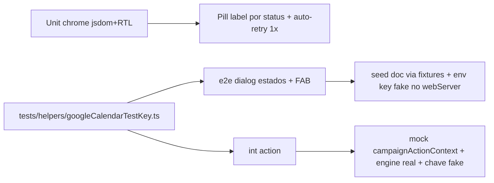

# Impl: C122 — C114 follow-up: cobertura de testes dos estados do espelho Google

Status: aprovado
Atualizado em: 2026-08-11
Issue: #666
Intenção: docs/plans/c122-c114-followup-testes-estados-espelho.md
Appetite restante: ~0,5 dia eng (fill-in de cobertura — herdado)

## Leitura da intenção

- **Outcome:** S14 (unit do chrome: rótulo da pill por status + auto-retry uma
  vez quando `paused`), S17 (e2e dialog em disabled/paused/synced + FAB mobile)
  e S18 (int da action: disable grava `disabledAt`, re-enable limpa e o hook da
  config re-sincroniza) cobertos. Zero mudança de comportamento de produção.
- **O que NÃO negociar:** estados determinísticos SEM rede (nenhuma chamada ao
  Google real); `leader` lockdown e gates staff intactos; nada de mock que
  mascare o write path real (a action grava em DB de teste com hooks reais).
- **O que reavaliar** (hipóteses da intenção que exigem decisão de engenharia):
  1. "env key fake" no e2e só existe no processo do servidor Playwright → a
     chave entra no `webServer.env` (suite-wide, não por teste).
  2. O e2e roda `fullyParallel` com specs de activity escrevendo em paralelo;
     o hook de activity roda o engine REAL quando o doc `googleCalendarSync`
     existe → escreve `lastErrorAt` no doc da nossa spec. O estado `synced`
     precisa de `lastSuccessAt` no futuro (2099) para ser imune a esse ruído.
  3. A int da action: mockar `getCampaignActionContext`/`reloadStaffActor` (a
     action lê `cookies()` de next/headers — invocável só com request real) e
     observar a reconciliação D7 pelo efeito no DB (`lastErrorAt`), com a chave
     fake que falha localmente em `importPKCS8` — spy desnecessário.
  4. A pill é registrada via `SetCampaignHeaderAction` (retorna `null`) → o
     unit test precisa de um probe que renderize `headerActions['google-calendar-sync']`
     do contexto.

## Abordagem recomendada

**Opções consideradas:**

- **E2E "como injetar a chave fake":** A) `webServer.env` no playwright.config
  (suite-wide, key fake idêntica à do int) — **recomendada**; B) apenas seed do
  doc sem env → impossível: `deriveGoogleCalendarSyncStatus` retorna
  `not-configured` sem `hasCredential` (fail-closed primeiro); C) estado via
  query/env por teste → não existe mecanismo (server actions rodam no processo
  único do servidor).
- **E2E `synced` sob paralelismo:** A) seed `lastSuccessAt` no futuro
  (qualquer `lastErrorAt` de hook paralelo fica mais velho → deriva `synced`)
  — **recomendada**; B) serializar a spec → não protege contra hooks de OUTROS
  spec files (fullyParallel); C) minimizar a janela seed→SSR → racy por
  definição (specs de activity escrevem a cada poucos segundos).
- **Int da action:** A) mockar `@/utilities/campaignActionContext`
  (getCampaignActionContext + reloadStaffActor) e manter engine/hooks reais com
  a chave fake — **recomendada**: o D7 é observado pelo efeito no DB
  (`lastErrorAt` gravado pelo engine DENTRO do afterChange da re-enable), que é
  a prova mais forte sem rede; B) mockar o engine com spy → não prova o write
  real e duplica o padrão do `googleCalendarSyncHooks.unit.spec.ts`; C) testar
  pela UI → é o e2e, que já cobre o fluxo; o int é o lugar do D7.
- **DRY da chave fake:** A) helper compartilhado `tests/helpers/googleCalendarTestKey.ts`
  — **recomendada** (3 call sites: int engine, int action, playwright config;
  drift entre chaves quebraria a premissa "falha local sem rede"); B) copiar a
  base64 em cada site → barato hoje, envenenado amanhã.

**Rejeitadas:** B/C de cada bloco acima (razões in-line).

### Componentes / mudanças

- **`tests/unit/agendaGoogleSyncChrome.unit.spec.tsx`** (novo): RTL + jsdom
  (precedente `calendarFeedDialog.unit.spec.tsx` — stubs de matchMedia desktop,
  ResizeObserver, scrollIntoView). Harness: `CampaignPageChromeProvider` +
  `CampaignQuickActionContextProvider` + probe que renderiza
  `headerActions['google-calendar-sync']`. Casos: label da pill por status
  (synced/paused/not-configured/disabled); auto-retry chama `onSyncNow` UMA vez
  com `paused` e zero com `synced`/`not-configured` (via `waitFor`).
- **`tests/e2e/campaignAgendaGoogleSync.e2e.spec.ts`** (expandir): mantém o
  teste `not-configured`; novos: `disabled` (pill + dialog + Reativar →
  transição determinística para `paused`, porque o sync pós-re-enable falha
  local na chave fake), `paused` (pill + dialog + link "Abrir Google Calendar";
  o auto-retry de mount falha local e reforça o estado), `synced` (pill +
  dialog com link block/copiar/instruções + Desativar), e FAB mobile em
  describe aninhado com `test.use({ viewport: 390×844 })` → "Ações rápidas" →
  "Agenda da Campanha" → sheet "Agenda da Campanha no Google" (estado
  `not-configured`, sem doc).
- **`tests/int/googleCalendarSyncAction.int.spec.ts`** (novo): mock de
  `campaignActionContext`; fixture coordinator real; seed do doc; (1) disable →
  `ok` + status `disabled` + `disabledAt` no DB, engine NÃO rodou
  (verificável: `lastErrorAt` continua null); (2) re-enable → `disabledAt`
  null + `lastErrorAt` gravado (o hook D7 rodou) + view `paused`. Chave fake
  via helper; `// @vitest-environment node`.
- **`tests/helpers/googleCalendarTestKey.ts`** (novo): base64 do JSON fake
  (client_email + private_key 'MOCK…') — falha em `importPKCS8` localmente,
  sem rede (verificado: `Invalid keyData`).
- **`tests/int/googleCalendarSync.int.spec.ts`** (refactor): `FAKE_KEY` →
  helper (mesmo valor, sem mudança de comportamento).
- **`playwright.config.ts`**: `GOOGLE_CALENDAR_SERVICE_ACCOUNT_KEY` no
  `webServer.env` (chave fake do helper). Colateral: nenhum — a derivação de
  status só muda com doc; o engine só roda com doc; só esta spec cria doc.
- **`tests/e2e/fixtures/campaignE2EFixtures.ts`**: `'googleCalendarSync'` em
  `OwnedCollection` + `deletionOrder` (auto-own/cleanup do doc da spec).
- **Migration:** sem migration. **Access/Consent:** inalterados. **UI:** sem
  mudança de superfície (Impeccable B — só testes).

## Fases verificáveis

1. **Unit do chrome** — `pnpm test:unit -- agendaGoogleSyncChrome`
2. **Int da action** — `pnpm test:int -- googleCalendarSyncAction`
3. **E2e** — `pnpm test:e2e -- tests/e2e/campaignAgendaGoogleSync.e2e.spec.ts`
   (dev server local do worktree; PLAYWRIGHT_BASE_URL=http://localhost:3222)
4. **Gates** — `pnpm lint` + `pnpm typecheck` + `pnpm test` + `pnpm format:check`
   - `pnpm exec knip` + `pnpm check:cycles`

## Rabbit holes / Não escopo (engenharia)

- Testar os estados do pill no modo mobile (decisão C114: FAB é a superfície
  mobile) — fora.
- Refactor do chrome de instruções addbyurl (2 call sites) — defer, gatilho:
  3ª superfície (C115).
- Testar o role gate da action (`reloadStaffActor` falhando) — o gate já é
  exercitado em outras frentes; o mock o neutraliza aqui de propósito.
- Unit do dialog por estado (copy) — o e2e cobre a superfície; unit fica no
  chrome (aceite da intenção).

## Riscos e mitigação

- **Hooks paralelos escrevem `lastErrorAt` no doc da spec** → `synced` imune
  via `lastSuccessAt` 2099; `disabled` imune (`disabledAt` vence); `paused`
  reforçado. Nenhum outro spec é afetado (o engine só roda quando há doc).
- **Rede acidental no e2e** → chave fake falha em `importPKCS8` ANTES de
  qualquer fetch (verificado em node: `Invalid keyData`); int usa o mesmo
  helper.
- **Radix Dialog em jsdom** → precedente `calendarFeedDialog.unit.spec.tsx`
  (stubs de matchMedia/ResizeObserver/scrollIntoView).
- **`recordSyncState` aninhado no afterChange da própria config** → é o
  comportamento de produção já shipped (C114); o teste apenas o observa.
- **CI sem Docker/Cloud** → nenhuma dependência nova; DB de teste local.

## Aceite de engenharia

- [x] Aceite de produto da intenção ainda coberto (S14/S17/S18, sem rede,
      determinístico)
- [x] Invariantes AGENTS/engineering-standards (sem mudança em código de
      produção; testes só em `tests/` + config de teste)
- [x] Testes de domínio previstos: unit (chrome), int (action D7), e2e
      (estados + FAB)

## Já resolvido no simplify/critique (não reabrir)

- **C126 (#686, pre-existente, in-progress por outro agente):** o flake do
  `googleCalendarSync.int.spec.ts` sob carga paralela (contagens globais vs
  atividades de specs paralelas) foi resolvido nesta sessão com asserções
  escopadas ao próprio fixture pelos ids determinísticos (`ourEvent(s)` + o
  contrato do store stub). A abordagem preferida do C126 ("escopar o espelho
  do teste" = mudança de produção; "serializar os dois specs" = não existe em
  vitest) é inviável sem tocar produção — a asserção escopada preserva as
  garantias por atividade (espelho criado, convergência idempotente, update/
  delete, recuperação). Não editada (in-progress); o dono decide o desfecho.
- **C127 (#688):** datas hardcoded no int spec (`2026-08-10` all-day e
  `2029-01-01` outside-window) substituídas por instantes derivados do agora
  (all-day: now+2d..+4d com datas esperadas via `allDayCivilDateOf`/
  `allDayExclusiveEndDate`; fora-da-janela: now+400d) — sem expiração
  determinística.
- Todos os achados `[apply]` dos 3 reviewers do /simplify (label matrix via
  `PILL_LABELS`, default `onSyncNow` consistente com o status — remove uma
  corrida real —, `it.each`, `stubMatchMedia` compartilhado, `syncDialog`
  helper, overrides tipados, const do env, cleanup de config por id próprio
  nos dois int specs, remoção do alias `withCredential`).

## Explicitamente fora

- **Constante compartilhada de calendarId** entre os dois int specs (2 call
  sites — DRY <3): defer, gatilho = 3º spec do espelho.
- **Serialização de passes concorrentes** (advisory lock): defer da intenção,
  gatilho = reclamação de pill preso em `paused` ou o C115.
- **Refactor do chrome de instruções addbyurl** (2 call sites): defer da
  intenção, gatilho = 3ª superfície de calendário (C115).
- **Teste do pill no modo mobile** (decisão C114: FAB é a superfície mobile).
- **Flake do `campaignSuggestions.int.spec.ts`** (claims de município sob
  carga): já rastreado em #553 — não reaberto aqui.
- Timeouts de dev server sob carga (load ~73 no host): ambiente, não débito.
