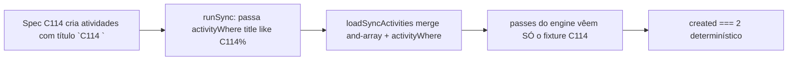

# Impl: C126 — Int specs do espelho Google (C114) flakeam em paralelo com specs que criam atividades

Status: em execução
Atualizado em: 2026-08-11
Issue: #686
Intenção: body da Issue #686 (sem plano de intenção linkado — a Issue é a spec)
Appetite restante: herdado (defect P2, ~0,25–0,5 dia — fix de teste + 1 param opcional)

## Leitura da intenção

- **Outcome:** o `googleCalendarSync.int.spec.ts` deixa de flakear quando a suíte int roda em paralelo: `outcome.created === 2` (full mirror), `=== 1` (converges/changing calendarId) e `=== 0` (outside window) passam a valer **independentemente** do que outras specs fazem no mesmo banco. A asserção global **não** é relaxada.
- **O que NÃO negociar:** nunca relaxar a asserção; o espelho cheio em produção (escopo do staff inteiro) permanece intacto; zero mudança de comportamento em runtime.
- **O que reavaliar:** a sugestão da Issue "escopar o espelho do teste a tag/range próprio do fixture **ou** serializar os dois specs". Reavaliação: a race é mais ampla que o par nomeado — medido no código, **4** specs criam atividades in-window no banco compartilhado (`campaignActivity.int.spec.ts:51`, `calendarFeed.int.spec.ts:41`, `homeSearchActivities.int.spec.ts:25`, `municipalityDossierData.int.spec.ts:71`, todas `startAt = now + 1 dia`). "Serializar os dois specs" não cobriria as outras três → a correção tem que isolar o espelho do fixture, não o par.

## Abordagem recomendada

**Opções consideradas:**

- **A — Escopo injetável no motor** (`activityWhere?: Where` em `CampaignCalendarSyncOptions`): o motor passa a aceitar cláusulas extras no `where` do push set (`loadSyncActivities`) e do delete-guard set (`loadAliveActivityIds`); a spec passa `{ title: { like: 'C114%' } }` (o mesmo filtro do cleanup do afterEach — operador já provado no repo). Produção não passa o param → espelho cheio inalterado, byte-identical nos hooks/action.
- **B — Serializar os dois specs** (fileParallelism:false num projeto vitest para o par, ou global).
- **C — Isolar por banco/schema por spec**.
- **D — Pré-limpeza destrutiva no banco antes de cada pass** (deletar atividades alheias da janela).

**Recomendação: A** — única que torna o resultado determinístico **para todas as fontes de poluição de uma vez** (as 4 specs), sem tocar em runtime (param opcional nunca passado em produção; hooks e action intactos) e sem custo de suíte. O param é o contrato honesto: "espelho completo por padrão; escopo estreito quando o chamador pedir" — e já serve a futuros mirrors parciais (nada a inventar depois).

**Rejeitadas:**

- **B porque** o vitest não tem serialização par-a-par de arquivos: `fileParallelism: false` num projeto com os 2 arquivos serializa só **esse par** — e a poluição real vem de **4** arquivos (o par nomeado na Issue é o observado, não o único); `fileParallelism: false` global mataria o paralelismo da suíte int inteira (maxWorkers 8 é deliberado, ver `vitest.config.mts`); e a dependência ordem/timing entre arquivos é exatamente a classe de flake que o repo combate (D9: "janela sem lease = race"; aqui não há lease que as outras specs tomem — não é construtível).
- **C porque** custo de infra gigante para um defect de teste; cada spec int nova exigiria banco próprio.
- **D porque** destrutivo e racioso (outra spec pode criar entre a limpeza e o pass) — não resolve, só move a janela.

### Componentes / mudanças

- **`CampaignCalendarSyncOptions.activityWhere`** (`src/utilities/googleCalendarSync.ts`): novo campo opcional `activityWhere?: Where`; `loadSyncActivities` e `loadAliveActivityIds` ganham o param e **appendam** ao array `and` existente (mesmo shape do `buildFeedWhere` de `calendarFeed.ts` — precedente provado); `runSyncPass` repassa; `runCampaignCalendarSync` passa `options.activityWhere`. Import `Where` de `'payload'` (precedente `calendarFeed.ts:24`). Doc comment: omitido em produção (espelho cheio); existe para espelhos escopados/isolação de teste.
- **`tests/int/googleCalendarSync.int.spec.ts`**: helper local `runSync(client, reason = 'manual')` = `withCredential(() => runCampaignCalendarSync(payload, { reason, client, activityWhere: { title: { like: 'C114%' } } }))` — substitui as ~16 chamadas de pass; as 2 chamadas do teste no-op (sem credencial) ficam diretas (short-circuit antes de qualquer query — adicionar escopo ali é ruído).
- **Teste-pin novo** no mesmo spec: "mirrors only the fixture scope" — cria UMA atividade C114 + UMA atividade "estrangeira" in-window (título fora do `C114%`), roda `runSync`, espera `created === 1` e store com só 1 evento; cleanup da estrangeira em `finally` (o afterEach só limpa `C114%` — não vazar poluição para outras specs, o exato bug que estamos matando). Esse pin é a regressão viva: no código atual (sem escopo) a estrangeira seria espelhada → `created === 2` → vermelho.
- **Migration:** sem migration (mudança de TS puro).
- **Access / Consent:** nenhum — sem chave, sem PII; motor continua `overrideAccess` com a mesma racionalidade documentada.
- **UI:** nenhuma (sem Impeccable).
- **Changelog:** entrada curta em `docs/CHANGELOG-AGENTS.md` (padrão "Recently resolved").

## Fases verificáveis

1. **Motor + spec** — param `activityWhere` + threading nos 2 loads; helper `runSync`; substituição das chamadas; teste-pin. (núcleo do appetite)
2. **Prova de determinismo** — repro/contraprova local contra as 4 specs poluidoras: `pnpm vitest run --maxWorkers 8 tests/int/googleCalendarSync.int.spec.ts tests/int/campaignActivity.int.spec.ts tests/int/calendarFeed.int.spec.ts tests/int/homeSearchActivities.int.spec.ts tests/int/municipalityDossierData.int.spec.ts` × N (na base, eventualmente flakeia; com o fix, sempre verde); depois suíte int completa.
3. **Gates** — `pnpm gate:fast` (lint/typecheck/unit), `pnpm test` (int), `pnpm format:check`, `pnpm exec knip`, `pnpm check:cycles`, `pnpm build`; e2e não afetado (sem UI — CI cobre), changelog, impl plan `aprovado`, push.

## Rabbit holes / Não escopo (engenharia)

- Leases/advisory locks de atividade para serializar specs — não construtível (as poluidoras não tomam lease) e não necessário (escopo resolve).
- "Melhorar" as outras 4 specs (mudar `startAt` delas) — altera semântica testada delas; não é o owner do defeito.
- Escopo no lado remoto (`listEvents`) — desnecessário: o stub remoto só contém o que o próprio spec inseriu; em produção o espelho cheio continua listando o calendário inteiro.
- C122 (estados do espelho) — follow-up independente (#pendente), sem overlap com este fix.

## Riscos e mitigação

- **Param opcional no motor vira API pública sem consumidor real** → mitigado: é a superfície mínima honesta (1 campo opcional, documentado), os 3 callers de produção não o passam, e o teste-pin exercita o contrato; se um dia não servir, remove-se junto do teste.
- **`like` de título com `%` em outros operadores** → o afterEach do próprio spec já usa `title: { like: 'C114%' }` há semanas sem falso-positivo (títulos alheios nunca começam com `C114`); o pin usa título estrangeiro explícito.
- **Poluição do teste-pin para outras specs** → cleanup em `finally` dentro do próprio teste; o afterEach existente cobre o resto.
- **Race residual de outra natureza** → fora de escopo da Issue (self-healing do estado é C122; o engine já recobre por passadas).

## Aceite de engenharia

- [ ] Aceite da Issue coberto: asserções globais intactas, determinísticas sob a suíte paralela
- [ ] Invariantes AGENTS: motor com espelho cheio em produção (callers sem `activityWhere`); zero `src/` de teste-only (param é contrato de produto do motor)
- [ ] Teste-pin da isolação (estrangeira in-window não é espelhada) — regressão viva
- [ ] Contraprova: 5 arquivos (C114 + 4 poluidoras) × N runs verdes; suíte int completa verde
- [ ] Changelog registrado; sem migration/access/Consent/UI
