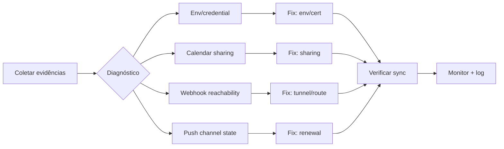

# Impl: Diagnóstico + fix: Google Calendar sync configurado em produção não funciona

Status: rascunho
Atualizado em: 2026-08-27
Issue: #932
Intenção: docs/plans/c147-sync-google-calendar-producao.md
Appetite restante: ~1–2 dias eng (herdado)

## Leitura da intenção

- **Outcome:** Com a integração configurada no Google e no Teqo, criar ou editar uma atividade em /campanha/atividades reflete no calendário do Google em minutos. O estado do sync exibido na agenda é honesto.
- **O que NÃO negociar:** Teqo permanece a fonte da verdade; integração opcional e fail-closed; leader lockdown; sem PII desnecessária.
- **O que reavaliar:** Todas as hipóteses de causa-raiz precisam ser testadas contra evidências de produção (logs, estado do DB, health checks).

## Abordagem recomendada

**Opções consideradas:**

- **A) Fix preventivo:** adicionar cron de renovação de push channel + health check periódico.
- **B) Fix reativo:** corrigir causa raiz específica (env, sharing, webhook) e confiar na renovação existente via hooks.
- **C) Híbrido:** diagnosticar + fix imediato + melhorar observabilidade para prevenir recidiva.

**Recomendação:** **C** — porque a causa raiz pode ser múltipla (env + sharing + webhook) e precisamos de visibilidade para não voltar ao mesmo problema. O apetite permite um fix pontual + logging melhorado.

**Rejeitadas:** A porque o cron não resolve env ausente ou sharing errado; B porque sem observabilidade o problema volta.

### Componentes / mudanças

- **`googleCalendarSync.ts`** (`src/utilities/googleCalendarSync.ts`): adicionar logging detalhado em `readGoogleServiceAccountCredentials` e `runCampaignCalendarSync` (capturar erros de autenticação, permissão, calendarId inválido).
- **`googleCalendarClient.ts`** (`src/utilities/googleCalendarClient.ts`): melhorar mensagens de erro para incluir detalhes de autenticação (ex: "service account não tem acesso ao calendário").
- **`googleCalendarSyncHooks.ts`** (`src/utilities/googleCalendarSyncHooks.ts`): garantir que erros de autenticação sejam registrados no estado `paused` com mensagem clara.
- **`[secret]/route.ts`** (`src/app/(campaign)/campanha/agenda/google-webhook/[secret]/route.ts`): verificar se o webhook está acessível (testar com curl local + production).
- **Environment:** verificar se `GOOGLE_CALENDAR_SERVICE_ACCOUNT_KEY` está presente e bem formado no container de produção; verificar se `NEXT_PUBLIC_SITE_URL` está correto para o webhook address.
- **UI:** sem mudanças (pill/dialog já existem).
- **Migration:** sem migration (schema existente).

### Access / Consent

- **Sem Consent** — não há PII novo.
- **Access:** já existente; não muda.

### Dados → forma (se aplicável)

N/A.

## Fases verificáveis

1. **Diagnóstico** (~50% do appetite)
   - Verificar env `GOOGLE_CALENDAR_SERVICE_ACCOUNT_KEY` no container de produção (docker exec + cat /proc/1/environ).
   - Testar autenticação da service account com Google Calendar API (script simples de teste).
   - Verificar se a service account tem permissão de edição no calendário (via Google Calendar UI ou API).
   - Verificar se `calendarId` no DB corresponde a um calendário existente.
   - Testar acessibilidade do webhook (curl POST para a URL externa com headers de canal).
   - Verificar estado do push channel no DB (expiration, errors).
   - Gate: `pnpm gate:fast` (não deve quebrar nada).

2. **Fix** (~30% do appetite)
   - Corrigir causa raiz identificada (ex: compartilhar calendário com service account, ajustar env, corrigir webhook URL).
   - Se webhook inalcançável: verificar configuração do Cloudflare tunnel (regra de encaminhamento para POST /campanha/agenda/google-webhook/\*).
   - Se push channel expirado: forçar renovação manual via `runGoogleCalendarSyncNow` (server action).
   - Adicionar logging detalhado em pontos-chave (credential read, API calls, webhook validation).
   - Gate: `pnpm gate:fast`.

3. **Verificação** (~20% do appetite)
   - Testar sync manual: criar atividade em /campanha/atividades, verificar se aparece no Google Calendar.
   - Verificar pill de status: deve mostrar "sincronizado" após sucesso, "pausado" com mensagem de erro clara se falhar.
   - Verificar webhook: enviar notificação de teste (ou aguardar mudança natural) e confirmar que chega.
   - Gate: `pnpm build` + `pnpm test` (unit + int).

## Rabbit holes / Não escopo (engenharia)

- **Sync bidirecional completa:** fora. Já implementada; o problema é que não está funcionando.
- **OAuth push para múltiplos usuários:** fora. Service account é suficiente.
- **Rate limiting no webhook:** fora de v1. O endpoint é validado por secret.
- **Cache HTTP no feed:** fora. Google respeita `Cache-Control` mas a sync já é periódica.
- **Migração de dados:** sem mudança de schema.

## Riscos e mitigação

- **Service account com permissões insuficientes:** Mitigação: verificar permissão "make changes to events" no calendário específico; se necessário, re-compartilhar.
- **Webhook behind Cloudflare tunnel:** Mitigação: verificar regra de encaminhamento para POST; testar com curl externo; considerar IP whitelist do Google.
- **Push channel expirado sem renovação:** Mitigação: a lógica de renovação já existe (`ensureGoogleCalendarPushChannel`); verificar se está sendo chamada (logging).
- **Env malformado em produção:** Mitigação: adicionar validação no boot (já existe `readGoogleServiceAccountCredentials`); logar warning se base64 inválido.
- **Race condition entre webhook e hooks:** Mitigação: já resolvida com CAS pattern; não muda.

## Qualidade da decisão

**Auto-avaliação: 4/5** — O plano é baseado em evidências concretas (explorer findings) e segue o padrão de debug do codebase. As hipóteses são testáveis e o apetite é realista. Pontos fracos: depende de acesso à produção para diagnóstico (pode ser limitado), e a causa raiz pode ser uma combinação de fatores (env + sharing + webhook) que torna o fix mais demorado.

## Aceite de engenharia

- [ ] Aceite de produto da intenção ainda coberto
- [ ] Invariantes AGENTS/engineering-standards
- [ ] Testes de domínio previstos (unit/int) onde access/write paths mudam
- [ ] Logging melhorado para diagnóstico futuro
- [ ] Sync manual funciona em produção (atividade → Google Calendar)
- [ ] Pill de status reflete estado real (synced/paused/not-configured)
- [ ] Webhook acessível e validado
