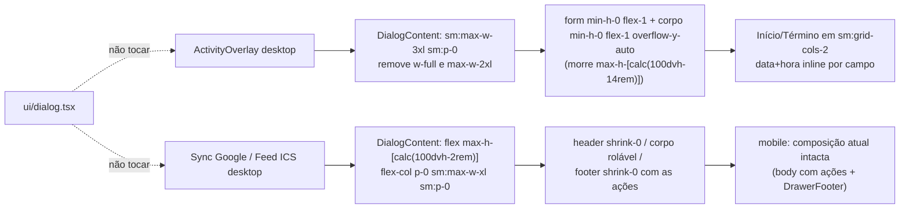

# Impl: Agenda: modais usáveis no desktop (criação de atividade, sync e feed)

Status: rascunho
Atualizado em: 2026-09-12
Issue: #933
Intenção: docs/plans/c148-modais-agenda-desktop.md
Appetite restante: herdado — ~0,5–1 dia eng. Correção local de encaixe em 3 componentes + testes; sem migration, sem schema, sem access/Consent.

## Leitura da intenção

- **Outcome:** no desktop, os três modais da agenda (criação/edição, sync Google, feed ICS) abrem com largura/padding coerentes, nunca cortam conteúdo (corpo rola internamente com o rodapé de ações sempre visível) e o par Início/Término do modal de criação fica lado a lado com data+hora na mesma linha. Mobile intocado.
- **O que NÃO negociar:** (1) mobile dos três modais não regride — o DOM do Drawer/folha atual (overlay `h-[calc(100dvh-1rem)]` + corpo `min-h-0 flex-1 overflow-y-auto`; sync/feed `max-h-[85vh]` + corpo rolável + `DrawerFooter`) permanece exatamente o de hoje; (2) lógica de validação/salvamento e dados intocados; (3) nenhum outro modal do app muda — `ui/dialog.tsx` e seus 10 consumidores intactos; (4) sem migration/Consent (dado interno de staff, `activity` não tem Consent).
- **O que reavaliar:** a hipótese central da intenção está **confirmada**, com mecânica precisa: `cn` = clsx + tailwind-merge resolve conflito de mesma variante (`grid`→`flex`, `p-6`→`p-0`, `gap-4`→`gap-0`, `max-w-sm`→`max-w-2xl`), mas **não** derruba `sm:max-w-md`/`sm:p-8` da base quando o override não tem `sm:`; no CSS do Tailwind v4 a utility com variante é emitida depois e vence em ≥640px. Correção = espelhar a variante (`sm:max-w-3xl sm:p-0`), deixando o twMerge apagar as da base — sem guerra de ordem. Dois defeitos vizinhos no mesmo caminho: `w-full` no overlay anula o gutter de 2rem da base (`w-[calc(100vw-2rem)]`), e `max-h-[calc(100dvh-14rem)]` é número mágico acoplado às alturas de header/footer. O "empilhamento" do par data/hora é sintoma da largura de 28rem (o grid já é `sm:grid-cols-2`; o componente já renderiza data+hora inline), não falta de estrutura — não há layout novo a inventar.
- **Fora de escopo reafirmado:** a divergência de breakpoint (overlay 640 via `useNarrowMeasured(640)` em `ActivityCreateOverlayHost.tsx:35`/`ActivityEditOverlayHost.tsx:34` vs sync/feed 768 via `useIsMobile()` em `src/hooks/use-mobile.ts:3`) **não** será unificada nesta entrega; as fronteiras atuais são preservadas.

## Abordagem recomendada

**Opções consideradas:** A) override local com variantes `sm:` explícitas nos 3 modais | B) mudar a base `ui/dialog.tsx` (largura/padding/scroll default) | C) extrair um shell compartilhado "modal desktop com corpo rolável" para os 3 call sites.
**Recomendação:** A — cada modal já tem conteúdo, padding e largura próprios; a correção é de classe, e o padrão a replicar já existe no repo (QuickActions: `flex max-h-[min(85dvh,40rem)] … overflow-hidden` + filho `overflow-y-auto`, `CampaignQuickActionsOverlay.tsx:166-186`; Advisor: `max-h-[calc(100dvh-2rem)] overflow-y-auto`, `AdvisorPermissionBadge.tsx:86`). Zero superfície de regressão fora da agenda.
**Rejeitadas:**

- **B — mexer em `ui/dialog.tsx`:** base de 10 imports (`Command`, `PetitionSuccessDialog`, `CampaignNotificationBell`, `CampaignQuickActionsOverlay`, `MunicipalityV2StatusReasonDialog`, `CampaignUpdatesCreateModal`, `AdvisorPermissionBadge` + os 3 da agenda). Mudar `sm:max-w-md`/`sm:p-8`/scroll default é regressão silenciosa em telas não auditadas; a própria intenção marca como rabbit hole.
- **C — shell compartilhado:** seria um pass-through raso (classes + 2 slots) para 3 modais heterogêneos (overlay `p-0` + cards; sync/feed padding próprio e `max-w-xl`), sem conhecimento encapsulado — depth check "pass-through raso → não criar". O repo já resolve isso por receita inline repetida (QuickActions, Advisor, sheet mobile). **Gatilho de revisitação:** 4º modal da agenda com o mesmo corpo rolável, ou adoção do padrão por outro domínio.

### Decisões de engenharia

1. **Onde a rolagem do overlay desktop acontece.** Opções: A) `form` `min-h-0 flex-1` + corpo `min-h-0 flex-1 overflow-y-auto`, herdando o `max-h` do `DialogContent` (padrão do sheet mobile e do QuickActions) | B) manter `max-h-[calc(100dvh-14rem)]` e só corrigir largura/padding. **Recomendação: A** — o magic number é a causa do corte quando header/footer mudam de altura; A torna a geometria derivada (`100dvh - 2rem` no content + header/footer `shrink-0`). **Rejeitada:** B porque preserva o acoplamento que gerou o defeito.
2. **Sync/feed: rodapé fixo vs conteúdo inteiro rolável.** Opções: A) header/body/footer em flex, ações extraídas para footer `shrink-0` (draft cena 2; aceite exige "rodapé de ações permanece visível") | B) `overflow-y-auto` no `DialogContent` inteiro (padrão Advisor). **Recomendação: A** — só A satisfaz o aceite; B rola as ações para fora. **Rejeitada:** B (mais simples, porém falha o aceite explícito).
3. **Disposição Início/Término (questão aberta de produto).** Opções: A) dois campos lado a lado, cada um data+hora inline (draft cena 1) | B) um campo por linha com data+hora inline. **Recomendação: A** — o grid `sm:grid-cols-2` (`ActivityOverlay.tsx:355`) já existe; com a largura recuperada cada coluna ganha ~20rem e o gatilho de data (~10rem) mostra `07/08/2026` sem truncar. **Rejeitada:** B (perde a largura recuperada; vira fallback). **Gatilho de revisitação:** se no gate a faixa 640–767px ficar ilegível, cair para B nessa faixa (não antes).
4. **Larguras.** Overlay: `sm:max-w-3xl` (48rem, cena 1) vs `sm:max-w-2xl` (42rem, hipótese da intenção). Sync/feed: `sm:max-w-xl` (36rem, cena 2) vs manter `sm:max-w-lg` (32rem). **Recomendação: 48rem/36rem** — o rascunho UI é o gate aprovado; "largura generosa" e "ampliar pouco" estão materializados nas cenas. **Rejeitadas:** manter 42rem/32rem — a diferença é uma classe e o alvo está no gate.
5. **Como preservar o mobile exatamente.** Opções: A) dividir o `body` em `content` + `actionRow` e recompor o ramo mobile na mesma ordem de hoje | B) footer desktop com `position: sticky` dentro do corpo atual. **Recomendação: A** — DOM mobile idêntico (os unit mobile e os e2e C103/C94/C114 são a prova), sem sticky frágil com padding negativo. **Rejeitada:** B (quebra com `space-y`/padding do content; menos explícito que o flex).

### Componentes / mudanças

- **`ActivityOverlay.tsx`** (só caminho desktop):
  - `DialogContent` (`:601`): `flex max-h-[calc(100dvh-2rem)] w-full max-w-2xl flex-col gap-0 overflow-hidden p-0` → `flex max-h-[calc(100dvh-2rem)] flex-col gap-0 overflow-hidden p-0 sm:max-w-3xl sm:p-0` (remove `w-full` para voltar o gutter `w-[calc(100vw-2rem)]` da base; `sm:` espelhado derruba `sm:max-w-md`/`sm:p-8` via twMerge).
  - `DialogHeader` desktop (`:602`): + `shrink-0` (mantém `border-b px-6 py-4`).
  - `form` (`:442`): ramo desktop `flex flex-col` → `flex min-h-0 flex-1 flex-col` (igual ao sheet).
  - corpo (`:451-456`): ramo desktop `max-h-[calc(100dvh-14rem)] flex-1 overflow-y-auto overscroll-contain p-6` → `min-h-0 flex-1 overflow-y-auto overscroll-contain p-6`; + `data-slot="dialog-scroll-body"`.
  - rodapé (`:520-525`): classes inalteradas (`shrink-0` já existe); + `data-slot="dialog-footer"`.
- **`GoogleCalendarSyncDialog.tsx`:**
  - separar o `body` (`:186-286`) em `content` (sem as ações) + `actions` por estado (`not-configured` → nenhuma; `disabled` → Reativar; `synced`/`paused` → Abrir Google Calendar quando `paused` + Sincronizar agora + Desativar). `actionError` vai para o rodapé desktop (junto da ação que falhou) e **fica na posição atual no mobile** (entre content e actions).
  - mobile (`:296-310`): composição idêntica à de hoje — `DrawerContent max-h-[85vh]` + `
{content}{actionError}{actionRow}
` + `DrawerFooter` Fechar.
  - desktop (`:313-323`): `DialogContent className="flex max-h-[calc(100dvh-2rem)] flex-col gap-0 overflow-hidden p-0 sm:max-w-xl sm:p-0"`; `DialogHeader className="shrink-0 border-b px-6 py-4 pr-12 text-left"`; corpo `

{content}

`; rodapé `
{actionError}{actionRow}
` (não renderiza quando ambos vazios — `not-configured`).
- **`CalendarFeedDialog.tsx`:**
  - mesmo split: `content` + `actions` (criado: Fechar desktop + Abrir Google Calendar; senão: Cancelar desktop + Gerar link); erro do form continua no corpo, junto do input.
  - mobile (`:216-233`) idêntico; desktop (`:236-248`) com o mesmo shell do sync e `sm:max-w-xl`.
- **`ActivityDateTimeField.tsx`:** uma linha — wrapper dos selects (`:154`) `isNarrow ? 'w-16' : 'w-20'` → `w-16` (o draft cena 1 usa `w-16`; o mobile já era `w-16`, então só o desktop muda). Mantém o rótulo completo da data mesmo na faixa 640–767px. Nenhuma outra mudança no componente.
- **`src/components/ui/dialog.tsx`:** **sem mudança** — base intacta para os 10 consumidores.
- **Testes:**
  - unit — `tests/unit/activityOverlay.unit.spec.tsx`, `googleCalendarSyncDialog.unit.spec.tsx`, `calendarFeedDialog.unit.spec.tsx`: asserções estruturais novas (não de classe): botão de ação dentro de `[data-slot="dialog-footer"]` e **fora** de `[data-slot="dialog-scroll-body"]`; conteúdo no corpo. O caminho desktop é o default dos 3 specs (`matchMedia` mockado `matches:false`; overlay `isNarrow=false`).
  - e2e — `campaignActivity.e2e.spec.ts` (jornada desktop `:51`): após abrir o modal, `boundingBox` da largura `> 600` (guarda do "estreito"; hoje 448) e `|Δy| < 4` entre Início e Término — o aceite "não empilha" vira asserção. `campaignAgendaGoogleSync.e2e.spec.ts` (teste synced `:138`): encolher o viewport para 1280×560, manter o diálogo aberto, assertar `Sincronizar agora` visível + `[data-slot="dialog-scroll-body"]` com `scrollHeight > clientHeight` + box do diálogo dentro do viewport. Feed: sem e2e novo (mesmo shell do sync; coberto pelo unit estrutural); os e2e existentes (`campaignAgendaFeed.e2e.spec.ts:18` e `:73`) seguem como regressão.
- **Changelog:** `docs/changelog/<data>-c148.md` — uma entrada curta da entrega (nunca editar o agregado; `pnpm changelog:build` gera).
- **Migration:** sem migration (nenhum schema/field).
- **Access / Consent:** N/A — dado interno de staff; nenhum write path muda.
- **UI:** Impeccable B — shape já fixado no rascunho (`docs/plans/c148-modais-agenda-desktop-ui-draft.html`, cenas 1–3); craft = classes desta entrega; critique = gate visual nas 3 cenas (1280px e 390px); polish só se o gate pedir. Shells reusados: padrão do Drawer mobile (header/body/footer com `min-h-0 flex-1 overflow-y-auto`) e o par `flex max-h … overflow-hidden` + filho rolável do QuickActions.

### Dados → forma (se aplicável)

N/A — a entrega não apresenta dado novo (pergunta 3 de data-presentation não se aplica); é encaixe de modal.

## Fases verificáveis

1. **Tracer — overlay desktop** (quota ~40%): classes em `ActivityOverlay.tsx` (DialogContent/header/form/corpo) + `data-slot` + a linha do `w-16` em `ActivityDateTimeField.tsx`. Verificação: `pnpm test:unit` do `activityOverlay.unit.spec.tsx` verde + abrir `/campanha/atividades` no browser com edit draft longo (todas as seções) e conferir: largura 48rem, padding contido, corpo rola, rodapé visível, Início/Término na mesma linha. Gate visual da cena 1.
2. **Sync + feed desktop** (quota ~40%): split `content`/`actions` nos dois dialogs + shell header/body/footer + `sm:max-w-xl`; conferir no browser a cena 2 e o mobile inalterado (cena 3). Verificação: units dos dois dialogs verdes, incluindo as asserções estruturais novas.
3. **Testes + gates** (quota ~20%): estender os e2e das duas superfícies (asserções acima); rodar os e2e afetados (`campaignActivity`, `campaignAgendaFeed`, `campaignAgendaGoogleSync` + mobile da agenda); `pnpm gate:fast`; `pnpm push` (gate:ci completo sem e2e — o e2e é passo explícito da skill).

## Rabbit holes / Não escopo (engenharia)

- Não tocar `ui/dialog.tsx` nem os outros 7 consumidores; não criar `DialogFooter` na base.
- Não unificar os breakpoints 640 vs 768 (`useNarrowMeasured(640)` vs `useIsMobile()`).
- Não extrair shell/constante compartilhada para os 3 modais (ver Decisão C).
- Não redesenhar o formulário: o draft é ilustrativo (Tipo/Status não existem no form real); só encaixe.
- Não mexer no Popover do calendário (`ActivityDateTimeField.tsx:209`, `max-h-[22rem]`) nem no `[data-slot="popover-content"]` dos e2e.
- Não trocar mais nada em `ActivityDateTimeField` além do `w-16` (sem reestruturar a linha data+hora).
- Não guerrear ordem de CSS na mão (`!important`, reordenar classes): usar `sm:` + twMerge.
- Não tocar no mobile (Drawer/`DrawerFooter`/nested sheet) — só a recomposição que preserve o DOM.

## Riscos e mitigação

- **Regressão mobile por refatorar o `body`:** mitigação — compor `content + actionError + actionRow` na mesma ordem de hoje no ramo mobile e manter unit/e2e mobile (C103/C94/C114) verdes; revisão de diff focada no ramo `isMobile`/`isNarrow`.
- **`min-h-0` faltando em algum elo** → corpo não rola e corta: mitigação — cadeia `DialogContent (max-h + flex-col) → form (flex-1 min-h-0) → corpo (flex-1 min-h-0 overflow-y-auto)`; testar com edit draft cheio (tasks + demandas) numa janela baixa (1280×560).
- **Asserção de largura do e2e frágil:** mitigação — threshold `> 600` (não o valor exato) e comentário apontando o aceite; o par usa `|Δy| < 4`.
- **e2e de sync em viewport baixo flaky** (conteúdo pode não transbordar): mitigação — viewport 560px com o estado `synced` completo (link + instruções + edições) garante overflow; assert de `scrollHeight > clientHeight` no corpo marcado por `data-slot`.
- **`sm:p-0` remover padding de que o header dependa:** mitigação — header/body/footer ganham padding próprio (`px-6 py-4`) e o X absoluto (`right-3 top-3`) é conferido no gate.
- **Erro de ação sair da vista no desktop:** mitigação — `actionError` vai para o rodapé, ao lado da ação; no mobile fica onde está.
- **Unit estrutural acoplar a `data-slot`:** mitigação — os atributos seguem o padrão de `dialog-content`/`drawer-content` já usado por e2e; sem asserts de classe.

## Aceite de engenharia

- [ ] Aceite de produto da intenção ainda coberto: 3 modais com largura/padding coerentes; corpo rolável + rodapé visível; Início/Término lado a lado; mobile intocado.
- [ ] Invariantes AGENTS/engineering-standards: sem migration, sem access/Consent, `ui/dialog.tsx` intacto, contrato mobile preservado, zero warnings, sem dead code (nenhum helper órfão).
- [ ] Testes de domínio previstos: unit existentes verdes + asserções estruturais novas nos 3 specs; int N/A (nenhuma fronteira Payload/DB muda); e2e afetados rodados antes do push.

## Self-score (decision-quality)

| Critério                              | Nota | Justificativa                                                                                                                                                      |
| ------------------------------------- | ---- | ------------------------------------------------------------------------------------------------------------------------------------------------------------------ |
| 1. Decisões caras têm rejeitadas?     | 5/5  | Onde corrigir (A/B/C), técnica de rolagem, rodapé fixo vs scroll total, larguras e fallback A/B do par — todas com rejeitadas explícitas e gatilho de revisitação. |
| 2. Cabe no appetite?                  | 5/5  | 3 componentes + testes, sem schema/migration; correção local de classes e composição.                                                                              |
| 3. Rabbit holes nomeados?             | 5/5  | Base global, unificação de breakpoint, shell novo, redesign do form, popover/E2E, sticky.                                                                          |
| 4. Depth check: reusa shells/helpers? | 5/5  | Reusa o padrão existente (sheet mobile, QuickActions, Advisor); nenhum módulo novo.                                                                                |
| 5. Intenção permanece satisfeita?     | 5/5  | Engenharia não reescreveu o outcome: encaixe, não redesign; mobile preservado por contrato de DOM.                                                                 |

**Total: 5/5 (gate ≥4).**
