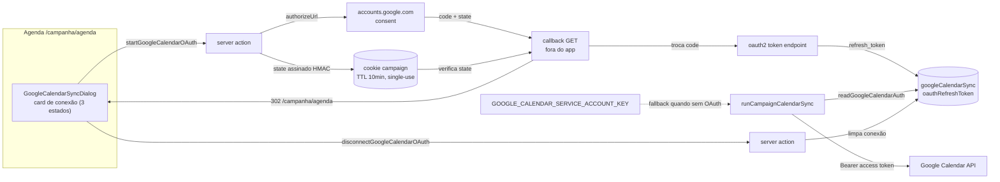

# Impl: C149 — Google Calendar: botão Conectar Google (OAuth) substitui a configuração manual de service account

Status: em execução
Atualizado em: 2026-09-12
Issue: #934
Intenção: docs/plans/c149-conectar-google-oauth.md
Appetite restante: ~2 dias eng (herdado)

## Leitura da intenção

- **Outcome:** candidato/coordenador conecta a conta Google do calendário da campanha com um clique (consent), sem criar service account nem colar JSON; o estado da conexão é honesto (`conectado | erro | não configurado`), erro de token reconecta em um clique e o Teqo segue SoT.
- **Não negociar:** escopos mínimos literais (`calendar.events` + `calendar.calendarlist.readonly`); exatamente três estados, derivados, nunca armazenados; `GOOGLE_CALENDAR_SERVICE_ACCOUNT_KEY` preservada como fallback (não renomear/remover); token sobrevive sem re-consentimento semanal; não é OAuth por pessoa (anti-goal C114); motor de reconciliação intocado; callback sempre na URL pública (`getCampaignInviteBaseURL()`); token nunca em log; armazenamento fail-closed (sem conexão → sem sync, sem crash); leader lockdown intocado.
- **Reavaliar:** app unverified exige publicar em produção no GCP para o refresh token não expirar em ~7 dias (decisão de ops, D14); armazenamento do refresh token em texto puro é débito consciente com gatilho de revisão (D1); advisor vê o card sem botões (assumido com produto); a escrita de `calendarId` continua admin-only e será aberta no C150.

## Abordagem recomendada

**Opções consideradas:** A) Authorization Code + rota de callback própria com state assinado em cookie | B) fluxo out-of-band (device/código colado) | C) manter service account e melhorar só o runbook.

**Recomendação:** A — reusa o precedente de cerimônia fora do `(app)` (WebAuthn) e o resolvedor de URL pública (`getCampaignInviteBaseURL`), entrega o consent de um clique e isola o callback para teste; B troca "um clique" por "copiar e colar código" e não tem precedente; C não entrega o outcome pedido pelo dono.

**Rejeitadas:** B porque adiciona atrito e uma superfície de erro nova; C porque é exatamente a cerimônia que o pedido manda remover.

### Componentes / mudanças

- **`src/collections/GoogleCalendarSync.ts`** — cinco campos novos (D1): `oauthRefreshToken` (text, `read: canReadGoogleCalendarSyncIdentityField`, `create/update: canSetGoogleCalendarSyncSystemField`), `oauthScope` (text), `oauthConnectedAt` (date), `oauthErrorAt` (date), `oauthError` (textarea); labels/admin `readOnly` em pt-BR; `admin.defaultColumns` inalterado.
- **`src/utilities/access/googleCalendarSync.ts`** — `canManageGoogleCalendarConnection(actor)` (delega a `isCampaignUnrestricted`); novos campos usam os helpers existentes (`canSetGoogleCalendarSyncSystemField`, `canReadGoogleCalendarSyncIdentityField`).
- **`src/migrations/<timestamp>_add_google_calendar_oauth_connection.{ts,json}` + `index.ts`** — migração aditiva (colunas nullable), gerada com `pnpm migrate:create add_google_calendar_oauth_connection`; `src/payload-types.ts` regenerado (`pnpm generate:types`).
- **`src/lib/googleCalendarOAuth.ts`** (novo, puro) — `GOOGLE_CALENDAR_OAUTH_SCOPES`, `GOOGLE_CALENDAR_OAUTH_CALLBACK_PATH`, `GOOGLE_CALENDAR_OAUTH_AUTHORIZE_ENDPOINT`, `buildGoogleCalendarOAuthAuthorizeUrl({ clientId, redirectUri, state })` com `access_type=offline`, `prompt=consent`, `response_type=code`.
- **`src/utilities/googleCalendarOAuth.ts`** (novo, server-only, sem importar `googleCalendarSync`) — `readGoogleCalendarOAuthCredentials()` (fail-closed), `buildGoogleCalendarOAuthRedirectUri()` (via `getCampaignInviteBaseURL()`), `storeGoogleCalendarOAuthState(state, userId)` / `readGoogleCalendarOAuthState(state)` / `clearGoogleCalendarOAuthState()` (HMAC `PAYLOAD_SECRET`, payload state+userId+exp, TTL 10min, httpOnly/lax, path `/campanha`, single-use), `exchangeGoogleCalendarOAuthCode(code, fetchImpl?)` → `{ refreshToken, scope }` ou erro tipado com mensagem segura (sem corpo/token).
- **`src/utilities/googleCalendarClient.ts`** — `GoogleCalendarAuth = { kind: 'service-account'; credentials } | { kind: 'oauth'; refreshToken; clientId; clientSecret }`; `createGoogleCalendarClient(auth, ...)` mantém os 6 métodos e o cache em memória; `requestAccessToken` ganha o branch `grant_type=refresh_token`; novo `GoogleCalendarAuthError` APENAS para `invalid_grant` (refresh token revogado/expirado — o caso reconectável; `invalid_client`/5xx seguem `GoogleCalendarApiError`, pois reconectar não conserta); `buildServiceAccountAssertion` preservado para testes.
- **`src/utilities/googleCalendarSync.ts`** — `readGoogleCalendarAuth(config)` (OAuth se refresh token + env; senão SA; senão `null`); `GoogleCalendarConnectionState = 'connected' | 'error' | 'not-configured'` + `deriveGoogleCalendarConnectionState`; `GoogleCalendarSyncView` ganha `connection`, `oauthAvailable`, `oauthConnectedAt`, `oauthError`; `loadGoogleCalendarSyncConfig` passa a "row com `calendarId` vence, senão qualquer row" (D11); helpers `recordGoogleCalendarOAuthConnection`, `recordGoogleCalendarOAuthError`, `clearGoogleCalendarOAuthConnection`; `runCampaignCalendarSync` resolve a auth pelo config, limpa `oauthError*` no sucesso e grava `oauthErrorAt/oauthError` no catch de `GoogleCalendarAuthError`.
- **`src/app/(campaign)/campanha/actions/googleCalendarSync.ts`** — `startGoogleCalendarOAuth()` (valida `reloadUnrestrictedActor`, exige env, cria o row singleton se ausente com admin bypass, grava state cookie, devolve `{ ok, authorizeUrl }`) e `disconnectGoogleCalendarOAuth()` (limpa token/scope/datas/erro; sem revoke remoto; sem pass de sync); `GoogleCalendarSyncActionResult` ganha `canManageConnection` e os campos de conexão; `failure()` atualizado.
- **`src/app/(campaign)/campanha/agenda/google-oauth/callback/route.ts`** (novo, fora do `(app)`, `dynamic = 'force-dynamic'`) — GET: lê `code/state/error`, verifica e queima o state cookie, re-checa papel fresco, troca o code, grava a conexão, roda pass de sync se houver `calendarId` e responde `NextResponse.redirect` 302 para `/campanha/agenda`; `access_denied` não grava erro; falha de troca grava `oauthError` e redireciona (sem query param).
- **`src/components/campaign/activity/GoogleCalendarSyncDialog.tsx`** — card de conexão por estado (badge, Conectar/Reconectar/Desconectar, nota do fallback SA, nota para não-manager, runbook admin só quando `!oauthAvailable`); props novas `onStartOAuth`, `onDisconnect`, `canManageConnection`.
- **`src/components/campaign/activity/AgendaGoogleSyncChrome.tsx`** — callbacks `onStartOAuth`/`onDisconnect` repassados; pill existente intocada.
- **`src/app/(campaign)/campanha/(app)/agenda/page.tsx`** — passa as server actions novas ao chrome.
- **`scripts/lib/e2e-affected-manifest.mjs`** — entry nova mapeando `src/utilities/googleCalendarSync.ts`, `googleCalendarSyncHooks.ts`, `googleCalendarClient.ts`, `googleCalendarOAuth.ts`, `src/lib/googleCalendarOAuth.ts`, `GoogleCalendarSyncDialog.tsx`, `AgendaGoogleSyncChrome.tsx` e `src/app/(campaign)/campanha/agenda/google-oauth` ao spec `campaignAgendaGoogleSync`.
- **`playwright.config.ts`** — `GOOGLE_CALENDAR_OAUTH_CLIENT_ID`/`_SECRET` dummy no `webServer.env` (botão visível no e2e).
- **`tests/e2e/campaignAgendaGoogleSync.e2e.spec.ts`** — estados com OAuth: botão, URL de consent interceptada, conectado e erro.
- **`.env.example` + `docs/ops/teqo-1313-deploy.md`** — as duas envs e o runbook GCP (D14).
- **Testes:** `tests/unit/googleCalendarOAuth.unit.spec.ts` (novo), extensões em `googleCalendarClient.unit.spec.ts`, `googleCalendarSync.unit.spec.ts`, `googleCalendarSyncDialog.unit.spec.tsx`, `agendaGoogleSyncChrome.unit.spec.tsx`, `tests/int/googleCalendarSync.int.spec.ts`, `tests/int/googleCalendarSyncAction.int.spec.ts`; allowlist top-level de `tests/unit/codebaseConventions.unit.spec.ts` ganha `googleCalendarOAuth.ts`.

### Dados → forma

Estado da conexão é **derivado** (nunca armazenado), função de `oauthRefreshToken`, `oauthConnectedAt` e `oauthErrorAt`:

| refresh token | erro mais novo que a conexão                                | estado           | UI                                                                  |
| ------------- | ----------------------------------------------------------- | ---------------- | ------------------------------------------------------------------- |
| não           | não                                                         | `not-configured` | "Não configurado" + Conectar (se `oauthAvailable`) ou runbook admin |
| sim ou não    | sim (`oauthErrorAt > oauthConnectedAt`, inclui sem conexão) | `error`          | "Erro na conexão" + Reconectar + Desconectar                        |
| sim           | não                                                         | `connected`      | "Conectado" + Desconectar                                           |

`oauthAvailable` (env do client presente) é ortogonal ao estado e decide botão vs. runbook. `oauthScope`, `oauthConnectedAt` e `oauthError` são apenas informativos/derivados; o token nunca cruza a fronteira da view.

## Decisões de engenharia (decisão + por quê + rejeitadas; só as caras de reverter)

1. **Armazenamento na própria `googleCalendarSync` (D1):** campos novos na collection que já é dona do estado do espelho; sem collection twin. Texto puro com precedente (`SocialFeedSettings.instagramAccessToken`, `pushChannelSecret`), `read: false` no token e nunca logar. **Rejeitadas:** AES-GCM (sem precedente no repo, rotação de chave e o DB comprometido já é game over) — vira débito com gatilho de revisão; collection nova (twin).
2. **Credenciais do app OAuth em env (D2):** `GOOGLE_CALENDAR_OAUTH_CLIENT_ID`/`_SECRET`; redirect URI sempre derivado de `getCampaignInviteBaseURL()` + `/campanha/agenda/google-oauth/callback`. **Rejeitadas:** client no DB (não é per-campanha); override de redirect por env (risco de localhost vazar).
3. **Transporte por união de auth (D3):** `GoogleCalendarAuth` com SA (JWT assertion, comportamento atual) e OAuth (refresh_token grant) na mesma superfície de 6 métodos, mesmo cache e mesmo retry de 401; `GoogleCalendarAuthError` separa conexão quebrada (`invalid_grant`, reconectável) de erro de API/config (`invalid_client`, 5xx → pausa). **Rejeitadas:** segundo client OAuth paralelo; tratar todo erro de token como auth error (invalid_client viraria "reconecte" sem conserto).
4. **Resolução e limpeza no motor (D4):** `readGoogleCalendarAuth` prefere OAuth quando há refresh token + env, senão SA, senão `null`; sucesso limpa `oauthError*`, `GoogleCalendarAuthError` grava `oauthErrorAt/oauthError` além de `lastError`/paused. **Rejeitada:** fallback silencioso para SA com token quebrado (mascararia o erro e tornaria o estado `error` inalcançável com SA configurada).
5. **Estado derivado (D5):** `'connected' | 'error' | 'not-configured'` como função pura dos campos, nunca coluna nova. **Rejeitadas:** armazenar o estado (drift); quarto estado intermediário.
6. **Papéis (D6):** conectar/desconectar = `isCampaignUnrestricted` via `canManageGoogleCalendarConnection`, enforcement com `reloadUnrestrictedActor` na action; advisor vê o card sem botões; leader não vê a agenda. **Rejeitadas:** advisor conectar (credencial global); liberar por `canUpdateGoogleCalendarSync` (staff inteiro).
7. **Fluxo: action de start + callback GET com state em cookie (D7):** `startGoogleCalendarOAuth` devolve `authorizeUrl` e o client navega; callback valida state (HMAC, TTL 10min, single-use, bound ao userId), re-checa papel fresco, troca o code e responde 302. **Rejeitadas:** searchParam/hash para aviso pós-callback (a canonicalização de `resolveActivityAgendaUrl` come parâmetros desconhecidos); rota GET de start (menos testável e sem precedente); revogação remota no disconnect.
8. **Desconectar limpa só o Teqo (D8):** remove refresh token/scope/datas/erro com admin bypass e orienta revogar no Google; sem pass de sync automático (o próximo trigger cai no fallback SA, se houver). **Rejeitada:** chamar `/revoke` no Google (fora do literal da intenção).
9. **Módulos (D9):** puro em `src/lib/googleCalendarOAuth.ts`, server-only em `src/utilities/googleCalendarOAuth.ts` (sem importar `googleCalendarSync` para não criar ciclo), record/clear e resolução no `googleCalendarSync.ts`, client no `googleCalendarClient.ts`; registrar o novo top-level na allowlist. **Rejeitadas:** um módulo único misturando puro/server; lógica OAuth dentro do client.
10. **UI (D10):** card de conexão dentro do `GoogleCalendarSyncDialog`; pill existente e motor intocados; runbook admin só quando `!oauthAvailable`. **Rejeitadas:** diálogo novo; mexer na pill de status do espelho.
11. **Loader singleton (D11):** "row com `calendarId` vence; senão qualquer row" para o row da conexão não ficar escondido pelo filtro atual. **Rejeitada:** manter o filtro e criar row só no primeiro sync (a conexão ficaria invisível).
12. **Manifest e2e (D12):** entry do domínio Google Calendar → `campaignAgendaGoogleSync`, fechando o gap pré-existente. **Rejeitada:** confiar só no fallback de smoke (o spec não rodaria no PR).
13. **E2E determinístico (D13):** envs dummy no webServer; estados conectado/erro com `lastSuccessAt` futuro para não disparar auto-retry; consent assertado com `page.route('https://accounts.google.com/**')`. **Rejeitada:** consent real (rede/flake).
14. **Ops documentado, sem código (D14):** OAuth client "Web application" no GCP com redirect URIs (prod + dev), escopos, app **publicado em produção (unverified)** para o refresh token não expirar em 7 dias; envs em `~/stack/teqo-1313.env`; aviso de app não verificado aceito (decisão de produto A).

## Fases verificáveis

1. **Tracer/schema + server (~55%, ≈1,1 dia)**
   - Campos + access + `pnpm migrate:create add_google_calendar_oauth_connection` + `pnpm migrate` + `pnpm generate:types`.
   - `src/lib/googleCalendarOAuth.ts` e `src/utilities/googleCalendarOAuth.ts` com unit (URL, escopos, state TTL/single-use, env fail-closed, exchange sem token em mensagem).
   - Auth union + `GoogleCalendarAuthError` no client com unit (SA inalterado, refresh grant, 401 re-mint).
   - `readGoogleCalendarAuth`, derivação do estado, loader D11, record/clear, sucesso limpa erro, catch de `GoogleCalendarAuthError`; unit/int do sync atualizados.
   - Actions start/disconnect + `canManageGoogleCalendarConnection`; int com mock de `campaignActionContext` (padrão de `googleCalendarSyncAction.int.spec.ts`).
   - Allowlist top-level de `codebaseConventions` registrada. Gate: `pnpm gate:fast`.
2. **Callback + UI + e2e + docs (~35%, ≈0,7 dia)**
   - Callback route (state, papel fresco, exchange, grava, pass se `calendarId`, 302).
   - Dialog/chrome/page; unit de dialog/chrome; copy pt-BR dos três estados + orientação de revogar no Google.
   - e2e: envs no `playwright.config.ts`, spec com botão/consent/conectado/erro, entry no manifest.
   - `.env.example` + runbook em `docs/ops/teqo-1313-deploy.md`. Gate: `pnpm test:e2e:affected` (deve incluir `campaignAgendaGoogleSync`).
3. **Gates finais (~10%, ≈0,2 dia)**
   - `pnpm gate:fast`; e2e afetado local (`pnpm test:e2e:affected`); `pnpm push`.

## Rabbit holes / Não escopo (engenharia)

- **Criptografar o refresh token no DB (AES-GCM/keyring):** débito registrado com gatilho (rotação de chave/requisito de compliance); não entra.
- **Chamar `/revoke` no Google ao desconectar:** só orientação na UI (literal da intenção).
- **Listar/escolher calendário:** C150; aqui só a conexão.
- **Verificação completa do app Google / auditoria:** ops, fora.
- **Aposentar/migrar a service account:** fora; segue fallback.
- **Watchdog de expiração do refresh token / cron:** fora; o erro aparece no próximo pass e a UI oferece Reconectar.
- **Módulo genérico de envs:** fora; `process.env` direto como no resto do repo.
- **Rate limiting nas rotas OAuth:** fora; state + TTL bastam para este escopo.
- **Motor de reconciliação, janela, locks, hooks C114/C122:** intocados.
- **Aviso pós-callback via searchParam/hash:** rejeitado; redirect simples para `/campanha/agenda`.
- **OAuth por pessoa / agenda pessoal:** anti-goal C114.

## Riscos e mitigação

- **Refresh token expira em ~7 dias (app unverified em testing):** D14 publica o app em produção (unverified) no GCP; se expirar, estado vira `error` e Reconectar resolve. Risco residual aceito (produto A).
- **Localhost vazando no redirect atrás do túnel:** redirect URI sempre de `getCampaignInviteBaseURL()` (prod exige HTTPS DNS); unit pin do path do callback; e2e asserta `redirect_uri` público.
- **CSRF/replay do callback:** state HMAC `PAYLOAD_SECRET` com TTL 10min, single-use (queimado antes da troca) e binding ao userId; papel re-checado fresco.
- **Token em log:** exchange não loga corpo; mensagens usam status/código seguros; `oauthRefreshToken` com `read: false`; unit garante ausência de token/code na mensagem de erro.
- **Falha do Google corromper dados:** Teqo SoT; `GoogleCalendarAuthError` só grava `oauthError*`/paused; int cobre `invalid_grant` sem apagar/duplicar eventos.
- **OAuth quebrado sem fallback SA:** decisão consciente (D4); a UI expõe erro + Reconectar e o runbook explica.
- **Upsert do row/corrida:** start cria o singleton com admin bypass; única escrita concorrente é o callback; sem lock novo.
- **Migration em prod:** aditiva/nullable, aplicada pelo deploy (`pnpm build` roda `payload migrate`); sem backfill; baseline intocada.
- **`unmapped-risk` no CI:** `src/utilities/access` já é mapeado; a entry nova do domínio Google entra no mesmo PR — falhar fechado é o comportamento desejado.
- **Auto-retry em erro de conexão:** uma tentativa por load da agenda (sem hammer); falha rápida no token endpoint.

## Qualidade da decisão

**Auto-avaliação: 4/5** — as decisões já vêm fechadas e ancoradas em achados concretos (rotas de cerimônia fora do `(app)`, cookie HMAC do WebAuthn, precedente de credencial no DB, canonicalização da agenda, gap do manifest), e o caminho crítico é testável sem tocar o Google. Perde 1 ponto por dependências fora do código: o refresh token de app unverified é uma promessa de ops (publicar em produção no GCP) e o e2e não exercita consent real, então a prova de produção fica no smoke manual pós-deploy; o armazenamento em texto puro é débito aceito com gatilho, não resolvido.

## Aceite de engenharia

- [ ] Botão "Conectar com o Google" no card da agenda para candidato/coordenador; advisor vê o card sem botões; leader sem agenda (lockdown intocado).
- [ ] Estados exatamente `conectado | erro | não configurado`, derivados de `oauthRefreshToken`/`oauthConnectedAt`/`oauthErrorAt`.
- [ ] Erro de token (`invalid_grant`) mostra Reconectar em um clique; `access_denied` não grava erro.
- [ ] Callback atrás do túnel usa a URL pública (`getCampaignInviteBaseURL()`); sem localhost em produção.
- [ ] Token nunca em log; `oauthRefreshToken` com `read: false`; exchange sem corpo em erro.
- [ ] Fail-closed: sem auth → `runCampaignCalendarSync` retorna cedo, sem crash e sem sync.
- [ ] Desconectar limpa a conexão no Teqo e orienta revogar no Google; sem pass de sync automático.
- [ ] Service account segue como fallback; `GOOGLE_CALENDAR_SERVICE_ACCOUNT_KEY` não renomeada/removida.
- [ ] Escopos literais `calendar.events` + `calendar.calendarlist.readonly`; `access_type=offline` + `prompt=consent`.
- [ ] Migration nova aplicada local + `payload-types.ts` regenerado; nenhuma migration antiga editada.
- [ ] `pnpm gate:fast` verde; `pnpm test:e2e:affected` inclui `campaignAgendaGoogleSync` (manifest atualizado) e passa local.
- [ ] `.env.example` e runbook de ops (GCP, envs, app publicado unverified) documentados.

## Execução — desvios e decisões emergentes (2026-09-12)

- **Classificação do `invalid_grant` virou helper puro** (`oauthErrorPatchFor` em `googleCalendarSync.ts`, pinado em unit): o catch do motor é I/O-bound e o int de motor com row configurado colidia com os specs C114 paralelos. O comportamento é o mesmo; a prova ficou no unit.
- **Escopos concedidos são validados no exchange**: consent granular permite desmarcar `calendar.events`; sem a checagem o card diria "Conectado" e o sync falharia 403 sem caminho de reconexão.
- **Callback só grava `oauthError` quando o EXCHANGE falha** (papel recusado/env ausente não sujam o estado de uma conexão sadia; um erro transitório se auto-cura no próximo pass bem-sucedido, que limpa o campo).
- **Suíte int dos specs Google serializada por advisory lock** (`GOOGLE_CALENDAR_SYNC_LOCK_KEY` + `serializeSpecWithAdvisoryLock` em `tests/helpers/advisoryLock.ts`): a collection é singleton e o loader "row configurado vence" fazia specs paralelos lerem o doc um do outro. A serialização elimina a dependência de `retry` da família.
- **Specs novos não criam rows configurados** (só connection-only) e limpam tokens em rows compartilhados sem deletá-los; o pass do callback é mockado no spec de actions (o motor tem spec próprio).
- **`.env.example` + runbook C149 em `docs/ops/teqo-1313-deploy.md`** documentam o OAuth client, os redirect URIs e a publicação unverified.

## Débitos (triage do /simplify)

| ID  | Achado                                                              | Score | Tipo          | Destino                                                       |
| --- | ------------------------------------------------------------------- | ----- | ------------- | ------------------------------------------------------------- |
| S1  | Cookie HMAC — 3ª cópia (`googleCalendarOAuth` vs WebAuthn vs import) | 3     | defer_trigger | Defer: extrair `signedCampaignCookie` no 4º cookie assinado ou no próximo toque de um dos três |
| S2  | Refresh token OAuth em texto puro no DB                             | 3     | defer_trigger | Defer: cifrar em repouso quando compliance/counsel exigir (o campo já é `read: false` e o precedente do repo é texto puro) |
| S3  | Upsert do singleton sem constraint única                            | 2     | defer_trigger | Defer para **C150** (dono do `calendarId`): decidir constraint se twins virarem risco real |
| S4  | Helper de env dos testes duplicado em 3 specs                       | 2     | cheap_polish  | Descartado (barato, local; os specs estão verdes)              |
| S5  | `docToView` com 3 flags posicionais                                 | 1     | cheap_polish  | Descartado (cosmético)                                         |

- **Já resolvido no simplify (não reabrir):** índice em `oauthConnectedAt` removido; `failure()` sem diagnóstico falso; copy do card ajustada; `Date.parse` na derivação; guarda do `parseAccessToken`; validação de escopo concedido; prefixo morto do manifest; callback grava erro só do exchange; `runAction` no dialog; classify puro `oauthErrorPatchFor`; serialização int.
- **Explicitamente fora:** criptografia do refresh token agora; revogação remota no Google (só orientação); rate limiting nas rotas OAuth; verificação completa do app Google; aposentadoria da service account.
