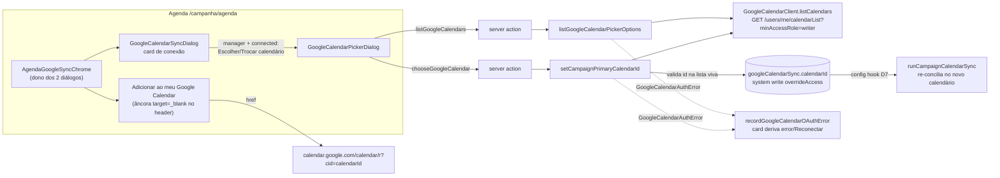

# Impl: C150 — Agenda: calendário principal escolhido pelo candidato/coordenador + inscrição de staff no Google

Status: em execução
Atualizado em: 2026-09-12
Issue: #935
Intenção: docs/plans/c150-calendario-principal-e-inscricao-staff.md
Appetite restante: ~1,5–2 dias eng (herdado)

## Leitura da intenção

- **Outcome:** na própria agenda (`/campanha/agenda`), o candidato/coordenador lista os calendários da conta Google conectada (C149) e escolhe o calendário principal da campanha — create/edit passam a espelhar nele; um staff adiciona a agenda ao Google pessoal com um clique, sem copiar link nem "Por URL". O recorte filtrado segue no feed ICS atual.
- **O que NÃO negociar:** leader lockdown (nem vê as ações); Teqo segue SoT; um calendário principal só (nada de N espelhos); motor C114/C115 não muda de modelo; falha do Google não derruba a agenda (estado do sync visível); admin do Payload continua como escape hatch; o fluxo do recorte ICS (`CalendarFeedDialog`) fica intocado; OAuth por pessoa e backfill do calendário antigo são anti-goals.
- **O que reavaliar (divergências registradas no plano):**
  - A "Direção no codebase" sugeria abrir `canSetGoogleCalendarSyncConfigField` a candidato/coordenador. **Rejeitado** (D2): a escrita passa por action de manager + utility system write com validação "id pertence à lista viva da conta conectada"; o campo segue admin-only.
  - O bullet de e2e do explorador propõe interceptar `oauth2.googleapis.com/token` e `www.googleapis.com/calendar/v3/...` com `page.route`. **Impossível** (D7): `page.route` só vê o tráfego do browser; a listagem roda no processo Next (server action). O caminho feliz lista/escolhe fica no int com stub client; o e2e cobre os contratos do browser.
  - O rascunho UI desenha o botão mobile full-width; o cluster do top bar não suporta isso — adaptado para ícone + `aria-label` (D6).
  - A cena de "confirmação da inscrição" do rascunho não é implementável (o Google não chama de volta); fora de escopo (não escopo de engenharia).

## Abordagem recomendada

**Opções consideradas:** A) listagem no client + actions de manager com validação viva + picker como diálogo próprio + literal `cid=<calendarId>` | B) abrir `canSetGoogleCalendarSyncConfigField` a `isCampaignUnrestricted` (hipótese da intenção) | C) armazenar nome/summary do calendário e fazer o picker a partir do banco.

**Recomendação:** A — mantém o motor e o modelo de dados intocados, concentra a nova escrita num utility com bypass e validação server-side (mesmo padrão de `recordGoogleCalendarOAuthConnection`), e entrega os dois outcomes com um componente de diálogo novo e zero migration. B abriria escrita crua de id arbitrário pela superfície REST do `campaignUser` sem a validação "pertence à conta conectada"; C exige migration e sofre drift quando o calendário é renomeado no Google.

**Rejeitadas:** B porque o enforcement de papel não substitui a validação de pertencimento (e o admin deve seguir funcionando como escape hatch); C porque a lista é viva e o "em uso" deriva de `state.calendarId` sem persistir nada.

### Componentes / mudanças

**Server**

- **`GoogleCalendarClient.listCalendars`** (`src/utilities/googleCalendarClient.ts`): método novo na superfície existente (mesmo `apiFetch`, mesmo cache de token, mesmo retry de 401, mesmo timeout de 15s). `GET {base}/users/me/calendarList` com `minAccessRole=writer`, `showHidden=true`, `maxResults=250`, `fields=items(id,summary,primary,deleted),nextPageToken` e loop de `pageToken`; filtra `deleted`; `summary` cai para o `id` quando ausente. Tipo novo `GoogleCalendarListEntry = { id: string; summary: string; primary: boolean }`. `CALENDAR_LIST_PAGE_SIZE = 250`.
- **`listGoogleCalendarPickerOptions(payload, options?: { client?: GoogleCalendarClient })`** (`src/utilities/googleCalendarSync.ts`): carrega a row (`loadGoogleCalendarSyncConfig`), resolve `readGoogleCalendarAuth` e **exige `auth.kind === 'oauth'`**; cria o client (ou usa `options.client`) e devolve `{ ok: true; calendars } | { ok: false; reason: 'not-connected' | 'auth-error' | 'api-error'; message }`. Em `GoogleCalendarAuthError`, grava `recordGoogleCalendarOAuthError` e devolve `reason: 'auth-error'` com a mensagem do erro (já segura, pt-BR). `GoogleCalendarPickerOption = GoogleCalendarListEntry` (alias, sem twin de shape).
- **`setCampaignPrimaryCalendarId(payload, calendarId, options?)`** (mesmo arquivo): reusa `listGoogleCalendarPickerOptions` (inclusive o record de auth error), exige que `calendarId` esteja na lista viva (`not-listed` quando não está), no-op quando já é o atual, e escreve com `payload.update({ collection: 'googleCalendarSync', id, data: { calendarId }, depth: 0, overrideAccess: true })` — o hook `googleCalendarSyncConfigHook` (D7) dispara `runCampaignCalendarSync` no novo calendário. Nunca cria row (a row conectada existe; sem row → `not-connected`).
- **Actions** (`src/app/(campaign)/campanha/actions/googleCalendarSync.ts`, mesmo padrão manual try/catch — sem `runCampaignFormAction`/zod):
  - `listGoogleCalendars(): Promise<GoogleCalendarListActionResult>` — `loadConnectionManager` (candidate/coordinator) + utility; falha de papel devolve `{ ok: false, message: GOOGLE_CALENDAR_PRIMARY_MANAGER_ONLY_MESSAGE }`.
  - `chooseGoogleCalendar(calendarId: string): Promise<GoogleCalendarSyncActionResult>` — `loadConnectionManager`; valida `typeof calendarId === 'string'` com tamanho sano; utility; sucesso devolve `{ ok: true, canManageConnection: true, ...withLinks(await readGoogleCalendarSyncView(payload)) }` (mesmo shape das outras actions); falha devolve `failure(message, true)`.
  - Tipos/mensagens novos: `GoogleCalendarPickerOption`, `GoogleCalendarListActionResult = { ok: true; calendars } | { ok: false; message }`, `GOOGLE_CALENDAR_PRIMARY_MANAGER_ONLY_MESSAGE`, `GOOGLE_CALENDAR_PICKER_NOT_CONNECTED_MESSAGE`, `GOOGLE_CALENDAR_PICKER_NOT_LISTED_MESSAGE`, `GOOGLE_CALENDAR_PICKER_LIST_FAILED_MESSAGE`.
- **`buildGoogleCalendarAddLink`** (`src/lib/googleCalendarLink.ts`): `cid=${encodeURIComponent(calendarId)}` (literal da intenção); `buildGoogleCalendarWebcalUrl` e `buildGoogleCalendarPublicIcalUrl` permanecem exportados/intocados (Apple/Outlook). Atualizar o doc-comment do módulo (o `cid` não é mais a URL webcal).
- **Migration:** **nenhuma** — `payload-types.ts` intocado. Débito S3 (constraint singleton) adiado de novo (D3).

**UI (Impeccable B — encaixe na agenda; shell/dialog existentes)**

- **`GoogleCalendarPickerDialog.tsx`** (novo, `src/components/campaign/activity/`): Dialog desktop / Drawer mobile com o mesmo chrome do `GoogleCalendarSyncDialog` (header/scroll-body/footer). Props `{ open, onOpenChange, currentCalendarId, onListCalendars, onChooseCalendar }`. Estados `loading | error | empty | ready` com "Tentar de novo"; lista de opções com `summary`, marca "em uso" quando `id === currentCalendarId` e hint "principal da conta" quando `primary`; seleção local; rodapé "Cancelar" / "Escolher calendário" (desabilitado sem seleção, sem mudança ou busy).
- **`GoogleCalendarSyncDialog.tsx`**: prop nova `onOpenPicker: () => void`; no bloco `connected` (manager) botão "Escolher calendário principal" (ou "Trocar calendário principal" quando `state.calendarId`); non-manager vê a copy "O calendário principal da campanha é escolhido por candidato ou coordenação." (substitui "escolhido na configuração do Painel"); o `content` de `status === 'not-configured' && connection === 'connected'` passa a apontar para o botão (manager) / informar a escolha do núcleo (non-manager); bloco manual: input vira `buildGoogleCalendarPublicIcalUrl(state.calendarId)` (label "URL pública do calendário (Por URL, Apple Calendar e Outlook)") + âncora one-click "Adicionar ao meu Google Calendar" (`state.addLink`); instruções "Por URL" passam a casar com o input.
- **`AgendaGoogleSyncChrome.tsx`**: props novas `onListCalendars`, `onChooseCalendar`; estado `pickerOpen`; `openPicker` fecha o diálogo do espelho e abre o picker (overlays não empilham — ver D5), `onOpenChange(false)` do picker reabre o do espelho; `handleChooseCalendar` chama a action e `setState(result)` no sucesso; registra `SetCampaignHeaderAction id="google-calendar-add"` com a âncora one-click quando `state.addLink` existe (desktop com rótulo `hidden md:inline-flex`, mobile ícone `md:hidden` com `aria-label`/`title` "Adicionar ao meu Google Calendar"); pill e auto-retry intocados; FAB continua abrindo o diálogo do espelho.
- **`agenda/page.tsx`**: injeta as duas actions novas no chrome (`listGoogleCalendars`, `chooseGoogleCalendar`) junto das 5 atuais.
- **`scripts/lib/e2e-affected-manifest.mjs`**: adicionar `src/lib/googleCalendarLink.ts` e `src/app/(campaign)/campanha/actions/googleCalendarSync.ts` à entry C149 do domínio → `campaignAgendaGoogleSync`.

### Dados → forma

Não se aplica como apresentação de dado do Teqo (nenhuma leitura nova; a intenção adiou a forma). O único dado apresentado é a lista viva da conta Google, com shape mínimo `{ id, summary, primary }` e "em uso" derivado de `state.calendarId` — sem persistência. Forma escolhida: lista de opções (radio-like) com o calendário atual marcado; **rejeitadas:** select/combobox (esconde o contexto do "em uso" e o estado vazio), armazenar `summary` (D3), lista cacheada (D1).

## Decisões de engenharia (decisão + por quê + rejeitadas; só as caras de reverter)

1. **Listagem como método novo do client, OAuth-only na borda (D1).** `listCalendars()` entra na superfície do `GoogleCalendarClient` (transporte fino) e a exigência de OAuth fica no utility (`auth.kind !== 'oauth'` → `not-connected`). Params `minAccessRole=writer` + `showHidden=true` + paginação + filtro `deleted`. **Opções:** A) método no client + enforcement no utility | B) método restrito ao branch OAuth do tipo union | C) listar via service account. **Recomendação: A** — o client já é agnóstico de auth (SA/OAuth) e a autorização é concern do domínio; B bifurca o tipo sem ganho; C não enxerga os calendários compartilhados (a `calendarList` do SA só contém os dele). **Rejeitadas:** `showHidden=false` (o default — o calendário criado pela operação pode estar desmarcado no Google e sumir do picker, justamente o que o usuário quer escolher); cache da lista/summary na row (migration + drift, D3); `syncToken` incremental (complexidade sem ganho para uma lista de dezenas de itens).
2. **Escrita do `calendarId`: action de manager + utility system write com validação viva (D2).** `chooseGoogleCalendar` → `setCampaignPrimaryCalendarId` com `overrideAccess: true`, validando que o id está na lista viva (`minAccessRole=writer`) da conta conectada. **Opções:** A) action + utility com bypass | B) abrir `canSetGoogleCalendarSyncConfigField` a `isCampaignUnrestricted` (hipótese da intenção) | C) novo field access por papel. **Recomendação: A** — a superfície REST do `campaignUser` nunca escreve id arbitrário; a validação de pertencimento roda server-side e o write segue o padrão C149; o admin continua podendo configurar direto no Painel (escape hatch). **Rejeitadas:** B porque field access não valida valor nem roda o record de auth error (e abriria `calendarId` cru ao REST); C porque fragmenta o enforcement sem cobrir a validação. **Divergência da intenção registrada:** o outcome (escolher sem admin) é preservado; o caminho é outro.
3. **Sem migration; lista viva (D3).** Nenhum campo novo; o picker marca "em uso" por `state.calendarId`. **Opções:** A) não armazenar | B) `calendarSummary` na row. **Recomendação: A** — zero schema e zero drift. **Rejeitadas:** B (migration cosmética + summary desatualizado quando o calendário é renomeado no Google). **S3 (constraint singleton):** adiado de novo; o C150 não cria rows (só atualiza a row conectada), então o risco de twins segue teórico — gatilho de revisitação: qualquer caminho novo que crie row ou twins observados em prod; sem coluna natural de singleton, a constraint exigiria migration hand-written.
4. **Erro de auth na listagem grava o estado de conexão (D4).** `GoogleCalendarAuthError` → `recordGoogleCalendarOAuthError` + falha `reason: 'auth-error'`. **Opções:** A) gravar só `invalid_grant` | B) não gravar | C) gravar qualquer erro. **Recomendação: A** — mesma classificação do motor (C149 D4): `invalid_grant` é reconectável e o card deriva `error`/Reconectar; o picker é outro consumidor da mesma credencial. **Rejeitadas:** B (card diria "Conectado" enquanto o picker falha — estado desonesto); C (`invalid_client`/5xx não se consertam reconectando). Residual aceito: o badge do card atualiza no próximo read de view; a mensagem do picker já instrui "Reconecte a conta".
5. **Picker como diálogo próprio; chrome dono dos dois; sem empilhar overlays (D5).** Novo `GoogleCalendarPickerDialog` (Dialog/Drawer, mesmo chrome), aberto a partir do card de conexão para manager com `connection === 'connected'`. O chrome fecha o diálogo do espelho ao abrir o picker e o reabre quando o picker fecha — um overlay por vez (Radix/vaul aninhados têm scroll-lock/focus frágeis no mobile). **Opções:** A) diálogo próprio com troca de overlay | B) lista expansível dentro do `GoogleCalendarSyncDialog` | C) rota/página nova. **Recomendação: A** — o picker tem ciclo próprio (loading/erro/vazio/retry) e o diálogo do espelho já é denso; o chrome já é dono do estado (padrão C148). **Rejeitadas:** B (duas máquinas de estado num modal cheio); C (cerimônia e rota nova sem URL pública a proteger); empilhar os dois overlays (risco de focus/scroll no mobile).
6. **One-click com `cid=<calendarId>` + reconciliação do bloco manual (D6).** `buildGoogleCalendarAddLink` passa a `https://calendar.google.com/calendar/r?cid=${encodeURIComponent(calendarId)}`; header ganha a âncora (desktop com rótulo, mobile ícone + `aria-label`); o input do diálogo passa a `buildGoogleCalendarPublicIcalUrl(calendarId)` (o "Por URL" e Apple/Outlook assinam a URL iCal pública) + âncora one-click dentro do diálogo; `CalendarFeedDialog` (recorte ICS) intocado. **Opções:** A) literal da intenção + input iCal público | B) manter webcal no `cid` | C) dois inputs. **Recomendação: A** — o fluxo de adicionar calendário do Google interpreta `cid` como id do calendário; as instruções "Por URL" atuais já estavam desalinhadas com o `cid` webcal (o input antigo não era a URL iCal pública); Apple/Outlook continuam servidos pela URL iCal. **Rejeitadas:** B (infiel ao literal); C (mais chrome que o menor ajuste); remover o bloco manual (quebraria Apple/Outlook e o "copie e envie"); um-clique para o recorte ICS (anti-goal da intenção).
7. **E2E sem interceptar fetch do servidor (D7 — emenda ao bullet do explorador).** `page.route` intercepta só o tráfego do browser; a listagem roda na server action (processo Next). **Opções:** A) e2e cobre contratos do browser (href do one-click, ausência para advisor, ícone mobile, botão do manager) + caminho feliz lista/escolhe no int com stub | B) env de base URL do Google para teste | C) semear refresh token real e chamar o Google. **Recomendação: A** — determinístico e sem rede (mesma doutrina C114/C149); o int prova a validação viva e o D7 com `listEvents(novoId)`. **Rejeitadas:** B (superfície de produção — base URL do Google por env — existindo só por teste); C (flake de rede/credencial dummy no CI).
8. **Seam de teste por injeção de client nas utilities (D8).** `listGoogleCalendarPickerOptions`/`setCampaignPrimaryCalendarId` aceitam `options.client?: GoogleCalendarClient` (precedente `runCampaignCalendarSync.options.client`); o int novo mocka `@/utilities/googleCalendarClient` (stub com `listCalendars`/`listEvents` gravando o `calendarId`) e `campaignActionContext`, serializado por `serializeGoogleCalendarSyncSpec()`. **Opções:** A) injeção de client | B) mock global de `fetch` | C) só o fake credential (falha no JWT). **Recomendação: A** — prova direta da rejeição de id fora da lista e da reconciliação no novo calendário; C não prova qual calendário foi usado. **Rejeitadas:** B (o action não injeta `fetchImpl`; mockar `fetch` global vaza para o resto do spec).
9. **Manifest cobre o literal e as actions (D9).** Adicionar `src/lib/googleCalendarLink.ts` e `src/app/(campaign)/campanha/actions/googleCalendarSync.ts` à entry C149 → `campaignAgendaGoogleSync`. **Rejeitada:** confiar no smoke fallback (o literal do link e as actions não acordariam o spec da agenda).

## Fases verificáveis

1. **Tracer/servidor (~50%, ≈0,8–1 dia)**
   - `listCalendars` no client + unit em `tests/unit/googleCalendarClient.unit.spec.ts` (params `minAccessRole=writer`/`showHidden=true`, paginação por `nextPageToken`, filtro `deleted`, fallback do summary, retry de 401, `invalid_grant` → `GoogleCalendarAuthError`).
   - Utilities `listGoogleCalendarPickerOptions`/`setCampaignPrimaryCalendarId` + actions `listGoogleCalendars`/`chooseGoogleCalendar` + tipos/mensagens.
   - Int novo `tests/int/googleCalendarPrimaryCalendarAction.int.spec.ts` (mocks do client e do contexto + advisory lock): advisor recusado; lista para coordinator; `invalid_grant` grava `oauthErrorAt/oauthError`; id fora da lista rejeitado sem write; id listado escreve `calendarId` e o hook D7 reconcilia no novo (`listEvents` chamado com o novo id); no-op quando já é o atual.
   - Gate: `pnpm gate:fast`.
2. **UI + links (~35%, ≈0,6 dia)**
   - `buildGoogleCalendarAddLink` literal + pins (`tests/unit/googleCalendarLink.unit.spec.ts`, e2e do input).
   - `GoogleCalendarPickerDialog` novo + `tests/unit/googleCalendarPickerDialog.unit.spec.tsx` (loading/erro/vazio/lista, "em uso", confirmar desabilitado sem mudança, escolha chama o callback).
   - `GoogleCalendarSyncDialog` (botão/copy/iCal público/âncora) + `tests/unit/googleCalendarSyncDialog.unit.spec.tsx`; `AgendaGoogleSyncChrome` (estado dos dois diálogos + header add) + `tests/unit/agendaGoogleSyncChrome.unit.spec.tsx`; `page.tsx` injeta as actions.
   - Gate: `pnpm gate:fast`.
3. **E2E + manifest + gates (~15%, ≈0,3 dia)**
   - `tests/e2e/campaignAgendaGoogleSync.e2e.spec.ts`: href do one-click com `cid=<calendarId>` e `target=_blank`; advisor sem o botão + copy; manager com "Trocar calendário principal"; mobile com o ícone (`aria-label`); input do diálogo com a URL iCal pública.
   - Manifest (D9). Gate: `pnpm gate:fast`; `pnpm test:e2e:affected` (deve incluir `campaignAgendaGoogleSync`); `pnpm push`.

**Cortes se o appetite estourar (nesta ordem):** (1) hint "principal da conta" e polish do picker; (2) âncora one-click dentro do diálogo (mantém header + input iCal); (3) asserção mobile no e2e (unit cobre o ícone); (4) `fields` no request da listagem. **Nunca cortar:** a validação do id na lista viva (D2), o record do auth error (D4) e o int do D7.

## Rabbit holes / Não escopo (engenharia)

- **Backfill/limpeza do calendário abandonado:** trocar `calendarId` reusa a reconciliação D7 e o calendário antigo fica congelado (design C114 D7, provado em `tests/int/googleCalendarSync.int.spec.ts:396-418`); nenhum retro-cleanup.
- **Limpar `calendarId` no disconnect:** C149 intocado; gatilho de revisitação — suporte observar "reconectei outra conta e o espelho pausou"; a UI do picker já lida (nenhum item "em uso") e o manager reescolhe.
- **Estado de confirmação pós-one-click** ("Agenda adicionada"): o Google não chama de volta; a cena do rascunho não é implementável.
- **One-click para o recorte ICS / feed externo:** anti-goal (cid infiel); `CalendarFeedDialog` fica como está.
- **OAuth por pessoa, N calendários, calendário por assessor:** anti-goals C114/intenção.
- **Cache da lista/summary, `syncToken` incremental:** D1/D3.
- **Constraint singleton (S3):** adiada de novo (D3), com gatilho.
- **Env de base URL do Google para teste:** D7.
- **Mexer no motor C114/C115** (snapshot pino, canal push, janela, locks) e no `GoogleCalendarSyncDialog` além dos blocos descritos: fora.
- **Rate limiting na listagem:** manager-only e aberta por gesto; sem superfície nova de abuso.

## Riscos e mitigação

- **Listagem pode segurar o diálogo (token + N páginas, cada hop 15s):** o picker tem estado de loading e "Tentar de novo"; `REQUEST_TIMEOUT_MS` existente limita cada hop; ação de manager, sem caminho crítico da agenda.
- **Calendário some entre a listagem e a escolha:** `setCampaignPrimaryCalendarId` re-lista e rejeita (`not-listed`); a mensagem pede atualizar a lista.
- **`invalid_grant` no meio do fluxo:** a listagem grava o erro de conexão; o picker mostra a mensagem e o card deriva `error`/Reconectar no próximo read (residual documentado em D4).
- **Crowding do header desktop** (pill + rótulo longo + import + IA + sino): rótulo com `shrink-0`/`whitespace-nowrap`; encurtar a copy ou esconder o rótulo em `md` (cheap polish) se a inspeção visual acusar.
- **Overlays empilhados no mobile:** evitado por desenho (D5) — o picker substitui o diálogo do espelho enquanto aberto.
- **E2E da agenda é serial e compartilha a row singleton:** os seeds novos usam `lastSuccessAt` futuro (imune a `lastErrorAt` de specs paralelas) e nunca disparam action contra o Google; sem refresh token real nos seeds que abrem o picker (o botão não é clicado no e2e).
- **Sem rede no e2e:** o caminho feliz lista/escolhe é int com stub; a prova de produção fica no smoke manual pós-deploy (mesma doutrina C149).
- **`buildGoogleCalendarPublicIcalUrl` passa a ser usado** (era export não consumido em `src`): sem impacto; knip já tolerava.
- **`unmapped-risk` no CI:** as mudanças tocam `src/utilities/access`? Não — o access fica intocado (D2); o manifest entra no mesmo PR.

## Qualidade da decisão

**Auto-avaliação: 4/5** — todas as decisões caras (listagem, escrita do `calendarId`, schema, auth error, UI, literal do link, estratégia de teste) têm recomendação e rejeitadas ancoradas em achados concretos (union de auth C149, precedente de system write, hook D7, pins de teste, manifest); o appetite cabe (~1,7–1,9 dia) e o depth check reusa client/utility/action/dialog/hook existentes, criando só o componente de picker (ciclo de estados próprio). Perde 1 ponto porque o caminho feliz da listagem real (shape do Google, `showHidden`, paginação) só é provado por unit/int com stub — sem e2e de rede (D7) —, então a verificação contra o Google real fica no smoke pós-deploy.

## Execução — desvios e decisões emergentes (2026-09-12)

- **`buildGoogleCalendarWebcalUrl` removido:** o plano previa mantê-la para Apple/Outlook, mas o diálogo serve esse caminho com a URL iCal pública (HTTPS); o export ficou morto e saiu no simplify.
- **Validação do id e leitura única:** `resolveGoogleCalendarPickerClient` dobrado em `loadWritableGoogleCalendars`, que recebe o doc já carregado — a escolha faz uma leitura da row, não duas.
- **Picker sem roles ARIA de radio:** a lista usa botões com `aria-pressed` (roving tabindex/owned-children não valem a cerimônia); a seleção fica desabilitada durante a escolha e há guarda de sessão (`sessionRef`) contra corrida de close/reopen.
- **Catch explícito no picker:** listagem/escolha rejeitadas (sessão expirada/serialização) caem em erro com "Tentar de novo" — nunca spinner infinito.

## Débitos (triage do /simplify)

| ID  | Achado                                                         | Score | Tipo          | Destino                                                                                                       |
| --- | -------------------------------------------------------------- | ----- | ------------- | ------------------------------------------------------------------------------------------------------------- |
| S1  | 3ª cópia do chrome responsivo Dialog/Drawer (Picker/Sync/Feed) | 3     | cheap_polish  | Registrado: **C156** (#965) — `docs/plans/escala-dry-pos-c150.md` (o gatilho do C148 disparou com o 4º modal) |
| S2  | Copy "Adicionar ao meu Google Calendar" duplicada              | 2     | cheap_polish  | Absorvido como F3 cortável do C156                                                                            |
| S3  | Máquinas de estado semelhantes Picker/Sync                     | 2     | defer_trigger | Defer no plano do C156: 3º diálogo com a mesma máquina busy/erro/ação                                         |

- **Já resolvido no simplify (não reabrir):** guarda de sessão/catch do picker; `CalendarOption`; envelope `applyState` no chrome; `addLink` derivado no diálogo; webcal morto; leitura única da row; flag `changed` removida; roles ARIA.
- **Explicitamente fora:** copy única fora do C156; máquinas de estado unificadas; shell do `ActivityOverlay`.

## Aceite de engenharia

- [ ] Aceite de produto da intenção ainda coberto: candidato/coordenador escolhe o calendário principal na agenda; create/edit espelham nele; staff adiciona a agenda ao Google com um clique; recorte ICS intocado; admin do Payload segue escape hatch.
- [ ] Invariantes AGENTS/engineering-standards: `leader` sem agenda; escrita system com `overrideAccess` justificado e papel checado na action; identificadores em inglês, copy pt-BR; sem migration (nenhuma antiga editada).
- [ ] `calendarId` só é escrito após validação de que o id está na lista viva da conta conectada (`minAccessRole=writer`); `canSetGoogleCalendarSyncConfigField` segue admin-only.
- [ ] Trocar o calendário dispara a reconciliação D7 no novo calendário (int prova `listEvents(novoId)`); nenhum backfill/limpeza no calendário antigo.
- [ ] `GoogleCalendarAuthError` na listagem/escolha grava `oauthErrorAt/oauthError` e o card deriva `error`/Reconectar; `invalid_client`/5xx não sujam a conexão.
- [ ] `buildGoogleCalendarAddLink` = `cid=<calendarId URL-encoded>`; âncora de header (desktop com rótulo, mobile ícone + `aria-label`) visível só com `addLink`; diálogo mantém URL iCal pública para "Por URL"/Apple/Outlook.
- [ ] Testes previstos verdes: unit do client/link/picker/sync dialog/chrome; int novo das actions (papel, id fora da lista, write + D7); e2e `campaignAgendaGoogleSync` estendido (href, advisor, manager, mobile).
- [ ] `pnpm gate:fast` verde; `pnpm test:e2e:affected` inclui `campaignAgendaGoogleSync` (manifest cobre `googleCalendarLink.ts` e `actions/googleCalendarSync.ts`) e passa local; `pnpm push`.
