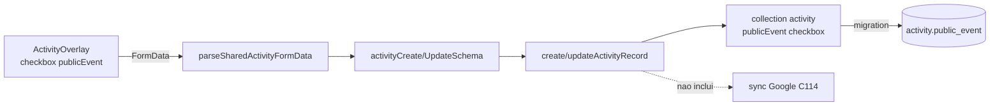

# Impl: Atividade: marcar evento como público (base para exposição no site)

Status: aprovado
Atualizado em: 2026-09-12
Issue: #936
Intenção: docs/plans/c151-atividade-evento-publico.md
Appetite restante: herdado (~0,5 dia eng) — cabe sem corte.

## Leitura da intenção

- **Outcome:** o staff marca/desmarca "Evento público" no modal de atividade; a marcação é
  durável, volta correta ao reabrir e fica consultável — sem nenhuma tela mudar de comportamento.
- **O que NÃO negociar:** exposição pública é item futuro (PUB), nada no `(frontend)`; sem filtro/badge
  na lista; sem collection paralela; `leader` segue lockdown (não vê o campo); o espelho do Google
  (C114) não é influenciado em v1.
- **O que reavaliar:** a hipótese do plano de intenção ("a marcação vive na atividade existente")
  confirma-se — nenhuma surpresa de acoplamento na exploração.

## Abordagem recomendada

**Opções consideradas:** A) campo boolean na `activity` existente (draft) | B) collection/entidade
"evento público" separada | C) global/config paralela.

**Recomendação:** A — a intenção fixa a flag na atividade existente; é um checkbox de negócio, indexado,
sem access especial (quem edita a atividade marca).

**Rejeitadas:** B porque duplica cadastro e cria divergência de dados (anti-goal explícito da intenção);
C porque não há escopo por item — a flag é por atividade.

### Componentes / mudanças

- **`publicEvent`** (`src/collections/Activity.ts`): `type: 'checkbox'`, `label: 'Evento público'`,
  `defaultValue: false`, `index: true`, `admin.description` "Quando marcado, este evento poderá ser
  publicado no site do candidato (futuro)." — espelha `deputyPresent`/`allDay` (sem `access` de field:
  qualquer staff com linha pode marcar).
- **`activityStaffFieldSnapshot`** (`src/collections/Activity.ts`): incluir
  `publicEvent: Boolean(doc.publicEvent)` no snapshot do guard de liderança — mantém a defesa em
  profundidade (liderança, se algum dia alcançar o write path, não marca campo de staff). Access
  `canReadActivity`/`canUpdateActivity` já negam `leader`; isto é só cinto de segurança barato.
- **`src/lib/schemas/activity.ts`**: adicionar `publicEvent: z.boolean().optional()` em
  `activityFieldsSchema` (herdado por create/update `.partial()`).
- **`src/utilities/activityFormData.ts`**: `publicEvent: checkboxFormValue(formData, 'publicEvent')`
  em `parseSharedActivityFormData` — sem isso o checkbox é silenciosamente descartado no submit.
- **`src/utilities/activityViewModels.ts`**: `ActivityFormViewModel.publicEvent: boolean` +
  `activityFormSelect.publicEvent` + `toActivityFormViewModel`. **Não** tocar em
  agenda/list/detail selects/view models (nada de badge/coluna/consumo novo).
- **`src/components/campaign/activity/ActivityOverlay.tsx`**: checkbox "Evento público" na
  `scheduleSection`, logo após "Todo o dia" (posição do rascunho UI aprovado), `name="publicEvent"`,
  `defaultChecked={isEdit ? editDraft?.publicEvent : false}`, `aria-label="Evento público"`.
- **Migration:** `pnpm migrate:create add_activity_public_event` — copia exata do precedente
  `20260810_010844_add_activity_all_day` (`ADD COLUMN "public_event" boolean DEFAULT false` +
  índice btree `activity_public_event_idx`). Depois `pnpm generate:types` (`src/payload-types.ts`).
- **Google Calendar (C114):** `SYNC_RELEVANT_ACTIVITY_FIELDS` **não** recebe `publicEvent` — decisão
  v1 da intenção; editar só a flag não re-dispara sync nem carimba `lastMirroredChangeAt`.
- **UI:** Impeccable B (encaixe no modal). Reusa `Checkbox` + `Field` do próprio overlay; sem seção
  nova, sem shell novo. Shape já aprovado no rascunho `c151-atividade-evento-publico-ui-draft.html`.

### Dados → forma (se aplicável)

- Não aplicável: nenhuma superfície de dados neste item (a intenção já decidiu "não apresentar dados").

## Fases verificáveis

1. **Tracer schema+server** — campo + migration + zod + parser + select/view model do form;
   int test prova persistência e reabertura (`loadActivityEditDraftRecord` devolve `publicEvent`).
2. **UI** — checkbox no `scheduleSection`; unit test do overlay (render no create e no edit, submit
   manda `publicEvent=on` só quando marcado).
3. **Gates** — `pnpm gate:fast`; `pnpm test` (unit+int) na entrega; push via `pnpm push`.

## Rabbit holes / Não escopo (engenharia)

- Expor no site público, agenda pública, SEO ou share kit (item PUB futuro).
- Badge/coluna/filtro na lista de atividades, na agenda ou no detalhe.
- Ligar a flag ao espelho do Google (C114) — decidido fora em v1.
- Tornar `publicEvent` system field (`canSetActivitySystemField`) ou restricted access — não pedido.
- Marcação em lote / spreadsheet mode.

## Riscos e mitigação

- **Risco:** checkbox silenciosamente descartado no submit se o parser/zod não acompanhar. **Mitigação:**
  unit test do overlay + int test de parse/persistência.
- **Risco:** a flag vazar para abas/visões como comportamento novo. **Mitigação:** mudanças restritas a
  form select/view model; nenhum agenda/list/detail select alterado.
- **Risco:** migration sem regenerar tipos → erro de `tsc`. **Mitigação:** `migrate:create` +
  `generate:types` + `pnpm typecheck` no gate.

## Débitos triados (simplify)

- **Já resolvido:** o `migrate:create` arrastou drift de `supporter_import_batch.actor_id`
  (snapshot stale dos hand-written 20260824) com `down` rollback-inseguro — removido, a migration
  só mexe em `public_event`; changelog da entrega criado; racional C126 do `farFuture` no int;
  status do plano finalizado.
- **Descartado (YAGNI):** índice parcial em vez de btree pleno para um boolean de 2 valores — sem
  medição que justifique; a intenção pediu "indexado" e o precedente `all_day` usa btree pleno.
- **Defer (gatilho):** extrair um `OverlayCheckboxField` local para os três checkboxes idênticos do
  overlay (`deputyPresent`/`allDay`/`publicEvent`) — só quando um 4º checkbox ou mudança real de UX
  no bloco justificar.
- **Defer (gatilho):** teste de regressão pinando `publicEvent` fora de `SYNC_RELEVANT_ACTIVITY_FIELDS`
  e dos selects de agenda/lista — hoje a type honesty (view models sem o campo) cobre agenda/lista/
  detalhe; adicionar o pin quando o item PUB ligar a flag a um consumidor.

## Aceite de engenharia

- [x] Aceite de produto da intenção ainda coberto (marca/desmarca, durável, reabre correto, nada muda)
- [x] Invariantes AGENTS/engineering-standards (leader lockdown, copy pt-BR/identificadores EN)
- [x] Testes de domínio previstos (unit do overlay + int de persistência/parse + e2e de roundtrip)
