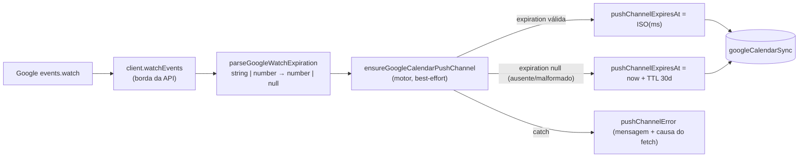

# Impl: Agenda: canal de push do Google Calendar nunca registra (expiration string → Invalid time value)

Status: rascunho
Atualizado em: 2026-09-15
Issue: #1009
Intenção: docs/plans/c164-canal-push-google-expiration.md
Appetite restante: herdado — ~0,5 dia eng (fix pequeno, sem UI, sem migration)

## Leitura da intenção

- **Outcome:** o canal de push Google→Teqo volta a registrar no primeiro sync (`pushChannelId`/`pushChannelResourceId`/`pushChannelExpiresAt` preenchidos, `pushChannelError` nulo), renova sozinho antes de expirar e uma edição/cancelamento no Gmail reflete na atividade do Teqo em segundos-minutos, sem sync manual.
- **O que NÃO negociar:** guardrail best-effort (falha do canal nunca derruba o espelho Teqo→Google nem grava `lastError`/pausa o sync); sem migration, sem Consent, sem UI; erro do canal continua registrado para diagnóstico; contrato público do webhook e rota inalterados.
- **O que reavaliar (confirmado no reconhecimento):** a hipótese de direção está certa — `watchEvents` tipa/ler `body.expiration` direto (`googleCalendarClient.ts:386-398`) e `ensureGoogleCalendarPushChannel` chama `new Date(expiration).toISOString()` (`googleCalendarSync.ts:1092-1094`) → `RangeError: Invalid time value` no catch. Dois ajustes de leitura: (1) `stubTransport` do unit não modela `/watch` — o ramo genérico `POST /events` engoliria o watch (`tests/unit/googleCalendarClient.unit.spec.ts:91-98`); (2) o fallback `expiration: null → expiresAt = now + TTL` **não** está pinado em int (o teste de canal afirma id/secret/erro, não `pushChannelExpiresAt`) — a cobertura será adicionada.

## Abordagem recomendada

**Opções consideradas:** A | B | C (decisão A abaixo; B/C rejeitadas)
**Recomendação:** normalizar na **borda** com um parser puro exportado (`parseGoogleWatchExpiration`) usado por `watchEvents`, mantendo `GoogleWatchChannel.expiration: number | null`; o motor continua dono do fallback de TTL e ganha só o enriquecimento da causa no catch.
**Justificativa:** é o menor diff que satisfaz a intenção, mantém o contrato já consumido pelo motor e pelos stubs int (number|null), e transforma o bug num pin unitário determinístico.

### Decisões de engenharia

#### A. Onde normalizar `expiration`

Opções: **A)** parser puro exportado `parseGoogleWatchExpiration` aplicado em `watchEvents` (borda), tipo de retorno `number | null` inalterado; **B)** coerção inline no motor; **C)** cliente devolver ISO string.
Recomendação: **A** — a intenção fixa "normalização na borda da API"; o cliente é o único que fala o dialeto JSON do Google (`int64` serializado em string) e o motor segue com o contrato tipado que stubs int/e2e já usam.
Alternativas rejeitadas: **B** porque espalha o conhecimento do formato do Google para o consumidor (o tipo do client passaria a mentir) e contradiz a intenção; **C** porque muda o contrato do client, duplica no cliente a conversão ms→ISO que o motor já faz e empurraria a decisão de fallback/TTL para a borda.

#### B. Fallback de TTL

Opções: **A)** manter o fallback atual no motor (`expiration ? ISO(ms) : now + PUSH_CHANNEL_TTL_SECONDS`) e o cliente devolver `null`; **B)** o cliente assumir o TTL (devolver `now + 30d` quando ausente); **C)** tratar `expiration` ausente como erro de canal.
Recomendação: **A** — TTL e lead de renovação (`PUSH_CHANNEL_TTL_SECONDS`, `PUSH_CHANNEL_RENEW_LEAD_MS`) são política de renovação do motor; `null` já é o contrato atual e os stubs int das actions já o usam. Cliente burro: devolve o que o Google mandou.
Alternativas rejeitadas: **B** porque move/duplica conhecimento de TTL e dá a `null` um significado que não é do Google; **C** porque contraria o guardrail best-effort — ausência de `expiration` não é falha do canal (o watch é válido; o TTL é cap do Google, não promessa).

#### C. Valores malformados

Opções: **A)** `typeof string ? Number(value) : value` + `Number.isFinite` + `> 0` + teto de `Date` (`MAX_DATE_MS = 8.64e15`, mesmo idiom de `speechVod.ts:177`); **B)** regex de dígitos `/^\d+$/`; **C)** lançar `GoogleCalendarApiError` em formato inesperado.
Recomendação: **A** — segue o precedente de normalização de borda do repo (`youtubeFeed.ts:112-113`: string → `Number` → `Number.isFinite`). Guardas: `> 0` rejeita epoch-0/negativa (e de quebra `Number('')`/`Number('   ')`, que dão 0 — sem `trim` extra); `<= MAX_DATE_MS` rejeita millis além do range do `Date`, onde o `toISOString()` do motor voltaria a lançar (a classe exata do bug). Malformado → `null` → fallback no motor, **nunca throw**.
Alternativas rejeitadas: **B** porque é um dialeto mais estrito que o contrato, sem falha real que as guardas não cubram (int64 decimal parseia exato; hex/exponencial não é emitido pelo `events.watch`) — fica complexidade sem ganho; **C** porque transforma dado estranho do Google em falha do canal, o oposto do fail-to-fallback pedido.

#### D. Expor parser / `GoogleWatchChannel` para teste

Opções: **A)** exportar `parseGoogleWatchExpiration` (puro) e testá-lo direto + um caso de regressão através de `watchEvents` com stub de transporte; **B)** manter o parser privado e testar só via `watchEvents`; **C)** exportar o tipo `GoogleWatchChannel`.
Recomendação: **A** — o parser exportado permite a matriz de bordas (string/number/null/ausente/malformado/zero) sem montar fetch, e o caso via `watchEvents` pina a fiação real (resposta JSON com `"expiration": "<millis>"`). O parser é usado em produção pelo próprio `watchEvents`, então o export não é test-only.
Alternativas rejeitadas: **B** porque obriga toda a matriz a passar pelo stub de fetch (mais cerimônia para o mesmo pin); **C** porque `GoogleWatchChannel` não tem consumidor externo e exportá-lo só para teste violaria a regra `exports: error` do knip (símbolo morto) e ampliaria a API do módulo sem necessidade — o teste estrutura o retorno sem nomear o tipo.

#### E. Contexto do `fetch failed` em `pushChannelError`

Opções: **A)** manter só a mensagem (adiar); **B)** anexar `error.cause.message` quando existir; **C)** logar a causa só no logger, sem persistir.
Recomendação: **B** — a questão em aberto da intenção recomenda B e o custo é uma linha no catch que já existe; o `fetch failed` intermitente fica diagnosticável no próprio campo que a operação consulta (admin/banco), sem tocar o guardrail (mesmo catch, mesmo best-effort, mesmo teto de 500 chars — a base é truncada primeiro, `baseMessage.slice(0, 500 - causeSuffix.length)`, para o teto não engolir a causa). Forma mínima: se `error` é `Error` e `error.cause` é `Error`, sufixar `` ` (causa: ${error.cause.message})` `` à `message`; caso contrário, comportamento atual. Nível de teste: **int**, stub `watchEvents` lançando `new TypeError('fetch failed', { cause: new Error('connect ETIMEDOUT') })` e assert de que `pushChannelError` contém as duas partes.
Alternativas rejeitadas: **A** porque a intenção explicitamente abre "registrá-lo melhor" e o custo é desprezível; **C** porque some do campo que a operação lê e exigiria caçar log no servidor.

#### F. Estratégia de teste da borda

Opções: **A)** estender `stubTransport` com ramo explícito para `/watch` antes do ramo genérico `POST /events` e corpo de watch configurável (default realista com string), mais testes diretos do parser; **B)** criar um fetch stub dedicado para `/watch`.
Recomendação: **A** — um único stub serve a todos os testes do client e o ramo explícito conserta a lacuna atual (hoje `url.includes('/events') && method === 'POST'` captura `/events/watch` e faria o teste novo falhar por motivo errado). Casos: `"expiration": "<millis>"` (string) → number; number finito → inalterado; ausente/null → null; malformado (`''`, `'abc'`, `0`) → null.
Alternativas rejeitadas: **B** porque duplica transporte para o mesmo arquivo sem ganho (DRY < 3).

#### G. Migration / Consent / UI

Opções: **A)** nenhum dos três; **B)** migration só para documentar; **C)** UI de diagnóstico do canal.
Recomendação: **A** — nenhuma mudança de schema, de PII ou de superfície; a verificação é operacional (banco + edição real no Gmail), como a intenção manda.
Alternativas rejeitadas: **B** porque migration sem mudança de schema é cerimônia; **C** porque é rabbit hole nomeado na intenção.

### Componentes / mudanças

- **`parseGoogleWatchExpiration`** (`src/utilities/googleCalendarClient.ts`): novo parser puro exportado (`unknown → number | null`), colocado fora de `createGoogleCalendarClient`, junto aos helpers de parsing do módulo. Shape: string → `Number`; passa number finito, `> 0` e `<= MAX_DATE_MS` (8.64e15 — range do `Date`, onde o `toISOString()` do motor seria válido); resto → `null`. Único call site: `watchEvents`.
- **`watchEvents`** (`src/utilities/googleCalendarClient.ts:374-399`): o cast do JSON vira `expiration?: unknown`; retorna `expiration: parseGoogleWatchExpiration(body.expiration)`. A validação de `id`/`resourceId` (throw `GoogleCalendarApiError`) e o tipo interno `GoogleWatchChannel` (não exportado) ficam como estão.
- **`ensureGoogleCalendarPushChannel`** (`src/utilities/googleCalendarSync.ts:1028-1114`): fluxo inalterado — o fallback `channel.expiration ? new Date(ms).toISOString() : new Date(Date.now() + PUSH_CHANNEL_TTL_SECONDS*1000).toISOString()` (1092-1094) permanece; única mudança é o sufixo de causa no `message` do catch (1108-1113). `PUSH_CHANNEL_TTL_SECONDS` continua no motor.
- **Migration:** nenhuma.
- **Access / Consent:** nada muda — campos continuam sistema-only (`canSetGoogleCalendarSyncSystemField`); nenhum `Consent` novo.
- **UI:** N/A (Impeccable A) — sem superfície nova ou alterada.
- **Manifest e2e:** sem mudança — `src/utilities/googleCalendarClient.ts` já mapeia para `campaignAgendaGoogleSync` (`scripts/lib/e2e-affected-manifest.mjs:114-134`).

### Dados → forma

N/A — a intenção já resolve: sem apresentação de dados; o estado do canal é verificação operacional.

## Fases verificáveis

1. **Parser + client + unit (RED→GREEN)** — quota ~50% do appetite.
   - **RED:** em `tests/unit/googleCalendarClient.unit.spec.ts`, adicionar ramo explícito `/events/watch` no `stubTransport` (antes do `POST /events` genérico) com corpo configurável (default `{ id: 'watch-1', resourceId: 'resource-1', expiration: '1757900000000' }`) e um teste via `client.watchEvents(...)` afirmando `expiration === 1757900000000` (number). Adicionar `describe('parseGoogleWatchExpiration')` com a matriz: `"1757900000000"` → number; `1757900000000` → number; `undefined`/`null` → null; `''`/`'   '`/`'abc'`/`0`/`NaN`/`8.64e15 + 1` → null.
   - **GREEN:** implementar o parser e aplicá-lo em `watchEvents`.
   - **Comando:** `pnpm test:unit -- tests/unit/googleCalendarClient.unit.spec.ts` (o script já injeta `DATABASE_URL` inválida e o alias `server-only`).
2. **Fallback + causa no motor (int)** — quota ~35%.
   - Estender `'ensures a push channel on the first pass...'` (`tests/int/googleCalendarSync.int.spec.ts:759-810`) para capturar a `expiration` devolvida e afirmar `pushChannelExpiresAt === new Date(expiration).toISOString()` (caminho number).
   - Novo caso, mesma família: stub com `expiration: null` → `pushChannelExpiresAt` dentro de `[now + 29d, now + 31d]` (fallback de 30d), `pushChannelId`/`pushChannelResourceId` preenchidos e `pushChannelError` nulo (fallback não perde o canal).
   - Novo caso (decisão E): stub `watchEvents` lança `new TypeError('fetch failed', { cause: new Error('connect ETIMEDOUT') })` → espelho segue `synced`, `pushChannelError` contém `fetch failed` **e** `connect ETIMEDOUT`.
   - Nota de não-duplicação: os stubs int das actions (`googleCalendarOAuthAction.int.spec.ts:107-112`, `googleCalendarPrimaryCalendarAction.int.spec.ts:101-105`) já usam `expiration: null` e não afirmam `pushChannelExpiresAt` — nada a remover; o caso novo preenche a lacuna.
   - **Comando:** `pnpm test:int -- tests/int/googleCalendarSync.int.spec.ts`.
3. **Gates + fechamento** — quota ~15%.
   - `pnpm gate:fast` (lint + typecheck + unit full).
   - `pnpm test:int -- tests/int/googleCalendarSync.int.spec.ts` verde.
   - E2E local discricionário (OPS72): `pnpm test:e2e -- tests/e2e/campaignAgendaGoogleSync.e2e.spec.ts` — o registro real do canal **não** é observável e2e (chave fake falha o JWT) e o spec cobre entrega de webhook, que não muda; registrar a discricionariedade no PR.
   - Changelog: `docs/changelog/2026-09-15-c164.md` (uma entrada curta).
   - `pnpm push` → PR com `Closes #1009`.
   - Verificação pós-deploy (operacional, do plano de intenção): após uma passada de sync, `pushChannelId`/`pushChannelResourceId`/`pushChannelExpiresAt` preenchidos e `pushChannelError` nulo; editar um evento no Gmail e ver a atividade atualizar sem sync manual. Runbook: `docs/ops/teqo-1313-deploy.md`.

## Rabbit holes / Não escopo (engenharia)

- **Perseguir o `fetch failed` intermitente** (DNS/timeout/transporte): sem causa determinística; corte — só registrar a causa (decisão E) e reavaliar se persistir depois do fix.
- **Redesenhar o modelo de canal** (cron dedicado, canal por usuário, stop proativo): o mecanismo lazy de garantir/renovar em toda passada é o dono; fora.
- **UI de diagnóstico do canal** no admin: fora; verificação é operacional.
- **OAuth / reconexão**: fora; a conexão está saudável e não é o defeito.
- **Helper compartilhado `toFiniteNumber`**: os idioms existentes (token `expires_in`, `youtubeFeed`) têm shapes diferentes (number-only vs string-only) e DRY < 3 para o novo; o parser fica no dono (client). Sem novo módulo.
- **Mexer no espelho Teqo→Google ou no webhook**: fora; o diff é borda (client) + mensagem de erro (motor).

## Riscos e mitigação

- **Contrato do client regredir** (retornar string/ISO ou lançar em malformado): parser puro com matriz unitária garante `number | null` e nunca throw; `watchEvents` segue lançando `GoogleCalendarApiError` só para `id`/`resourceId` ausentes.
- **Causa mascarar a mensagem original**: prefixo com `error.message` sempre presente; o assert int checa as duas partes (não a string completa).
- **Campo `pushChannelError` estourar**: o `slice(0, 500)` existente permanece; o sufixo de causa passa pelo mesmo corte.
- **Expiração degenerada (0/negativa) causar loop de renovação**: guarda `> 0` no parser + fallback `now + TTL` no motor; **expiração além do range do `Date` voltar a lançar no `toISOString()`**: teto `MAX_DATE_MS` no parser + fallback (mesma classe do bug, fechada na borda).
- **e2e não observar o canal real**: aceite de produção é a verificação operacional pós-deploy (intenção), não o e2e; o spec local roda por proximidade da superfície.

## Aceite de engenharia

- [ ] Aceite de produto da intenção coberto: canal registra, renova pelo lead existente, edição no Gmail reflete; best-effort mantido; sem migration/Consent/UI.
- [ ] Invariantes AGENTS/engineering-standards: sem migration, sem Consent/PII, fail-closed intocado, edição no dono do concern (client/motor) sem twin.
- [ ] Testes: unit de regressão no client (string→number + matriz do parser) e int de fallback + causa no motor; nenhum write path/access novo exige teste extra.
- [ ] `pnpm gate:fast` verde; `pnpm test:int -- tests/int/googleCalendarSync.int.spec.ts` verde; changelog `docs/changelog/2026-09-15-c164.md` commitado.
- [ ] PR com `Closes #1009` e nota de discricionariedade do e2e.

### Self-score (decision-quality)

**5/5** — (1) todas as decisões não triviais (A–G) têm opções, recomendação e rejeitadas; (2) o diff cabe folgado no appetite (~0,5 dia, um arquivo de produção + dois de teste); (3) rabbit holes nomeados com corte explícito; (4) depth check feito: parser no dono existente, sem módulo/helper novo, reusando o idiom de borda do repo; (5) o outcome da intenção permanece intacto — a engenharia não o reescreveu.
