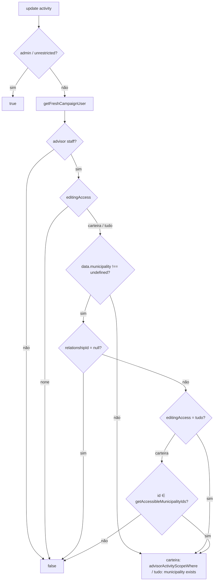

# Impl: C165-F1 — Activity: update access fecha município nulo/fora da carteira (bypass REST)

Status: aprovado
Atualizado em: 2026-09-15
Issue: #1030
Intenção: docs/plans/c165-f1-update-access-municipality.md
Appetite restante: herdado — ~0,25 dia eng

## Leitura da intenção

- **Outcome:** `canUpdateActivity` deixa de cobrir só a linha e passa a inspecionar `data.municipality` para um advisor (staff não-unrestricted): `null` (ou malformado) → recusa; id fora do write scope da carteira → recusa; chave ausente → mantém o `Where` de linha atual. Coordenador/candidato/admin intocados; `editing: 'tudo'` segue alcançando qualquer atividade **com** município, mas limpar para `null` vira coordenação/candidato-only. Fecha o bypass REST/Local (`PATCH /api/activity/:id` com JWT de campanha).
- **O que NÃO negociar:** simetria com `canCreateActivity` (que já é `data`-aware); action mantém guard/UX (Decisão G do C165) como defesa em profundidade, sem mensagem nova; sem field access por valor; sem migration/Consent/UI; touchpoint único no collection access.
- **O que reavaliar:** nada estrutural — a intenção deixa o eixo de valor no collection access e o `Where` de linha intocado. Fica em aberto apenas a **forma de detectar a presença** de `municipality` no patch (resolvida abaixo).

## Abordagem recomendada



**Opções consideradas:** A) guard de valor no collection access `update` (data-aware, reusando `getAccessibleMunicipalityIds` memoizado) | B) usar `getWritableMunicipalityIds` no access | C) field-level access em `municipality`.

**Recomendação:** **A** — porque o bypass é do **valor** e o dono do eixo de access de update já é esta função; `data` chega ao access (`node_modules/payload/dist/collections/operations/updateByID.js:42-46` passa `{ id, data, req }`), então o guard fecha por construção sem tocar a action. Para `editing === 'carteira'` o conjunto de ids coincide com a carteira (`getAccessibleMunicipalityIds`), que `advisorActivityScopeWhere` já chama no mesmo request — logo a checagem extra é memoizada e não adiciona query.

**Rejeitadas:**

- **B (`getWritableMunicipalityIds`):** faz um `find` não-memoizado por request no caminho quente (todo update de activity passa pelo access) e, para `carteira`, devolve o mesmo conjunto do memoizado; para `tudo` devolve `null` (catálogo todo), já coberto por não checar escopo no branch `tudo`.
- **C (field access):** fora de escopo pela intenção; field access recebe valor/sibling data, não o documento, e a assimetria do modelo pertence ao collection access.

| Decisão                             | Caro / Barato                                                                                                    | Escolha                                           |
| ----------------------------------- | ---------------------------------------------------------------------------------------------------------------- | ------------------------------------------------- |
| Onde mora o guard de valor          | field access (caro, fora de escopo) vs collection access `update` (barato)                                       | collection access                                 |
| Fonte dos ids da carteira           | `getWritableMunicipalityIds` (`find` extra/request) vs `getAccessibleMunicipalityIds` (memoizado)                | memoizado                                         |
| Detectar presença de `municipality` | `'municipality' in data` (recusa `undefined` explícito) vs `data?.municipality !== undefined` + `relationshipId` | `!== undefined` (só a chave ausente cai no Where) |

### Componentes / mudanças

- **`canUpdateActivity`** (`src/utilities/access/activities.ts:104`): trocar a assinatura para `async ({ data, req })`; após `if (editingAccess === 'none') return false`, inserir o guard de valor antes dos retornos de linha:

  ```ts
  if (data?.municipality !== undefined) {
    const municipalityID = relationshipId(data.municipality)
    if (municipalityID === null) return false
    if (editingAccess === 'carteira') {
      const writableIDs = await getAccessibleMunicipalityIds(req, currentUser)
      if (writableIDs !== null && !writableIDs.includes(municipalityID)) return false
    }
  }
  ```

  Preservar intactos os retornos seguintes (`tudo` → `{ municipality: { exists: true } }`; senão → `advisorActivityScopeWhere`). `relationshipId` já devolve `null` para `null`/`undefined`/malformado e id para número/`{id}`; o `!== undefined` externo garante que chave ausente não seja recusada. Comentar com `C165-F1` explicando o eixo valor vs linha.

- **Pin int** (`tests/int/campaignActivity.int.spec.ts`): novo `it(...)` perto do bloco `:485-498`; com o `advisor` da carteira e um município fora (`fixtures.getMunicipality()`), exercitar via `payload.update({ collection: 'activity', id, data, user, overrideAccess: false })`:
  - `{ municipality: null }` → `rejects.toThrow(/permissão/i)`;
  - `{ municipality: outside.id }` → rejeita;
  - `{ locality: '...' }` (só outro campo) → sucesso, `municipality` inalterado;
  - advisor `editing: 'tudo'` (`createCampaignUser('advisor', { editing: 'tudo' })`): apontar para `outside.id` é permitido, mas `{ municipality: null }` é recusado.

  Manter `:485-498` verde (sem `data` → `Where` exato inalterado).

- **Migration:** sem migration.
- **Access / Consent:** só o eixo de access de `activity.update`; nenhum Consent/opt-in envolvido.
- **UI:** N/A — sem UI.

## Fases verificáveis

1. Editar `canUpdateActivity` em `src/utilities/access/activities.ts` (guard de valor; retornos de linha intactos).
2. Adicionar o pin int em `tests/int/campaignActivity.int.spec.ts` e confirmar `:485-498` intacto.
3. Rodar `pnpm gate:fast` (inclui int) verde; checar que nenhum outro teste de activity quebrou.

## Rabbit holes / Não escopo (engenharia)

- Field-level access por valor em `municipality` — fora de escopo (intenção).
- Hardening equivalente em outras collections — fora de escopo; só `activity.update`.
- Memoização global de `getWritableMunicipalityIds` no módulo — não pedido; o branch `tudo` não precisa de ids.
- Mensagem nova/ajuste de copy da action — fora de escopo; a recusa vira o erro genérico de permissão (mesmo comportamento do bypass do create).
- Ajuste no manifest e2e (`scripts/lib/e2e-affected-manifest.mjs:116-118`) — já mapeado, nenhum toque.

## Riscos e mitigação

- **Advisor `editing: 'tudo'` hoje limpa município pela action** — já era recusado no C165; o access só fecha a mesma regra por outra porta. Teste do branch `tudo` cobre `null` recusado e remanejamento permitido.
- **Custo por request no caminho quente:** `getAccessibleMunicipalityIds` é memoizado por request (`resolveAccessibleIds`, `shared.ts:249`) e só é chamado quando `editing === 'carteira'` **e** `data.municipality` presente; deduplica com a chamada de `advisorActivityScopeWhere`.
- **Regressão do pin existente** (`:485-498` compara o `Where` exato sem `data`): `data?.municipality === undefined` cai direto nos retornos atuais — comportamento idêntico.
- **Falso permitido para id malformado:** coberto pelo `relationshipId === null` no mesmo guard.
- **Erro do access:** `false` em update vira `Forbidden` (`executeAccess.js:10-14`) → mensagem de permissão, sem tocar names/copy (`/permissão/i` como no restante da suíte).

## Aceite de engenharia

- [ ] `canUpdateActivity` é `data`-aware: `null`/malformado → `false`; fora da carteira (`carteira`) → `false`; ausente → `Where` de linha inalterado.
- [ ] `editing: 'tudo'` permite qualquer município com `municipality` presente, mas recusa `null`.
- [ ] Pin int novo verde em `tests/int/campaignActivity.int.spec.ts`; `:485-498` segue verde.
- [ ] `pnpm gate:fast` verde.
- [ ] Sem migration, sem Consent, sem UI; URL/slug intactos.

## Débitos da revisão (triage 2026-09-15)

**Já resolvido na sessão (não reabrir):** nome `writableIDs` → `accessibleIDs` (a fonte é o
escopo de leitura; na carteira coincide com o write scope); comentário do `tudo` reescrito;
borda positiva coberta (repoint **dentro** da carteira permitido) e perfil misto
`visibility:'tudo' + editing:'carteira'` pinado (a Visão "Tudo" não alarga a fronteira de
escrita) — trava o invariante read==write da carteira sem nova query; impl doc commitado.

**Explicitamente fora / descartado deste lote:**

- **C90 leg `responsible` × valor do município** (pré-existente, sinalizado pelos dois
  revisores): um advisor **responsável** por atividade fora da carteira edita por update
  parcial que **omita** `municipality` (pin `:684`), mas o overlay de edição reenvia o
  município e a recusa por valor fora da carteira fecha o save inteiro. Já era o
  comportamento da action do C165 (não é regressão desta entrega) e não há Issue aberta.
  **Gatilho:** primeiro relato de assessor responsável que não consegue salvar pelo overlay,
  ou curadoria futura do leg `responsible` (C90/C141) — aí revisar action + access juntos.
- **Hardening de valor em outras collections**: cada domínio tem seu dono; fora do appetite.

## Self-score (decision-quality)

**5/5.**

- Problema, owner e assimetria nomeados (`activities.ts:104` collection access vs action em `activity.ts:300`; `data` chega ao access conforme Payload).
- Decisão principal com trade-off explícito (memoizado vs `getWritableMunicipalityIds`) e critério de correção para o branch `tudo` (não reaproveitar a carteira).
- Borda de presença (`undefined` ausente vs `null` presente) resolvida com justificativa e coberta por teste.
- Aceite verificável e enxuto dentro do appetite (~0,25 dia): uma função, um teste, gate.
