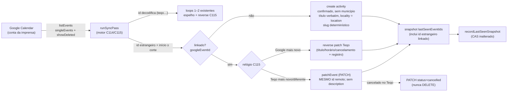

# Impl: Agenda: importar automaticamente eventos do Google como atividades (sem município, a partir de 16/08/2026)

Status: aprovado
Atualizado em: 2026-09-15
Issue: #1010
Intenção: docs/plans/c165-importar-eventos-google.md
Appetite restante: herdado — ~3–4 dias eng

## Leitura da intenção

- **Outcome:** evento criado no Google Calendar (conta da imprensa já conectada) com início ≥ 16/08/2026 vira atividade no Teqo sozinho, com a imediatez Google→Teqo do C164 (mesmo webhook/passada, sem trigger novo). A atividade nasce `confirmado`, sem município, com título original do Google (sem prefixo `[Município] `), `location → locality`, e a coordenação tria no overlay existente quando quiser. Sem município, só `coordinator`/`candidate` veem; ao atribuir município, entram as regras normais (advisor por carteira/responsável). Vínculo estável e idempotente: re-sync não duplica; editar no Teqo atualiza o MESMO evento do Google — nunca nasce um segundo evento `teqo…`. Editar/cancelar no Google reflete (relógio C115); excluir no Google cancela a atividade. Nada antes de 16/08/2026 entra (sem backfill); evento estrangeiro nunca é apagado; leader lockdown intocado; sem `Consent` novo; Teqo inteiro se o Google cair.
- **O que NÃO negociar:** corte em `CALENDAR_PHASE_ANCHORS.consolidationStart` (`src/lib/visitPlannerAnchors.ts:22-29` — não duplicar o literal); horizonte = janela do espelho (90d/365d) com piso do corte; `singleEvents=true` (cada ocorrência vira atividade própria); descrição ignorada na v1; cancelar no Teqo cancela o MESMO evento; importado que ganha município mantém o título sem prefixo; Vínculo system-write (invisível aos user paths); sem Consent; leader lockdown e feed iCal públicos intocados; evento estrangeiro nunca `DELETE`ado pelo Teqo.
- **O que reavaliar (o reconhecimento confirmou as armadilhas):**
  - Access: advisor `visibility === 'tudo'` retorna `true` em `canReadActivity` (`src/utilities/access/activities.ts:74-77`) e `editing === 'tudo'` em `canUpdateActivity` (`:99`) — fura "sem município só coordenação/candidato" sem um guard de `municipality != null`; `canCreateActivity` (`:31-39`) é booleano staff e não olha `data`.
  - Ação: `src/app/(campaign)/campanha/actions/activity.ts:293-294` dereferencia `activity.municipality.id` incondicionalmente → TypeError ao salvar importado com demandas; `CampaignDemand.ts:242-279` exige município (`:253`) e compara com o da atividade (`:274-278`).
  - Forward: o insert sempre nasce com id determinístico `teqo…` (`src/lib/googleCalendarEventMapping.ts:142`) e o update usa o id remoto decodificado (`googleCalendarSync.ts:675`) — sem branch por `googleEventId`, editar um importado criaria um 2º evento.
  - Descrição: `googleEventContentEquals` compara `description` (`mapping:196-199`) e `buildGoogleEventPayload` sempre monta a descrição (`:104-107`) — o forward sobrescreveria a descrição do usuário mesmo "ignorando" a importação.
  - Recorrência: instâncias têm id `master_2026…` (underscore) e `GoogleRemoteEvent` (`mapping:152-161`) não carrega `recurringEventId`; títulos idênticos colidem no `slug` único (`Activity.ts:71-98` + `ACTIVITY_DUPLICATE_TITLE_MESSAGE`) — a 2ª ocorrência pausaria a passada.
  - Namespace: `teqo3` manual decodifica como atividade 3 (`mapping:54-67`) — o corte de importação reusa `decodeGoogleEventActivityId(...) !== null`, nunca prefixo.
  - Título: summary vazio/emoji-only falha `setCanonicalActivitySlug` (`Activity.ts:82-84`) sem fallback.
  - Snapshot: `lastSeenEventIds` só guarda ids `teqo…` (`googleCalendarSync.ts:442-458,602-603`); sem ids estrangeiros linkados não há como detectar "excluído no Google" (hard delete).
  - e2e manifest: `src/collections/Activity.ts`, `src/lib/schemas/activity.ts` e `src/utilities/access/activities.ts` **não** estão nos prefixes de atividade (`scripts/lib/e2e-affected-manifest.mjs:100-115`) → diff cairia no smoke/`frontend+campaignNewsletter`; `src/lib/googleCalendarEventMapping.ts`/`googleCalendarReverseEdit.ts` também faltam no entry do motor (`:114-135`).
  - Migration: `activity.municipality_id` é `NOT NULL`; required→nullable idempotente tem precedente em `20260824_010000_make_supporter_import_batch_actor_nullable.ts:23-45`.

## Abordagem recomendada

**Opções consideradas (macro):** **A)** vínculo em 2 campos system-write na `Activity` (`googleEventId` + `googleCalendarId`) + passo de importação dentro do `runSyncPass` (mesma janela/snapshot/CAS) + `PATCH` para eventos linkados; **B)** coleção de vínculo dedicada (`googleCalendarLink`) com passada própria; **C)** "espelhar" o importado criando um evento `teqo…` e deixar o estrangeiro intocado (vínculo pelo título/horário).
**Recomendação: A.**
**Justificativa:** é o menor modelo que satisfaz o aceite inteiro (idempotência por vínculo único, edição no MESMO evento, cancelamento sem apagar estrangeiro) sem twin de coleção e sem duplicar a máquina de snapshot/CAS. B rejeitada: 1:1 sem ciclo de vida próprio, exigiria join/coleção nova e dois escritores de estado. C rejeitada: viola "editar no Teqo atualiza o MESMO evento" (o Teqo passaria a ter duas fontes: o evento estrangeiro e a cópia `teqo…`) e "nunca nasce um segundo evento".

### Decisões de engenharia

#### A. Modelo do vínculo (schema + migration)

Opções: **A)** dois campos system-write na `Activity` — `googleEventId` (`text`, `unique`, `index` implícito, `admin.readOnly`, `access.create/update: canSetActivitySystemField`) + `googleCalendarId` (`text`, idem, sem unique); presença de `googleEventId` = importado (o espelho usa id determinístico e nunca persiste link); **B)** só `googleEventId`, assumindo calendário único; **C)** coleção `googleCalendarLink` (atividade↔evento) separada.
Recomendação: **A** — o par id+calendário é o vínculo estável: com a troca de calendário do C150, só o par responde "este link é deste calendário?" sem ambiguidade (skip seguro, sem 404/duplicata). O `unique` no `googleEventId` é a trava de idempotência no banco (Postgres aceita múltiplos NULL). Migration `20260915_HHMMSS_activity_google_import_link`: gera as duas colunas + unique index e `ALTER TABLE activity ALTER COLUMN municipality_id DROP NOT NULL`.
Alternativas rejeitadas: **B** porque a troca de calendário torna o id ambíguo (update em evento de outro calendário → 404 pausa a passada ou cria cópia); **C** porque é twin de um 1:1 (join por atividade, sem consulta independente) e dobra os pontos de escrita.

#### B. Semântica de importação (corte, horizonte, forma e idempotência)

Opções: **A)** predicado puro `isImportableGoogleEvent(event, { rangeStart, timeMax })` no módulo de mapping + import por `googleEventId` com fallback de título/slug determinístico; **B)** filtro inline no motor com literais de corte; **C)** importar tudo que o `listEvents` devolver (sem corte) e triar depois.
Recomendação: **A** — o corte é `formatBahiaCivilDate(startAt) >= CALENDAR_PHASE_ANCHORS.consolidationStart` (all-day: `date` já é civil; timed: `Date.parse(dateTime)` → data civil Bahia), o piso é `max(rangeStart, cutInstant)` e o teto é o `timeMax` do `buildListWindow` (mesma janela do espelho). Candidato = `decodeGoogleEventActivityId(event.id) === null` (corte existente `googleCalendarSync.ts:605-610`; um `teqo3` manual decodifica e fica no namespace do espelho — nunca importado, documentado). Forma do importado: `status: 'confirmado'`, `startAt/endAt/allDay` de `googleScheduleToActivityFields` (null → skip), `locality = event.location?.trim().slice(0,160)`, `description` ausente, `tags: []`, `googleEventId`/`googleCalendarId`, create com `overrideAccess: true` + `context: { mutationKind: 'googleCalendarSync' }` + `req.user` removido (mesmo padrão do reverse patch, `googleCalendarSync.ts:471-499`). Título = `googleTitleFromSummary(summary, undefined)`, exigindo `length ≥ 2` e `slugify(title) !== ''` (senão skip — não inventar título num campo imutável). Slug determinístico `${slugify(title)}-${sufixo civil}` (timed: `formatIsoAsBahiaDateTimeInput(startAt).replace(/[-:]/g,'')`; all-day: `allDayCivilDateOf`), com branch no hook `setCanonicalActivitySlug`: em `create` com `mutationKind === 'googleCalendarSync'` e slug fornecido, sanitiza e preserva (em vez de recomputar). Idempotência: mapa `googleEventId → activity` carregado numa query do passo; `unique` no banco como backstop; violação de unicidade do create só é engolida quando um link para o mesmo evento já existe (senão re-throw — ver decisão C).
Alternativas rejeitadas: **B** porque duplicaria o literal do corte (proibido pela intenção) e espalharia a política no motor; **C** porque backfill de eventos pessoais antigos é rabbit hole nomeado e viola o aceite "nada antes de 16/08".
Nota de produto respeitada: o importado **não** leva `[Município] ` no título nem depois de ganhar município (branch de importado no forward; ver D/E).

#### C. Encaixe no motor, snapshot e concorrência

Opções: **A)** função `runImportedEventsPass(...)` chamada dentro do `runSyncPass` depois dos loops 1–2 e **antes** do `recordLastSeenSnapshot`, compartilhando `remoteEvents`, `lastSeenIds`, CAS e `activityWhere`, devolvendo contadores + ids vistos para o snapshot; **B)** branches de importação dentro dos dois loops existentes; **C)** passada de importação de topo, com `listEvents` próprio, chamada pelo `runCampaignCalendarSync`.
Recomendação: **A** — os loops 1–2 são a máquina C114/C115 testada e assumem id decodificado; separar o passo isola a semântica nova (criar/cancelar linkado) e reusa o que já existe: a lista estrangeira vem do mesmo `listEvents` (sem RTT extra), o `lastSeenIds` alimenta a regra de exclusão e o snapshot ganha os ids estrangeiros **linkados** (não todos os estrangeiros — mantém o JSONB enxuto e o significado do conjunto). Contadores: estender `SyncCounts` só com `imported` (criações); patches Teqo→Google contam em `updated`, cancels do Google em `reverseEdits` (mesma classe do nativo), cancelamento no Teqo conta em `deleted` (PATCH `status: 'cancelled'`, nunca `DELETE`) — `toMatchObject` dos testes atuais não quebra. Query do passo: `payload.find` em `activity` com `and: [{ googleEventId: { exists: true } }, { googleCalendarId: { equals: calendarId } }, ...(activityWhere)]`, sem filtro de status (precisa das `cancelado` para re-assertar o cancel no Google). Concorrência de duas passadas no mesmo evento novo: o `unique` barra o segundo create; o catch só é tolerado se um link para aquele `googleEventId` já existir (re-leitura), senão re-throw (o erro real sobe e a passada vira `paused`, comportamento atual).
Alternativas rejeitadas: **B** porque mistura o branch frágil no loop que hoje garante o espelho (e o tratamento de cancelado difere entre nativo e importado); **C** porque paga um segundo `listEvents` por passada e cria um segundo escritor de snapshot/CAS.

#### D. Editar no Teqo → MESMO evento (`patchEvent`, cancel)

Opções: **A)** novo `patchEvent(calendarId, eventId, partial)` no client (HTTP `PATCH`, `events.patch`) usado por importados, com o body só dos campos que o Teqo controla (`summary`, `start`, `end`, `location`) e `sendUpdates: 'none'`; **B)** continuar com `updateEvent` (PUT) e copiar `description` do evento listado; **C)** PUT e aceitar a perda.
Recomendação: **A** — `PUT` (update) substitui o recurso inteiro: além da `description`, apagaria convidados/lembretes/Meet (fora de escopo, mas não podem ser destruídos). O `PATCH` preserva tudo que não enviamos. No branch de importado do `runSyncPass`, o payload usa o id remoto (`googleEventId`) e **nunca** `googleEventIdForActivity`; a igualdade de conteúdo do importado compara `summary` + `start/end` + `location` (descrição fora). Cancelar no Teqo = `patchEvent(..., { status: 'cancelled' })` no MESMO evento (a recomendação A da questão em aberto), nunca `DELETE` — o evento continua existindo (lixeira do Google) e o mandato "evento estrangeiro nunca é apagado" fica literal. Hard delete da atividade (admin) não apaga o evento estrangeiro.
Alternativas rejeitadas: **B** porque ainda é `PUT` (destrói o resto do recurso; copiar a descrição só maquia o problema); **C** porque destrói dado do usuário e é anti-goal explícito ("não alterar evento estrangeiro" além do combinado).

#### E. Descrição no forward de importados

Opções: **A)** o payload parcial do importado omite `description` (o `PATCH` preserva a do Google) e a igualdade de conteúdo ignora descrição; **B)** espelhar a descrição no campo `description` da atividade e reenviá-la; **C)** apagar a descrição do evento na primeira edição.
Recomendação: **A** — é a leitura literal de "descrição ignorada na v1 (texto vive no Google)": o Teqo não lê, não guarda e não escreve descrição de importado. Teste int pina que editar o título no Teqo mantém a descrição que existia no stub.
Alternativas rejeitadas: **B** porque a intenção v1 manda ignorar (e reenviar uma descrição Teqo-soberana contradiz "texto vive no Google"); **C** porque perde dado do usuário.

#### F. Recorrência

Opções: **A)** cada instância expandida vira atividade própria, linkada ao id da instância (`master_2026…T…`), sem campo novo de série; **B)** importar só a primeira ocorrência da série; **C)** guardar `recurringEventId`/`originalStartTime` e gerar/atualizar atividades por série.
Recomendação: **A** — é o literal da intenção (`singleEvents=true` já expande). O id de instância é estável para a ocorrência (contém o início original; mover a ocorrência no Google mantém o id), então remarcar uma ocorrência no Teqo faz `PATCH` naquela instância (vira exceção no Google) e remarcar a série atualiza as instâncias (reverse C115 por instância). O título repetido NÃO colide o slug graças ao sufixo determinístico (decisão B). Mudar a regra da série pode regenerar ids: as atividades órfãs "somem" do Google → canceladas pela regra de exclusão, e as novas entram (aceito e documentado na v1). Nenhum campo de série é criado (sem consumidor).
Alternativas rejeitadas: **B** porque perde compromissos reais e contraria o aceite; **C** porque modela série sem produto que a use (YAGNI) e multiplica estados.

#### G. Access sem município (a armadilha do `visibility === 'tudo'`)

Opções: **A)** guard de existência nas scopes de advisor + `canCreateActivity` ciente de `data`; **B)** reusar `resolveProfileScopedRead` e deixar o advisor "tudo" ver tudo (inclui sem município); **C)** trocar o `true` do perfil "tudo" por um where que exclui apenas `responsável` sem município.
Recomendação: **A** — `canReadActivity`: admin/unrestricted antes; `visibility === 'tudo'` passa a devolver `{ municipality: { exists: true } }`; a carteira devolve `{ and: [{ municipality: { exists: true } }, { or: [ responsible…, advisorMunicipalityScopeWhere ] }] }` (o `and` fecha o vazamento do branch `responsible`, que casaria atividade sem município). `canUpdateActivity`: `editing === 'tudo'` idem, carteira idem. `canCreateActivity`: sem `relationshipId(data?.municipality)` só `isCampaignUnrestricted`. Na action, advisor criando sem município, limpando município (`null`) ou repontando para fora da carteira → mensagem nomeada nova em `src/lib/schemas/activity.ts` (precedente `SUPPORTER_UNSCOPED_COORDINATOR_MESSAGE`), mapeada em `mapActivityOverlayError` (safeMessages) para não colapsar em genérico. Com município, nada muda (advisor por carteira/responsável). Leader continua `false`. Campos novos seguem `canSetActivitySystemField` (só admin no admin panel; o motor escreve com bypass).
Alternativas rejeitadas: **B** porque "perfil de visão" é eixo de leitura do catálogo com município, não licença para atividade órfã — furaria o aceite; **C** porque não fecha o branch `responsible` do `advisorActivityScopeWhere` (advisor responsável veria a atividade sem município).

#### H. Demandas/rascunho sem município

Opções: **A)** demandas continuam exigindo município: dereferência null-safe + rejeição nomeada quando há rascunhos sem município efetivo; **B)** permitir demanda sem município mudando `CampaignDemand.ts:242-279`; **C)** ignorar silenciosamente os rascunhos sem município.
Recomendação: **A** — `CampaignDemand` é dona da regra "demanda e atividade no mesmo município" (`:253,274-278`) e demandas são entidade municipal por design; o escopo deste item é atividade. Em `createActivityRecord` e `updateActivityRecord`: usar `relationshipId(activity.municipality)` (remove o TypeError de `:293-294`) e, se `demands.length > 0` com município efetivo nulo, lançar mensagem nomeada ("Atribua um município para criar demandas desta atividade."). Sem demandas, salvar sem município funciona. Giro (`createTourDraftActivitiesRecord`) intocado (sempre tem município).
Alternativas rejeitadas: **B** porque reabre o modelo de demandas (blast radius grande, fora do appetite); **C** porque perde dado em silêncio.

#### I. Overlay (município opcional)

Opções: **A)** `StrictCombobox` com opção sintética `{ value: '', label: 'Sem município' }` no topo, label "Município (opcional)", aviso âmbar quando vazio, hidden input enviando `''`, parser `nullableRelationshipFormValue`; **B)** input vazio + placeholder sem opção explícita; **C)** checkbox "sem município" separado.
Recomendação: **A** — é o rascunho UI aprovado (Impeccable B): default "Sem município", opção/chip exclusivo, aviso "Sem município, só coordenação e candidato veem. Ao atribuir, o assessor da carteira passa a ver." O `StrictCombobox` já suporta `value ''` (selected nulo, `showClear` some); a opção sintética dá o texto default e a volta depois de escolher um município. Remover a validação `if (!municipalityId)` (`ActivityOverlay.tsx:205`); o hidden `municipality` (`:459`) passa a valer `''`; o edit prefila o município existente (`:175-181`) e "Sem município" quando nulo. Sem mudança nos hosts (create/edit já passam `municipalityOptions`).
Alternativas rejeitadas: **B** porque "Sem município" seria só placeholder (não dá para reverter a escolha) e o draft pede opção explícita; **C** porque cria um estado a mais só para o mesmo campo.

#### J. Lista e agenda (view models + badges)

Opções: **A)** `importedFromGoogle` derivado de `Boolean(activity.googleEventId)` nos view models existentes, badges no `ActivityCard` (âmbar "Do Google", tracejado "Sem município", rodapé "Importado automaticamente") e marcador âmbar no evento da agenda (`ActivityAgenda`, `extendedProps`); **B)** campo booleano próprio no schema; **C)** componente de card novo só para importados.
Recomendação: **A** — derivar evita estado redundante (o link é a fonte); adicionar `googleEventId: true` a `activityAgendaSelect` cobre lista (`ActivityList`) e agenda (`ActivityAgendaEvent`) com um select só; `ActivityCard`/`Badge`/CSS da agenda são os shells existentes (Impeccable B: encaixe, não twin). Agenda renderiza o marcador "Do Google" e "Sem município" na linha de local (hoje a linha já filtra `municipalityName` nulo, `ActivityAgenda.tsx:136` — null-safe). Dossiê (`municipalityDossierData.ts:73-90`) continua filtrando por município: importado não aparece lá (aceito).
Alternativas rejeitadas: **B** porque duplica o que a presença do link já diz (estado redundante que pode divergir); **C** porque twin do `ActivityCard`.

#### K. Omnibox/filtro "Sem município"

Opções: **A)** estado booleano `unscoped?: boolean` + param `unscoped=1`, chip e sugestão "Sem município" (grupo Município), exclusivo com `municipality`; **B)** sobrecarregar `municipality` com o literal `sem`; **C)** só filtro visual sem URL.
Recomendação: **A** — `buildActivityListWhere` adiciona `{ municipality: { exists: false } }`; `parseActivityListParams`/`buildActivityListSearchParams` fazem round-trip de `unscoped`; aplicar `unscoped` limpa `municipality` e vice-versa; remover o chip limpa só o campo. Contagens por sugestão do rascunho são ilustrativas (o omnibox não tem plumbing de contagem hoje; a lista mantém o "N resultados" existente). `ActivityFilters` não muda de estrutura (só seeds/chips).
Alternativas rejeitadas: **B** porque quebra o parse numérico do param e mistura dois significados; **C** porque filtro sem URL quebra o padrão de navegação compartilhado (`useCampaignListFilterNavigation`).

#### L. e2e manifest

Opções: **A)** adicionar os prefixes faltantes: no entry de atividade (`:100-115`) `src/collections/Activity.ts`, `src/lib/schemas/activity`, `src/utilities/access/activities.ts`; no entry do motor (`:114-135`) `src/lib/googleCalendarEventMapping.ts`, `src/lib/googleCalendarReverseEdit.ts`; **B)** confiar na run `frontend`+`campaignNewsletter` que `src/lib/schemas` já acorda; **C)** ampliar para `src/utilities/access` inteiro no entry de atividade.
Recomendação: **A** — `src/lib/schemas` e `src/utilities/access` são risk prefixes e têm mappings genéricos próprios (`:238-251`); sem o par específico, um diff de activity acorda specs erradas (e o classifier pode falhar fechado `unmapped-risk`). O match é por `startsWith` e une os specs dos entries que casam, então o par específico não remove a cobertura de risco existente. E2E de importação real com stub de Google não existe na suíte (fora).
Alternativas rejeitadas: **B** porque a cobertura pinada é do formulário público/newsletter, não da agenda; **C** porque `src/utilities/access` completo acordaria as specs de activity em qualquer diff de RBAC de outro domínio (ruído).

#### M. Testes

Opções: **A)** unit para mapping/client/overlay/omnibox + int no motor (novo describe de importação) e nas regras de access/demandas + e2e de formulário/badge; **B)** só int no motor; **C)** e2e novo com stub de Google.
Recomendação: **A** — unit barato pina a matriz de corte/forma/slug/PATCH; int pina o comportamento do motor (idempotência, mesmo id, descrição preservada, snapshot, cancel) e as regras de access; e2e cobre o overlay sem município e o badge. **C** rejeitado: a suíte e2e não tem stub do Calendar (C164 já documentou a discricionariedade); int com stub é a camada do motor.
Detalhe por arquivo: `tests/unit/googleCalendarEventMapping.unit.spec.ts` (predicado de corte nas bordas 15/16-08 all-day e timed, forma do importado, igualdade sem descrição, slug determinístico, `teqo3` fora do import); `tests/unit/googleCalendarClient.unit.spec.ts` (`patchEvent` → `PATCH` no path certo); `tests/unit/googleCalendarReverseEdit.unit.spec.ts` (título `[X] ` verbatim com `municipalityName` undefined); `tests/unit/activityOverlay.unit.spec.tsx` (default "Sem município", salvar sem município envia `municipality=''`, aviso de visibilidade); `tests/unit/activityUi.unit.spec.ts`/`activityAgendaOmnibox.unit.spec.ts` (round-trip `unscoped`, chip, exclusividade); `tests/int/googleCalendarSync.int.spec.ts` (stub ganha `patchEvent` com merge: **1** importa timed ≥ corte sem município, título verbatim, sem evento `teqo…`; **2** 2ª passada converge; **3** edição no Google reflete com registro; **4** edição no Teqo PATCHa o mesmo id e preserva descrição; **5** atribuir município mantém título sem prefixo; **6** `cancelled` no Google cancela; **7** hard delete pós-visto cancela; **8** pré-corte fica fora e o dia 16/08 entra; **9** cancelar no Teqo vira `cancelled` no MESMO evento (sem DELETE); **10** summary vazio não importa e não pausa; **11** duas ocorrências de mesmo título geram slugs distintos); `tests/int/campaignActivity.int.spec.ts` (schema sem município; advisor não cria/limpa; advisor `visibility=tudo` não lê sem município via `payload.find`/where; coordenador lê; demandas sem município rejeitadas; dereferência null-safe); `tests/e2e/campaignActivity.e2e.spec.ts` (labels `Município (opcional)` nas 4 linhas pinadas e um create sem município com badge "Sem município").
Alternativas rejeitadas: **B** porque a matriz de corte/forma é pura e determinística (não deve depender de banco); **C** idem acima.

### Componentes / mudanças

- **`src/collections/Activity.ts`:** `municipality` `required: false`; campos `googleEventId` (unique, readOnly, access system) e `googleCalendarId` (readOnly, access system) perto de `lastMirroredChangeAt`; branch no `setCanonicalActivitySlug` para preservar slug fornecido em create com `mutationKind === 'googleCalendarSync'`.
- **`src/lib/schemas/activity.ts`:** `municipality` opcional no create e `nullable().optional()` no update; `tourStopDraftSchema` mantém município obrigatório (extend explícito — o pick herdaria a opcionalidade); mensagem nomeada do sem-município e a de demandas.
- **`src/utilities/activityFormData.ts`:** `municipality: nullableRelationshipFormValue(formData, 'municipality')`.
- **`src/utilities/access/activities.ts`:** guards de município existente (read/update) e `canCreateActivity` por `data` (decisão G).
- **`src/app/(campaign)/campanha/actions/activity.ts`:** guard de advisor sem município/limpar/repontar; dereferência null-safe e rejeição de demandas (decisão H); exportar `updateActivityRecord` se o teste int precisar (precedente `createActivityRecord`).
- **`src/utilities/activityOverlayErrors.ts`:** safeMessages com a mensagem nova.
- **`src/lib/googleCalendarEventMapping.ts`:** `isImportableGoogleEvent`, `buildImportedGoogleEventPayload`, `googleImportedEventContentEquals`, `importedActivitySlug` (puros, reusando `googleScheduleToActivityFields`/`googleTitleFromSummary`/`allDayStartInstant`/`slugify`/`CALENDAR_PHASE_ANCHORS`).
- **`src/utilities/googleCalendarClient.ts`:** `patchEvent` (`PATCH`, `sendUpdates: 'none'`).
- **`src/utilities/googleCalendarSync.ts`:** `runImportedEventsPass` + integração no `runSyncPass` (merge de snapshot e contadores), branch de importado no forward (`patchEvent` pelo id remoto), cancel no Teqo via `status: 'cancelled'`, `SyncCounts.imported`.
- **`src/utilities/activityViewModels.ts`:** `googleEventId: true` no `activityAgendaSelect`; `importedFromGoogle` em `ActivityAgendaEvent`/`ActivityListViewModel`.
- **UI:** `ActivityOverlay.tsx` (decisão I), `ActivityCard.tsx` (badges/rodapé), `ActivityAgenda.tsx` + `ActivityAgenda.css` (marcador), `ActivityFilters.tsx` (seeds/chips) — shells existentes do rascunho aprovado.
- **Filtros:** `src/utilities/activityUi.ts` (`unscoped`), `src/utilities/activityOmnibox.ts` (chip/sugestão/exclusividade).
- **`scripts/lib/e2e-affected-manifest.mjs`:** prefixes da decisão L.
- **Migration:** `src/migrations/20260915_HHMMSS_activity_google_import_link.ts` (+ `index.ts`, `payload-types.ts` via `pnpm migrate:create`/`pnpm migrate`/`pnpm generate:types`).
- **Access/Consent:** nada de `Consent` novo (dado interno de staff); vínculo system-write; leader lockdown intocado.
- **Dados → forma:** N/A — a intenção resolve "não apresentar dados"; a apresentação é a UI de badges/overlay acima.

## Fases verificáveis

1. **Tracer schema + access (quota ~25% / ~1 dia).** Migration aplica; coordenador cria atividade sem município pelo Local API; advisor (inclusive `visibility=tudo`) não lê; demandas sem município rejeitadas com mensagem.
   - `pnpm migrate:create activity_google_import_link` → auditar `up`/`down` → `pnpm migrate` → `pnpm generate:types`.
   - Unit/int: `pnpm test:unit -- tests/unit/activityOverlayErrors.unit.spec.ts`; `pnpm test:int -- tests/int/campaignActivity.int.spec.ts`.
   - Checkpoint: os testes pinados `campaignActivity.int.spec.ts:99-106` mudam de "requires a municipality" para "coordinator cria sem / advisor não cria".
2. **Motor import/link (quota ~40% / ~1,5 dia).** Evento estrangeiro elegível vira atividade linkada; 2ª passada converge; edição nos dois sentidos usa o mesmo evento; descrição preservada; cancel/exclusão; corte/horizonte.
   - Unit: `pnpm test:unit -- tests/unit/googleCalendarEventMapping.unit.spec.ts tests/unit/googleCalendarClient.unit.spec.ts tests/unit/googleCalendarReverseEdit.unit.spec.ts`.
   - Int: `pnpm test:int -- tests/int/googleCalendarSync.int.spec.ts`.
3. **UI (quota ~20% / ~0,75 dia).** Overlay com "Município (opcional)" + aviso; cards com "Do Google"/"Sem município"/rodapé; agenda com marcador; omnibox com chip/sugestão "Sem município".
   - Unit: `pnpm test:unit -- tests/unit/activityOverlay.unit.spec.tsx tests/unit/activityUi.unit.spec.ts tests/unit/activityAgendaOmnibox.unit.spec.ts`.
   - E2E: `pnpm test:e2e -- tests/e2e/campaignActivity.e2e.spec.ts` (labels novos + create sem município com badge; import real não é observável e2e — registrar discricionariedade).
4. **Gates + fechamento (quota ~15% / ~0,5 dia).** Manifest, suíte, changelog, PR.
   - `pnpm gate:fast`; `pnpm test:int -- tests/int/googleCalendarSync.int.spec.ts tests/int/campaignActivity.int.spec.ts`; `pnpm test:e2e -- tests/e2e/campaignActivity.e2e.spec.ts`.
   - Changelog `docs/changelog/2026-09-15-c165.md` (parágrafo único, abrindo `**C165 — … (2026-09-15):**`).
   - `pnpm push` → PR com `Closes #1010`.

## Rabbit holes / Não escopo (engenharia)

- **Modelar série/recorrência** (`recurringEventId`, exceções, RRULE): fora — instância é atividade (decisão F).
- **Sincronizar convidados/RSVP/lembretes/Meet/cor**: fora; `PATCH` existe justamente para não destruí-los (decisão D).
- **Backfill pré-corte**: fora para sempre (predicado com piso; sem job).
- **Tela de triagem/notificação de importado**: a triagem é inline (lista + filtro + overlay).
- **Coleção de vínculo/estado de sync por evento**: twin rejeitado (decisão A/C).
- **Reconciliar calendários secundários**: fora; só o principal conectado.
- **Tocar leader lockdown, feed iCal público, consentimento**: fora.
- **Renomear/limpar links em troca de calendário**: v1 só ignora links de outro `googleCalendarId` (sem 404, sem duplicata); relink é trabalho futuro, se pedido.
- **Advisory lock global do sync**: fora — o CAS + unique já fecham a corrida sem segurar lock em I/O (C114-LOCK).

## Riscos e mitigação

- **Descrição/dados do usuário destruídos no forward:** `PATCH` parcial para importados + igualdade sem descrição (decisões D/E); int afirma que a descrição sobrevive a uma edição de título/local no Teqo.
- **Segundo evento `teqo…` criado:** branch por `googleEventId` nunca chama `insertEvent` com id determinístico; evento de link de outro calendário é ignorado; int afirma ausência de id `teqo…` no stub.
- **Colisão de slug (recorrência/título repetido):** sufixo civil determinístico + branch do hook; int com duas ocorrências de mesmo título.
- **Corrida de duas passadas importando o mesmo evento:** `unique` + catch que só tolera colisão quando o link já existe; senão re-throw (passada `paused`, sem duplicata — a trava é o banco).
- **Vazamento de visão para advisor (`visibility=tudo`/responsável):** guard `municipality exists` nos dois branches; int com `payload.find` sob o advisor; curated e2e de RBAC roda pelo risk prefix `src/utilities/access` (e o par específico acorda a suíte de atividade).
- **TypeError em demandas / demanda sem município:** dereferência null-safe + rejeição nomeada; `CampaignDemand` intocado; int cobre.
- **Título vazio/emoji-only quebrando a passada:** predicado de título/slug skip (não cria, não lança, passada segue `synced`); int cobre.
- **Borda do corte em fuso:** comparação por data civil Bahia (all-day direto; timed via `Date`); unit pina 15/08 (fora) e 16/08 (dentro).
- **Passada mais longa no hook (5s):** imports só adicionam uma query + creates de eventos novos; se o orçamento estourar, a passada vira `paused` e a próxima (webhook/manual, sem budget) converge — comportamento existente, registrar no PR.
- **Google fora do ar:** catch existente → `paused`; nenhum write path do Teqo depende do Google (guardrail preservado).
- **Snapshot maior:** só ids estrangeiros linkados entram (não todos), limitado pela janela/corte.
- **Migration em produção:** drop NOT NULL + unique index em coluna nova (todas as linhas NULL) — sem conflito; `down` reverte colunas e (best-effort) o NOT NULL.

## Aceite de engenharia

- [ ] Aceite de produto da intenção coberto: importação automática ≥ 16/08/2026, sem município visível só coordenação/candidato, triagem no overlay, vínculo idempotente editando o MESMO evento, Google→Teqo e excluir→cancelar, nada pré-corte, estrangeiro nunca apagado, leader lockdown intocado, sem Consent, Teqo inteiro se o Google cair.
- [ ] Invariantes AGENTS: migration commitada (`push: false`), Consent fail-closed preservado (nenhum novo), edição no dono (mapping/motor/access/overlay existentes, sem twin), sem literal duplicado do corte, URLs públicas intactas, PR com `Closes #1010`.
- [ ] Testes: unit (mapping/client/overlay/omnibox/reverse-edit), int (motor de importação + access/demandas), e2e pinado de formulário/badge; manifest e2e atualizado; `pnpm gate:fast` verde.
- [ ] Changelog `docs/changelog/2026-09-15-c165.md` commitado.

## Débitos da revisão (triage 2026-09-15)

**Registrado:** C165-F1 ([#1030](https://github.com/fsolla/teqo/issues/1030), kind defect, P2,
`depends #1010`, appetite ~0,25 dia) — o guard de valor do município vive só na action;
`PATCH /api/activity` com JWT de campanha escapa. Plano:
[c165-f1-update-access-municipality.md](c165-f1-update-access-municipality.md).

**Já resolvido no simplify (não reabrir):** snapshot não re-importa id dismissado (+ teste de
2ª passada); create do import fora da transação do caller + pre-check; seen-and-gone para
atividade sem município; `down` da migration com `IF EXISTS`; params objeto em
`runImportedEventsPass`; `patchEvent(importedPatch)`; casts redundantes removidos; helpers de
teste hoistados; assert de slug por regex; `isImportableGoogleEvent` rejeita ids `teqo…`;
labels `ACTIVITY_IMPORTED_LABEL`/`ACTIVITY_UNSCOPED_LABEL`; `importedActivitySlug`
desexportado (knip); card sem span vazio.

### Adiado com gatilho

- **S2 — sleeps reais de 3,5s nos int do relógio** (margem ~0,5s contra a tolerância de 2s; o
  irmão nativo é pré-C165). **Gatilho:** primeiro flake do relógio que consumir o `retry: 1`
  em CI, ou qualquer mudança na tolerância/janela — trocar o sleep por timestamps/baseline
  controlados, nos dois testes juntos.
- **S4 — "sumiu do Google" também cancela quem só saiu da janela bufferizada** (regra
  deliberada do espelho nativo C115, agora herdada; remarcar para além de
  `rangeEnd + SYNC_LIST_WINDOW_BUFFER_DAYS` vira cancelamento). **Gatilho:** primeiro relato
  de cancelamento falso por remarcação fora da janela, ou mudança das janelas `FEED_*` —
  revisar nativo + importado juntos.

### Explicitamente fora

- **S3 —** `googleScheduleToActivityFields` tipa `startAt`/`endAt` como `string | null` mas
  nunca devolve null, e `importedActivitySlug` mascara com `?? ''`: pureza de tipo, sem call
  site prejudicado; refazer só se um consumidor novo precisar do tipo estreito.
- **S5 —** `runImportedEventsPass` com ~150 linhas: extrair o ramo linkado em helper quando
  uma feature tocar esse ramo; legibilidade não paga refatoração sem comportamento.
- **S6 —** `slugify(title) || 'evento'` inalcançável (o builder rejeita título sem slug em 2
  pontos): fallback defensivo morto; remover no próximo toque no mapping.

### Self-score (decision-quality)

**5/5** — (1) todas as decisões não triviais (A–M) trazem Opções A|B|C, Recomendação e rejeitadas com o porquê; (2) o diff cabe no appetite (~3–4 dias; fases somam 100% com quotas 25/40/20/15 e nenhuma frente inflada); (3) rabbit holes nomeados com corte explícito (série, convidados, backfill, tela de triagem, coleção twin); (4) depth check feito — helpers puros no dono (`googleCalendarEventMapping`), orquestração no motor que já é dona do snapshot/CAS, access no módulo de access, UI nos shells existentes; nenhum módulo/helper novo além da migration; (5) o outcome da intenção permanece intacto — as reavaliações confirmaram as armadilhas e as decisões as fecham, sem reescrever produto (descrição segue ignorada, líder segue trancado, evento estrangeiro não é apagado).
