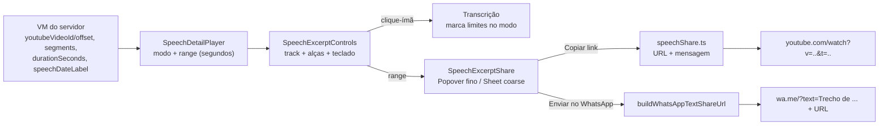

# Impl: Acervo: selecionar trecho e compartilhar por link (YouTube no ponto + WhatsApp)

Status: em execução
Atualizado em: 2026-09-15
Issue: #1013
Intenção: docs/plans/c166-compartilhar-trecho-link.md
Appetite restante: ~1–1,5 dia (herdado; sem migration, sem server action, sem escrita)

## Leitura da intenção

- **Outcome:** marcar [início, fim] no detalhe do acervo (ímã de frase, 5 s–180 s, duração visível) e compartilhar um link do YouTube que abre no ponto + mensagem com o intervalo — via copiar (feedback "Link copiado") ou `wa.me/?text=` do remetente.
- **O que NÃO negociar:** nenhum link autenticado do acervo para fora; sem escrita/`Consent`/collection/migration; `advisor`/`leader` negados; crédito CC BY e o clique-para-posicionar C162 intactos; exatamente 2 opções de share; sem YouTube → sem link + aviso honesto (seleção continua); offset desconhecido → link sem `t=` (nunca inventar).
- **O que reavaliar:** a intenção sugere `utilities/speech` para a lógica pura — o módulo puro vai para `src/lib/speech*` (casa com o prefixo do manifesto e não carrega Payload); `formatSpeechClock` muda de dono para o layer puro (hoje em `speechViewModels.ts`); o VM precisa de campos crus (`durationSeconds`, `speechDateLabel`) que a intenção não listava.

## Abordagem recomendada

**Opções consideradas:** A) lógica pura em `src/lib/speech*` + estado no player existente + 2 componentes irmãos | B) tudo dentro de `SpeechDetailPlayer.tsx` | C) componente/player próprio do trecho.
**Recomendação:** A — geometria e composição de link/mensagem unit-testáveis sem DOM; o player segue sendo o único (anti-goal); o contrato C162 fica atrás de um modo explícito.
**Rejeitadas:** B porque o arquivo já tem 381 linhas e a geometria ficaria refém do jsdom; C porque é o rabbit hole "segundo player" que a intenção corta.

### Componentes / mudanças

- **`src/lib/speechClock.ts`** (novo): dono de `formatSpeechClock` (movido de `speechViewModels.ts`, que passa a importá-lo; `src/utilities/ai/tools/findSpeechExcerpts.ts:22` troca o import). Sem re-export-twin: dono único, 2 call sites atualizados. Necessário porque `src/lib` é proibido de importar `@/utilities/**` e o share precisa do mesmo mm:ss.
- **`src/lib/speechExcerptSelection.ts`** (novo, puro): tipos estruturais `ExcerptSegment`/`ExcerptRange` (sem importar o VM); `MIN_EXCERPT_SECONDS = 5`, `MAX_EXCERPT_SECONDS = 180`; `selectSegmentRange(segments, index, durationSeconds)` (frase inteira; se a frase tiver < 5 s, estende até 5 s respeitando a duração; cap 180; ASR fracionário snap por `floor`/`ceil`), `extendRangeToSegment(range, segments, index, durationSeconds)` (estende para antes/depois; clique dentro/sobreposto re-seleciona a frase), `moveRangeEdge(range, edge, nextSeconds, durationSeconds)` (alça/teclado com min 5 s e max 180 s), `secondsFromTrackRatio(ratio, durationSeconds)`, `rangeDurationSeconds(range)`, `initialExcerptRange(segments, durationSeconds)`.
- **`src/lib/speechShare.ts`** (novo, puro): `buildSpeechExcerptShare({ videoId, offsetSeconds, startSeconds, endSeconds, speechType, dateLabel })` → `{ url, message, whatsAppUrl }`; `url` = `https://www.youtube.com/watch?v=<id>&t=<Math.floor(offset+start)>` (sem `t` quando `offsetSeconds === null`); `message` literal `Trecho de <tipo|"fala"> (<dd/mm/aaaa>): de <mm:ss> a <mm:ss> <url>`; `whatsAppUrl` reusa `buildWhatsAppTextShareUrl` (`src/lib/phone.ts:63`).
- **`speechViewModels.ts`**: `durationSeconds: number | null` e `speechDateLabel: string` no `SpeechDetailViewModel`; `formatSpeechDate` (mesmo regex de `formatSpeechAt`, só `dd/mm/aaaa`); sem `endLabel` (o controle formata `endSeconds` com `formatSpeechClock` — um campo a mais seria dado morto). Importa `formatSpeechClock` de `@/lib/speechClock`.
- **`[id]/page.tsx`**: passa `durationSeconds`, `speechType={view.type}` e `speechDateLabel` ao player.
- **`SpeechDetailPlayer.tsx`**: props novas; estado `selecting` e `range`; toggle "Selecionar trecho" (`aria-pressed`) na linha de ações; ao ligar o modo, inicializa `range` com `initialExcerptRange(segments, effectiveDuration)`; transcrição muda em modo seleção (`onClick` marca em vez de `seekTo`; `disabled={!seekable && !selecting}` — sem isso a seleção morreria no quadrante sem YouTube/sem offset); copy da transcrição vira "clique para marcar o trecho" no modo; renderiza os 2 irmãos novos; aviso honesto quando `!youtubeVideoId`. Fora do modo, `onClick`/`seekTo` ficam byte a byte como hoje (C162).
- **`SpeechExcerptControls.tsx`** (novo, client): barra com trilha própria e 2 handles `role="slider"` (`aria-valuemin/max/now/valuetext`, labels "Início do trecho"/"Fim do trecho"); pointer events + `setPointerCapture` com ímã nos limites de segmento (tolerância em px) e ajuste fino; teclado setas ±1 s, PageUp/Down ±5 s, Home/End; mostra início/fim/duração e a dica "mínimo 5s · máximo 3min"; chama só as funções puras.
- **`SpeechExcerptShare.tsx`** (novo, client): botão "Compartilhar" (desabilitado sem range válido — min 5 s); `useCoarsePointer()` → `Popover` (fino) ou `Sheet` (`SheetContent`, coarse); opções exatas "Copiar link" (estado local `idle|copied|error`, reset 2 s, live region sr-only — padrão `ContentShareButton`, classes do tema campaign, sem `--pt-red`) e "Enviar no WhatsApp" (`<a target="_blank" rel="noopener noreferrer">`); preview da mensagem; nota "abre no início da sessão" quando `youtubeOffsetSeconds === null`. "Copiar link" copia a **mensagem completa** (intervalo + URL) — o fim não cabe no `t=`, então o texto é o que circula.
- **Migration:** nenhuma. **Access/Consent:** nenhum; o gate `speechCatalog` do detalhe segue sendo a única barreira (advisor/leader intactos).
- **UI:** Impeccable B — tema `data-theme="campaign"`; reusa `Button`, `Popover`, `Sheet`, `useCoarsePointer`; copy do rascunho; nenhum shell novo.

### Dados → forma

Não se aplica: a intenção já decidiu "não apresenta dados" — duração/mm:ss são feedback de ação, não dado do acervo.

## Fases verificáveis

1. **Núcleo puro + VM** (~0,5 dia): mover `formatSpeechClock`, criar `speechExcerptSelection.ts`/`speechShare.ts`, campos do VM + wiring da página; testes puros verdes.
2. **UI** (~0,5 dia): modo no player + `SpeechExcerptControls` + `SpeechExcerptShare` (Popover/Sheet) + aviso sem-YouTube; RTL estendido.
3. **Gates** (~0,25 dia): `pnpm gate:fast`; e2e browserless com asserções SSR novas; `pnpm push`; CI roda o e2e `campaignSpeechAcervo` (manifest já mapeia `src/lib/speech`, component/speech e `utilities/speech`).

## Plano de testes

- **Unit puro** `tests/unit/speechExcerptSelection.unit.spec.ts` + `tests/unit/speechShare.unit.spec.ts` (jsdom irrelevante): snap de segmentos fracionários; frase inteira; frase < 5 s estendida até 5 s; cap 180 em frase longa; estender para trás/frente; clique dentro re-seleciona; min 5 s/max 180 s nas alças; deltas de teclado; Home/End; px→segundos (round/clamp); fallback de duração `segments.at(-1)?.endSeconds`; URL com `t` inteiro e sem `t` no offset desconhecido; mensagem com tipo e fallback "fala"; igualdade com `buildWhatsAppTextShareUrl`.
- **Unit RTL** `tests/unit/speechDetailPlayer.unit.spec.tsx` (estender): manter os 9 pins C162 (4 VOD + 5 YouTube) e o de no-video; novos casos — alternar modo seleção não regride o seek fora dele; em modo, clique em `button[data-start-seconds="43"]` marca (não mexe no `video.currentTime`/iframe); botões de transcrição habilitam mesmo sem `seekable`; alças por teclado mudam os labels; 180 s capado aparece no label de duração; "Copiar link" com `navigator.clipboard` mockado (precedente `campaignInviteInteractions.unit.spec.ts`) → texto = mensagem + URL e feedback "Link copiado" (reset 2 s); href do WhatsApp contém `wa.me/?text=` com o texto codificado; sem YouTube → sem "Compartilhar" + aviso; offset `null` → link sem `t=` + nota. Popover radix em jsdom tem precedente (`campaignHeaderFilterPopover.unit.spec.ts`).
- **E2E:** `tests/e2e/campaignSpeechAcervo.e2e.spec.ts` (browserless) segue o contrato HTTP existente e ganha asserções SSR baratas do novo contrato: detalhe com YouTube contém o toggle "Selecionar trecho" e `data-slot="speech-excerpt-controls"`; detalhe só-VOD contém o aviso "Compartilhar por link exige o vídeo no YouTube" e **não** contém o botão "Compartilhar". Sem novo browser e2e — a interação é dona do jsdom RTL; um spec de browser só adicionaria flake/custo sem novo contrato de servidor.

## Rabbit holes / Não escopo (engenharia)

- IFrame API/`window.YT`/postMessage/enablejsapi — não existe no repo; playhead/pause do YouTube ficam fora (seleção independente do player, sem seek no YouTube além do reload de `start`).
- Preview do trecho, loop, zoom/linha de tempo frame-a-frame, drag livre sobre a transcrição.
- Persistir seleção na URL (`?t=&e=`), telemetria/UTM, encurtador, página pública/OG (C167/C168).
- Extrair a transcrição para outro componente (churn no contrato pinado), segundo player, toast sonner, fallback `document.execCommand`.

## Riscos e mitigação

- **Regressão do clique C162:** modo explícito + pins existentes rodando a cada mudança; fora do modo o `onClick` é o atual.
- **Seleção impossível sem seek:** `disabled` passa a considerar `selecting`; teste dedicado no quadrante sem YouTube.
- **Frase de 4 s (fixture e2e) vs mínimo de 5 s:** `initialExcerptRange`/`selectSegmentRange` estendem até 5 s dentro da duração; nunca nasce range inválido.
- **Clipboard indisponível (contexto inseguro):** catch → "Não foi possível copiar" + live region, sem crash (padrão ContentShareButton).
- **Offset/duração ausentes:** sem `t=`; duração cai para `segments.at(-1)?.endSeconds` e, se < 5 s, o controle de seleção não renderiza (seleção indisponível honesta).
- **ASR fracionário:** âncoras `floor`/`ceil`, alças em inteiros, `t` com `Math.floor` — fixtures fracionárias nos testes.
- **Popover clipado no mobile:** Sheet em ponteiro coarse (precedente `CampaignHomeActionStrip`).

## Aceite de engenharia

- [ ] Aceite de produto da intenção coberto (5 s–180 s com ímã; 2 opções; `t=` = offset + início; mensagem com intervalo; sem YouTube → sem link + aviso; seleção preservada).
- [ ] Invariantes AGENTS/engineering-standards (sem migration/Consent/write; `src/lib` sem importar utilities; labels pt-BR; identificadores em inglês).
- [ ] Contrato C162 pinado verde (9 pins) + e2e browserless atualizado; `pnpm gate:fast` limpo.

## Decisões de engenharia

- **A) Lógica pura.** Opções: `src/lib/speechShare.ts` + `src/lib/speechExcerptSelection.ts` | `utilities/speech` | dentro do componente. **Recomendação:** `src/lib/speech*` — client-safe, sem Payload, casa com o prefixo do manifesto e é unit-testável sem DOM. **Rejeitadas:** `utilities/speech` (o componente cliente importaria utilities por nada); no componente (não testável).
- **B) Estado/UI.** Opções: estado no `SpeechDetailPlayer` + `SpeechExcerptControls`/`SpeechExcerptShare` irmãos | tudo no player | player separado. **Recomendação:** estado no player (único dono do vídeo) com 2 irmãos; modo altera a transcrição. **Rejeitadas:** tudo no player (381 linhas, geometria no jsdom); player separado (anti-goal); extrair a transcrição (churn C162).
- **C) Seleção.** Opções: track própria com 2 handles `role="slider"` + clique-ímã | 2 `<input type=range>` | handles livres. **Recomendação:** track própria — `step` nativo não encaixa em limites arbitrários de segmento; ímã de frase + ajuste fino; teclado ±1/±5, Home/End. **Rejeitadas:** ranges nativos (step/dois polegares); alças livres (erram a frase).
- **D) Duração.** Opções: `durationSeconds` cru no VM | derivar de `durationLabel` | `endLabel` por segmento. **Recomendação:** `durationSeconds: number | null` (já selecionado no `speechPageData`), fallback no cliente para `segments.at(-1)?.endSeconds`; sem `endLabel` (o controle formata com `formatSpeechClock`). **Rejeitadas:** parsear `durationLabel` (formatação não se lê de volta).
- **E) Datas/mensagem.** Opções: `speechDateLabel` no VM | parsear `speechAtLabel` no lib. **Recomendação:** `speechDateLabel` (dono é `formatSpeechAt`; o lib não deve conhecer o formato de exibição; `· HH:mm` não vaza). Fallback de `type` nulo: `"fala"` minúsculo (mensagem natural, sem inventar classificação). **Rejeitadas:** parsear label (frágil, acopla a mensagem ao formato do rótulo).
- **F) Sem YouTube / offset nulo.** Opções: sem opção de link + aviso, seleção continua | link autenticado do acervo | sem seleção. **Recomendação:** sem YouTube → nenhum "Compartilhar" e aviso honesto no lugar; offset nulo → link sem `t=` com nota "abre no início da sessão". **Rejeitadas:** link autenticado (não funciona para quem recebe e vaza URL interna); bloquear a seleção (ela é a porta do C167).
- **G) Mobile.** Opções: Popover fino / Sheet coarse via `useCoarsePointer` | só Popover | só Sheet. **Recomendação:** split com `useCoarsePointer` reusando `Popover`/`Sheet` (ambos em `src/components/ui`), precedente `CampaignHomeActionStrip`/`CampaignHomeActionButton`. **Rejeitadas:** só Popover (clipa/pequeno demais no toque); só Sheet (pesado no desktop).
- **H) Feedback de copiar.** Opções: estado local 2 s + live region | toast sonner. **Recomendação:** local (o feedback vive na linha da opção; não cobre o popover nem some com o Sheet aberto; padrão `ContentShareButton`). **Rejeitadas:** toast (fora do contexto da opção; segundo padrão de feedback na mesma fatia).

## Self-score decision-quality

5/5 — (1) todas as decisões caras (A–E, G) têm opções e rejeitadas explícitas; (2) cabe no appetite herdado: sem schema, sem servidor, 2 módulos puros + 2 componentes + 1 move; (3) rabbit holes nomeados (YT API, preview, timeline, persistência, telemetria); (4) depth check: reusa `buildWhatsAppTextShareUrl`, `Popover`/`Sheet`/`Button`, `useCoarsePointer`, o player e o VM existentes — nenhum mecanismo paralelo; (5) o aceite de produto permanece intacto (a engenharia não reescreveu o outcome).
