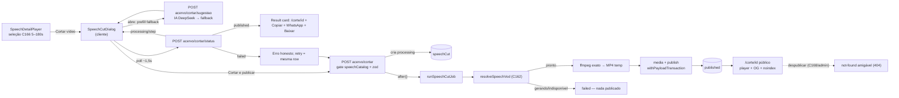

# Impl: Acervo: cortar o trecho [início,fim] e publicar o arquivo numa página compartilhável

Status: aprovado
Atualizado em: 2026-09-15
Issue: #1014
Intenção: docs/plans/c167-cortar-trecho-publicar.md
Appetite restante: herdado (~2–3 dias eng; nenhum corte de escopo proposto)

## Leitura da intenção

- **Outcome:** da seleção [início,fim] do C166 (5–180 s), "Cortar vídeo" gera e salva o MP4 do trecho exato — sem aproximar keyframe —, com título/descrição IA pt-BR pré-preenchidos e editáveis, publica `/corte/<id>` (unlisted, `noindex`, só por link) tocando o mesmo arquivo e baixável; falhou o corte, nada publica.
- **O que NÃO negociar:** corte quem lê o acervo (`communicator`/`coordinator`/`candidate`; advisor/leader negados fail-closed — `canReadSpeechCatalog`); sem transcrição/internals no público; crédito "Fonte: Câmara dos Deputados · CC BY 4.0"; sem upload externo, sem `Consent`, sem segundo cadastro; kill switch despublica na hora; IA indisponível não bloqueia (fallback determinístico `Trecho de <tipo> — <data>` + sumário oficial); a página toca o **mesmo** arquivo do download.
- **O que reavaliar (hipóteses da intenção):**
  1. "O arquivo exato [início,fim] sai da seleção C166" pressupõe um arquivo fonte no servidor. A única fonte possível é o VOD da Câmara já re-resolvido pelo C162 — o YouTube não é baixável dentro do aceite. Logo o corte só existe quando `speechVodCoordinates(speech) !== null` (mesmo predicado do botão C162), e o job usa `resolveSpeechVod` + o mesmo sistema de coordenadas da seleção (segundos do arquivo que o player toca).
  2. "Página pública" no `(frontend)` herda `robots: {index:true}` do layout — `/corte/<id>` precisa de override próprio (não há precedente de página pública unlisted).
  3. O request síncrono não cabe: Cloudflare → 524 com o Node ainda trabalhando = estado ambíguo. Persistência + background + polling vira decisão dura (D2).
  4. O placeholder "Gerando título e descrição" do draft exige um passo real no job (garantia de fallback/normalização), já que a sugestão IA acontece no modal (D8).

## Abordagem recomendada



**Opções consideradas:** A) ffmpeg no servidor da imagem + job assíncrono in-process com `after()` e polling; B) ffmpeg.wasm no navegador; C) serviço externo de render; D) `ffmpeg -c copy`.
**Recomendação:** A — o repo já tem o padrão de mutação JSON em `/campanha`, proxy S3 com Range para tocar/baixar, e a produção é um container único com CPU ociosa; o custo é `apk add ffmpeg` só no estágio `runner` e um runner de job pequeno e testável com fake.
**Rejeitadas:** B porque exige COOP/COEP globais (quebraria o embed do YouTube do C162), ~30 MB de wasm e teto de RAM do browser; C porque não existe serviço e criar um é o rabbit hole declarado; D porque `-c copy` só corta em keyframe e viola o aceite ("sem aproximar keyframe").

## Decisões de engenharia (caras de reverter)

### D1 — Mecanismo de corte: ffmpeg na imagem, comando exato por re-encode

- **Opções:** A) `apk add --no-cache ffmpeg` no estágio `runner` + `child_process.execFile` com `FFMPEG_PATH` (default `ffmpeg`); B) ffmpeg.wasm no browser; C) serviço externo; D) `-c copy`.
- **Recomendação:** A. Comando (array de args, sem shell — sem interpolação):
  ```
  ffmpeg -nostdin -hide_banner -y
    -ss <startSeconds> -i <input>
    -t <endSeconds-startSeconds>
    -map 0:v:0 -map 0:a?
    -c:v libx264 -preset veryfast -crf 20 -pix_fmt yuv420p
    -c:a aac -b:a 128k
    -movflags +faststart
    <output>
  ```
  `-ss` **antes** de `-i` (seek rápido) **e re-encode** ⇒ o decoder descarta tudo antes do marco e o MP4 começa exatamente nele; `-t` (duração) evita a ambiguidade de `-to` com timestamps deslocados; `+faststart` para tocar progressivo no proxy; `execFile` com `timeout` (8× a duração, teto 5 min) e `maxBuffer` para o stderr.
- **Rejeitadas:** B (COOP/COEP global + RAM + asset grande); C (sem infra — rabbit hole); D (keyframe, viola o aceite).

### D2 — Síncrono vs assíncrono: `processing` persistido + `after()` + polling + reaper

- **Opções:** A) request síncrono; B) estado persistido `processing` + trabalho em background no processo (`after()` de `next/server`, Next 15.4) + polling de status + reaper lazy; C) fila externa/worker.
- **Recomendação:** B. O POST cria a row (`processing`, `step=resolving`) e responde em <1s; `after(() => runSpeechCutJob(...))` roda depois da resposta (não estoura o túnel ~100s); o cliente faz poll de ~1,5s em `POST acervo/cortar/status` e renderiza o `step`. Reaper lazy: `status=processing` com `updatedAt` > 10 min (`SPEECH_CUT_STALE_MS`) → `failed` ("interrompido"), executado no início do status e do retry — cobre restart/deploy sem cron nem sweep.
- **Rejeitadas:** A porque 524 com o servidor continuando = UI diz falhou mas o corte pode publicar (estado ambíguo, viola "nada publicado pela metade"); C porque é o rabbit hole nomeado na intenção (worker/retry/tela de pendências) e não há infra.

### D3 — Idempotência: retry reusa a row `failed`; create deduplica in-flight

- **Opções:** A) cada tentativa cria row nova; B) retry reusa a mesma row `failed` e o create devolve a row `processing` idêntica quando já existe uma para `createdBy+speech+range`; C) só guarda de UI (botão desabilitado).
- **Recomendação:** B. `POST cortar` checa antes uma row `processing` do mesmo autor+speech+[start,end] e devolve a existente (id estável, sem duplicata em duplo clique/retry de rede); `POST cortar` de retry (`cortar` com `retryOf`) só aceita `status=failed`, reseta `step/error/publishedAt` e reusa o mesmo id — a cena 3 promete "tentar de novo não cria corte duplicado".
- **Rejeitadas:** A (lixo na futura biblioteca C168 e risco de dois publicados para o mesmo trecho); C (rede/refresh burla o cliente; o servidor é o dono).

### D4 — Collection nova `speechCut` (não reusar `Speech`/`Media`)

- **Opções:** A) collection `speechCut` com status; B) campos no `Speech`; C) um doc por mídia com status só implícito (published = existe media).
- **Recomendação:** A. Migração `pnpm migrate:create add_speech_cut` (aditiva, sem backfill). Campos: `speech` (rel, required, index), `startSeconds`/`endSeconds` (number, required), `durationSeconds` (number; `end-start`, estável para a página), `title` (text, required), `description` (textarea, required), `status` (`select`: `processing|published|unpublished|failed`, default `processing`, required, index), `step` (`select`: `resolving|cutting|metadata|publishing`, opcional), `media` (rel `media`, opcional), `error` (textarea, admin readOnly, interno), `publishedAt` (date, admin readOnly), `createdBy` (rel `campaignUser`, admin readOnly, derivado no hook — padrão `CampaignDemand.ts:164-176`). Admin group **"Comunicação"** (mesmo da `Speech`), `useAsTitle: 'title'`. `admin.description` com o crédito CC BY. `status` **editável no Payload admin** (kill switch manual antes do C168, bust imediato pelo afterChange); o resto readOnly.
- **Rejeitadas:** B (poluiria o registro de fonte; N cortes por fala e a fala é read-only do import); C (perde `failed`/`processing` e a página não teria como esconder rascunho).
- **Revisão na execução (2026-09-15):** `speech` ficou **opcional**, não `required` — o FK gerado é `ON DELETE SET NULL` e a coluna `NOT NULL` fazia o delete de uma fala com cortes estourar no Postgres (o mesmo caso que obrigou o cascade de `CampaignUser`). Com a coluna anulável, excluir a fala preserva os links publicados (a página degrada tipo/data e some o link do YouTube) e o cleanup de e2e não quebra.

### D5 — Access: leitura pública só `published` no where; escrita = leitor do acervo

- **Opções:** A) `read: () => true` + filtro na página; B) `read` que devolve onde `{status: published}` para quem não é leitor e `true` para leitor/admin; C) rota pública lendo `overrideAccess:true` e mais nada.
- **Recomendação:** B — nova `canReadSpeechCut` em `src/utilities/access/speeches.ts` (owner do access de Speech), re-exportada por `src/utilities/campaignAccess.ts`:
  ```ts
  export const canReadSpeechCut: Access = async ({ req }) => {
    if (isPayloadAdmin(req.user)) return true
    const currentUser = await getFreshCampaignUser(req)
    return currentUser && canReadSpeechCatalog(currentUser.role)
      ? true
      : { status: { equals: 'published' } }
  }
  ```
  `create`/`update`: `canReadSpeech` (leitor do catálogo; o job e a action usam `overrideAccess: true` para o passo de sistema); `delete`: `payloadAdminOnly`. A action ainda repete o gate fresco (`canReadSpeechCatalog(actor.role)`) antes de qualquer leitura/escrita, como `resolveSpeechVodForActor` (C162).
- **Rejeitadas:** A porque a REST/GraphQL pública listaria `failed`/`unpublished` com `error` e `step` (internals); C porque deixa o REST sem proteção e o C168 dependente de um filtro que alguém esquece.

### D6 — Página pública cacheada por tag `document_speechCut:<id>` com bust no afterChange

- **Opções:** A) dinâmica a cada request; B) `getCachedDocumentById('speechCut', id, 1)` + `afterChange → revalidateDocumentById` (padrão Media/Petition); C) ISR por tempo.
- **Recomendação:** B. O `afterChange` do `SpeechCut.ts` chama `revalidateDocumentById('speechCut', doc.id)` em toda mudança — despublicar reflete na hora (kill switch) e republicar restaura o link. Sem `generateStaticParams` (unlisted: enumerar ids no build seria vazamento); a página renderiza on-demand. O read cacheado usa `overrideAccess` default (true) — por isso a página filtra `status === 'published'` explicitamente, exatamente como `abaixo-assinado/[id]/page.tsx:105-108` filtra `enabled`; o access D5 segue protegendo REST/GraphQL.
- **Rejeitadas:** A (custo de DB por hit sem ganho); C (janela de kill switch lenta).

### D7 — Indisponível = `notFound()` + `not-found.tsx` do segmento (404 amigável)

- **Opções:** A) `notFound()` com `src/app/(frontend)/corte/not-found.tsx`; B) página própria em 200 com o estado "Este corte não está disponível"; C) 404 default do Next; D) `not-found.tsx` no `(frontend)` inteiro.
- **Recomendação:** A. Cena 7 idêntica para despublicado e id inexistente (não revela existência), status HTTP 404 correto e sem tocar o 404 das outras páginas públicas. `generateMetadata` do caso indisponível devolve só `{ title: 'Este corte não está disponível', robots: { index:false, follow:false } }` (sem vazar título real).
- **Rejeitadas:** B (200 para recurso removido confunde crawler/monitoração e o kill switch perde semântica); C (página crua, não a cena 7); D (blast radius em todo 404 público sem necessidade).

### D8 — IA: sugestão no modal (ai | fallback) + fallback determinístico garantido no job

- **Opções:** A) ação `sugestao` ao abrir o modal devolve `{title, description, source:'ai'|'fallback'}`; o cliente pré-preenche com fallback **na hora** (já tem tipo/data/summary) e troca pelo texto IA se o usuário não tiver digitado (dirty flag); o passo `metadata` do job normaliza/garante fallback; B) IA só dentro do job; C) IA obrigatória (bloqueia sem provedor).
- **Recomendação:** A. Módulo `src/utilities/speech/speechCutMetadata.ts` no molde de `campaignDemandTitle.ts`/`rerankSpeechExcerpts.ts`: `generateObject` (zod `{title ≤ 120, description ≤ 600}`), DeepSeek `deepseek-flash`, `DEEPSEEK_API_KEY`, timeout ~6s, **nunca lança → null**; sem chave/erro → fallback. O fallback puro `buildSpeechCutFallbackMetadata` vive em `src/lib/speechCut.ts` (client-safe, unit-testável) e usa `Trecho de <tipo> — <data>` + `summary` oficial. Aviso "Sugerido por IA — revise" só quando `source === 'ai'`; sem IA, nota discreta de revisão.
- **Rejeitadas:** B (não pré-preenche o formulário — o aceite pede editar antes de confirmar); C (viola "sem bloquear a criação").

### D9 — Download: `<a download>` same-origin no proxy do Payload

- **Opções:** A) `<a href={media.url} download>` (mesma origem); B) rota dedicada com `Content-Disposition`; C) query `?download=1`.
- **Recomendação:** A. Verificado no `staticHandler` do `@payloadcms/storage-s3` (v3.82): ele streama com `Content-Type`/`ETag`/Range e **não** seta `Content-Disposition`; `media.url` é relativa e same-origin (`/api/media/file/<filename>`), então o atributo `download` do `<a>` é honrado pelo browser sem mudar storage.
- **Rejeitadas:** B (rota nova só para um header, com risco de furar o contrato de Range); C (`?download=1` não existe no handler).

### D10 — OG: capa do YouTube quando a sessão tiver; senão a imagem global do Metadata

- **Opções:** A) `https://i.ytimg.com/vi/<id>/hqdefault.jpg` via `parseYoutubeVideoId(speech.youtubeUrl)`; senão a imagem do global `metadata` (padrão de post/petição); B) extrair poster do MP4 com ffmpeg e subir como mídia; C) sem imagem quando não houver YouTube.
- **Recomendação:** A. Absoluta por natureza; o fallback global já é o padrão do site (`resolveSiteMetadata`/`toAbsoluteUrl`). O `<video>` ainda usa a capa do YouTube como `poster` quando existir.
- **Rejeitadas:** B (segundo artefato/step — capa automática é polish; gatilho de revisitação: se o preview sem YouTube incomodar no C168); C (preview pior que o padrão do site, que já tem imagem).

### D11 — Docker: ffmpeg só no estágio `runner`, caminho por `FFMPEG_PATH`

- **Opções:** A) `RUN apk add --no-cache ffmpeg` no `runner` (depois de `FROM base AS runner`, antes de `USER nextjs`), leitura preguiçosa `process.env.FFMPEG_PATH ?? 'ffmpeg'`; B) no `base` (todos os estágios); C) binário estático vendorizado no repo.
- **Recomendação:** A — só a imagem de produção paga (~+80 MB); `deps`/`builder`/`migrator` ficam como estão; `FFMPEG_PATH` permite o fake nos testes sem ffmpeg local. `.env.example` ganha `FFMPEG_PATH=` comentado (vazio = `ffmpeg` do PATH).
- **Rejeitadas:** B (infla builder/migrator sem uso); C (supply-chain/arquitetura pinada sem ganho).

### D12 — Cobertura e2e: spec browserless novo + entradas no manifest + curated

- **Opções:** A) novo `tests/e2e/campaignSpeechCut.e2e.spec.ts` (gates das rotas + página pública 200/404/noindex) com entradas no `E2E_AFFECTED_MANIFEST` e `campaignSpeechCut` no `E2E_CURATED_SPECS`; B) estender só o `campaignSpeechAcervo`; C) cobertura só em int.
- **Recomendação:** A. O manifest ganha `campaignSpeechCut` na entrada de `comunicacao`/`src/components/campaign/speech`/`src/utilities/speech`/`src/lib/speech` e uma entrada própria `{ prefixes: ['src/app/(frontend)/corte'], specs: ['campaignSpeechCut'] }` (a entrada ampla `src/app/(frontend)` continua acordando `frontend` — união, sem `unmapped-risk`). `campaignSpeechCut` entra no curado (o diff desta entrega é high-risk por collection/migration/payload.config: sem isso o PR não roda a cobertura nova) — a pinagem congelada em `tests/unit/e2eAffectedManifest.unit.spec.ts:54-67` é editada **de propósito**, com o custo declarado (spec browserless, segundos). O e2e não exercita render real: cria `media`+`speechCut` publicados via fixtures e afirma o contrato HTTP; advisor/leader negados nas rotas de corte.
- **Rejeitadas:** B (o contrato novo da URL pública ficaria sem spec próprio); C (status 200/404, `noindex` e gate HTTP pertencem ao e2e; int não vê a resposta da rota).

## Componentes / mudanças

**Domínio / schema**

- **`src/collections/SpeechCut.ts`** (novo, `speechCut`): config D4; `access` D5; `hooks.beforeChange` deriva `createdBy` do `req.user` (`campaignUser`); `hooks.afterChange` → `revalidateDocumentById('speechCut', doc.id)`.
- **`src/utilities/access/speeches.ts`**: + `canReadSpeechCut` (D5); **`src/utilities/campaignAccess.ts`**: re-export.
- **`src/payload.config.ts`**: import + `SpeechCut` na lista `collections` (junto de `Speech`).
- **Migration:** `pnpm migrate:create add_speech_cut` → `src/migrations/<ts>_add_speech_cut.ts|.json` + `src/migrations/index.ts`; rodar `pnpm migrate` local e `pnpm generate:types` (commitar `src/payload-types.ts`, que é trackeado).
- **`Dockerfile`**: `RUN apk add --no-cache ffmpeg` no `runner`; `.env.example`: `FFMPEG_PATH=`.

**Lógica pura e contratos**

- **`src/lib/speechCut.ts`** (novo, client-safe): `SpeechCutStep = 'resolving'|'cutting'|'metadata'|'publishing'`; `SPEECH_CUT_STEPS`/labels pt; `speechCutStepStates(currentStep)` (`done|current|queued`); `buildSpeechCutFallbackMetadata({speechType,dateLabel,summary})`; `buildSpeechCutFfmpegArgs({inputPath,outputPath,startSeconds,endSeconds})`; `speechCutPublicPath(id)`; `toSpeechCutViewModel(record)` (status/step/link/media/título sem `error`/`createdBy`).
- **`src/lib/schemas/speechCut.ts`** (novo): `speechCutRequestSchema` (create: `speechId`, `startSeconds`/`endSeconds` inteiros, `title` 1–200, `description` 1–2000, refine 5–180 s via `MIN_EXCERPT_SECONDS`/`MAX_EXCERPT_SECONDS` de `@/lib/speechExcerptSelection`), `speechCutRetryRequestSchema`, `speechCutStatusRequestSchema`, `speechCutSuggestionRequestSchema`; mensagens seguras `SPEECH_CUT_FORBIDDEN_MESSAGE` (re-export nomeado de `SPEECH_VOD_FORBIDDEN_MESSAGE` — um literal só), `SPEECH_CUT_NOT_FOUND_MESSAGE`, `SPEECH_CUT_INVALID_RANGE_MESSAGE`, `SPEECH_CUT_RETRY_NOT_FAILED_MESSAGE`, `SPEECH_CUT_GENERIC_ERROR_MESSAGE`.
- **`src/utilities/speech/speechCutMetadata.ts`** (novo, `server-only`): `suggestSpeechCutMetadata(...)` (D8), monta a janela do trecho dos `speechSegment` que intersectam [início,fim] (cap ~1200 chars) + `summary` + tipo/data; nunca lança.
- **`src/utilities/speech/speechCutJob.ts`** (novo, `server-only`, **sem** import de `next/server`): `runSpeechCutJob(payload, cutId)`; `reapStaleSpeechCut(payload, cut)`; download do VOD (`fetch` com `CAMARA_USER_AGENT` e `AbortSignal.timeout(180_000)`, rejeita `text/html`, guarda de tamanho, `Readable.fromWeb` → arquivo em `fs.mkdtemp`), `execFile` do ffmpeg, `finally` apagando o temp. Fluxo:
  1. `step=resolving`: `resolveSpeechVod(coordinates)`; `gerando`/`indisponivel`/sem URL jogável → `failed` com mensagem interna (ex.: "A Câmara ainda está gerando o vídeo" / "A Câmara não entregou o arquivo");
  2. `step=cutting`: baixa para `input.mp4`, monta args com `buildSpeechCutFfmpegArgs` e roda o binário; exit ≠ 0 → `failed`;
  3. `step=metadata`: normaliza/garante `title`/`description` (fallback D8) — update de sistema (`overrideAccess: true`);
  4. `step=publishing`: `withPayloadTransaction` → `payload.create media` (`filePath` do MP4, `alt: title`, `req`) + `payload.update speechCut` (`status: 'published'`, `media`, `publishedAt`, `step: null`, `error: null`, `req`) — upload fora de transação de S3 é o mesmo contrato de `profile.ts:58-85`/`demand.ts:210-260`; falha ⇒ rollback + `failed`, nunca publicado; sobra eventual de objeto no bucket é aceita (sem row órfã).
- **`src/utilities/speech/speechCutScheduler.ts`** (novo, `server-only`): `startSpeechCutJobInBackground(cutId)` com `after` de `next/server` (o único módulo que importa o scheduler; mantém o job testável em node puro).

**Ações e rotas**

- **`src/app/(campaign)/campanha/actions/speech.ts`** (estender o owner, sem twin): `createSpeechCutForActor` (gate fresco → load da fala com `overrideAccess:false` → `normalizeExcerptRange` contra `durationSeconds` → dedupe in-flight D3 → `payload.create` com `createdBy` do hook → view), `retrySpeechCutForActor` (só `failed`), `getSpeechCutStatusForActor` (reaper + view), `suggestSpeechCutMetadataForActor` (gate + segmentos + D8).
- **Rotas** (padrão `resolver-vod/route.ts`: `campaignJsonMutationRoute`, `dynamic = 'force-dynamic'`, `types.ts` local):
  - `src/app/(campaign)/campanha/(app)/comunicacao/acervo/cortar/route.ts` + `types.ts`;
  - `.../cortar/status/route.ts`;
  - `.../cortar/sugestao/route.ts`.
    Nomes de URL em pt (precedente `resolver-vod`); identificadores/selects em inglês.

**UI**

- **`src/components/campaign/speech/SpeechDetailPlayer.tsx`** (editar o owner): nova prop obrigatória `speechSummary: string | null`; com `selecting && selection && vodResolvable`, CTA primário **"Cortar vídeo"** (`ScissorsIcon`) ao lado do "Compartilhar" C166 (que vira secundário); estado `publishedCut` renderiza `SpeechCutResultCard` abaixo das ações. O detalhe `acervo/[id]/page.tsx` passa `speechSummary={view.summary}`.
- **`src/components/campaign/speech/SpeechCutDialog.tsx`** (novo, cliente; padrão `Dialog`/`Sheet` coarse via `useCoarsePointer` como o `SpeechExcerptShare`): cena 1 (range, inputs editáveis, badge "Sugerido por IA — revise" quando `source='ai'`, nota de fallback quando não), cena 2 (lista dos 4 passos com `step` do poll, sem porcentagem), cena 3 (erro + "Tentar novamente" = retry do mesmo id + "Voltar ao acervo"), sucesso → callback com o corte. Poll em `postCampaignJson` com `AbortSignal` e limpeza no unmount.
- **`src/components/campaign/speech/SpeechCutResultCard.tsx`** (novo): link `/corte/<id>` (absoluto via `window.location.origin`), "Copiar link", "WhatsApp", "Baixar arquivo (MP4)" (`download`), "Abrir página" e preview OG mínimo (capa YouTube + título + descrição + domínio).
- **`src/components/SpeechCutShareActions.tsx`** (novo, cliente, compartilhado acervo/público): copiar (feedback com reset, padrão `SpeechExcerptShare.tsx:19-33`), `buildWhatsAppTextShareUrl` de `@/lib/phone`, `<a download>` — um dono para o trio em vez de duas cópias.
- **`src/app/(frontend)/corte/[id]/page.tsx`** (novo): `getCachedDocumentById('speechCut', id, 1)`, `status !== 'published'` → `notFound()`; `<SiteHeader />`; `<video controls preload="metadata" playsInline src={cut.media.url} poster={youtubeCover}>`; título, contexto `Discurso em plenário · <data> · <duração> · Ver sessão no YouTube ↗` (reusa `formatSpeechAt` de `speechViewModels.ts`, `formatSpeechSpan` de `speechClock.ts`, `speech.youtubeUrl` cru), descrição, ações compartilhadas, crédito CC BY. Sem transcrição/JSON-LD (gate: revisitar o JSON-LD só se a página algum dia for listada).
- **`src/app/(frontend)/corte/not-found.tsx`** (novo): cena 7 (mesma resposta para despublicado/inexistente).

**Testes/infra**

- `tests/unit/speechCut.unit.spec.ts` (args ffmpeg — `-ss` antes de `-i`, `-t`, x264/aac/faststart —, fallback, passos, view model, share), `tests/unit/speechCutDialog.unit.spec.tsx` (RTL, fetch mockado: prefill fallback, IA substitui campo intocado, dirty flag, poll→sucesso/erro→retry), ajuste de `tests/unit/speechDetailPlayer.unit.spec.tsx` (nova prop) e de `tests/unit/e2eAffectedManifest.unit.spec.ts` (pin do curado).
- `tests/int/speechCut.int.spec.ts`: matriz de access; create normaliza range/rejeita inválido/deduplica; retry reusa row e rejeita não-`failed`; job feliz com `fetch` stubado (VOD `PRONTO` + bytes) e **fake ffmpeg** (`FFMPEG_PATH=tests/fixtures/fake-ffmpeg.mjs`, log de argv em env) → media + published; falhas (indisponível, ffmpeg exit≠0) → `failed` sem media; reaper; bloco `describe.skipIf(!hasFfmpeg())` com ffprobe validando a duração exata (roda no CI; skip visível, nunca silencioso).
- `tests/fixtures/fake-ffmpeg.mjs` (executável, copia input→output, `FAKE_FFMPEG_FAIL`/`FAKE_FFMPEG_LOG`).
- `tests/e2e/campaignSpeechCut.e2e.spec.ts` (D12) + `tests/e2e/fixtures/campaignE2EFixtures.ts`: `'speechCut'` e `'media'` no union `OwnedCollection`/`deletionOrder` (cut antes de media e de speech).
- `scripts/lib/e2e-affected-manifest.mjs` + curated (D12).
- `docs/changelog/2026-09-15-c167.md` (uma entrada, não editar o agregado).

### Dados → forma (n/a)

Progresso/erro são feedback de ação (não dado de acervo) — nenhum KPI/gráfico novo, conforme a intenção. A página pública mostra contexto mínimo (tipo/data/duração/YouTube) e ações; sem transcrição.

## Fases verificáveis

1. **Tracer — schema + ação + corte fake (~40% do appetite).** Migration `add_speech_cut` + `SpeechCut.ts` + access + `src/lib/speechCut.ts` + schemas + job/scheduler + actions/rotas + fake ffmpeg. Verificação: `pnpm migrate` local, `pnpm generate:types`, `pnpm test:unit -- speechCut` e `pnpm test:int -- speechCut` verdes (access fail-closed, job fake publish/failed, reaper, retry); smoke manual com `FFMPEG_PATH` fake no dev (POST create→status publica). **Confirmação do contrato de coordenadas** (rebater a hipótese #1): segmentos ASR são relativos ao MP4 do VOD importado (`speechBundleFixture.ts:44` e `upsertSpeechBundle`), o mesmo arquivo que o C162 devolve; se o tracer mostrar offset de lead-in da Câmara, o marco continua o do arquivo tocado e a limitação é registrada (não silenciada).
2. **UI (~30%).** `SpeechCutDialog`, CTA/result no `SpeechDetailPlayer`, `SpeechCutResultCard`, `SpeechCutShareActions`; unit RTL. Verificação: `pnpm test:unit -- speechCutDialog` e player verdes; fluxo manual no dev com fake (feedback dos 4 passos, erro+retry sem duplicar, card de sucesso).
3. **Página pública + deploy-prep (~20%).** `/corte/[id]`, `not-found.tsx`, OG/noindex, `Dockerfile` (runner ffmpeg), manifest/curado, spec e2e novo + fixture ownership. Verificação: `pnpm test:e2e -- campaignSpeechCut` (browserless) verde; build local (`pnpm build`) funciona sem S3.
4. **Gates e fechamento (~10%).** `pnpm gate:fast` → `pnpm gate:ci` → changelog → `pnpm push`. Verificação final de produção fica com o `deploy-staging` (OPS103) antes de produção.

## Rabbit holes / Não escopo (engenharia)

- **Editor de vídeo/ajuste de marcos no servidor.** O corte é o [início,fim] do C166; nada de timeline, filtros ou re-render.
- **Fila externa/worker/notificação.** `after()` + polling + reaper é o teto desta fatia.
- **Legenda/transcrição no arquivo gerado, `.srt`, burn-in.** O MP4 sai mudo de texto; a transcrição segue só no acervo interno.
- **Poster/capa automática por frame e imageSizes.** OG = YouTube ou imagem global (D10); revisitar no C168 se necessário.
- **Biblioteca/listagem/toggle de despublicar na UI interna.** É o C168; aqui só o campo `status='unpublished'` e o kill switch manual no admin.
- **Upload externo de vídeo, publicação em redes via API, Consent/segundo cadastro, indexação/SEO.** Fora do aceite.
- **Enumerar ids no build (`generateStaticParams`).** Unlisted é só por link; nada de pré-render de todos os cortes.

## Débitos triados (simplify 2026-09-15)

- **Dedupe de corte já publicado** (recortar a mesma janela cria um segundo `published`) e **field access dos campos de sistema** (`step`/`media`/`publishedAt`/`error`/`durationSeconds` hoje só `admin.readOnly`): defer com gatilho **C168** — a biblioteca é quem decide dedupe/curadoria e é quem edita `status`. O dedupe in-flight (mesmo `processing`) está implementado.
- **Causa específica da falha no diálogo** (hoje a mensagem genérica "A Câmara não está entregando…" cobre ffmpeg/storage): defer — expor o `error` interno exigiria sanitizar stderr (paths) e o C168 vai rever o painel de estados.
- **Variante Sheet/coarse do diálogo**: defer com gatilho: primeiro feedback de uso no mobile (o Dialog com scroll atende).
- **E2E**: o cleanup de mídia/corte é best-effort por REST no `afterAll` (DB de e2e é efêmero); descartado o net de resíduo que as fixtures usam para rows criadas via Local API.

## Riscos e mitigação

- **524 do Cloudflare/túnel.** POST responde com a row `processing`; o trabalho vai no `after()`; a UI acompanha por poll (D2). Nenhum request longo.
- **ffmpeg ausente no dev local.** Fake ffmpeg nos unit/int (sempre) + bloco real `skipIf(!hasFfmpeg())` explícito (roda no CI/ubuntu e no verify do deploy); a validação real do arquivo acontece no staging.
- **Restart/deploy no meio do job.** Job órfão fica `processing`; o reaper lazy (10 min) marca `failed` e o retry reusa a row — nada publicado.
- **Câmara `gerando`/CDN fora/HTML disfarçado de 200/arquivo grande.** `resolveSpeechVod` já rejeita texto e faz probe; o job falha fail-closed com mensagem honesta e sem publicar; guarda de tamanho/tempo no download.
- **Falha no S3/Garage ou na transação de publicação.** `withPayloadTransaction` no passo `publishing`; falha ⇒ `failed`, sem media anexada, sem página; eventual objeto órfão no bucket é o mesmo trade-off já aceito em avatar/comprovante.
- **Banda/CPU do homeserver.** O download é server→Câmara e o upload é server→Garage local (não passa pelo túnel); a reprodução usa o proxy Range já existente; `veryfast` no ffmpeg limita CPU; duas execuções simultâneas são raras no time — sem lock nesta fatia (gatilho: primeiro relato de travamento em corte concorrente).
- **Estado ambíguo do cliente.** Erro de rede no create/retry não cria lixo: dedupe in-flight no servidor + retry por id; a seleção permanece no modal (cena 3).
- **Vazamento de internals.** `error`/`step`/`createdBy` nunca vão ao público; status route devolve só estado/passo/link; metadata do indisponível não expõe título.
- **Cache do kill switch.** `afterChange` busta a tag a cada update; despublicar reflete imediatamente (mesmo se o admin usar o Payload admin).

## Aceite de engenharia

- [ ] Aceite de produto da intenção coberto: MP4 exato [início,fim] salvo, `/corte/<id>` toca e baixa o mesmo arquivo, OG (título/descrição/imagem), `noindex`, crédito CC BY, fallback de IA, falha não publica, gate do acervo fail-closed.
- [ ] Invariantes AGENTS/engineering-standards: migração commitada (`.ts`+`.json`+`index.ts`) e `push:false` intocado; multi-collection write em transação com `req.transactionID`; sem `Consent`/`Contact` paralelos; `payload-types.ts` regenerado e commitado; strings de UI em pt, identificadores em inglês; `admin.group` consistente.
- [ ] Testes previstos: unit (ffmpeg args, fallback, passos, view model, dialog RTL), int (matriz de access, create/retry/dedupe/reaper, job fake + ffmpeg real sob `skipIf` explícito), e2e `campaignSpeechCut` (gates + página 200/404/`noindex`); manifest atualizado e pin do curado editado de propósito.
- [ ] `pnpm gate:fast` e `pnpm gate:ci` verdes; `Dockerfile` com ffmpeg no runner validado no `deploy-staging` antes de produção; changelog `docs/changelog/2026-09-15-c167.md`.

## Self-score (decision-quality ≥4)

1. **Decisões caras têm rejeitadas?** 5/5 — D1–D12 com Opções/Recomendação/Rejeitadas explícitas (mecanismo, execução, idempotência, schema, access, cache, 404, IA, download, OG, Docker, e2e).
2. **Abordagem cabe no appetite?** 4/5 — ~2–3 dias com tracer cobrindo a maior incerteza (ffmpeg) cedo; UI e página são reuso de shells/precedentes; a margem é apertada, mas nenhum rabbit hole entrou.
3. **Rabbit holes nomeados?** 5/5 — editor, fila/worker, legenda, poster, biblioteca C168 e SEO listados com corte.
4. **Depth check (reusa shells/helpers)?** 5/5 — `resolveSpeechVod`/`speechVodCoordinates` (C162), `campaignJsonMutationRoute`, `withPayloadTransaction`, `speechExcerptSelection`, `getCachedDocumentById`/`revalidateDocumentById`, `SpeechExcerptShare` (pattern), `campaignDemandTitle` (pattern), `buildWhatsAppTextShareUrl`; nenhum módulo pass-through novo.
5. **Intenção permanece satisfeita?** 5/5 — a engenharia não reescreveu o outcome; a única restrição nova (corte exige VOD resolvível, D1/hipótese #1) é a condição factual para existir arquivo para cortar e foi registrada.
