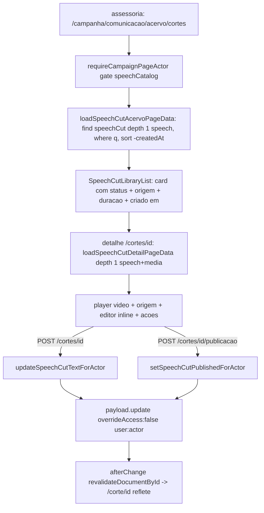

# Impl: Acervo: biblioteca de cortes (origem, download, compartilhar, editar título/descrição)

Status: aprovado
Atualizado em: 2026-09-15
Issue: #1015
Intenção: docs/plans/c168-biblioteca-cortes.md
Appetite restante: herdado (~1–1,5 dia eng)

## Leitura da intenção

- **Outcome:** a assessoria reencontra um corte já feito, confere o discurso de origem, ajusta título/descrição, baixa, compartilha e publica/despublica — sem refazer o corte. O C167 já deixou `speechCut` persistido, `/corte/<id>` no ar e o kit de compartilhamento; este item é a **biblioteca** que faltava para o corte não morrer no link.
- **O que NÃO negociar:** rota separada `/campanha/comunicacao/acervo/cortes` (lista) e `.../cortes/[id]` (detalhe); `communicator`/`coordinator`/`candidate` leem e editam, `advisor`/`leader` fail-closed; mais recentes primeiro com busca por título/descrição; kill switch despublicar/republicar no MESMO link; sem editor de vídeo, sem deletar pela UI, sem métricas; editar o texto do corte nunca toca a fala original nem o vídeo.
- **O que reavaliar:** o C167 só tem a página pública e o card de sessão; **não existe lista, detalhe interno, nem a action que alterna `status`**. O `<video>` público (`(frontend)/corte/[id]/page.tsx:135-144`) e o `SpeechCutShareActions` são os ativos reusáveis; o resto é novo. Decidir busca sem migração, dono da mutação, semântica do toggle e degradação quando `speech` é `null`.

## Abordagem recomendada

**Opções consideradas:** A — biblioteca como lista/detalhe próprios na vertical, reusando shells do acervo + kit do C167 (dono único de mutação) | B — estender o acervo de falas com abas Falas|Cortes | C — não ter UI interna e só expor os cortes no admin Payload.

**Recomendação:** A — o C167 já entregou o objeto (`speechCut`) e a página pública; falta a superfície de leitura/edição. Os shells (`CampaignPageShell`, `CampaignListPendingBoundary`, `CampaignListFooter`, `CampaignListEmptyState`), o `SpeechCutShareActions` e o `campaignJsonMutationRoute` já existem e são profundos; a lista de falas dá o esqueleto exato a copiar. Abas (B) misturam `where`/ordenação/filtros que a própria intenção declarou diferentes; admin (C) não atende o job (a assessoria não vive no admin).

**Rejeitadas:** B porque `SpeechListState` é facetado e acoplado a `Speech.searchText`+segmentos (`speechListFilters.ts:48-55`) — reusá-lo arrastaria busca de fala para dentro da lista de cortes; C porque não é a persona nem o produto (`communicator` não tem admin), e o kill switch/edição de texto precisam viver na vertical.

### Decisões de engenharia (caras de reverter)

**D1 — Busca por título/descrição.**
Opções: A) `or: [{ title: { like } }, { description: { like } }]`, sem migração | B) campo `searchText` + índice + `pnpm migrate:create` | C) filtro client-side.
**Recomendação: A** — os dois campos são `text`/`textarea` curtos (`SpeechCut.ts:101-113`) e o volume é de dezenas/centenas; `like` (ILIKE, case-insensitive) é precedente direto em `contactListUrl.ts:250-259`. Não há índice em `title`/`description` hoje (migration `20260915_122356_add_speech_cut.ts`), mas o volume não justifica um. **Gatilho de revisão:** passar de ~5–10 mil cortes OU o produto pedir busca acento-insensível/ranqueada → aí sim `searchText`+índice+migração, como `Speech`. Limitação honesta registrada: `like` não ignora acento.
**Alternativas rejeitadas:** B porque adiciona campo, hook de normalização e migração (schema é caro de reverter) por um ganho que o volume não paga; C porque busca no cliente quebra paginação e estado canônico na URL.

**D2 — Dono da mutação (título/descrição/status).**
Opções: A) JSON route via `campaignJsonMutationRoute` + server functions em `actions/speech.ts` | B) server action + `formActions.ts` (`runCampaignFormAction`) | C) browser chamando REST `/api/speechCut`.
**Recomendação: A** — `actions/speech.ts` já é o dono das mutações do acervo (C163–C167) e `campaignJsonMutationRoute` é o wrapper que o guard de convenção exige para `POST` (`campaignJsonMutationRoute.ts:92`; `codebaseConventions.unit.spec.ts` recusa `POST` fora dele). O detalhe é client-driven (edição inline + toggle) e os irmãos (`cortar`, `cortar/status`, `cortar/sugestao`) já são JSON routes; **não existe `formActions.ts` no acervo**.
**Alternativas rejeitadas:** B porque introduz um segundo dono de formulário onde nunca houve, e o detalhe não é um `<form action>` de navegação; C porque, apesar de respeitar os access controls da collection, não repete o gate `speechCatalog` nem a montagem whitelisted do `data` e fura o same-origin do wrapper.

**D3 — Semântica do toggle publicar/despublicar.**
Opções: A) `status: 'published' ↔ 'unpublished'`; `publishedAt` recebe o timestamp do novo publish e é preservado no unpublish | B) zerar `publishedAt` ao despublicar | C) novo estado `archived` (soft delete).
**Recomendação: A** — o link é `/corte/<id>` (`speechCutPublicPath`, `speechCut.ts:144`), id imutável ⇒ republicar restaura o MESMO link sem tocar `media`/`speech`; o kill switch já existe do lado público (`status === 'published'` em `(frontend)/corte/[id]/page.tsx:41`) e do lado do anônimo (`canReadSpeechCut` retorna `{ status: { equals: 'published' } }`, `access/speeches.ts:46`). É update de **uma** collection ⇒ sem transação (a invariante de transação vale para escritas multi-collection). O `afterChange` do C167 (`SpeechCut.ts:59-63`) já chama `revalidateDocumentById('speechCut', doc.id)`, que invalida o cache tag que a página pública lê (`getCachedDocumentById`, `(frontend)/corte/[id]/page.tsx:40`) — o refletir é automático, **sem hook novo e sem migração**. `publishedAt` fica como "última publicação" (readOnly, admin); nenhum consumidor o usa para decidir o kill switch.
**Alternativas rejeitadas:** B porque apaga o último momento de publicação (auditoria barata) sem contrapartida; C porque inventa estado e desfaz o vocabulário do C167 (`unpublished` já é canônico em `speechCut.ts:11-23`).

**D4 — Lista como cards vs tabela.**
Opções: A) cards + shells compartilhados (precedente `SpeechResultCard`/`SpeechResultList`) | B) `CampaignTable` (colunas como dado + cookie de visibilidade) | C) lista própria sem shells.
**Recomendação: A** — herda o esqueleto exato de `acervo/page.tsx:29-85` (`CampaignPageShell > CampaignListPendingBoundary > Filters + CampaignListResults > List/EmptyState/Footer`); status + origem + duração + criado em e as ações (abrir/copiar) cabem no card, e só há ordenação fixa `-createdAt` — tabela não paga o custo de `readCampaignColumnVisibility`/cookie nem semântica de sort por coluna.
**Alternativas rejeitadas:** B porque traz o sistema de colunas configuráveis sem necessidade; C porque duplicaria o contrato de pending/footer/empty.

**D5 — Detalhe: player, edição e aviso.**
Opções: A) reusar `SpeechCutShareActions` + `<video controls>` + editor inline client + `AlertDialog` | B) reusar `SpeechDetailPlayer`/`SpeechCutDialog` | C) editar em modal.
**Recomendação: A** — `SpeechCutShareActions.tsx:29` já entrega copiar/WhatsApp/baixar com a prop `primary` (no detalhe, `primary="copy"` + botão "Abrir página pública"); o player do corte é o `<video controls preload="metadata" playsInline>` de `(frontend)/corte/[id]/page.tsx:135-144` (o corte é o MP4 inteiro, não um VOD com offset). O editor de título/descrição é um client component que chama o JSON route; o aviso de despublicar é `AlertDialog` (primitivos em `src/components/ui/AlertDialog.tsx`; precedente de confirmação em `RemoveSupporterDataButton.tsx`) com a copy literal. **Nuance de produto que o detalhe assume:** para corte `unpublished`, copiar/WhatsApp ficam indisponíveis (o link está morto) e mostra-se o CTA de publicar; o download do MP4 continua (o arquivo existe). Para `processing`/`failed`, o editor e o toggle ficam desabilitados (não há o que publicar).
**Alternativas rejeitadas:** B porque `SpeechDetailPlayer` é da fala (VOD/YouTube/transcrição/segmentos/`SpeechCutDialog`) e `SpeechCutDialog` é o fluxo de criação, não de edição; C porque modal para texto longo piora a edição e contraria o draft (cena 3 é edição inline).

**D6 — Discurso de origem.**
Opções: A) carregar `speech` (depth 1) com `overrideAccess:false` e degradar quando `null` | B) query separada com bypass admin | C) denormalizar tipo/data no corte (migração).
**Recomendação: A** — o relationship é `index` e o loader do C167 já lê `speech` a depth 1 (`actions/speech.ts:104-119`); a FK é `SET NULL` (comentário em `SpeechCut.ts:78-80`), logo `speech == null` é esperado: esconde-se o link e mostra "Fala de origem indisponível", mantendo título, descrição, duração e arquivo (que vêm do próprio corte). O link "Ver fala no acervo" aponta para `/campanha/comunicacao/acervo/<speechId>`; a superfície pública continua `/corte/<id>`.
**Alternativas rejeitadas:** B porque bypass admin para ler uma fala que o ator já tem direito (`speechCatalog`) é bypass desnecessário; C porque copia dado que muda (tipo/data da fala) e exige migração por um ganho de render.

**D7 — Access.**
Opções: A) reusar `canReadSpeechCut` (read) e `canReadSpeech` (update) + gate `speechCatalog` na página/actions; `delete` segue `payloadAdminOnly` | B) access novo para o corte | C) update restrito a `unrestricted`.
**Recomendação: A** — é a matriz que a intenção fixa. A collection já está correta (`SpeechCut.ts:51-56`) e **não muda**. A página usa `requireCampaignPageActor({ gate: 'speechCatalog' })` (`campaignPageActor.ts:74`, = `canReadSpeechCatalog`) e cada action repete `canReadSpeechCatalog(actor.role)` antes de ler/escrever, como `actions/speech.ts:247`. O `payload.update` roda `overrideAccess:false, user:actor` e o `data` é montado **só** com `{ title, description }` ou `{ status, publishedAt }` do schema zod — a whitelist de campos é a fronteira, não o access da collection. Atenção explícita: **`canUpdateSpeech` NÃO serve** — é de papéis unrestricted (`access/speeches.ts:27-31`) e barraria o `communicator`, que é o dono do texto do CORTE.
**Alternativas rejeitadas:** B porque duplicaria a matriz que `canReadSpeech`/`canReadSpeechCut` já são donos; C porque a intenção assumiu "qualquer um com acesso ao acervo edita" (validado no gate).

**D8 — Testes e manifest.**
Opções: A) unit de URL + int de access/update/toggle + e2e do gate das rotas internas | B) só int | C) e2e de browser para o toggle.
**Recomendação: A** — unit cobre parse/href canônicos do `speechCutListUrl` e a montagem do `data` do toggle; int cobre a matriz de papéis (padrão de `tests/int/speechCut.int.spec.ts:139-148`), que editar texto reflete no loader e que despublicar remove o corte do find anônimo; e2e HTTP (`campaignSpeechCut.e2e.spec.ts:188-245`) cobre o gate das rotas internas (communicator 200 / advisor+leader fail-closed) sem dirigir ffmpeg. **O manifest não muda** desde que os utilitários fiquem em `src/utilities/speech/` e os componentes em `src/components/campaign/speech/`: os prefixos já estão mapeados em `scripts/lib/e2e-affected-manifest.mjs:288-308` (`${CAMPAIGN_APP}/comunicacao`, `src/components/campaign/speech`, `src/utilities/speech`).
**Alternativas rejeitadas:** B porque a URL/estado canônico é contrato puro e barato de testar; C porque o toggle exige semear corte+media e browser sem ganho sobre o int (o que o e2e do C167 já prova é HTTP, não browser).

**D9 — Nav/chrome/paths.**
Opções: A) sem item de nav novo; entrada pelo acervo de falas + breadcrumb; paths/catálogo atualizados | B) item "Cortes" no nav do communicator | C) abas Falas|Cortes.
**Recomendação: A** — a intenção já assumiu rota separada e o draft (cenas 1–5) mostra a sidebar só com "Comunicação" e o breadcrumb "← Acervo de falas". Adiciona-se `CAMPAIGN_COMMUNICATION_CORTES` em `src/lib/campaignPaths.ts:26` e uma entrada `cortes` no catálogo de chrome + regra exata de lista **antes** da regex genérica `^/campanha/comunicacao/acervo/[^/]+$` (`campaignPageChrome.ts:282-288`), que hoje capturaria `/acervo/cortes` e devolveria `null`; o detalhe usa `SetCampaignPageChrome` como o detalhe da fala. Entrada visível: CTA "Biblioteca de cortes" na lista de falas.
**Alternativas rejeitadas:** B porque o communicator tem um único destino (a vertical) e o acervo é a porta; C já rejeitada em produto (estado/filtros/ordenação diferentes).

### Componentes / mudanças

**Constantes, chrome e nav (sem nav novo):**

- `src/lib/campaignPaths.ts:26` — `CAMPAIGN_COMMUNICATION_CORTES = '/campanha/comunicacao/acervo/cortes'`.
- `src/lib/campaignPageChrome.ts:119-122` — catálogo `cortes` (`{ title: 'Cortes', subtitle: 'O que já foi cortado — reencontre, ajuste o texto e republique.' }`); regras em `:282-288`: exata de lista antes da genérica e `/cortes/[^/]+` → `null`.
- `src/app/(campaign)/campanha/(app)/comunicacao/acervo/page.tsx` — CTA "Biblioteca de cortes" (link, `min-h-11`) apontando para `CAMPAIGN_COMMUNICATION_CORTES`.
- `src/components/campaign/shell/nav.ts` — **sem mudança** (`isCampaignNavActive` cobre o prefixo `/campanha/comunicacao`, `nav.ts:126`).

**Domínio (utilities/server), ao lado do C167 — sem twinning:**

- `src/utilities/speech/speechCutListUrl.ts` — `speechCutPageSize = 25`; `SpeechCutListState = { page: number; q?: string }`; param set `['q','page']`; `parseSpeechCutListParams`, `serializeCanonicalSpeechCutListSearchParams`, `buildSpeechCutListHref`, `buildSpeechCutFiltersKey`, `resolveSpeechCutListUrl` (base `CAMPAIGN_COMMUNICATION_CORTES`) sobre os helpers de `campaignListUrl.ts` (`resolveListUrl:117`, `buildListHref:144`); `buildSpeechCutListWhere` com o `or` de `like`.
- `src/utilities/speech/speechCutPageData.ts` (`server-only`) — `SpeechCutNotFoundError` via `createEntityNotFoundError`; `loadSpeechCutAcervoPageData` (`depth: 1`, select sem `media`, `sort: '-createdAt'`, `page`, `where`, `user`, `overrideAccess:false`) e `loadSpeechCutDetailPageData` (`depth: 1`, com `media`+`speech`); VMs de lista/detalhe mapeando `createdAt`/origem sobre `toSpeechCutViewModel` (`speechCut.ts:210`).
- `src/lib/schemas/speechCut.ts` — `speechCutTextUpdateRequestSchema` (`{ cutId, title, description }` com os máximos já existentes) e `speechCutPublicationRequestSchema` (`{ cutId, published: boolean }`), + `SPEECH_CUT_PUBLISH_NOT_READY_MESSAGE`.
- `src/app/(campaign)/campanha/actions/speech.ts` — `updateSpeechCutTextForActor` e `setSpeechCutPublishedForActor` reusando `loadSpeechCutForActor`/gate (`:104-119,247`).

**Rotas e componentes:**

- `.../acervo/cortes/page.tsx` (lista), `loading.tsx`, `.../cortes/[id]/page.tsx`, `.../cortes/[id]/not-found.tsx`, `.../cortes/[id]/route.ts` (update texto) e `.../cortes/[id]/publicacao/route.ts` (toggle) + `types.ts`, ambos `POST` via `campaignJsonMutationRoute`.
- `src/components/campaign/speech/SpeechCutLibraryFilters.tsx` (client; `CampaignListOmnibox` query-only sobre `useCampaignListFilterNavigation`), `SpeechCutLibraryList.tsx`, `SpeechCutLibraryCard.tsx` (status chip, origem, duração, criado em, ações), `SpeechCutTextEditor.tsx` (client, inline), `SpeechCutPublicationPanel.tsx` (client, status + `AlertDialog` de despublicar + publicar), `SpeechCutOriginCard.tsx` (client-safe).

**Mapeamento das cenas do draft (`c168-biblioteca-cortes-ui-draft.html`):**

| Cena                      | Conteúdo                                                                          | Componente                                                                                                                            |
| ------------------------- | --------------------------------------------------------------------------------- | ------------------------------------------------------------------------------------------------------------------------------------- |
| 1 lista desktop           | título + sub + busca + cards + paginação                                          | `cortes/page.tsx`, `SpeechCutLibraryFilters`, `SpeechCutLibraryList/Card`, `CampaignListFooter`                                       |
| 2 lista vazia             | "Nenhum corte ainda" + ir ao acervo de falas                                      | `CampaignListEmptyState` com CTA para `CAMPAIGN_COMMUNICATION_ACERVO`                                                                 |
| 3 detalhe                 | player, baixar/abrir/copiar/WhatsApp, editor título/descrição, origem, publicação | `cortes/[id]/page.tsx`, `<video>`, `SpeechCutShareActions`, `SpeechCutTextEditor`, `SpeechCutOriginCard`, `SpeechCutPublicationPanel` |
| 4 confirmação despublicar | título/corpo/botões literais                                                      | `SpeechCutPublicationPanel` + `AlertDialog`                                                                                           |
| 5 mobile                  | lista e detalhe empilhados                                                        | mesmos componentes, classes responsivas                                                                                               |

### Dados → forma

- **Fonte:** collection `speechCut`, `depth: 1` para `speech` (lista) e `speech`+`media` (detalhe); `where` derivado de `q`; `sort: '-createdAt'`; `limit: 25`; `page` canônica da URL. Sem agregação, sem gráfico, sem KPI.
- **Lista (DTO):** `id`, `title`, `status` + label, `createdAtLabel`, `durationLabel`, `publicPath`, `speech: { id, typeLabel, dateLabel, href } | null`, `excerpt` (título/descrição para a busca).
- **Detalhe (DTO):** tudo da lista + `description`, `startSeconds`/`endSeconds` (span "00:43–01:55"), `mediaUrl`/`mediaFilename` (download), `youtubeVideoId` (capa), `publishedAt`.
- **Estado vazio:** sem `q` → "Nenhum corte ainda" + CTA ao acervo de falas; com `q` → "Nenhum corte encontrado para ...".

## Fases verificáveis

1. **URL + navegação:** `CAMPAIGN_COMMUNICATION_CORTES`, catálogo/regras de chrome, CTA no acervo, `speechCutListUrl.ts`. Prova: unit de parse/href/filtersKey + chrome; `pnpm gate:fast`.
2. **Dados e access:** `speechCutPageData.ts` + `loadSpeechCut*`; int da matriz de papéis (communicator/coordinator/candidate leem; advisor/leader fail-closed), busca por título/descrição e paginação. Prova: `pnpm test:int` + `pnpm gate:fast`.
3. **Lista:** `cortes/page.tsx` + filters + list/card + empty + footer + `loading.tsx`. Prova: gate verde + smoke local na rota.
4. **Detalhe e mutações:** schemas, actions, duas rotas JSON, player, editor, origem, painel de publicação, not-found. Prova: int de update de texto (reflete no loader) e do toggle (published→unpublished some do find anônimo; republicar restaura `/corte/<id>`); `pnpm gate:fast`.
5. **E2E + polimento:** gate HTTP das rotas internas em `campaignSpeechCut.e2e.spec.ts`; Impeccable C (shape→craft→critique→polish) sobre as 5 cenas; changelog `docs/changelog/2026-09-15-c168.md`; `pnpm push`.

## Rabbit holes / Não escopo (engenharia)

- **Editor de vídeo (início/fim/re-render):** o vídeo é imutável; nada de tocar `media`, `startSeconds`, `endSeconds`.
- **`searchText`/índice/migração:** só com o gatilho da D1; nada de migração nesta fatia.
- **Tabela com colunas configuráveis/cookie de visibilidade:** não; só `-createdAt`.
- **Segundo acervo de falas dentro do detalhe:** não carregar segmentos/transcrição; o player do corte é `<video>`, sem `SpeechDetailPlayer`/`canUpdateSpeech`.
- **Filtros facetados (ano/tema/município) na lista de cortes:** não; só `q`+`page`.
- **Ações em lote/exportação, coleções/kits, favoritos, métricas (views/downloads), comentários, versionamento de texto:** não.
- **Deletar/arquivar pela UI:** não; `delete` segue `payloadAdminOnly`.
- **Preview Open Graph no detalhe interno:** não neste item; a capa do YouTube fica no card, se houver.

## Débitos triados (simplify 2026-09-15)

- **Já resolvido no simplify (não reabrir):** loader do corte duplicado (action C167 × loader da biblioteca) → `findSpeechCutForActor` único em `utilities/speech/speechCutData.ts`; botão de copiar clonado → `CopyLinkButton` compartilhado (`src/components/CopyLinkButton.tsx`); casts `as SpeechCutRecordForView`/`as { id?: unknown }` removidos (`CutSpeechRecord.id?: number`); `hasFilters` agora é `Boolean(state.q)` (não o page); `postCampaignJson` do editor e do painel com `try/finally`; copy de despublicar numa constante; `clearSearchOnlyOmnibox.state` opcional; regra de chrome redundante do detalhe removida; `canonicalUrl`/fallback inalcançável simplificados.
- **Explicitamente fora / defer com gatilho:**
  - **`SpeechCutPlayer` duplica o `<video>` da página pública** — defer; gatilho: uma 3ª superfície tocar o MP4 do corte (aí extrai um `CutVideo` compartilhado).
  - **Hook de URL absoluta** (`useAbsolutePublicUrl`) repetido entre `SpeechCutResultCard` e `SpeechCutLibraryShareActions` — defer; gatilho: uma 3ª superfície precisar do `origin` no render (hoje o `<a>` do WhatsApp exige o valor no render, não no clique).
  - **`SpeechCutLibraryList` pass-through** — descartado; espelha de propósito o `SpeechResultList` do acervo de falas (consistência da vertical).
  - **`SpeechCutStatusBadge` com union local de variantes do `Badge`** — descartado; o union local é type-honest e evita arrastar `cva`/`badgeVariants` para o componente.
  - **`saved` do editor não ressincroniza em refresh externo** — descartado; edição é de equipe pequena e o `router.refresh()` pós-salvar casa props e estado.
  - **`withPageReset` no omnibox** e **`formatBahiaCivilDate` + `formatSpeechDate`** — descartados (custo maior que o ganho; pinagem dupla é defensiva e a data civil é testada).
  - Nenhum achado restante com score ≥3 / `expensive_lock` → **nenhuma Issue nova** registrada neste ciclo.

## Riscos e mitigação

- **`communicator` lê mas não atualiza a fala:** o editor é do CORTE e o update usa `canReadSpeech`, nunca `canUpdateSpeech`; o `data` é whitelisted pelo zod.
- **`speech` nulo (FK `SET NULL`):** loader degrada sem quebrar; teste int cobre corte sem fala.
- **Ordem das regras de chrome:** a regra exata `/acervo/cortes` entra **antes** da regex genérica; teste de unidade do chrome.
- **Kill switch não refletir:** coberto pelo `afterChange → revalidateDocumentById` existente; int/e2e provam 404 imediato do link.
- **Link público sujo:** contrato `/corte/<id>` intocado; só `status`/`title`/`description` mudam.
- **Busca com acento:** limitação documentada (D1) + gatilho claro.
- **Manifest/e2e:** manter arquivos nos prefixos já mapeados; se um prefixo novo surgir, atualizar `e2e-affected-manifest.mjs` e o conjunto curado.
- **UI do C167 acoplada:** não reusar `SpeechCutResultCard` (hardcoda "Corte publicado", é session-only); a biblioteca tem card por status.

## Aceite de engenharia

| Aceite (intenção)                                                                                                       | Evidência                                                                                            |
| ----------------------------------------------------------------------------------------------------------------------- | ---------------------------------------------------------------------------------------------------- |
| `/campanha/comunicacao/acervo/cortes`, recentes primeiro, título/origem+link/duração/status/criado em, busca, paginação | page + `loadSpeechCutAcervoPageData`; unit da URL; int da busca; smoke/e2e                           |
| Detalhe com player, origem com link, título/descrição editáveis; salvar reflete no público                              | `cortes/[id]` + `updateSpeechCutTextForActor`; int do update; cache já revalidado pelo `afterChange` |
| Baixar MP4, copiar link, WhatsApp; link = `/corte/<id>`                                                                 | `SpeechCutShareActions` + `mediaUrl`; e2e do link público                                            |
| Publicar/despublicar com aviso e estado na lista                                                                        | `SpeechCutPublicationPanel` + `AlertDialog` (copy literal); int do toggle; chip na lista             |
| Vazio "Nenhum corte ainda" + caminho ao acervo de falas                                                                 | `CampaignListEmptyState` com CTA                                                                     |
| Kill switch; republicar restaura o MESMO link                                                                           | `status` + id imutável; int published→unpublished→published                                          |
| `communicator`/`coordinator`/`candidate` editam; `advisor`/`leader` negados                                             | gate na página/actions + int/e2e da matriz                                                           |
| Sem deletar/métricas/editor; editar não toca a fala nem o vídeo                                                         | escopo e data whitelisted; sem mudança de collection/migration                                       |
| Qualidade                                                                                                               | `pnpm gate:fast` verde + `pnpm push`; changelog `docs/changelog/2026-09-15-c168.md`                  |

Invariantes respeitadas: Local API sempre com `user` + `overrideAccess:false`; toggle/edição são single-collection (sem transação — se virar multi, usar `withPayloadTransaction` + `req:{transactionID}`); sem collection paralela nem Consent; `leader`/`advisor` lockdown intocado; copy pt-BR e identificadores em inglês; **nenhuma migration** (e, se houver, só via `pnpm migrate:create`); dependências `lib → utilities → components → app`.

## Self-score (decision-quality ≥4)

1. **Decisões caras com rejeitadas — 5/5:** D1–D9 têm `Opções/Recomendação/Alternativas rejeitadas`, incluindo o que não se pode reverter por engano (busca/schema, access, semântica do toggle, link público).
2. **Cabe no appetite — 4/5:** reuso de shells, `SpeechCutShareActions`, `campaignJsonMutationRoute` e dos helpers de `campaignListUrl` mantém ~1–1,5 dia; o custo real é a UI Impeccable C de 5 cenas, que a fase 5 absorve.
3. **Rabbit holes nomeados — 5/5:** editor de vídeo, `searchText`/migração, tabela, segundo acervo, filtros facetados, lote/métricas e delete estão explicitamente fora, com gatilho onde aplicável.
4. **Depth check reusa shells — 5/5:** nada de pass-through raso: usa `campaignPageActor`, `campaignJsonMutationRoute`, `campaignListUrl`, `createEntityNotFoundError`, `SpeechCutShareActions`, o `<video>` público e o `afterChange` existente; as utilities vão para `src/utilities/speech/` (dono do C167), sem `src/utilities/speechCut/` gêmeo.
5. **Intenção de produto satisfeita — 5/5:** cada aceite literal tem evidência e a persona/gate fecham fail-closed; o texto do corte e o vídeo permanecem os únicos mutáveis.
