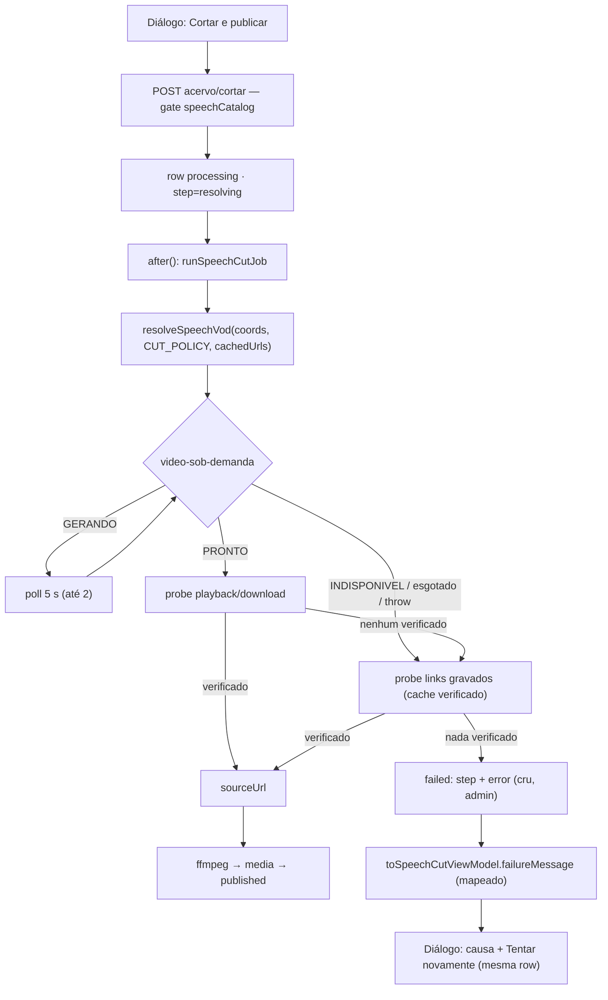

# Impl: Corte do acervo: resolver o trecho com a Câmara instável e falhar dizendo o porquê

Status: em execução
Atualizado em: 2026-09-15
Issue: #1045
Intenção: docs/plans/c169-corte-vod-confiabilidade.md
Appetite restante: herdado (~1 dia eng)

## Leitura da intenção

- **Outcome:** o "Cortar vídeo" da assessoria não morre mais na primeira etapa ("Localizando o trecho na Câmara") enquanto existir arquivo verificável — a API real ganha a janela medida (~30 s no primeiro request, depois polls curtos) e o link VOD já gravado na fala é tentado e verificado quando a API não serve; sem arquivo, a falha nomeia a causa em pt-BR, nada é publicado e "Tentar novamente" reusa a mesma row.
- **O que NÃO negociar:** `excerptTMs` verbatim (nunca arredondar/deslocar o trecho); link morto/falso (403, timeout, `text/html`) nunca vira arquivo; nada publicado em falha; crédito `Fonte: Câmara dos Deputados · CC BY 4.0`; gate do acervo (`canReadSpeechCatalog`; `advisor`/`leader` negados fail-closed; `leader` lockdown); sem espelhar MP4/S3, sem upload externo, sem YouTube; sem novo `Consent`/collection/migration; URLs públicas do acervo intocadas.
- **O que reavaliar (hipóteses da intenção):**
  1. "Ampliar a janela afeta também o clique do player" — verdade, mas resolve-se **parametrizando a política por chamador** (default = comportamento C162 de hoje), não com janela global nem caminho paralelo (D1).
  2. "O fallback do link gravado vive no job" — reavaliado: o dono do probe é o resolver; o fallback vira **opt-in no resolver** (`cachedUrls`), com o job passando os candidatos (D2).
  3. "A causa real fica só na coluna interna" — o discriminador (`error`) existe, mas `toSpeechCutViewModel` o descarta; a menor exposição é **um campo novo no VM** (`failureMessage`, mapeado no servidor), com o **step da falha preservado** para separar cortar de guardar; não é enum/migration (D3).
  4. "`tests/int` só cobre o caminho feliz" e o unit do resolver pina a janela — o default do player preservado mantém o teste pinado verde; poll/fallback entram como **unit com fake timers** (D4).

## Abordagem recomendada

**Opções consideradas:** A) endurecer o resolver dono (política por chamador + fallback opt-in do cache verificado) e levar a causa ao VM | B) só trocar as mensagens do job/diálogo, sem mexer na janela nem no fallback | C) fila/fluxo novo de resolução.
**Recomendação:** A — cobre os dois aceites (resiliência e falha honesta) sem schema e sem tocar o player; o resolver já é o dono do fetch/probe do VOD e o VM é o dono do que o diálogo renderiza.
**Rejeitadas:** B porque não atende o primeiro aceite (segue morrendo no timeout mesmo com link vivo); C porque é o rabbit hole nomeado (worker/fila/pendências) e o C167 já decidiu job in-process com `after()`.

### Decisões de engenharia (caras de reverter)

**D1 — Janela/poll do resolver sem regredir o player C162 (contrato compartilhado).**
Opções: A) `resolveSpeechVod(coords, { policy })` com default = política de hoje do player e `SPEECH_VOD_CUT_POLICY` passada só pelo job | B) uma janela única maior para todos os chamadores | C) resolver paralelo só do corte.
**Recomendação: A.** `SpeechVodPolicy = { statusTimeoutMs, statusRetries, retryDelayMs, pollAttempts, pollDelayMs }` em `src/utilities/speech/speechVodResolver.ts`: `SPEECH_VOD_PLAYER_POLICY = { 15_000, 1, 1_000, 0, 1_000 }` (idêntica ao comportamento atual: 2 requests no erro de transporte, resposta imediata em `GERANDO`) e `SPEECH_VOD_CUT_POLICY = { 45_000, 1, 1_000, 2, 5_000 }` (absorve o primeiro request de ~30 s, 2 polls de 5 s após `GERANDO`; teto declarado ~4,7 min no pior caso — 3 leituras × (2 × 45 s + 1 s) + 2 × 5 s, caso medido ~40 s). O loop só polla `GERANDO` enquanto houver budget; `PRONTO`/`INDISPONIVEL`/`DESCONHECIDO` retornam na hora; erro de transporte consome `statusRetries` e ao final relança (contrato atual do player intacto). `resolveSpeechVodForActor` não muda uma linha.
**Alternativas rejeitadas:** B porque transforma "Assistir/baixar" (clique síncrono e deliberadamente bounded do C162) num spinner de minutos sem aceite de produto; C porque fere o corte explícito da intenção ("não criar caminho de resolução paralelo ao C162 — editar o dono").

**D2 — Onde vive o fallback do link gravado.**
Opções: A) opt-in no resolver: `resolveSpeechVod(coords, { policy?, cachedUrls? })`; quando a API não entrega URL verificado (throw, `gerando`, `indisponivel`, `pronto` sem probe ok), proba os `cachedUrls` com o mesmo `probeSpeechMedia` (privado) e devolve `pronto` com o link verificado; sem `cachedUrls`, comportamento de hoje (inclusive relançar) | B) o job compõe a escada importando `probeSpeechMedia` exportado | C) fallback para todos os chamadores (player incluso).
**Recomendação: A** — um único ponto de entrada; o probe (Range GET, `text/html` = morto, HEAD só em 405/501) continua privado e com um dono; a precedência "API primeiro, cache depois" fica num lugar só; o job só passa `cachedUrls: { playbackUrl, downloadUrl }` (a fala já vem completa do `loadCutSystem`, depth 1) e consome `playbackUrl ?? downloadUrl`.
**Alternativas rejeitadas:** B porque exporta um interno usado uma vez e move a escada/precedência para o job (vazamento de conhecimento do resolver); C porque muda o contrato do C162 ("cache nunca é URL entregue ao browser") e o aceite do player sem produto. **Trigger de revisitação:** se os cortes salvos pelo cache provarem valor no uso real, reavaliar o player numa linha (passar `cachedUrls` na action) com aceite próprio.

**D3 — Como a causa chega à UI (wire do VM × semântica do step).**
Opções: A) `SpeechCutViewModel.failureMessage: string | null`, mapeado no servidor por `speechCutFailureMessage({ error, step })` (literais exatos + fallback por step); o job persiste o **step da falha** (`failCut(..., step)`), com `error` cru seguindo só no admin | B) campo `failureReason` enum na collection + `pnpm migrate:create` | C) expor `error` cru no status/VM e o diálogo mapear.
**Recomendação: A** — sem migration (`step` já é um select existente e nenhum consumidor o lê fora do diálogo em `running`); o operador segue vendo `HTTP 403 em <url>`/stderr no admin; a pessoa vê a causa; o diálogo só troca o texto (`setError(cut.failureMessage)` quando a poll vira `failed`; default atual mantido como defesa para payload sem o campo). O mapeamento é puro, client-safe em `src/lib/speechCut.ts`, e unit-testado.
**Alternativas rejeitadas:** B porque campo/migration estão explicitamente fora do escopo; C porque vaza URL/stderr no wire e viola o comentário contrato do VM ("`error` e `createdBy` nunca passam"). Também rejeitadas: classificar só por literal do `error` (ffmpeg/storage não têm literal estável e o aceite quer "cortar" ≠ "guardar" separados) e prefixar a fase no `error` (polui o detalhe do operador).

**D4 — Estratégia de teste e e2e.**
Opções: A) unit primeiro (fake timers para política/poll/fallback; mapper/VM), int para o job com estados imediatos, dialog unit para o texto; e2e existente **não muda** | B) e2e novo do job/poll | C) só int.
**Recomendação: A** — fake timers pinam a janela sem esperar (o unit atual que fixa "exatamente 2 fetches" do player continua verde, provando a não-regressão); o job é deliberadamente fora do HTTP (C167) e o int prova o fallback com `INDISPONIVEL`/`PRONTO`-hash-morto/throw curto; o manifest já mapeia `src/utilities/speech`, `src/components/campaign/speech`, `src/lib/speech*` e `src/lib/schemas` → `campaignSpeechCut` (+`campaignSpeechAcervo`), com `campaignSpeechCut` no `E2E_CURATED_SPECS` — o diff roda o spec sem editar manifest/curado.
**Alternativas rejeitadas:** B porque não há Câmara/ffmpeg dirigível no e2e e o custo não paga; C porque a política do player (risco de regressão) e o mapping puro precisam de pinagem barata.

### Componentes / mudanças

- **`resolveSpeechVod` + políticas** (`src/utilities/speech/speechVodResolver.ts`): `SpeechVodPolicy`, `SPEECH_VOD_PLAYER_POLICY`, `SPEECH_VOD_CUT_POLICY`, loop de poll em `GERANDO`, fallback opt-in via `cachedUrls` (reusa `probeSpeechMedia`/`probeMediaOnce` como estão); header do módulo atualizado (C162 + C169; player não passa `cachedUrls`). Reusa `buildVodUrl`, `parseVodStatus`, `CAMARA_USER_AGENT`.
- **`runSpeechCutJob`** (`src/utilities/speech/speechCutJob.ts`): primeira etapa chama `resolveSpeechVod(coordinates, { policy: SPEECH_VOD_CUT_POLICY, cachedUrls })`; `failCut(payload, cutId, message, step)` persiste o step da falha; um `currentStep` local acompanha `updateStep` para o catch; literais viram constantes compartilhadas; reaper importa a constante de interrompido.
- **`src/lib/speechCut.ts`**: constantes de causa (`SPEECH_CUT_FAILURE_SPEECH_GONE`, `..._GENERATING`, `..._UNAVAILABLE`, `..._UNPLAYABLE`, `..._INTERRUPTED` — a inelegível continua `SPEECH_VOD_INELIGIBLE_MESSAGE`), mapper `speechCutFailureMessage({ error, step })` e `SpeechCutRecordForView.error?: string | null` / `SpeechCutViewModel.failureMessage: string | null` (não-nulo só para `status='failed'`). Tabela de copy:
  | `error` gravado (admin) | `failureMessage` (diálogo) |
  | --- | --- |
  | 'A fala deste corte não está mais disponível.' | idem |
  | 'Esta fala não tem trecho de vídeo para resolver na Câmara.' | 'Esta fala não tem trecho de vídeo para cortar.' |
  | 'A Câmara ainda está gerando o vídeo deste trecho.' | idem |
  | 'A Câmara não entregou o arquivo deste trecho.' | 'A Câmara não disponibiliza mais o arquivo deste trecho.' |
  | 'A Câmara não entregou um arquivo jogável deste trecho.' | 'A Câmara não disponibilizou um arquivo válido deste trecho.' |
  | 'O corte foi interrompido antes de terminar.' | idem |
  | desconhecido · step resolving | 'Não foi possível localizar o trecho na Câmara.' |
  | desconhecido · step cutting | 'Não foi possível cortar o trecho.' |
  | desconhecido · steps metadata/publishing | 'Não foi possível guardar o arquivo do corte.' |
  | desconhecido · step null | 'Não foi possível preparar o corte.' |
  | sem `error` | `null` (diálogo mantém o default atual) |
- **`SpeechCutDialog.tsx`**: na poll, `cut.status === 'failed'` passa a setar `error` com `cut.failureMessage` (sem tocar layout, título ou ações; `SPEECH_CUT_GENERIC_ERROR_MESSAGE` segue como defesa).
- **Migration:** nenhuma (declarado; `step`/`error` já existem).
- **Access / Consent:** nenhum. O job mantém o bypass admin documentado (`overrideAccess: true`); actions/rotas seguem com o gate fresco `canReadSpeechCatalog` e `user`/`overrideAccess: false`; sem `Consent`, sem collection nova.
- **UI:** Impeccable A — só texto da cena de falha existente; sem shell novo, sem lista, sem migration.

### Dados → forma (se aplicável)

- **Não se aplica** — a intenção fixou "Vou apresentar dados? Não": progresso e erro são feedback de ação. A "forma" é a mensagem única de causa (tabela da D3) + os botões atuais; nada de dashboard/métrica de falhas.

## Fases verificáveis

1. **Tracer / server — resolver (quota ~0,4 dia):** `SpeechVodPolicy` + constantes, loop de poll, fallback opt-in. Unit: default do player intacto (2 requests, 0 polls, `GERANDO`/`INDISPONIVEL` em 1 request), `CUT_POLICY` pollando `GERANDO`→`PRONTO` com fake timers, fallback verificando cache em `INDISPONIVEL`/throw/`pronto`-sem-URL e recusando 403/timeout/`text/html`. Prova: `pnpm test:unit` + `pnpm gate:fast`.
2. **Server — job + VM (quota ~0,3 dia):** job usa política/candidatos, `failCut` com step, constantes; mapper + `failureMessage`. Int: (a) API `INDISPONIVEL` e link gravado vivo → job publica com o arquivo; (b) API `PRONTO` com hash morto (links do stub distintos dos gravados) e gravado vivo → idem; (c) tudo morto → `failed` com `step='resolving'`, `error` cru no doc, `getSpeechCutStatusForActor` devolvendo a causa; happy path/ffmpeg-fail/retry-mesma-row atuais verdes. Prova: `pnpm test:int` + `pnpm gate:fast`.
3. **UI — diálogo (quota ~0,15 dia):** poll `failed` usa `cut.failureMessage`; unit do diálogo com `failureMessage` no fixture (e o retry `{retryOf}` inalterado); revisão de copy (Impeccable A; ajuste opcional do "menos de um minuto" da cena de running). Prova: `pnpm test:unit` + smoke local.
4. **Gates (quota ~0,15 dia):** `pnpm gate:fast`; conferir a seleção de e2e (sem edição de spec/manifest; o diff cai nos prefixes já mapeados e roda `campaignSpeechCut`); changelog `docs/changelog/2026-09-15-c169.md`; `pnpm push`.

## Rabbit holes / Não escopo (engenharia)

- **Extrair `resolveVod`/`probeLink` de `scripts/lib/camaraFetch.mjs` para `src/`:** proibido/desnecessário; editar o dono (`speechVodResolver`) como referência de política, sem import.
- **Fila/worker/cron** de regeneração, pré-resolução em lote ou "gerar novamente": fora (C162/C167 já cortaram).
- **Escrever o link recém-resolvido de volta em `speech`:** exigiria `canUpdateSpeech` (unrestricted) — fora (Q4 assumida).
- **Campo enum de causa / migration / collection nova:** fora; literal + step resolvem.
- **Expor `error` cru no wire** (URLs/stderr): fora; o mapper devolve só literais seguros.
- **Dar o fallback ao player agora:** fora (contrato/aceite C162); trigger registrado na D2.
- **Redesenhar a cena de falha/layout, dashboard de falhas, biblioteca mostrando a causa:** fora (texto da falha existente apenas).
- **Mexer em `excerptTMs`/vizinhança ou na elegibilidade (`speechVodCoordinates`):** fora (guardrail verbatim; fala sem VOD continua inelegível).
- **Abstração genérica de HTTP/backoff compartilhada com `scripts/`:** dois call sites; DRY não paga.
- **e2e novo do job/poll:** fora (job não é HTTP-dirigível).

## Riscos e mitigação

- **Regressão do player C162 (mesmo resolver):** default `SPEECH_VOD_PLAYER_POLICY` byte a byte; unit atual (2 fetches, `gerando`/`indisponivel` em 1 request) fica verde; `resolveSpeechVodForActor` e os testes do player não mudam.
- **Janela maior × reaper (15 min):** pior caso resolving ~4,7 min + probes 10 s; cada `updateStep` renova `updatedAt`; teto declarado e ajustável num único ponto (`SPEECH_VOD_CUT_POLICY`). O pior caso combinado (resolving + download 180 s + ffmpeg 300 s) segue abaixo do `SPEECH_CUT_STALE_MS`.
- **Link verificado que morre entre probe e download:** `downloadSource` revalida (`!ok || text/html`) e o job falha fechado — nada publicado; o retry refaz a escada.
- **Vazamento do cru para a pessoa:** mapper só devolve literais conhecidos/por step; unit pina `HTTP 403 em <url>`/stderr → mensagem segura; comentário do VM atualizado.
- **`step` não-nulo em `failed`:** nenhum consumidor além do diálogo em `running` lê `step` (grep); retry reseta para `resolving`; admin ganha o passo real da falha.
- **Int lento por delays reais:** o int usa estados imediatos (`INDISPONIVEL`, `PRONTO`, throw) e deixa poll puro para o unit com fake timers.
- **Copy otimista do diálogo ("menos de um minuto")** no caso poll: ajuste textual opcional na fase 3 (Impeccable A), sem layout.

## Débitos registrados (triagem pós-simplify)

- **Pin unit do timeout do probe** (`probeSpeechMedia` catch → unverified): deferido com gatilho — a primeira mexida em `probeSpeechMedia`/`MEDIA_PROBE_TIMEOUT_MS`, ou uma 2ª regressão do fallback, pede o teste dedicado (o int cobre 403/hash morto, não o timeout).
- **Flake dev-only do e2e paralelo:** `campaignSpeechCut.e2e.spec.ts:259` responde 500 na rota da biblioteca só com 2 workers em `next dev` (serial e prod verdes). Gatilho: o primeiro 500 da rota em `E2E_PROD=1`/CI, ou uma 2ª sessão gasta no diagnóstico, vira Issue (checar a família de flake de dev).

## Aceite de engenharia

- [ ] Aceite de produto da intenção ainda coberto (tabela abaixo)
- [ ] Invariantes AGENTS/engineering-standards (Local API com `user`/`overrideAccess: false`; job com bypass documentado; sem multi-collection write; sem `Contact`/`Consent`/migration; Dependency Rule `lib → utilities`; copy pt-BR/identificadores em inglês)
- [ ] Testes de domínio previstos (unit/int) onde access/write paths mudam — sem mudança de access; write path do job (step/error) coberto por int + unit

| Aceite (intenção)                                                                                     | Evidência                                                                                                                                    |
| ----------------------------------------------------------------------------------------------------- | -------------------------------------------------------------------------------------------------------------------------------------------- |
| API lenta/instável não morre no 1º timeout, dentro de um limite declarado                             | `SPEECH_VOD_CUT_POLICY` (45 s/req, 1 retry, 2 polls de 5 s; teto ~4,7 min) + unit fake timers `GERANDO`→`PRONTO` + pin da política do player |
| Hash morto com link gravado vivo → corta; morto/falso nunca                                           | fallback opt-in com `probeSpeechMedia`; unit (403/timeout/html nunca retornam) + int do job (INDISPONIVEL e hash morto)                      |
| Sem arquivo recuperável → falha honesta e retomável, sem duplicar                                     | `failureMessage` no VM + diálogo; `retryOf` mesma row (int/e2e C167 atuais)                                                                  |
| Fala inelegível → mensagem direta                                                                     | `SPEECH_VOD_INELIGIBLE_MESSAGE` compartilhado no create (rota) e no job; e2e atual pinado                                                    |
| `excerptTMs` verbatim, crédito CC BY, gate do acervo, sem migration/collection/Consent, URLs públicas | contratos intocados pelo diff (nenhuma mudança em elegibilidade, página `/corte/<id>` ou access)                                             |
| Qualidade                                                                                             | `pnpm gate:fast` verde + `pnpm push`; changelog `docs/changelog/2026-09-15-c169.md`                                                          |

## Self-score (decision-quality ≥4)

1. **Decisões caras com rejeitadas — 5/5:** D1 (contrato do resolver compartilhado com o player), D2 (semântica de seleção de fonte/cache), D3 (wire do VM + semântica do `step` na falha) e D4 (testes/e2e) têm `Opções/Recomendação/Alternativas rejeitadas`, com as hipóteses da intenção reavaliadas explicitamente.
2. **Cabe no appetite — 5/5:** ~1 dia dividido em resolver (0,4), job/VM (0,3), diálogo (0,15) e gates (0,15); sem schema, sem UI nova, sem infra.
3. **Rabbit holes nomeados — 5/5:** extração dos scripts, fila/cron, write-back do link, enum/migration, `error` cru, fallback no player (com trigger), redesign/dashboard e mudança de trecho estão fora.
4. **Depth check reusa o dono — 5/5:** um único resolver parametrizado (sem caminho paralelo), `probeSpeechMedia` privado, VM/mapper puros no dono do vocabulário do corte, job com bypass documentado; nada de pass-through novo de cerimônia.
5. **Intenção de produto satisfeita — 5/5:** cada aceite literal tem evidência e os guardrails (verbatim, CC BY, gate, nada publicado, retry sem duplicar) permanecem; as duas assunções de produto (janela e uso do link gravado) ficam validadas pelos testes de aceite no gate.
