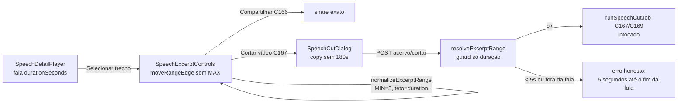

# Impl: Acervo: cortar sem teto — do mínimo de 5 s até o fim da fala

Status: aprovado
Atualizado em: 2026-09-16
Issue: #1046
Intenção: docs/plans/c170-corte-sem-limite.md
Appetite restante: herdado (~0,5–1 dia eng; nenhum corte de escopo proposto)

## Leitura da intenção

- **Outcome:** remover o teto de 3 min do corte do acervo. Seleção `[início,fim]` de 5 s até a duração total da fala; corte publicado/baixado = intervalo exato escolhido (12 min, fala inteira). Mesma seleção do C166, mesmo corte do C167, sem teto. Robustez: corte longo conclui; se o pipeline falhar por limite operacional, falha honesta (causa no C169, não vira teto).
- **O que NÃO negociar:** mínimo de 5 s mantido; `excerptTMs`/seleção exata `[início,fim]` intocados; crédito "Fonte: Câmara dos Deputados · CC BY 4.0"; gate do acervo intocado (`communicator`/`coordinator`/`candidate`; advisor/leader negados fail-closed); kill switch/publicação C167/C168 intocados; sem editor de vídeo; sem trocar início/fim depois de cortado; copy diz a verdade.
- **O que reavaliar (hipóteses da intenção, a validar no gate):**
  1. "Mínimo continua 5 s" — assumido A) manter. Confirmar no gate; se produto pedir outro valor, é outra fatia.
  2. "Limite efetivo = `durationSeconds`" — a fala inteira `[00:00, duração]` é permitida; o teto real é a duração da fala, não um número mágico.
  3. "Teto espalhado em 6 pontos" — geometria, aria, action, schema-msg, prompt IA, testes. Remover só a UI deixaria o servidor recusando o corte longo; a mudança é atômica nas pontas.

## Abordagem recomendada

**Opções consideradas:** A) manter `MAX_EXCERPT_SECONDS` mas subir para 86.400 s (1 dia); B) remover `MAX_EXCERPT_SECONDS` — `durationSeconds` é o único teto; C) `MAX` opcional/nulável com fallback para `durationSeconds`.
**Recomendação:** B — porque o teto de produto deixa de existir no código em vez de virar número grande mentiroso; um `grep MAX_EXCERPT` zerado prova a remoção; `normalizeExcerptRange`/`moveRangeEdge`/`resolveExcerptRange` passam a receber só `(range, durationSeconds)` e o mínimo continua nomeado.
**Rejeitadas:** A porque mantém o conceito de teto, a copy continuaria mentindo por omissão e um dia alguém "só ajusta o número" de volta; C porque cria dois caminhos de teto (config + duração) sem nenhum consumidor do configurável — camada sem volatilidade, complexidade sem dono.

### Decisões de engenharia (caras de reverter — nenhuma nesta fatia)

Zero decisão dura: sem collection nova, sem `Consent`/PII, sem multi-collection write, sem URL nova, sem fronteira de módulo. A única deliberação (representação do "sem teto", acima) é barata de reverter e foi explicitada para impedir remoção parcial. `speechCutJob.ts:37-44` (timeouts, 2 GiB, reaper) fica intocado por decisão — mexer no pipeline às cegas é o rabbit hole nomeado; falha operacional continua falha honesta do C167/C169.

### Componentes / mudanças

- **Migration:** nenhuma — sem mudança de schema/collection; `push:false` intocado; `payload-types.ts` não muda.
- **Access:** intocado — gate do acervo (`canReadSpeechCatalog`), `canReadSpeechCut` do C167 e leader lockdown seguem como estão; Local API segue `overrideAccess:false` no load da fala.
- **Geometria / limites (owner, sem twin):**
  - **`src/lib/speechExcerptSelection.ts`**: remover `MAX_EXCERPT_SECONDS` (:21) e todo uso (:54 `normalizeExcerptRange`, :125,:134 `moveRangeEdge`); manter `MIN_EXCERPT_SECONDS = 5` (:20,:44,:50-52); limpar imports/label/JSDoc `5s..180s` (:4,:34,:68,:112-113). Assinaturas passam a clampar só em `[0, durationSeconds]` + mínimo.
  - **`src/app/(campaign)/campanha/actions/speech.ts`**: `resolveExcerptRange` (:126-133, usado em :156 create e :338 sugestão) — remover guard `requested > MAX`; guardar só duração (`start >= 0`, `end <= durationSeconds`, `end - start >= MIN`); remover import (:31-33). `normalizeExcerptRange` em :136 herda a geometria sem teto.
- **UI (copy pt-BR exata, ids em inglês):**
  - **`src/components/campaign/speech/SpeechExcerptControls.tsx`**: label :31 `Mínimo 5s · máximo 3min` → `Mínimo 5s · sem limite — até o fim da fala`; `aria-valuemin/max` (:114,:119) passam a `0–durationSeconds`; sem mudar tradução ponteiro/tecla → `moveRangeEdge`.
  - **`src/components/campaign/speech/SpeechCutDialog.tsx`**: :242-243 `dentro da faixa de {MIN}–{MAX} s` → `mínimo 5 s · até o fim da fala` (linha `<duração> · mínimo 5 s · até o fim da fala`); remover import de MAX (:36).
  - **`SpeechDetailPlayer.tsx`**: sem toque — só usa MIN (:19,:146,:229). `SpeechExcerptShare`/`lib/speechShare`: sem toque, sem teto.
- **Servidor / schema / prompt:**
  - **`src/lib/schemas/speechCut.ts`**: mensagem :17 `Selecione um trecho de 5 a 180 segundos.` → `Selecione um trecho de 5 segundos até o fim da fala.`; zod :31 (0–86400) intocado — o teto real era a action.
  - **`src/utilities/speech/speechCutMetadata.ts`**: prompt :42 `…de um trecho de 5 a 180 segundos.` → `…de um trecho da fala com 5 segundos ou mais.`
- **Testes que pinam 180 (atualizar, não deletar cobertura):**
  - `tests/unit/speechExcerptSelection.unit.spec.ts:41-42,:113-117,:130-133,:141-144` — trocar pinos de clamp em 180 por clamp em `durationSeconds` + caso longo (ex.: 720 s passa).
  - `tests/unit/speechDetailPlayer.unit.spec.tsx:290` (`aria-valuemax` 180), `:306,:320-321,:442-444` — `valuemax = duração`.
  - `tests/int/speechCut.int.spec.ts:300` (regex `/5 a 180/`) — nova mensagem; adicionar caso create longo (>180 s, dentro da duração) publica/encaminha e caso `< 5 s` rejeita.

### Dados → forma (n/a)

Duração/`mm:ss` é feedback de ação, não dado do acervo — nenhum KPI/gráfico novo, conforme a intenção. Sem telemetria de corte nesta fatia.

## Fases verificáveis

1. **Tracer — geometria + servidor + schema-msg (~50% do appetite).** `speechExcerptSelection.ts` sem MAX + `resolveExcerptRange` só-duração + mensagem do schema + atualização das units/int acima. Verificação: `pnpm test:unit -- speechExcerptSelection` e `pnpm test:int -- speechCut` verdes; smoke Local API: range de 720 s dentro da duração normaliza/aceita, range de 3 s rejeita com a mensagem nova. Confirma a hipótese #3 (nenhum guard residual: `grep -rn MAX_EXCERPT` vazio fora de changelog).
2. **UI + prompt (~30%).** Barra (label + aria), diálogo (copy + import), prompt IA; ajuste das units do player. Verificação: `pnpm test:unit -- speechDetailPlayer` verde; manual no dev: fim da seleção alcança o último segundo, início o primeiro, duração visível (ex.: 12 min); diálogo mostra a copy nova; sugestão IA retorna com o prompt novo.
3. **Gates e fechamento (~20%).** `pnpm gate:fast` → `pnpm gate:ci` → `docs/changelog/2026-09-16-c170.md` (uma entrada, sem editar o agregado) → `pnpm push`. Cobertura e2e existente (`campaignSpeechAcervo`, curado C166/C167) deve passar sem spec novo — sem URL/collection nova, nada a acrescentar ao manifest. Validação do corte longo real fica com o `deploy-staging` (OPS103) antes de produção, na dependência do pipeline C169.

## Rabbit holes / Não escopo (engenharia)

- **Aumentar timeouts/limites do pipeline** (`SOURCE_DOWNLOAD_TIMEOUT_MS`, `MAX_SOURCE_BYTES`, `FFMPEG_MAX_TIMEOUT_MS`, reaper `SPEECH_CUT_STALE_MS`) — defeito do C169, não teto de produto.
- **Editor/timeline/zoom/precisão de frame, segundo player/preview** — barra atual + ímã de frase, segundos inteiros.
- **Streaming/fila assíncrona, presets de duração, multi-trecho, legenda no corte.**
- **Mecanismo/resolver VOD (C169); publicação/kill switch/biblioteca (C167/C168).**
- **Papéis do acervo, `Consent`/collection novas, segundo cadastro.**
- **Redesign da barra/paleta fora de `campaign`; DRY <3 call sites; camadas novas pass-through** — editar o owner, não twinar.

## Riscos e mitigação

- **Remoção parcial (UI libera, servidor recusa — ou o inverso).** Mitigação: tracer cobre geometria+servidor juntos na Fase 1; `grep MAX_EXCERPT` vazio como critério de aceite; int com caso longo ponta-a-ponta na action.
- **Corte longo falha por limite operacional (download 180 s, 2 GiB, ffmpeg 5 min, reaper 15 min).** Mitigação: aceite de robustez — falha honesta como hoje, nada publicado; causa registrada no C169; nenhum timeout mexido aqui.
- **Regressão C166/C167 (share e corte curto).** Mitigação: `excerptTMs`/seleção exata intocados; mínimo e ímã de frase intocados; units/int existentes atualizados, não removidos; e2e `campaignSpeechAcervo` no gate.
- **Aria/leitores de tela mentindo o limite.** Mitigação: `aria-valuemax = durationSeconds` junto com o label, coberto por unit do player.
- **Prompt IA ainda sugerindo trecho curto.** Mitigação: prompt sem números de teto; sugestão continua editável e o job normaliza com fallback — sem bloqueio.

## Aceite de engenharia

- [ ] Outcome da intenção: seleção `[início,fim]` de 5 s até a duração total (fala inteira permitida), barra não trava em 180 s, corte publicado/baixado = intervalo exato, copy verdadeira (`Mínimo 5s · sem limite — até o fim da fala` / `mínimo 5 s · até o fim da fala` / mensagem do schema / prompt IA).
- [ ] `grep -rn MAX_EXCERPT_SECONDS src tests` vazio (fora changelog); `MIN_EXCERPT_SECONDS = 5` intacto em geometria, player, action e testes.
- [ ] Invariantes AGENTS/engineering-standards: sem migração (nada a commitar em `src/migrations`); `push:false` intocado; gate do acervo e leader lockdown intocados; sem `Consent`/`Contact` paralelos; strings pt-BR, identificadores inglês; `admin.group` intocado.
- [ ] Testes previstos: units (`speechExcerptSelection`, `speechDetailPlayer` com `valuemax=duração`) + int (`speechCut`: mensagem nova, longo aceito, <5 s rejeitado) verdes; e2e `campaignSpeechAcervo` verde sem entrada nova no manifest.
- [ ] `pnpm gate:fast` e `pnpm gate:ci` verdes; changelog `docs/changelog/2026-09-16-c170.md`; validação do corte longo real no `deploy-staging` antes de produção.
