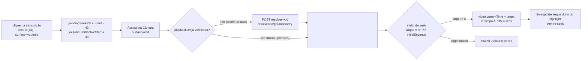

# Impl: C171-F1 — Player: a troca para a Câmara perde o ponto da transcrição

Status: em execução
Atualizado em: 2026-09-15
Issue: #1052
Intenção: docs/plans/c171-f1-ponto-da-transcricao-na-troca-de-superficie.md
Appetite restante: herdado (~0,25 dia eng; client-only — sem schema, sem `Consent`, sem escrita, sem rota)

## Leitura da intenção

- **Outcome:** com a superfície YouTube ativa, o clique explícito na transcrição vence o `initialSeconds` quando o `<video>` da Câmara monta (`video.currentTime` = último ponto clicado, excerpt-relative); sem clique, o contrato C162/C171 permanece nos dois caminhos (arquivo recém-resolvido e já verificado/baixado primeiro) e, sem deep link, o vídeo fica em 0.
- **O que NÃO negociar:** sem seek em loop (`timeupdate` não re-dispara o efeito); sem mudança de copy/layout, do POST/rota `resolver-vod` e do `t=` da saída `youtubeWatchUrl` (`activeStart ?? initialSeconds ?? 0`, `SpeechDetailPlayer.tsx:151-157`); o ramo YouTube de `seekTo` continua com o `start=` do iframe; sem schema/`Consent`/escrita/rota; o gate do acervo (`speechCatalog`) intocado.
- **O que reavaliar:** a hipótese de que "deps do efeito incluindo a transição de superfície" bastaria — deps sozinhas não cobrem o clique sem deep link, porque o guard atual (`initialSeconds === null || initialSeconds <= 0`, `:166`) descarta o alvo; a correção precisa de um alvo pendente explícito (`pendingSeekRef`), não de `activeStart` (volátil a cada `timeupdate`, `:235-243`). Segundo furo confirmado: no caminho "baixou primeiro" o efeito roda sem `<video>` e faz early-return (`:165-166`); na troca de superfície `playbackUrl` e `initialSeconds` não mudam — sem dep de `surface` o efeito não re-roda.

## Abordagem recomendada

**Opções consideradas:** A) alvo pendente (`pendingSeekRef` gravado no ramo YouTube de `seekTo`, consumido quando o `<video>` monta) + transição de superfície nas deps | B) `activeStart` direto nas deps do efeito | C) remontar o player (`key`) na troca de superfície.
**Recomendação:** A — o ref é do clique (intenção explícita), não do estado de reprodução; cobre os dois furos sem re-seek a cada `timeupdate` e sem novo POST.
**Rejeitadas:** B porque `activeStart` muda a cada `timeupdate` (`:235-243`) e o efeito re-seekaria em loop; C porque descarta a resolução já verificada e força novo fetch (regressão do "sem novo POST").

### Decisões de engenharia

1. **Mecanismo do ponto pendente.** Opções: A) `pendingSeekRef` gravado no ramo YouTube de `seekTo` e lido pelo efeito | B) `activeStart` nas deps | C) `key`/remontagem do player. **Recomendação:** A. **Rejeitadas:** B (loop a cada `timeupdate`); C (perde a resolução verificada e re-POSTA).
2. **Dep da transição de superfície.** Opções: A) `surface` nas deps | B) `youtubeSurface` derivado | C) nenhuma dep nova. **Recomendação:** A — é o estado que o `watchVod` muda (`:217`) e a condição que monta o `<video>` (`:281`); com o arquivo já verificado, `playbackUrl` não muda na troca, então C deixa o efeito sem rodar. **Rejeitadas:** B (booleano derivado do mesmo estado, sem ganho); C (não cobre "baixou primeiro").
3. **Ciclo de vida do ref.** Opções: A) limpar depois do seek efetivo, dentro do `seek()` | B) limpar no `watchVod` | C) nunca limpar. **Recomendação:** A — `gerando`/`failed`/retry não podem perder o ponto antes de existir `<video>`; enquanto o seek não aconteceu, o ref continua sendo o alvo. **Rejeitadas:** B (limpa cedo demais no caminho `gerando` → retry); C (um clique antigo venceria uma re-resolução futura sem intenção nova).
4. **Alvo e guard.** Opções: A) `target = pendingSeekRef.current ?? initialSeconds`, guard `target === null || target <= 0` | B) dois guards separados (`initialSeconds == null && ref == null`) | C) pré-preencher `activeStart`. **Recomendação:** A — um alvo único, guard idêntico ao C162 para `null`/`0` (0 não precisa de seek: o vídeo já nasce em 0; clique no segmento 0 termina correto). **Rejeitadas:** B (duplica a condição sem necessidade); C (acoplaria highlight e seek, e o `timeupdate` sobrescreveria o alvo).
5. **Estratégia de teste no jsdom.** Opções: A) disparar `fireEvent.loadedMetadata(video)` nos casos novos (jsdom entrega `readyState === 0`, então o efeito registra o listener `{once:true}` — o caminho real sem metadata) | B) stubbing global de `readyState = 1` no `beforeAll` | C) stubbing pontual de `readyState`. **Recomendação:** A — RTL expõe `loadedMetadata` no event map (`@testing-library/dom@10.4.1`), não troca o ramo de todos os pins (que hoje exercitam o seek direto do `seekTo` VOD) e mantém o listener coberto. O pino de "sem loop" usa um **segundo** `loadedmetadata` depois de `timeupdate`: com deps corretas o listener já foi removido (`{once:true}`) e o evento é inerte; um regresso com `activeStart` nas deps re-registraria o listener e re-seekaria para `initialSeconds`. **Rejeitadas:** B (tornaria o listener `loadedmetadata` morto na suíte inteira e mudaria o caminho de todos os pins); C (mesmo efeito de B, com mais cerimônia e restauração manual de descriptor).

### Componentes / mudanças

- **`SpeechDetailPlayer.tsx`** (dono único; encaixe cirúrgico, sem arquivo/helper novo):
  - `pendingSeekRef = useRef<number | null>(null)` junto do `videoRef` (`:129`) — precedente de ref de intenção no repo: `pendingDiscardRef` (`src/components/campaign/shared/CampaignInlineEditableCell.tsx:124`) e refs "latest props" (`src/components/campaign/shared/MunicipalityRelationEditor.tsx:137-138`).
  - `seekTo` ramo YouTube (`:222-228`): depois do guard `youtubeOffsetSeconds === null` (`:224`), `pendingSeekRef.current = seconds` antes de `setYoutubeStart`/`setActiveStart`.
  - Efeito (`:164-177`): o early-return passa a ser só `!video`; `const target = pendingSeekRef.current ?? initialSeconds`; guard `target === null || target <= 0`; `seek()` grava `video.currentTime = target` e zera o ref **após** a gravação (só quando ele foi a fonte); `loadedmetadata` `{once:true}` + cleanup inalterados; deps `[initialSeconds, playbackUrl, surface]`.
  - Intocados byte a byte: `youtubeStart`/`activeStart` (`:131,139-143`), `youtubeWatchUrl` (`:151-157`), `watchVod` (`:216-220`), `onTimeUpdate` (`:235-243`), `renderMedia`/`<video>` (`:268-294`), ramo VOD do `seekTo` (`:229-232`), download/share/cut/seleção.
- **Migration:** sem migration — nenhum campo/collection/`payload-types` novo (`push: false` intocado).
- **Access / Consent:** nenhum `Consent` novo, nenhuma escrita, nenhuma access rule tocada; `requireCampaignPageActor({ gate: 'speechCatalog' })` e a rota `resolver-vod` seguem como estão.
- **UI:** nenhuma forma visual nova — sem mudança de copy, layout ou hierarquia (não se aplica shape→craft do Impeccable).
- **Rota/parser (sem mudança):** `src/app/(campaign)/campanha/(app)/comunicacao/acervo/[id]/page.tsx:56` (`parseSpeechSeekSeconds(firstValue(query.t))`) e `src/utilities/speech/speechViewModels.ts:166-170` só fornecem o `initialSeconds`; a correção é client-only.
- **Testes:** `tests/unit/speechDetailPlayer.unit.spec.tsx` — novos casos na descrição C171 (ver Fases); nenhum pino existente muda (`:99-134`, `:266-287`, `:312-341`, `:343-365`).

### Dados → forma

Não se aplica como dado: o alvo pendente é **estado de reprodução** (efeito de uma ação), não informação de acervo — mesma decisão de C162/C166/C171. Formas rejeitadas: persistir o ponto em URL/`sessionStorage`; exibir o alvo pendente na UI; telemetria do clique.

## Fases verificáveis

1. **Fix + unit (~0,2 dia).** `pendingSeekRef` + transição de superfície nas deps + alvo/guard/limpeza. Casos novos em `tests/unit/speechDetailPlayer.unit.spec.tsx` (todos com `fetchMock` respondendo `pronto(PLAYBACK_URL, DOWNLOAD_URL)` e `fireEvent.loadedMetadata(videoElement()!)` após o `<video>` montar):
   - `keeps the transcript point clicked on the embed when switching to the Câmara` — `initialSeconds: 100`, clique em `button[data-start-seconds="43"]` com o iframe ativo, "Assistir na Câmara" → `video.currentTime === 43` (precedência sobre 100).
   - `seeks the clicked point on the Câmara surface even without a deep link` — `initialSeconds: null`, clique em 43, troca → `video.currentTime === 43` (o guard antigo de `initialSeconds` não descarta mais o clique).
   - `seeks the deep link when the file was verified before switching to the Câmara` — download primeiro (tab spy; resolução com o iframe ativo), depois "Assistir na Câmara" sem clique → `video.currentTime === 100`.
   - `leaves the fresh Câmara video at zero when there is no click and no deep link` — download primeiro, `initialSeconds: null` → `video.currentTime === 0` depois do `loadedmetadata` (contrato C162).
   - `applies the pending transcript point after the Câmara file resolves on retry` — clique 43, "Assistir na Câmara" com `gerando` (sem `<video>`), depois "Tentar novamente" com `pronto` → `video.currentTime === 43` (o ref sobrevive ao caminho sem vídeo e é limpo só no seek efetivo).
   - `does not re-seek as playback advances after the pending point was applied` — no fluxo do primeiro caso, `video.currentTime = 77` + `fireEvent.timeUpdate` (highlight muda) + segundo `fireEvent.loadedMetadata` → continua 77 (sem `activeStart` nas deps; sem re-seek em loop).
   - Pinos intocados e verdes: clique VOD direto (`:132-133`), transcrição depois da Câmara (`:337-338`), arquivo já verificado sem novo POST (`:343-365`), `t=` da saída e embed (`:177-206`, `:266-287`).
   - Verificação: `pnpm test:unit tests/unit/speechDetailPlayer.unit.spec.tsx`, depois `pnpm test:unit`; `pnpm typecheck`.
2. **Gates (~0,05 dia).** `pnpm gate:fast` (lint + typecheck + unit); e2e browserless do acervo intocado (`tests/e2e/campaignSpeechAcervo.e2e.spec.ts:157-175` não interage — o SSR não muda; o CI seleciona `campaignSpeechAcervo`+`campaignSpeechCut` pelo prefixo `src/components/campaign/speech`, `scripts/lib/e2e-affected-manifest.mjs:307`); changelog `docs/changelog/2026-09-15-c171-f1-ponto-da-transcricao.md` no fechamento; `pnpm push` na branch `C171-F1-player-a-troca-para-a-camara-perde-o-ponto-da-transc`.

## Rabbit holes / Não escopo (engenharia)

- IFrame API/`postMessage` para retomar a posição do embed do YouTube — segue cortado (C162/C171).
- Persistir o ponto entre reloads (URL/`sessionStorage`) — fora; o deep link `?t=` continua o único contrato de entrada.
- `speechVodResolver.ts`, rota `resolver-vod`, `actions/speech.ts` — dono: C169/#1045; dependência só suave.
- Copy/layout/`t=` da saída e do bloco `speech-youtube-exit` (débito cosmético S3 do triage) — gatilho próprio no plano-pai.
- Clique depois do `<video>` montado e antes do `loadedmetadata` (o alvo pendente/deep link ainda pode vencer esse clique tardio) — comportamento herdado do C162, fora desta fatia; **gatilho de revisitação:** relato de clique ignorado nessa janela ou o primeiro consumidor que precise de "último clique sempre vence".
- Modo de seleção (C166) não busca por design; nada muda.
- Browser e2e novo do detalhe — a interação é dona do jsdom (C171).

## Riscos e mitigação

- **Ref obsoleto vencendo uma resolução futura:** o ref só é escrito no ramo YouTube de um clique explícito e é limpo logo após o seek efetivo; o teste de retry (`gerando` → `pronto`) pina a sobrevivência do ref ao caminho sem vídeo; a limpeza em si fica como débito deferido (abaixo).

## Débitos registrados (triagem pós-simplify)

- **Pin da limpeza do `pendingSeekRef`:** o caso `does not re-seek as playback advances after the pending point was applied` pina a ausência de loop (segundo `loadedmetadata` inerte), não a limpeza do ref — removendo `pendingSeekRef.current = null` do `seek()` a suíte segue verde. O caminho de releitura hoje é estreito (as deps `[initialSeconds, playbackUrl, surface]` não mudam depois do `<video>` montar; `surface` só vai youtube→vod), então o pin é defensivo e fica deferido. **Gatilho de revisitação:** o primeiro consumidor novo do `pendingSeekRef` (retorno ao embed YouTube, re-resolução que troque `playbackUrl`, ou navegação client-side entre `?t=` no mesmo player montado) **ou** a primeira alteração nas deps do efeito de seek → adicionar caso que aplique o alvo, force um re-run do efeito (novo `initialSeconds`/`playbackUrl` via rerender) e prove que o alvo novo vence, não o ref antigo.
- **Regressão C162 ("baixou primeiro" com deep link):** é o segundo furo — coberto pelos casos 3 e 4; os pins existentes rodam a cada fase.
- **Loop de seek:** `activeStart`/`onTimeUpdate` fora das deps; o pino do segundo `loadedmetadata` falharia se `activeStart` entrasse nas deps.
- **StrictMode/duplo efeito:** no mount inicial nunca há `<video>` (a resolução nasce `idle` e o vídeo só existe depois de `playbackUrl`), então o duplo-effect do dev não re-seeka nem consome o ref; `loadedmetadata {once:true}` + cleanup seguem iguais.
- **jsdom:** `readyState` fica 0 (jsdom seta o valor por instância); o `currentTime` do prototype (`value: 0`, writable) é sombreado por own property em cada `<video>` que sofre seek, então um seek não vaza para o próximo render; a suíte usa `fireEvent.loadedMetadata` em vez de stub global.
- **e2e browserless:** nenhum HTML SSR muda (o `<video>` só existe client-side pós-resolução; `start=` e `watch?t=` intocados) — nenhum pino e2e precisa mudar.

## Aceite de engenharia

- [ ] Aceite de produto da intenção ainda coberto: clique pré-troca vence `initialSeconds`; sem clique o contrato C162/C171 vale no recém-resolvido e no já verificado; sem deep link, 0; sem mudança de copy/layout/POST/rota/`t=`.
- [ ] Invariantes AGENTS/engineering-standards: sem migration/`Consent`/escrita/rota; sem twin (o dono do seek é o próprio `SpeechDetailPlayer`); identificadores em inglês / copy pt-BR intocada.
- [ ] Testes de domínio previstos: unit RTL no dono (casos novos acima) + pins C162/C166/C171 verdes; e2e browserless do acervo inalterado.

## Self-score decision-quality

5/5 — (1) as decisões caras (mecanismo, dep de superfície, ciclo de vida do ref, guard, estratégia jsdom) têm opções + rejeitadas explícitas; (2) cabe no appetite herdado: um arquivo de componente + a suíte dele, sem schema/escrita/rota; (3) rabbit holes nomeados (IFrame API, reload, C169, cosmético S3, clique tardio pós-mount) com gatilho; (4) depth check: reusa o dono existente (`SpeechDetailPlayer`) e o precedente de refs de intenção do repo — nenhum helper/arquivo novo; (5) o outcome da intenção permanece intacto — a engenharia não reescreveu o aceite.
