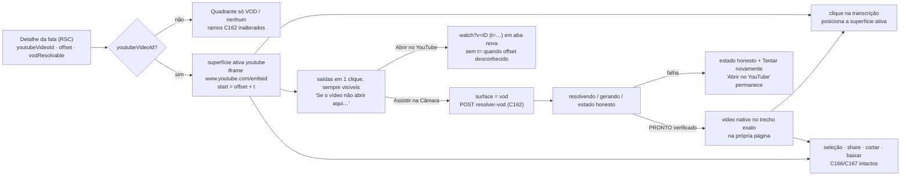

# Impl: Acervo: o player do YouTube nunca termina num beco de signin — toca ou oferece a saída em um clique

Status: executado
Atualizado em: 2026-09-15
Issue: #1047
Intenção: docs/plans/c171-player-youtube-sem-signin.md
Appetite restante: herdado (~0,5–1 dia eng; sem corte — sem schema, sem `Consent`, sem server novo, sem arquivo novo de player)

## Leitura da intenção

- **Outcome:** abrir uma fala com YouTube nunca termina num beco de signin — o embed toca quando o YouTube deixa e, quando não deixa, a página oferece em um clique uma superfície que toca nesta página (o trecho da Câmara sob demanda, quando elegível) e/ou "Abrir no YouTube" no ponto exato; transcrição, seleção, share, corte e download seguem intactos.
- **O que NÃO negociar:** saída independente de detecção do bloqueio (o app não vê o erro do iframe) — sempre visível; `t=` só com offset conhecido (nunca inventar); transcrição posiciona a **superfície ativa**; sem segundo player/editor; sem `Consent`/collection/migration; gate do acervo (`communicator`/`coordinator`/`candidate`; `advisor`/`leader` negados) e crédito "Fonte: Câmara dos Deputados · CC BY 4.0" intocados; URLs públicas intocadas; `excerptTMs` verbatim (C169).
- **O que reavaliar:** a hipótese de que a troca de host (`youtube-nocookie.com` → `www.youtube.com`, mesmos params) é o remédio barato para o bot-check de embed anônimo — é a recomendação C da intenção, assumida e validada no gate; a intenção sugere `src/lib/speechShare.ts` como área provável — não muda: o dono do link `watch?v=&t=` já existe e é reusado; e a fixture e2e é reavaliada na decisão 7 (nenhum browser e2e visita o detalhe hoje).

## Abordagem recomendada

**Opções consideradas:** A) manter `youtube-nocookie.com` e entregar só as saídas | B) trocar o host para `https://www.youtube.com/embed/<id>` (mesmos params) **e** entregar as saídas + estado de superfície — recomendação C da intenção | C) trocar o host e transformar o YouTube numa superfície própria (página/modal do player).
**Recomendação:** B — a troca de host é uma constante e ataca de frente as hipóteses (a)/(b) de bot-check/embed anônimo ("toca sem login"), enquanto as saídas cobrem o que o YouTube bloquear de fato (idade/embed desabilitado); a área é interna e autenticada, então o custo LGPD é menor que no site público — **assumido — validar no gate**.
**Rejeitadas:** A porque mantém o defeito provável intocado quando o remédio custa uma linha, e aposta tudo na saída; C porque é o rabbit hole "segundo player/superfície" que a intenção corta.

### Decisões de engenharia

1. **Host do embed.** Opções: A) manter `youtube-nocookie.com`, só saídas | B) `www.youtube.com` (mesmos `playsinline=1`, `rel=0`, `start` só >0) **e** saídas | C) host novo + superfície própria. **Recomendação:** B. **Rejeitadas:** A (não ataca a hipótese mais provável); C (anti-goal). _(assumido — validar no gate)_
2. **Superfície ativa.** Opções: A) `surface: 'youtube' | 'vod'` no `SpeechDetailPlayer`; iframe só com `surface === 'youtube'`; ramos VOD existentes byte a byte | B) iframe fixo + `<video>` "embaixo" (dois players) | C) `?surface=vod` na URL com reload. **Recomendação:** A — um dono do vídeo, uma superfície por vez, resolução C162 reusada. **Rejeitadas:** B (dois players e transcrição ambígua); C (estado volátil em URL interna, reload perde a resolução já verificada).
3. **Saídas sempre visíveis.** Opções: A) sempre que há `youtubeVideoId`, bloco secundário abaixo do media | B) só no bloqueio (exige detecção) | C) escondidas no menu de ações. **Recomendação:** A — aceite explícito: o app não vê o erro do iframe; B é o beco de hoje. "Assistir na Câmara" só quando `surface === 'youtube' && vodResolvable`; "Abrir no YouTube" sempre com id. **Rejeitadas:** B (detecção fora de escopo); C (esconderia a saída). _(assumido)_
4. **"Abrir no YouTube".** Opções: A) aba nova com `buildSpeechExcerptYoutubeUrl(youtubeVideoId, youtubeOffsetSeconds, activeStart ?? initialSeconds ?? 0)` | B) trocar o embed na mesma página | C) link autenticado do acervo. **Recomendação:** A — reusa o dono do `watch?v=&t=` (C166), `t=` omitido com offset nulo, sem helper/twin novo (knip preservado); "no ponto" = último ponto da transcrição/deep link (`activeStart ?? initialSeconds`), senão o início da fala. **Rejeitadas:** B (já é efeito da troca de host, não é botão); C (vaza URL interna). _(assumido)_
5. **Transcrição na superfície ativa.** Opções: A) `seekTo`/`seekable`/label/`disabled` ramificando em `surface` | B) manter ramificando em `youtubeVideoId` | C) desabilitar no VOD. **Recomendação:** A — B faria o clique tentar o iframe desmontado (regressão do aceite "posiciona na superfície ativa"); C é regressão C162. **Rejeitadas:** B e C.
6. **Detecção do bloqueio.** Opções: A) nenhuma (sem IFrame API/`onError`/polling) | B) IFrame API + heurística. **Recomendação:** A — fora de escopo explícito; a saída não depende de detecção. **Rejeitada:** B.
7. **Fixture e2e.** Opções: A) não tocar `tests/e2e/fixtures/e2eTest.ts` | B) estender o abort para `www.youtube.com/embed/**`. **Recomendação:** A — as duas famílias do acervo são browserless e nenhum browser e2e visita o detalhe; tocar no harness classifica o PR como high-risk (curated e2e) sem cobertura nova. **Rejeitada:** B nesta fatia. **Gatilho de revisitação:** o primeiro browser e2e que carregar o detalhe adiciona o abort do host novo (ou a rota vira regex dos dois hosts).

### Componentes / mudanças

- **`src/components/campaign/speech/SpeechDetailPlayer.tsx`** (dono único, encaixe cirúrgico): `buildYoutubeSrc` (:29-35) troca só o host para `https://www.youtube.com/embed/<id>` (params/ordem intocados); `title`, `allow`, `allowFullScreen`, `loading="lazy"` do iframe (:250-257) **byte a byte** — nada de `sandbox` novo; estado `surface` iniciado em `'youtube'` quando há id, `'vod'` caso contrário; `renderMedia` (:247-258) devolve o iframe só com `surface === 'youtube' && youtubeVideoId` e mantém os ramos VOD/`StatusPanel` como estão; `watchVod()` = `setSurface('vod')` + `requestResolution(false)` apenas quando não há `playbackUrl` e não há request em voo (`resolving`/`generating`) — já resolvido, troca sem novo POST; `seekTo` (:201-212) ramifica em `surface === 'youtube'` (offset nulo → inerte), senão `video.currentTime` + play; `seekable` (:245) vira `surface === 'youtube' ? youtubeOffsetSeconds !== null : Boolean(playbackUrl)` (label :471-476 e `disabled` :492 seguem de graça); `inlineNotice` (:340-355) gate em `surface === 'youtube' && youtubeVideoId` (no VOD o painel já conta o estado; o aviso do download em curso no caminho "ambos" segue aparecendo com o iframe ativo); bloco de saída local ao arquivo (mesmo padrão do `StatusPanel`/`renderMedia`, **sem arquivo/componente novo**), logo abaixo do media, `data-slot="speech-youtube-exit"`: título "Se o vídeo não abrir aqui, assista por outro caminho:", apoio "O trecho da Câmara toca nesta página; o YouTube abre no ponto da fala.", "Assistir na Câmara" (`Button variant="outline"`, `PlayIcon`) quando `surface === 'youtube' && vodResolvable`, e "Abrir no YouTube" (`Button asChild variant="outline"`, `<a target="_blank" rel="noreferrer">`, `YoutubeIcon` de `src/components/socialIcons.tsx:33-45`) sempre que `youtubeVideoId`, href = `buildSpeechExcerptYoutubeUrl(...)` (decisão 4). Intocados: download (:405-429), share/cut (:384-404), `SpeechExcerptControls`, `SpeechCutDialog`, `publishedCut`, `aria-busy`, aviso sem-YouTube do C166 (:457-467).
- **`src/lib/speechShare.ts`** (sem mudança): `buildSpeechExcerptYoutubeUrl` (:29-44) é o dono do `watch?v=&t=` e já é unit-testado/consumido por `SpeechExcerptShare.tsx:18,53-60` — reuso direto no player, sem alias/segundo helper.
- **`src/app/(campaign)/campanha/(app)/comunicacao/acervo/[id]/page.tsx` / `speechViewModels.ts` / rotas / actions**: nenhuma mudança — props atuais (`youtubeVideoId`, `youtubeOffsetSeconds`, `vodResolvable`) bastam; nada de schema/VM nova; **não tocar** `speechVodResolver.ts`, rota `resolver-vod`, `actions/speech.ts` (dono: C169/#1045).
- **Migration:** sem migration — nenhum campo/collection/`payload-types` novo (`push: false` intocado).
- **Access / Consent:** nenhum `Consent` novo; gate `canReadSpeechCatalog` do detalhe/rota intocado; nenhuma escrita nova; `advisor`/`leader` seguem negados.
- **UI:** Impeccable B — shape → craft → critique → polish; reusa `Button`, `YoutubeIcon`, o padrão de aviso `rounded-lg border bg-muted/40 px-4 py-3` (mesma família do aviso C166) e o tema `data-theme="campaign"`; sem shell novo, sem `--pt-red`; hierarquia secundária no caminho feliz (o draft decide a ênfase âmbar no gate); identificadores em inglês, copy pt-BR verbatim da intenção.

### Comportamento por quadrante

| Quadrante                           | Superfície inicial                                  | Saídas visíveis                                     | Transcrição                                    | Ações                                   |
| ----------------------------------- | --------------------------------------------------- | --------------------------------------------------- | ---------------------------------------------- | --------------------------------------- |
| YouTube + VOD                       | iframe `www.youtube.com/embed` com `start=offset+t` | "Assistir na Câmara" + "Abrir no YouTube"           | posiciona o iframe (recarrega `start=`)        | baixar MP4, share (C166), cortar (C167) |
| Só YouTube (`vodResolvable: false`) | iframe idem                                         | só "Abrir no YouTube" (`t=` omitido se offset nulo) | posiciona com offset; inerte sem offset (C162) | share ok; sem baixar/cortar (C162/C167) |
| Só VOD (sem id)                     | capa "Assistir o trecho" → painel → `<video>`       | nenhuma (nada a escapar)                            | posiciona o `<video>`                          | baixar, cortar, aviso sem-link C166     |
| Nenhum                              | "Vídeo indisponível neste momento."                 | nenhuma                                             | inerte                                         | "Abrir fonte" apenas                    |

**Caminho feliz (embed tocando):** as saídas seguem visíveis em hierarquia secundária — o app não vê o erro interno, então não há estado "bloqueado"; **após "Assistir na Câmara"**: o VOD vira a superfície, sobra "Abrir no YouTube" (a Câmara já é o player) e falha da Câmara mantém o link (nunca beco).

### Dados → forma

**Não se aplica como dado:** o estado do embed/saída é **feedback de ação** (o que fazer agora), não dado de acervo — mesma decisão do C166/C162. Formas rejeitadas: contador/telemetria de bloqueio, classificação da causa do signin, badge de status no card/detalhe, mostrar o erro interno do iframe (o app não o vê).

## Fases verificáveis

1. **Tracer (~0,25 dia):** host swap + `surface` + `watchVod` + bloco de saída no `SpeechDetailPlayer`; os 3 pins de host do unit atualizados (183, 201, 293) e casos novos verdes. Verificação: `pnpm test:unit`, `pnpm typecheck`.
2. **UI (~0,25–0,5 dia):** shape → craft → critique → polish do bloco (desktop/mobile ~390px, flex-wrap, `min-h-10`, a11y do `data-slot="speech-youtube-exit"`, copy verbatim); RTL completo dos quadrantes. Verificação: `pnpm test:unit`, `pnpm lint`, `pnpm format:check`.
3. **Gates (~0,25 dia):** e2e browserless do acervo; `pnpm gate:fast`; `pnpm push`; CI roda `campaignSpeechAcervo`+`campaignSpeechCut` pelo manifesto (`src/components/campaign/speech` → :300-314); changelog `docs/changelog/2026-09-15-c171-youtube-sem-beco.md` no fechamento.

## Plano de testes

- **Unit RTL** (`tests/unit/speechDetailPlayer.unit.spec.tsx`, estender): trocar **apenas o literal do host** nos pins :183, :201, :293 (params e comportamento intactos); YouTube+VOD mostra título + "Assistir na Câmara" + "Abrir no YouTube" com href `watch?v=<id>&t=<offset+initial>`; `vodResolvable: false` mostra só o link; offset `null` → href sem `&t=`; clique "Assistir na Câmara" → `fetch` 1× `{ speechId: 42 }`, painel "Resolvendo o trecho na Câmara…", iframe desmontado, depois `<video src>` e clique em `button[data-start-seconds="43"]` → `video.currentTime === 43` (e `seekable`/label voltam); resolução já pronta (via download) → troca sem novo POST; falha → painel honesto + "Tentar novamente" **com "Abrir no YouTube" presente**; share/cut/seleção seguem disponíveis na superfície da Câmara; os blocos C162/C166/C167 existentes continuam verdes.
- **E2E browserless** (`tests/e2e/campaignSpeechAcervo.e2e.spec.ts`): pin :163 → `www.youtube.com/embed/${YOUTUBE_VIDEO_ID}`; no detalhe "ambos" (deep link `?t=43`) somar `Se o vídeo não abrir aqui`, `Assistir na Câmara`, `Abrir no YouTube` e `t=2677` (2634+43, offset verbatim), mantendo `not.toContain('<video')` e `not.toContain('vod.camara.leg.br')`; só-VOD (:178-201) e nenhum (:249-266) negam `Abrir no YouTube` e `Se o vídeo não abrir aqui`; rota `resolver-vod` (:268-322) intocada. Sem browser e2e novo — a interação é dona do jsdom RTL.

## Rabbit holes / Não escopo (engenharia)

- IFrame API/`enablejsapi`/`postMessage`/`onError`/polling para detectar bloqueio — corte da intenção; a saída não depende de detecção.
- Proxy/oEmbed/cache server-side do embed, baixar/mirror do vídeo, login/SSO no YouTube, cookies de terceiros — fora.
- Segundo player/superfície própria, preview do trecho no embed, voltar o host para `nocookie` — fora.
- Mexer no embed do site público (`CampaignStorySection`/`frontend.e2e.spec.ts:508-514`) — permanece `youtube-nocookie`.
- Fixture e2e (decisão 7), CSP/middleware/`headers()`, `Consent`/collection/migration/escrita, redesenho do detalhe/lista além do encaixe — fora.

### Já resolvido no simplify (não reabrir)

- Extração de `renderYoutubeExit()`; testes de guard do `watchVod` (resolving/generating → 1 POST); pins negativos dos quadrantes só-VOD/nenhum; `youtubeSurface && youtubeVideoId` mantido só no `renderMedia` (narrowing); apoio "O trecho da Câmara toca nesta página…" condicional a `vodResolvable`. Tudo já no diff desta entrega.

### Adiado com gatilho / Explicitamente fora (triage pós-simplify, 2026-09-15)

- **Ponto da transcrição perdido na troca para a Câmara** (S2, estrutural): o efeito de `initialSeconds` (:164-177) sobrescreve o último clique (`activeStart`) e, no arquivo já verificado (download primeiro), nem roda quando o `<video>` monta — a fatia vira a Issue **[C171-F1 (#1052)](https://github.com/fsolla/teqo/issues/1052)** (`depends: [1047]`, plano `docs/plans/c171-f1-ponto-da-transcricao-na-troca-de-superficie.md`). Não implementar nesta entrega.
- **`watchVod` re-POSTA com `resolved` + `playbackUrl` nulo** (S1): intencional — o clique explícito em "Assistir na Câmara" é o retry do probe de playback; alinhar o guard a `resolved` só mostraria o painel honesto sem nova tentativa. Descartado (sem código).
- **`YoutubeIcon` sem `data-icon="inline-start"` no "Abrir no YouTube"** (S3, cosmético ~2px): gatilho = próximo toque no bloco `speech-youtube-exit` — usar `data-icon="inline-start"` (precedente `SpeechCutShareActions.tsx:47`).
- **`surface` sem união discriminada `{kind:'youtube';videoId:string} | {kind:'vod'}`** (S4): 1 consumidor; o `&& youtubeVideoId` do `renderMedia` é só narrowing. Gatilho = 3º consumidor do estado de superfície ou extração do iframe para componente próprio.
- **Renomes `surface`→`playerSurface`, `youtubeWatchUrl`→`youtubeExitUrl`, `watchVod`→`showVodSurface`** (S5): pureza de nomes sem consumidor externo — descartado (score 1).

## Riscos e mitigação

- **Pins do host trocado:** 3 no unit (`:183`, `:201`, `:293`) + 1 no e2e (`:163`) — trocar só o literal e rodar os pins a cada mudança; nenhuma asserção de comportamento muda.
- **A troca de host não resolver (idade/embed desabilitado):** as saídas cobrem o que o YouTube ainda bloquear; sem prometer aviso automático; `t=` nunca inventado.
- **Postura LGPD:** premissa "área interna autenticada" registrada como _assumido — validar no gate_; o site público fica `nocookie`; reversão é uma constante em `buildYoutubeSrc`.
- **iframe `sandbox`/`allow`:** não adicionar `sandbox` (quebraria o player); `allow`, `allowFullScreen`, `loading` e `title` intocados — fora do diff.
- **C169 concorrente no mesmo domínio:** não tocar resolver/rota/action; dependência só suave (resolver corrigido torna o botão "Assistir na Câmara" mais confiável).
- **Duplo POST/"Assistir na Câmara" repetido:** guard de `resolving`/`generating`/`playbackUrl` no `watchVod` + teste de 1 chamada.
- **Regressão C162/C166/C167:** ramos VOD, download, share, cut e seleção intocados; pins rodam a cada fase.
- **Hermeticidade e2e:** nenhum browser e2e carrega o detalhe (as duas famílias são HTTP); gatilho de revisitação na decisão 7 se um browser spec passar a carregar.

## Aceite de engenharia

- [x] Aceite de produto da intenção coberto: 4 quadrantes + caminho feliz; saída em 1 clique sempre visível; "Assistir na Câmara" toca o trecho na própria página e a transcrição posiciona a superfície ativa; `watch?v=&t=` no ponto e sem `t=` quando o offset é desconhecido; crédito CC BY e share/cut/download intactos.
- [x] Invariantes AGENTS/engineering-standards: sem migration/`Consent`/escrita; sem twin (`buildSpeechExcerptYoutubeUrl` reusado; nenhum helper novo); `src/lib` sem import novo; gate do acervo intocado; copy pt-BR / identificadores em inglês; nenhum comentário supérfluo.
- [x] Testes de domínio previstos (unit jsdom + e2e browserless) onde o contrato do player muda; `pnpm gate:fast` limpo e manifest de e2e sem entrada nova.

## Self-score decision-quality

5/5 — (1) todas as decisões caras (host, superfície, saídas, link, fixture) têm opções + rejeitadas explícitas; (2) cabe no appetite herdado porque corta detecção/IFrame API/superfície nova e não cria arquivo; (3) rabbit holes nomeados com corte; (4) depth check: reusa `SpeechDetailPlayer`, `StatusPanel`, `Button`, `YoutubeIcon` e `buildSpeechExcerptYoutubeUrl` — nada de shell/twin paralelo; (5) o outcome permanece intacto (toca ou saída em um clique, nunca beco de signin), com a troca de host sinalizada como assumida ao gate humano.
