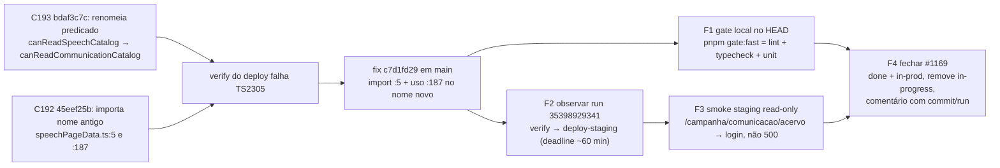

# Impl: C201 — Typecheck da main quebrado após C192×C193: import órfão de canReadSpeechCatalog

Status: aprovado
Atualizado em: 2026-09-18
Issue: #1169
Intenção: body da Issue (sem plano linkado — o body é a spec)
Appetite restante: herdado (P1 de fix mecânico — ~5 min de execução; o custo real é a verificação)

## Leitura da intenção

- **Outcome:** `main` volta a passar typecheck e o pipeline de deploy volta a publicar; zero referências ao predicado antigo `canReadSpeechCatalog` em `src/`/`tests/`/`scripts/`; #1169 fechada como `done`+`in-prod` com o registro do commit que consertou.
- **O que NÃO negociar:** o fix já está em `main` (`c7d1fd29`) e altera exatamente as 2 referências de `src/utilities/speech/speechPageData.ts` (import :5 + uso :187) para `canReadCommunicationCatalog`; a semântica do predicado é preservada (`communicator || unrestricted` — coordinator/candidate — em `src/lib/campaignRoles.ts:27`); histórico/migrations não se editam retroativamente; fail-closed de acesso intacto.
- **O que reavaliar:** a premissa implícita "há diff a produzir" não se aplica — HEAD == origin/main == `c7d1fd29` (branch idêntica ao main). O desfecho desta sessão é **verificação + fechamento do tracker**, sem PR.

## Abordagem recomendada

**Opções consideradas:** A | B | C

**Recomendação:** **C — sessão de verificação no HEAD** (`c7d1fd29`): rodar `pnpm gate:fast` local, observar o run de deploy `35398929341` (`verify` → `deploy-staging`), smoke de staging read-only na rota da vertical e fechar #1169 no tracker citando commit + run. É a única opção compatível com o estado real do repositório (diff-zero) e fecha o ciclo P1 sem inventar trabalho.

**Rejeitadas:** **A — refazer o fix numa branch nova + PR:** o commit já está em `main`; um PR sem diff é inválido e o auto-merge não teria o que mergear (e o flip pós-merge não roda sem PR). **B — reverter/re-aplicar por rebase:** não há divergência — HEAD == origin/main == `c7d1fd29`; rebase de branch idêntica é no-op e só arrisca reescrever histórico.

### Componentes / mudanças

- **Código:** nenhuma mudança nesta sessão. O fix integral está em `src/utilities/speech/speechPageData.ts` (:5 import, :187 uso de `canReadCommunicationCatalog`); o predicado renomeado vive em `src/lib/campaignRoles.ts:27`.
- **Referências órfãs:** busca em `src/`, `tests/` e `scripts/` não encontra mais `canReadSpeechCatalog` (apenas docs históricos); nenhum outro órfão do rename do C193 entre importadores de `@/lib/campaignRoles`.
- **Changelog:** já registrado em `docs/changelog/2026-09-18-c193-fix-rename.md` (`pnpm gate:fast` verde — 364 arquivos / 3867 testes — e int `speechAcervo`/`reel` 22 verdes no commit do fix).
- **Artefatos desta entrega:** este plano + o registro de fechamento na Issue #1169 (comentário com commit/run/desfecho).
- **Migration:** sem migration (rename de símbolo, sem mudança de schema).
- **Access / Consent:** sem Consent e sem mudança de access — a matriz de papéis segue coberta pelos int existentes (`tests/int/speechAcervo.int.spec.ts:329,408` — inclui "never expands outside the catalog gate" —, `speechCatalog.int.spec.ts:123`, `speechExcerpts.int.spec.ts:135`, `reel.int.spec.ts`).
- **UI:** sem UI nova — nenhuma superfície muda; a rota `/campanha/comunicacao/acervo` é a mesma (só o gate interno renomeado).

### Dados → forma (se aplicável)

Não aplicável: nenhuma forma de dado nova ou alterada — a mudança é só o identificador do predicado (rename já aplicado).

## Fases verificáveis

1. **Gate local no HEAD (`c7d1fd29`)** — `pnpm gate:fast` (lint + `typecheck` + `test:unit`) deve sair verde (o typecheck era o job vermelho por TS2305). Unit relevantes como sinal direto: `tests/unit/campaignNav.unit.spec.ts:68`, `tests/unit/aiToolsScope.unit.spec.ts:37`. Evidência: saída verde do comando.
2. **Observar o run de deploy `35398929341` (HEAD `c7d1fd29`)** — `preflight` já success, `verify` in_progress; acompanhar até `verify` success e `deploy-staging` publicar o SHA. Deadline de observação ~60 min do `createdAt`; não intervir (sem cancelar/re-dispatch) salvo falha real.
3. **Smoke de staging (read-only)** — `https://staging.jorgesolla1313.com.br/campanha/comunicacao/acervo` **sem sessão** deve redirecionar ao login (não 500); conferir também que a página de login responde. Nenhuma escrita, nenhuma credencial de campanha.
4. **Fechar a Issue #1169** — labels `done` + `in-prod`, remover `in-progress`; comentário citando o commit `c7d1fd29`, o run `35398929341` e o desfecho do smoke; `gh issue close 1169`. Sem PR, o fechamento é manual (o flip `issue-done-on-main-merge` depende de PR, que não existe neste caso).

## Rabbit holes / Não escopo (engenharia)

- Recriar o fix em branch nova/PR vazio (opção A) ou rebase/re-aplicação (opção B): rejeitados no gate — diff-zero.
- Rodar e2e full local: fora — o `verify` do deploy já roda a suíte full uma vez por commit; rodar de novo localmente não acrescenta sinal.
- Reauditar a série C192/C193 inteira ou caçar outros órfãos de rename: verificado zero remanescentes; expandir sem evidência é custo puro.
- Mexer em `deploy.yml`/preflight/requeue ou aprovar `deploy-production` nesta sessão: fora — produção tem required reviewer (decisão humana) e não é critério da C201.
- Editar o body/plano da Issue (spec) ou o changelog do fix: imutáveis.

## Riscos e mitigação

- **Run falha por motivo alheio (flake/infra, ex.: e2e conhecido ou runner offline)** → reportar como observação e **não** tratar como regressão da C201; distinguir pelo arquivo/job que falhou (nada do run toca o rename além do typecheck que já passou no commit).
- **Fechamento manual do tracker sem PR** → exige citar commit + run no comentário; não fechar como `in-prod` antes do staging publicado; nunca deixar `in-progress` residual.
- **`deploy-staging` estoura timeout / runner indisponível** → infra: vira observação (file-miss), não defeito; `done` ainda pode ser registrado com o verify verde, `in-prod` só com staging verde.
- **Deadline ~60 min** → se o run ainda estiver `in_progress` ao estourar, aguardar/observar sem intervir; registrar o estado real no comentário da Issue.

## Aceite de engenharia

- [ ] Aceite de produto da intenção ainda coberto (typecheck de `main` verde; vertical de comunicação operacional em staging)
- [ ] Invariantes AGENTS/engineering-standards (sem edição retroativa de migrations/histórico, sem force-push, rename já aplicado no dono do símbolo)
- [ ] Testes de domínio previstos (unit/int) onde access/write paths mudam — não mudam; matriz de papéis re-validada pelo gate local e pelos int existentes da vertical
- [ ] Evidência esperada: saída verde do `pnpm gate:fast` local no HEAD + job `verify` success do run `35398929341` + smoke de staging (redirect ao login, sem 500) + #1169 fechada com comentário commit/run
- [ ] Self-score decision-quality: 4/5 (C é a única opção com diff-zero; rejeitadas nomeadas; rabbit holes e riscos de infra delimitados)
