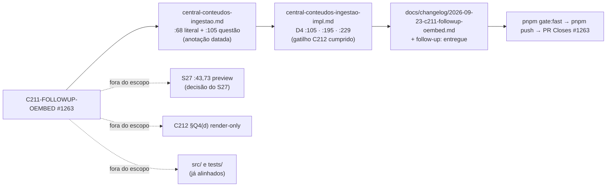

# Impl: C211-FOLLOWUP-OEMBED — C211 — link de terceiro: o oEmbed não permite persistir metadados/conteúdo

Status: aprovado
Atualizado em: 2026-09-23
Issue: #1263
Intenção: docs/plans/c211-followup-oembed-terceiro.md
Appetite restante: herdado (~30 min; documentação apenas — sem código/schema/migration/Consent/URL)
Modo: autônomo (`--auto`) — impl plan nasce aprovado pelo agente.

## Leitura da intenção

- **Outcome:** quando o C211 for implementado/refinado, a regra chega ao plano dele — peça de terceiro circula **pelo link**; o embed/thumbnail pode ser **renderizado** (front-end); **nada é extraído, baixado ou persistido** de terceiro (metadados inclusive); extração/catalogação de arquivo só da conta própria via Graph API. Sem código.
- **O que NÃO negociar:**
  - **Documentação apenas** — nenhum arquivo de `src/`, `tests/`, schema, migration, Consent ou URL.
  - **Não apagar o as-built** — anotação datada (convenção pós-entrega; precedente `docs/plans/gate-push-local.md:3`, "ampliado 2026-07-30").
  - **Não flipar status dos planos do C211** (`central-conteudos-ingestao.md:3` rascunho; impl `:3` em execução) — fora do escopo declarado.
  - **Não invadir S27/C212** — `central-conteudos-publica.md` e `central-conteudos-varredura-instagram.md` ficam como estão.
  - A regra citada vem de `central-conteudos-varredura-instagram.md` §Q2 + doc oficial datada (Instagram oEmbed, consultada em 2026-09-22).
- **O que reavaliar (hipóteses do follow-up):**
  - A condicional do aceite (`c211-followup-oembed-terceiro.md:20`) — "se o aceite `:49` ainda prometer thumbnail de terceiro" — é **falsa**: `central-conteudos-ingestao.md:49` não promete thumbnail; **nada a mudar lá** (registrar).
  - A precondição "destrava quando o C211 flipar `done`" (`:5,35`): a entrega do C211 está em `main` (commit `cb61cf11`, changelog `2026-09-22-c211.md`), então o refinamento datado é aditivo e não reabre decisão do C211 — sem flip de status.

## Abordagem recomendada

**Opções consideradas:** A) edição **in-place datada** nos dois arquivos do C211 + changelog novo; B) reescrever as seções afetadas; C) doc/plano de refinamento paralelo; D) editar S27/C212/código agora.
**Recomendação:** **A** — o C211 entregou (`cb61cf11`) e o impl é a fonte do as-built; a convenção do repo para edição pós-entrega é acrescentar linha datada sem apagar história (`gate-push-local.md:3`). Citar §Q2 + doc datada fecha o gatilho da rejeitada B do D4 e põe a regra onde quem implementar o link vai ler.
**Rejeitadas:** **B** porque apaga a decisão e o motivo (as-built é histórico e o C211 entregou em `cb61cf11`); **C** porque cria segunda fonte de verdade — o dono é o plano do C211; **D** porque S27 (`:43,73`) e C212 (§Q4(d)) têm decisão e gatilho próprios, e o código já está alinhado (`src/utilities/content/contentPieceLink.ts:21-32` documenta "NO scraping and no oEmbed"; a UI só diz "Mídia de terceiro nunca é baixada") — mexer seria inventar drift.

### D1 — Onde/como o refinamento aterrissa

**Opções:** A) anotação datada nos dois planos do C211 (intenção `:68,105`; impl D4 `:105`, Não escopo `:195`, resumo `:229` — ponteiros pós-edição) + changelog; B) reescrever as seções; C) documento paralelo; D) S27/C212/código.
**Recomendação:** **A** — é o único que mantém o dono (o C211), preserva o as-built e fecha o gatilho "achados do C212" na própria D4.
**Rejeitadas:** B (perde histórico), C (duas verdades), D (escopo alheio; sem drift no código).

### Componentes / mudanças (edição exata)

1. **`docs/plans/central-conteudos-ingestao.md`** (aplicado)
   - `:4` `Atualizado em: 2026-09-22` → `2026-09-23`.
   - `:68` (literal "Adicionar por link") — acrescentado ao fim: `**Refinado 2026-09-23 (oEmbed, C212 §Q2):** thumbnail e metadados de terceiro não são extraídos nem persistidos; renderizar o embed de terceiro é do item futuro do C212 §Q4(d) — o C211 segue sem oEmbed.`
   - `:105` (questão "Peça por link") — marcador trocado para `_(decidido — refinado no C212; refinamento datado 2026-09-23 — C211-FOLLOWUP-OEMBED, Issue #1263)_` com o texto: `O oEmbed de terceiro só serve para **renderizar** o post embutido — "consuming, manipulating, extracting, or persisting the metadata and content … is strictly prohibited" (doc datada em 2026-09-22; ver §Q2 de docs/plans/central-conteudos-varredura-instagram.md); a extração de arquivo continua só da conta própria via Graph API.`
2. **`docs/plans/central-conteudos-ingestao-impl.md`** (header `:4` já é 2026-09-23)
   - `:105` (fim do D4, pós-edição) — parágrafo acrescentado: `**Refinamento 2026-09-23 (C211-FOLLOWUP-OEMBED, Issue #1263):** gatilho "achados do C212" cumprido — oEmbed do Instagram não entrega metadados sem app (probe sem credencial: 403 "(#200) Provide valid app ID") e a doc proíbe persistir metadados/conteúdo; oEmbed do YouTube dá só título/capa/embed. A rejeitada **B permanece rejeitada**; enriquecimento futuro é render-only e pertence ao item descrito em §Q4(d) da varredura.`
   - `:195` (Não escopo, pós-edição) — acrescentado ao bullet: `**Refinado 2026-09-23:** o item futuro do C212 §Q4(d) já nasce render-only; o C211 segue sem oEmbed.`
   - `:229` (resumo D4, pós-edição) — `sem oEmbed (C212 decide)` → `sem oEmbed (C212 decidiu 2026-09-22 — render-only, nada de terceiro persistido; refinamento 2026-09-23)`.
3. **`docs/plans/c211-followup-oembed-terceiro.md`** — `:3` `Status: rascunho` → `Status: entregue (2026-09-23 — refinamento datado nos planos do C211; sem código)`; `:4` → `2026-09-23`; `:5` → `Issue: #1263`.
4. **`docs/changelog/2026-09-23-c211-followup-oembed.md`** (novo, uma entrada curta; nunca editar o agregado/HISTORY nem o changelog do C211): entrada única no formato do agregado — o limite do C212 §Q2, o gatilho do D4 cumprido, o aceite `:49` sem thumbnail e o código já alinhado. O texto final está no próprio arquivo.

- **Migration:** nenhuma. **Access/Consent:** N/A (sem código; nenhuma chave nova). **UI:** Impeccable A — N/A.

### Dados → forma (se aplicável)

N/A — item documental, sem superfície de dado.

## Fases verificáveis

1. **Refinamento da intenção (~10 min):** os 3 pontos em `central-conteudos-ingestao.md`. Verificação: `grep -n "Refinado 2026-09-23"` = 2 ocorrências; `git diff` só acrescenta (exceto o marcador `refinar`→`refinado` e o `Atualizado em: 2026-09-22`→`2026-09-23`).
2. **Refinamento do impl (~10 min):** os 3 pontos em `central-conteudos-ingestao-impl.md`. Verificação: `grep -n "(C212 decide)"` = 0; nota do D4 presente.
3. **Fechamento (~10 min):** follow-up (`Status`/`Issue`/data) + changelog novo + `pnpm gate:fast` + `pnpm push` + PR ready base `main` com `Closes #1263` (o changelog fora de `docs/plans/` evita o guard plans-only; incluir no mesmo PR). No merge o workflow flipa a Issue; comentar o desfecho em uma linha.

## Rabbit holes / Não escopo (engenharia)

- **S27 (`central-conteudos-publica.md:43,73`)** — promete "preview (título + imagem)" para toda peça publicada; peça-link não tem arquivo. A decisão de placeholder é do S27 (gatilho: implementação do S27); não editar agora.
- **C212 §Q4(d)** — o item futuro já nasce render-only; não é deste follow-up.
- **Código** — `contentPieceLink.ts:21-32` e a UI já documentam a regra; alterar seria drift fabricado.
- **Reescrever as-built / flipar status** — proibido; só anotação datada.
- **Headers do C211 stale** (`central-conteudos-ingestao.md:3` "rascunho"; impl `:3` "em execução" com a Issue #1254 fechada) — pré-existente, fora do escopo declarado; deferido com gatilho: próxima edição do plano do C211 (ou início do item §Q4(d)).
- **Editar o changelog do C211 ou o agregado** — o dono novo é `docs/changelog/2026-09-23-c211-followup-oembed.md`.

## Riscos e mitigação

- **Escopo vazar para S27/C212:** não escopo nomeado; diff restrito aos 4 arquivos.
- **"Refinar" virar reescrita:** regra "só acrescenta linha datada"; `git diff` esperado quase só adições.
- **Doc-only sem teste:** verificação por `grep -n` das strings-alvo + `pnpm gate:fast`; nenhum comportamento tocado.
- **`Closes #1263` × guard plans-only** (`scripts/check-plans-only-pr-closes.mjs`): o changelog fora de `docs/plans/` faz o diff não ser plans-only — changelog no mesmo PR é requisito.
- **Editar plano "em execução":** aditivo/datado; precondição satisfeita pela entrega `cb61cf11`; nenhuma decisão do C211 reaberta.

## Aceite de engenharia

- [ ] Aceite da intenção coberto: regra (link/render/nada persistido) no plano **e** no impl do C211, citando §Q2 + doc datada; nada além de documentação.
- [ ] Invariantes AGENTS/engineering-standards: sem código/schema/migration/Consent/URL; migrations existentes intocadas; changelog no arquivo novo.
- [ ] Testes de domínio: N/A (nenhum write path/access muda); verificação por grep + gate.
- [ ] `pnpm gate:fast` verde; PR ready com `Closes #1263`.

## Self-score

**Self-score decision-quality: 5/5.** (1) A decisão de engenharia (onde/como aterrissa) tem opções + recomendação + rejeitadas explícitas (D1). (2) Cabe no appetite herdado (~30 min; 4 arquivos, zero código). (3) Rabbit holes nomeados (S27, C212, código, reescrita, agregado). (4) Depth check: reusa a convenção de anotação datada e o dono do changelog — nenhum mecanismo novo. (5) Outcome preservado: a engenharia não reescreve o aceite nem invade S27/C212.
